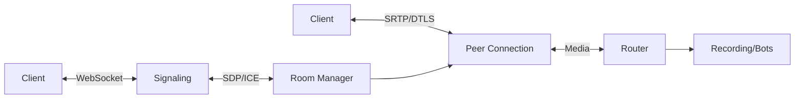

Building a WebRTC media server is not for the faint of heart. Here's how we approached it, what we learned, and why Go was the right choice.

## The Problem with Existing Solutions

Jitsi uses Jitsi Videobridge (Java). BigBlueButton uses FreeSWITCH (C). Both work, but both carry significant operational overhead - JVM tuning, FreeSWITCH module management, and complex configuration.

We wanted something simpler: a single process that handles signaling, media routing, and room management without external dependencies.

## Why Go

Three reasons:

1. **Goroutines** - Each WebRTC peer connection runs in its own goroutine. No thread pool management, no callback hell.
2. **Pion WebRTC** - The Go WebRTC library is production-grade and actively maintained.
3. **Single binary** - Go compiles to a static binary. No runtime, no dependencies.

## Architecture Overview

- **Signaling** handles SDP exchange and ICE candidates over WebSocket
- **Room Manager** tracks participants and their media state
- **Peer Connection** wraps Pion's WebRTC implementation
- **Router** forwards media between participants with selective forwarding (SFU)

## Memory Usage

A single peer connection uses ~2MB of memory. A room with 10 participants uses ~25MB. That's why Bedrud runs on 512MB total - most of that is the web UI and API server.

## What's Next

We're working on simulcast support and SVC (Scalable Video Coding) for better quality on variable bandwidth connections. Stay tuned.
