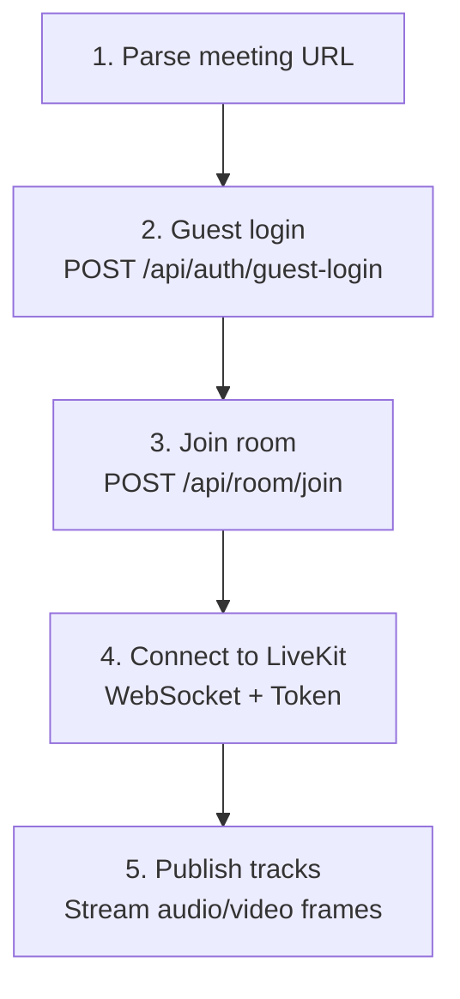
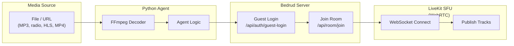

يتضمن بدرود وكلاء بوت قائمين على Python يمكنهم الانضمام إلى غرف الاجتماعات وبث محتوى الوسائط. مفيدة للموسيقى الخلفية أو بث الراديو أو مشاركة محتوى الفيديو.

## الوكلاء المتاحون

| الوكيل | الوصف | نوع الوسائط |
|-------|-------------|-----------|
| `music_agent` | يشغل ملفات الصوت في غرفة | صوت (PCM) |
| `radio_agent` | يبث محطات الراديو عبر الإنترنت | صوت (PCM عبر FFmpeg) |
| `video_stream_agent` | يشارك محتوى الفيديو (HLS، MP4) | فيديو + صوت |

## كيف يعمل الوكلاء

يتبع جميع الوكلاء نمط الاتصال نفسه:





## وكيل الموسيقى

يشغل ملفات الصوت (MP3، WAV، إلخ) في غرفة اجتماع.

### الإعداد

```bash
cd agents/music_agent
pip install -r requirements.txt
```

**التبعيات:** `httpx`، `livekit`، `pydub`

### الاستخدام

```bash
python agent.py "https://meet.example.com/m/room-name"
```

### طريقة العمل

١. فك تشفير ملفات الصوت باستخدام `pydub`
٢. التحويل إلى إطارات PCM
٣. نشر إطارات الصوت إلى LiveKit كمسار ميكروفون

> راجع [وثائق وكيل الموسيقى](https://github.com/bedrud-ir/bedrud/tree/main/agents/music_agent) للإعداد والاستخدام.

---

## وكيل الراديو

يبث محطات الراديو عبر الإنترنت إلى غرفة اجتماع باستخدام FFmpeg لفك تشفير الصوت.

### الإعداد

```bash
cd agents/radio_agent
pip install -r requirements.txt
```

**التبعيات:** `httpx`، `livekit`

**متطلب النظام:** يجب تثبيت FFmpeg (`brew install ffmpeg` أو `apt install ffmpeg`)

### الاستخدام

```bash
python agent.py "https://meet.example.com/m/room-name"
```

### طريقة العمل

١. الاتصال بعنوان URL لبث الراديو
٢. تمرير البث عبر FFmpeg لفك التشفير إلى PCM خام
٣. نشر إطارات صوت PCM إلى LiveKit

> راجع [وثائق وكيل الراديو](https://github.com/bedrud-ir/bedrud/tree/main/agents/radio_agent) للإعداد والاستخدام.

---

## وكيل بث الفيديو

يشارك الفيديو والصوت من رابط (HLS/m3u8، MP4) في غرفة اجتماع.

### الإعداد

```bash
cd agents/video_stream_agent
pip install -r requirements.txt
```

**التبعيات:** `httpx`، `livekit`

**متطلب النظام:** يجب تثبيت FFmpeg

### الاستخدام

```bash
python agent.py "https://meet.example.com/m/room-name"
```

### طريقة العمل

١. يشغّل عمليتي FFmpeg بالتوازي:
    - **الفيديو:** فك تشفير إلى إطارات YUV420p خام (1280×720 @ 30 إطار/ثانية)
    - **الصوت:** فك تشفير إلى عينات PCM
٢. نشر الفيديو كمسار مشاركة شاشة
٣. نشر الصوت كمسار ميكروفون

> راجع [وثائق وكيل بث الفيديو](https://github.com/bedrud-ir/bedrud/tree/main/agents/video_stream_agent) للإعداد والاستخدام.

### مواصفات الفيديو

| الإعداد | القيمة |
|---------|-------|
| العرض | 1280 |
| الارتفاع | 720 |
| FPS | 30 |
| تنسيق البكسل | YUV420p |

---

## كتابة وكيل مخصص

لإنشاء وكيل جديد، اتبع هذا النمط:

```python
import httpx
from livekit import rtc

# 1. Parse the meeting URL to extract room name
room_name = parse_url(meeting_url)

# 2. Guest login
client = httpx.Client(base_url=server_url)
resp = client.post("/api/auth/guest-login", json={"name": "Bot Name"})
token = resp.json()["token"]

# 3. Join room
client.headers["Authorization"] = f"Bearer {token}"
resp = client.post("/api/room/join", json={"roomName": room_name})
lk_token = resp.json()["token"]

# 4. Connect to LiveKit
room = rtc.Room()
await room.connect(livekit_url, lk_token)

# 5. Publish tracks
source = rtc.AudioSource(sample_rate=48000, num_channels=1)
track = rtc.LocalAudioTrack.create_audio_track("audio", source)
await room.local_participant.publish_track(track)

# 6. Stream frames
while has_data:
    frame = get_next_frame()
    await source.capture_frame(frame)
```

---

## انظر أيضًا

- [وثائق وكيل الموسيقى](https://github.com/bedrud-ir/bedrud/tree/main/agents/music_agent) - الإعداد والاستخدام
- [وثائق وكيل الراديو](https://github.com/bedrud-ir/bedrud/tree/main/agents/radio_agent) - الإعداد والاستخدام
- [وثائق وكيل بث الفيديو](https://github.com/bedrud-ir/bedrud/tree/main/agents/video_stream_agent) - الإعداد والاستخدام
