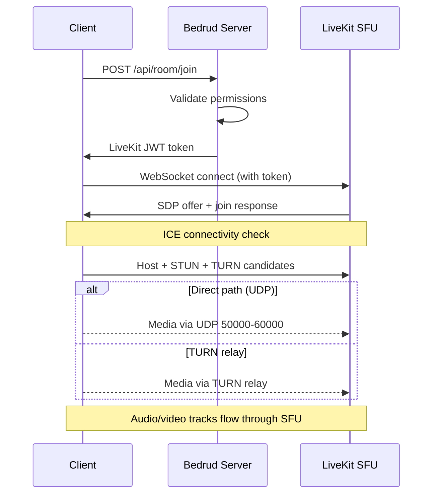

بدرود هو مستودع أحادي (monorepo) يحتوي على خادم Go، وثلاثة تطبيقات عميل، ووكلاء بوت Python، وحزم مشتركة. تصف هذه الصفحة كيف ترتبط المكونات ببعضها.

## المخطط العام

```
┌──────────────────────────────────────────────────────────────┐
│                          Clients                             │
│                                                              │
│  ┌─────────┐  ┌──────────┐  ┌────────┐  ┌───────────────┐   │
│  │  Web    │  │ Android  │  │  iOS   │  │ Desktop       │   │
│  │ React   │  │ Compose  │  │SwiftUI │  │ Rust + Slint  │   │
│  └────┬────┘  └────┬─────┘  └───┬────┘  └──────┬────────┘   │
│       │            │            │              │             │
│       └────────────┼────────────┼──────────────┘             │
│                    │                                         │
│               REST API + WebSocket                          │
└────────────────────┼────────────────────────────────────────┘
                           │
┌────────────────────────┼────────────────────────────────┐
│                   Bedrud Server                         │
│                        │                                │
│  ┌─────────────────────┴──────────────────────────┐     │
│  │              Fiber HTTP Router                  │     │
│  │  /api/auth/*  /api/room/*  /api/admin/*        │     │
│  └──────────┬─────────────────────┬───────────────┘     │
│             │                     │                     │
│  ┌──────────┴──────────┐  ┌──────┴────────────────┐     │
│  │   GORM / SQLite     │  │  LiveKit Protocol SDK │     │
│  │   (or PostgreSQL)   │  │  (token generation,   │     │
│  │                     │  │   room management)    │     │
│  └─────────────────────┘  └──────────┬────────────┘     │
│                                      │                  │
│                           ┌──────────┴────────────┐     │
│                           │  Embedded LiveKit      │     │
│                           │  Media Server (WebRTC) │     │
│                           └───────────────────────┘     │
└─────────────────────────────────────────────────────────┘
```

## المكونات

### الخادم (`server/`)

خلفية Go هي نواة بدرود. تتولى ما يلي:

- **REST API** - المصادقة، إدارة الغرف، عمليات المسؤول
- **خدمة الملفات الثابتة** - واجهة الويب المُجمَّعة مدمجة عبر `//go:embed`
- **تكامل LiveKit** - ينشئ الرموز ويدير الغرف عبر LiveKit Protocol SDK
- **خادم LiveKit المدمج** - يعمل كعملية فرعية للخادم

يستخدم الخادم إطار عمل الويب **Fiber** (مشابه لـ Express.js في Node.js) و**GORM** كطبقة ORM. يدعم SQLite للتطوير وPostgreSQL للإنتاج.

للتفاصيل راجع [بنية الخادم](/docs/architecture/server).

### واجهة الويب (`apps/web/`)

تطبيق **React** مبني بـ TanStack Start وTailwindCSS v4 وshadcn/ui. في الإنتاج، يُعرَض مسبقًا على الخادم وتُدمَج أصول العميل في الملف الثنائي Go.

القدرات الأساسية:

- واجهة اجتماعات الفيديو مع LiveKit Client SDK
- مصادقة قائمة على JWT مع تحديث تلقائي للرموز
- لوحة تحكم المسؤول لإدارة المستخدمين والغرف
- نظام تصميم مع مكتبة مكونات متسقة

للتفاصيل راجع [واجهة الويب](/docs/architecture/web).

### تطبيق Android (`apps/android/`)

تطبيق Android أصلي مبني بـ **Jetpack Compose** و**Kotlin**. يستخدم Koin لحقن التبعية وRetrofit لـ HTTP.

القدرات الأساسية:

- تجربة اجتماعات فيديو كاملة مع LiveKit Android SDK
- وضع الصورة داخل الصورة
- معالجة الروابط العميقة (`bedrud.com/m/*` و`bedrud.com/c/*`)
- إدارة المكالمات مع ConnectionService في Android
- دعم تعدد المثيلات (الاتصال بعدة خوادم)

للتفاصيل راجع [تطبيق Android](/docs/architecture/android).

### تطبيق iOS (`apps/ios/`)

تطبيق iOS أصلي مبني بـ **SwiftUI**. يستخدم KeychainAccess لتخزين بيانات الاعتماد بأمان وLiveKit Swift SDK للوسائط.

القدرات الأساسية:

- تجربة اجتماعات فيديو كاملة
- دعم تعدد المثيلات
- معالجة الروابط العميقة
- تخزين آمن قائم على Keychain

للتفاصيل راجع [تطبيق iOS](/docs/architecture/ios).

### تطبيق سطح المكتب (`apps/desktop/`)

تطبيق أصلي لـ Windows وLinux مبني بـ **Rust** وأدوات واجهة المستخدم **Slint**. يُجمَّع كملف ثنائي واحد بدون تبعيات وقت التشغيل.

القدرات الأساسية:

- تجربة اجتماعات فيديو كاملة عبر LiveKit Rust SDK
- عرض أصلي لـ Windows (Direct3D 11) وLinux (OpenGL/Vulkan)
- دعم تعدد المثيلات (الاتصال بعدة خوادم بدرود)
- تكامل مع keyring نظام التشغيل لتخزين بيانات الاعتماد بأمان

للتفاصيل راجع [تطبيق سطح المكتب](/docs/architecture/desktop).

### وكلاء البوت (`agents/`)

سكربتات Python تنضم إلى غرف الاجتماعات كبوتات وتقوم ببث محتوى الوسائط:

- **وكيل الموسيقى** - يشغل ملفات الصوت
- **وكيل الراديو** - يبث محطات الراديو عبر الإنترنت
- **وكيل بث الفيديو** - يشارك محتوى الفيديو (HLS، MP4)

للتفاصيل راجع [وكلاء البوت](/docs/architecture/agents).

## مسار المصادقة

```
Client                    Server                    Database
  │                         │                          │
  ├─POST /api/auth/login───►│                          │
  │                         ├──verify credentials─────►│
  │                         │◄─────────────────────────┤
  │◄──access + refresh JWT──┤                          │
  │                         │                          │
  ├─GET /api/room/list──────►│  (Authorization header)  │
  │  (Bearer <access_token>)│                          │
  │◄──room list─────────────┤                          │
```

جميع الطلبات المصادَق عليها تستخدم رموز JWT في ترويسة `Authorization`. مغلف `authFetch` في واجهة الويب يتولى إرفاق الرموز وتحديثها تلقائيًا.

طرق المصادقة المدعومة:

| الطريقة | نقطة النهاية | الوصف |
|--------|----------|-------------|
| البريد/كلمة المرور | `POST /api/auth/login` | بيانات اعتماد تقليدية |
| التسجيل | `POST /api/auth/register` | إنشاء حساب جديد |
| ضيف | `POST /api/auth/guest-login` | وصول مؤقت بالاسم فقط |
| OAuth | `GET /api/auth/:provider/login` | Google، GitHub، Twitter |
| مفاتيح المرور | `POST /api/auth/passkey/*` | القياسات الحيوية FIDO2/WebAuthn |

## مسار اتصال الاجتماع



١. يطلب العميل الانضمام إلى غرفة عبر REST API
٢. يتحقق الخادم من الصلاحيات وينشئ رمز LiveKit موقّعًا
٣. يتصل العميل مباشرة بـ LiveKit عبر WebSocket باستخدام الرمز
٤. يجمع `ICE` المرشحين (host، `STUN`، `TURN`) ويختار أفضل مسار
٥. تتدفق مسارات الصوت/الفيديو عبر `SFU` الخاص بـ LiveKit

للمسار الكامل للاتصال راجع [اتصال WebRTC](/docs/architecture/webrtc-connectivity).

## نموذج البيانات

### المستخدم

| الحقل | النوع | الوصف |
|-------|------|-------------|
| ID | uint | المفتاح الأساسي |
| Email | string | عنوان بريد إلكتروني فريد |
| Name | string | الاسم المعروض |
| Password | string | كلمة المرور المشفرة (فارغ لـ OAuth/ضيف) |
| Avatar | string | رابط الصورة الرمزية |
| Provider | string | مزود المصادقة (`local`، `google`، `github`، `twitter`، `guest`) |
| Role | string | `user` أو `admin` |

### الغرفة

| الحقل | النوع | الوصف |
|-------|------|-------------|
| ID | uint | المفتاح الأساسي |
| AdminID | uint | مفتاح خارجي ← User.ID (منشئ الغرفة) |
| Name | string | اسم الغرفة / slug الرابط |
| IsPublic | bool | هل يمكن للضيوف الانضمام بدون دعوة |
| ChatEnabled | bool | هل الدردشة في الغرفة مفعّلة |
| VideoEnabled | bool | هل الفيديو مسموح |
| Participants | []User | المستخدمون المتواجدون حاليًا في الغرفة |

### مفتاح المرور

| الحقل | النوع | الوصف |
|-------|------|-------------|
| ID | uint | المفتاح الأساسي |
| UserID | uint | مفتاح خارجي ← User.ID |
| CredentialID | []byte | معرّف بيانات اعتماد WebAuthn |
| PublicKey | []byte | المفتاح العام WebAuthn |
| Counter | uint32 | عداد توقيعات WebAuthn |

### رمز التحديث

| الحقل | النوع | الوصف |
|-------|------|-------------|
| Token | string | سلسلة رمز التحديث |
| UserID | uint | مفتاح خارجي ← User.ID |
| ExpiresAt | time | طابع زمني لانتهاء الرمز |

## بنية النشر

في الإنتاج، يعمل بدرود كخدمتين systemd:

| الخدمة | الملف الثنائي | الغرض |
|---------|--------|---------|
| `bedrud.service` | `bedrud --run` | خادم API + واجهة الويب المدمجة |
| `livekit.service` | `bedrud --livekit` | خادم وسائط WebRTC |

كلاهما يُدار بملف ثنائي واحد. يتولى Traefik أو وكيل عكسي آخر إنهاء TLS وتوجيه حركة المرور.

للتفاصيل راجع [دليل النشر](/docs/guides/deployment).

## المصطلحات الأساسية

تظهر هذه المصطلحات في أنحاء وثائق البنية:

| المصطلح | الاسم الكامل | المعنى |
|------|-----------|---------|
| **SFU** | وحدة الإرسال الانتقائي | خادم وسائط يستقبل التدفقات من كل مشارك ويعيد توجيهها للآخرين. يتصل العملاء بالخادم، وليس ببعضهم. |
| **SDP** | بروتوكول وصف الجلسة | التنسيق المستخدم لوصف معلمات اتصال WebRTC (الترميزات، الدقات، أنواع الوسائط). |
| **ICE** | إنشاء الاتصال التفاعلي | إطار عمل يجمع جميع مسارات الشبكة الممكنة بين العميل والخادم، ثم يختار أفضلها. |
| **STUN** | أدوات عبور الجلسة لـ NAT | بروتوكول خفيف يساعد العميل على اكتشاف عنوان IP العام الخاص به. يعمل لمعظم الاتصالات. |
| **TURN** | العبور باستخدام المرحلات حول NAT | بروتوكول يُرحِّل جميع الوسائط عبر الخادم عندما يكون الاتصال المباشر مستحيلًا. الملاذ الأخير، أعلى تكلفة عرض نطاق. |
| **NAT** | ترجمة عناوين الشبكة | ميزة في الموجه تربط العناوين الخاصة الداخلية بعنوان عام واحد. قد تمنع اتصال WebRTC المباشر حسب النوع. |
| **srflx** | الانعكاسي الخادمي | نوع من مرشحي `ICE` يمثل عنوان IP العام للعميل، المكتشف عبر `STUN`. |
| **WebRTC** | اتصال الويب في الوقت الفعلي | معيار API للمتصفح والهاتف المحمول لنقل الصوت والفيديو والبيانات في الوقت الفعلي. |

## انظر أيضًا

- [اتصال WebRTC](/docs/architecture/webrtc-connectivity) - مسار الاتصال الكامل `STUN`/`ICE`/`TURN`/`SFU`
- [دليل خادم TURN](/docs/architecture/turn-server) - بنية وتهيئة مرحل `TURN`
- [تكامل LiveKit](/docs/backend/livekit) - كيف يُدمَج LiveKit في بدرود
