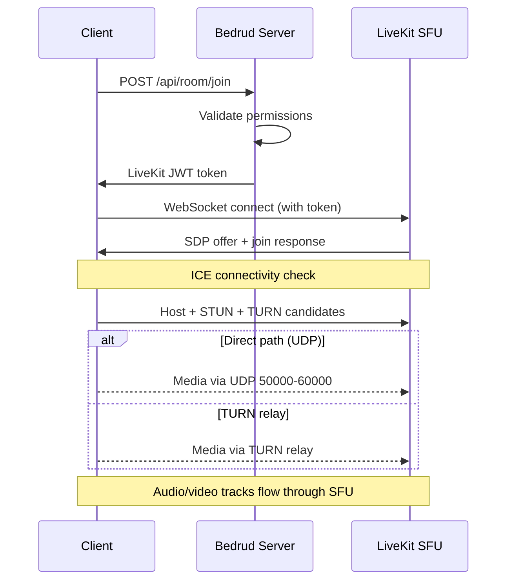

Bedrud is a monorepo containing a Go server, three client applications, Python bot agents, and shared packages. This page describes how the components relate to each other.

## High-Level Diagram

```
┌──────────────────────────────────────────────────────────────┐
│                          Clients                             │
│                                                              │
│  ┌─────────┐  ┌──────────┐  ┌────────┐  ┌───────────────┐   │
│  │  Web    │  │ Android  │  │  iOS   │  │ Desktop       │   │
│  │ React   │  │ Compose  │  │SwiftUI │  │ Rust + Slint  │   │
│  └────┬────┘  └────┬─────┘  └───┬────┘  └──────┬────────┘   │
│       │            │            │              │             │
│       └────────────┼────────────┼──────────────┘             │
│                    │                                         │
│               REST API + WebSocket                          │
└────────────────────┼────────────────────────────────────────┘
                          │
┌────────────────────────┼────────────────────────────────┐
│                   Bedrud Server                         │
│                        │                                │
│  ┌─────────────────────┴──────────────────────────┐     │
│  │              Fiber HTTP Router                  │     │
│  │  /api/auth/*  /api/room/*  /api/admin/*        │     │
│  └──────────┬─────────────────────┬───────────────┘     │
│             │                     │                     │
│  ┌──────────┴──────────┐  ┌──────┴────────────────┐     │
│  │   GORM / SQLite     │  │  LiveKit Protocol SDK │     │
│  │   (or PostgreSQL)   │  │  (token generation,   │     │
│  │                     │  │   room management)    │     │
│  └─────────────────────┘  └──────────┬────────────┘     │
│                                      │                  │
│                           ┌──────────┴────────────┐     │
│                           │  Embedded LiveKit      │     │
│                           │  Media Server (WebRTC) │     │
│                           └───────────────────────┘     │
└─────────────────────────────────────────────────────────┘
```

## Components

### Server (`server/`)

The Go backend is the core of Bedrud. It handles:

- **REST API** - authentication, room management, admin operations
- **Static file serving** - the compiled web frontend is embedded via `//go:embed`
- **LiveKit integration** - generates tokens and manages rooms via the LiveKit Protocol SDK
- **Embedded LiveKit server** - the media server binary runs as a child process

The server uses the **Fiber** web framework (similar to Express.js in Node.js) and **GORM** as the ORM layer. It supports SQLite for development and PostgreSQL for production.

See [Server Architecture](/docs/architecture/server) for details.

### Web Frontend (`apps/web/`)

A **React** application built with TanStack Start, TailwindCSS v4, and shadcn/ui. In production, it is pre-rendered on the server and the client assets are embedded into the Go binary.

Key capabilities:

- Video meeting UI with LiveKit Client SDK
- JWT-based authentication with automatic token refresh
- Admin dashboard for user and room management
- Design system with consistent component library

See [Web Frontend](/docs/architecture/web) for details.

### Android App (`apps/android/`)

A native Android app built with **Jetpack Compose** and **Kotlin**. Uses Koin for dependency injection and Retrofit for HTTP.

Key capabilities:

- Full video meeting experience with LiveKit Android SDK
- Picture-in-picture mode
- Deep link handling (`bedrud.com/m/*` and `bedrud.com/c/*`)
- Call management with Android's ConnectionService
- Multi-instance support (connect to multiple servers)

See [Android App](/docs/architecture/android) for details.

### iOS App (`apps/ios/`)

A native iOS app built with **SwiftUI**. Uses KeychainAccess for secure credential storage and LiveKit Swift SDK for media.

Key capabilities:

- Full video meeting experience
- Multi-instance support
- Deep link handling
- Keychain-based secure storage

See [iOS App](/docs/architecture/ios) for details.

### Desktop App (`apps/desktop/`)

A native Windows and Linux desktop application built with **Rust** and the **Slint** UI toolkit. Compiles to a single binary with no runtime dependencies.

Key capabilities:

- Full video meeting experience via LiveKit Rust SDK
- Native Windows (Direct3D 11) and Linux (OpenGL/Vulkan) rendering
- Multi-instance support (connect to multiple Bedrud servers)
- OS keyring integration for secure credential storage

See [Desktop App](/docs/architecture/desktop) for details.

### Bot Agents (`agents/`)

Python scripts that join meeting rooms as bots and stream media content:

- **Music Agent** - plays audio files
- **Radio Agent** - streams internet radio stations
- **Video Stream Agent** - shares video content (HLS, MP4)

See [Bot Agents](/docs/architecture/agents) for details.

## Authentication Flow

```
Client                    Server                    Database
  │                         │                          │
  ├─POST /api/auth/login───►│                          │
  │                         ├──verify credentials─────►│
  │                         │◄─────────────────────────┤
  │◄──access + refresh JWT──┤                          │
  │                         │                          │
  ├─GET /api/room/list──────►│  (Authorization header)  │
  │  (Bearer <access_token>)│                          │
  │◄──room list─────────────┤                          │
```

All authenticated requests use JWT tokens in the `Authorization` header. The web frontend's `authFetch` wrapper handles token attachment and automatic refresh.

Supported auth methods:

| Method | Endpoint | Description |
|--------|----------|-------------|
| Email/Password | `POST /api/auth/login` | Traditional credentials |
| Registration | `POST /api/auth/register` | New account creation |
| Guest | `POST /api/auth/guest-login` | Temporary access with just a name |
| OAuth | `GET /api/auth/:provider/login` | Google, GitHub, Twitter |
| Passkeys | `POST /api/auth/passkey/*` | FIDO2/WebAuthn biometrics |

## Meeting Connection Flow



1. The client requests to join a room via the REST API
2. The server validates permissions and generates a signed LiveKit token
3. The client connects directly to LiveKit via WebSocket using the token
4. ICE gathers candidates (host, STUN, TURN) and selects the best path
5. Audio/video tracks flow through LiveKit's SFU

See [WebRTC Connectivity](/docs/architecture/webrtc-connectivity) for the full connectivity stack.

## Data Model

### User

| Field | Type | Description |
|-------|------|-------------|
| ID | uint | Primary key |
| Email | string | Unique email address |
| Name | string | Display name |
| Password | string | Hashed password (empty for OAuth/guest) |
| Avatar | string | Avatar URL |
| Provider | string | Auth provider (`local`, `google`, `github`, `twitter`, `guest`) |
| Role | string | `user` or `admin` |

### Room

| Field | Type | Description |
|-------|------|-------------|
| ID | uint | Primary key |
| AdminID | uint | Foreign key → User.ID (room creator) |
| Name | string | Room name / URL slug |
| IsPublic | bool | Whether guests can join without invite |
| ChatEnabled | bool | Whether in-room chat is active |
| VideoEnabled | bool | Whether video is allowed |
| Participants | []User | Users currently in the room |

### Passkey

| Field | Type | Description |
|-------|------|-------------|
| ID | uint | Primary key |
| UserID | uint | Foreign key → User.ID |
| CredentialID | []byte | WebAuthn credential ID |
| PublicKey | []byte | WebAuthn public key |
| Counter | uint32 | WebAuthn sign count |

### RefreshToken

| Field | Type | Description |
|-------|------|-------------|
| Token | string | The refresh token string |
| UserID | uint | Foreign key → User.ID |
| ExpiresAt | time | Token expiration timestamp |

## Deployment Architecture

In production, Bedrud runs as two systemd services:

| Service | Binary | Purpose |
|---------|--------|---------|
| `bedrud.service` | `bedrud --run` | API server + embedded web frontend |
| `livekit.service` | `bedrud --livekit` | WebRTC media server |

Both are managed by a single binary. Traefik or another reverse proxy handles TLS termination and routes traffic.

See [Deployment Guide](/docs/guides/deployment) for setup instructions.

## Key Terms

These terms appear throughout the architecture documentation:

| Term | Full Name | Meaning |
|------|-----------|---------|
| **SFU** | Selective Forwarding Unit | A media server that receives streams from each participant and forwards them to others. Clients connect to the server, not to each other. |
| **SDP** | Session Description Protocol | The format used to describe WebRTC connection parameters (codecs, resolutions, media types). |
| **ICE** | Interactive Connectivity Establishment | A framework that gathers all possible network paths between client and server, then selects the best one. |
| **STUN** | Session Traversal Utilities for NAT | A lightweight protocol that helps a client discover its public IP address. Works for most connections. |
| **TURN** | Traversal Using Relays around NAT | A protocol that relays all media through the server when a direct connection is not possible. Last resort, highest bandwidth cost. |
| **NAT** | Network Address Translation | A router feature that maps private internal addresses to a public address. Can block direct WebRTC connections depending on type. |
| **srflx** | Server Reflexive | A type of ICE candidate representing the client's public IP, discovered via STUN. |
| **WebRTC** | Web Real-Time Communication | The browser and mobile API standard for real-time audio, video, and data transfer. |

## See Also

- [WebRTC Connectivity](/docs/architecture/webrtc-connectivity) - full STUN/ICE/TURN/SFU connectivity stack
- [TURN Server Guide](/docs/architecture/turn-server) - TURN relay architecture and configuration
- [LiveKit Integration](/docs/backend/livekit) - how Bedrud embeds LiveKit
