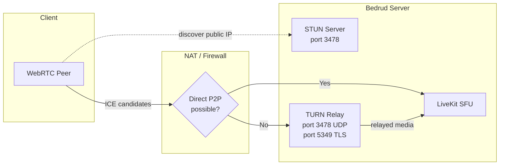
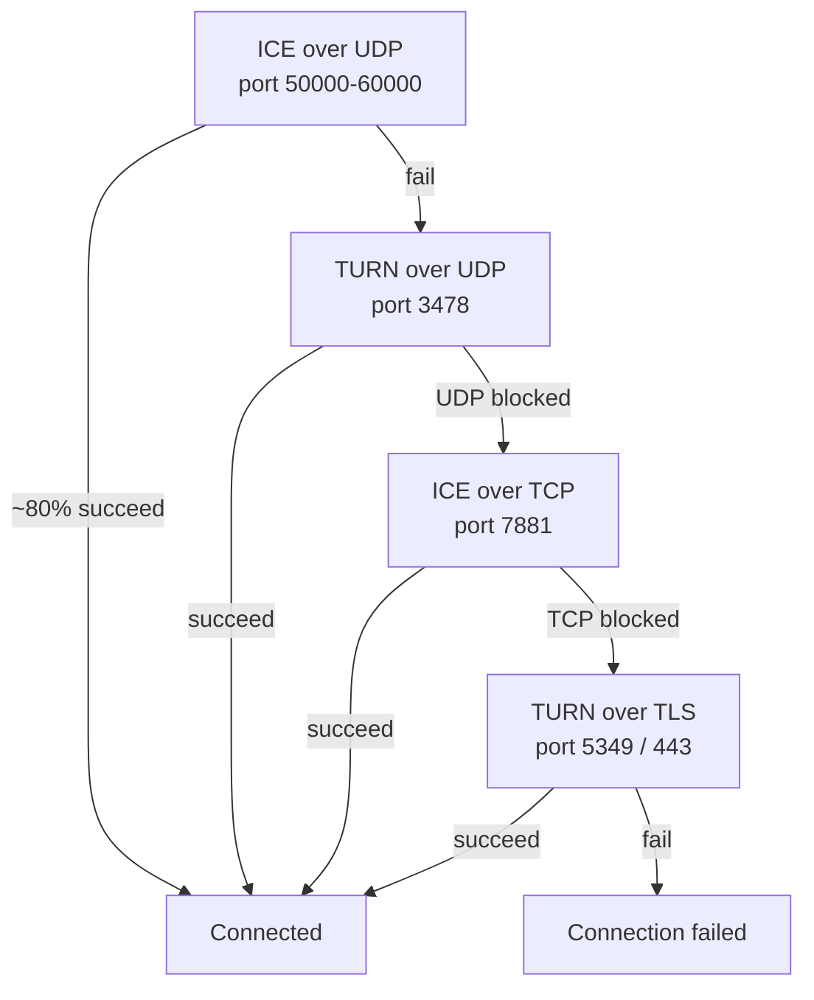
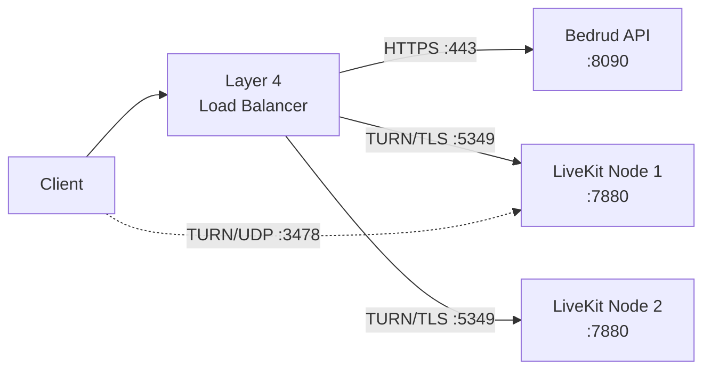
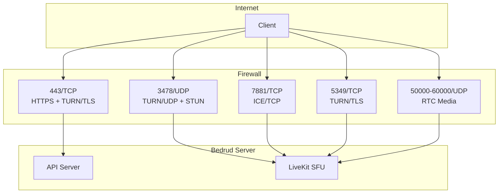

يُدمِج بدرود خادم `TURN` عبر LiveKit لترحيل الوسائط للعملاء خلف NATs أو جدران حماية مقيدة. تغطي هذه الصفحة البنية والتهيئة واستكشاف الأخطاء.

---

## ما هو TURN

**`TURN`** (العبور باستخدام المرحلات حول NAT) هو بروتوكول يُمرِّر حزم الوسائط عبر خادم عندما لا يمكن لنقطتين الاتصال مباشرة.

**البروتوكولات ذات الصلة:**

| البروتوكول | الدور | التكلفة |
|----------|------|------|
| **`STUN`** | اكتشاف IP/المنفذ العام. خفيف. | لا شيء (الخادم يرى فقط طلبات ربط صغيرة) |
| **`ICE`** | إطار عمل يجرب جميع خيارات الاتصال حسب الأولوية. | لا شيء (تنسيق فقط) |
| **`TURN`** | ترحيل جميع الوسائط عند فشل المسار المباشر. الملاذ الأخير. | عالية (عرض نطاق الخادم = جميع الوسائط المُرحَّلة) |

راجع [اتصال WebRTC](/docs/architecture/webrtc-connectivity) لمسار الاتصال الكامل.

---

## TURN في بدرود

يتضمن LiveKit خادم `TURN` مدمجًا. لا حاجة لبنية تحتية خارجية.

### بنية المرحل



### أولوية الاتصال

يجرب LiveKit أنواع الاتصال بالترتيب. كل احتياطي يضيف زمن استجابة وتكلفة خادم:



| الأولوية | النوع | المنفذ | السيناريو النموذجي |
|----------|------|------|-----------------|
| ١ | ICE/UDP (مباشر) | 50000-60000 | معظم الاتصالات. بدون مرحل. |
| ٢ | TURN/UDP | 3478 | `NAT` متماثل، P2P محظور. |
| ٣ | ICE/TCP | 7881 | UDP محظور (VPN، بعض جدران الحماية). |
| ٤ | TURN/TLS | 5349 أو 443 | جدار حماية مؤسسي، HTTPS الصادر فقط. |

---

## متى يُفعَّل TURN

يُفعَّل `TURN` عندما يفشل مسار الوسائط المباشر. الأسباب الشائعة:

- **NAT متماثل على كلا الطرفين** - كلا العميل والخادم يمتلكان `NAT` متماثل. يخصص `NAT` منفذًا عامًا مختلفًا لكل وجهة، فالعنوان المكتشف عبر `STUN` يصبح غير قابل للوصول.
- **جدار حماية مؤسسي** - يحظر UDP الصادر بالكامل. فقط المنفذ 443 TCP مسموح.
- **قيود VPN** - بعض شبكات VPN تعترض أو تحظر حركة WebRTC.
- **أجهزة افتراضية سحابية بدون IP عام** - بعض مزودي السحابة يستخدمون `NAT` يمنع `ICE` المباشر.

معظم المستخدمين (~80%) لا يستخدمون `TURN` مطلقًا. مسار UDP المباشر يعمل.

### تكلفة عرض النطاق

عندما يُرحِّل `TURN`، يتحمل الخادم جميع الوسائط لهذا المشارك. عرض النطاق التقريبي لكل تدفق:

| نوع التدفق | معدل البت | لكل مشارك مُرحَّل |
|-------------|---------|------------------------|
| صوت (Opus) | ~32 كيلوبت/ث | ~32 كيلوبت/ث |
| فيديو 720p (VP8) | ~1.5 ميغابت/ث | ~1.5 ميغابت/ث صعود + 1.5 ميغابت/ث نزول لكل مسار مشترك |
| مشاركة شاشة 1080p | ~2.5 ميغابت/ث | ~2.5 ميغابت/ث |

لاجتماع من 5 أشخاص مع مشارك واحد مُرحَّل: يتحمل الخادم ~1.5 ميغابت/ث إضافية لترحيل فيديو ذلك المشارك. اضرب هذه القيم في عدد المشاركين المُرحَّلين لتقدير إجمالي عرض نطاق الخادم.

---

## التهيئة

**الملف:** `server/config/livekit.yaml` (تطوير) أو `/etc/bedrud/livekit.yaml` (إنتاج)

```yaml
turn:
  enabled: true
  domain: "turn.example.com"
  udp_port: 3478
  tls_port: 5349
  cert_file: /etc/bedrud/turn.crt
  key_file: /etc/bedrud/turn.key
  relay_range_start: 30000
  relay_range_end: 40000
  external_tls: false
```

### مرجع المفاتيح

| المفتاح | الافتراضي | الوصف |
|-----|---------|-------------|
| `enabled` | `true` | تفعيل خادم `TURN` المدمج. |
| `domain` | `localhost` | النطاق المُعلَن للعملاء. يجب أن يحل إلى عنوان IP العام للخادم. |
| `udp_port` | `3478` | منفذ TURN/UDP. يخدم أيضًا طلبات ربط `STUN` عند تفعيل `TURN`. |
| `tls_port` | `5349` | منفذ TURN/TLS. اضبط إلى `443` إذا لم يكن هناك موازن حمل ينهي TLS. |
| `cert_file` | - | شهادة TLS لـ TURN/TLS. مطلوب عند وجود عملاء TURN/TLS. |
| `key_file` | - | مفتاح TLS الخاص المطابق لـ `cert_file`. |
| `relay_range_start` | `30000` | بداية نطاق منافذ UDP المستخدم لحزم الوسائط المُرحَّلة. |
| `relay_range_end` | `40000` | نهاية نطاق منافذ المرحل. كل مشارك مُرحَّل يستهلك منافذ من هذا النطاق. |
| `external_tls` | `false` | اضبط `true` عندما ينهي موازن حمل من الطبقة 4 TURN/TLS. يتخطى LiveKit TLS الخاص به على منفذ `TURN`. |

### تفاعل `use_external_ip`

في نفس `livekit.yaml`، تحت `rtc:`:

```yaml
rtc:
  use_external_ip: true
```

يجب أن يكون `true` لكي يعمل `TURN` بشكل صحيح. عند `false`، تحتوي مرشحو `ICE` على عناوين IP داخلية (خاصة) لا يمكن للعملاء على الإنترنت الوصول إليها.

---

## إعداد TLS للإنتاج

يتطلب TURN/TLS شهادة TLS خاصة به. مقاربتان:

### نطاق واحد (بدون موازن حمل)

أعد استخدام شهادة TLS الخاصة بالخادم. اضبط `tls_port` إلى `443`:

```yaml
turn:
  enabled: true
  domain: "meet.example.com"
  tls_port: 443
  cert_file: /etc/bedrud/meet.example.com.crt
  key_file: /etc/bedrud/meet.example.com.key
```

نطاق `TURN` ونطاق الخادم متطابقان. المنفذ 443 يتولى كل من HTTPS API وTURN/TLS - يميز LiveKit بالبروتوكول.

### نطاق TURN مخصص (مع موازن حمل)



```yaml
turn:
  enabled: true
  domain: "turn.example.com"
  tls_port: 5349
  external_tls: true
```

ينهي موازن الحمل TLS. `external_tls: true` يخبر LiveKit بأن يتوقع حركة مرور تم فك تشفيرها مسبقًا.

---

## مرجع المنافذ وجدار الحماية



| المنفذ | البروتوكول | الخدمة | مطلوب | ملاحظات |
|------|----------|---------|----------|-------|
| 443 | TCP | HTTPS + TURN/TLS | نعم | API + واجهة الويب. أيضًا TURN/TLS إذا `tls_port: 443`. |
| 3478 | UDP | TURN/UDP + STUN | مُوصى به | غرض مزدوج: ربط `STUN` + مرحل `TURN`. |
| 5349 | TCP | TURN/TLS | إذا لم يكن هناك موازن حمل | منفذ TURN/TLS مخصص. تجاوزه إذا استُخدم المنفذ 443. |
| 7881 | TCP | ICE/TCP | مُوصى به | احتياطي عند حظر UDP لكن TLS غير مطلوب. |
| 50000-60000 | UDP | وسائط RTC | نعم | منافذ مرشحي `ICE`. كل مشارك يستخدم منفذين. |
| 7880 | TCP | LiveKit API | داخلي | إشارات WebSocket. لا يُعرَّض مباشرة في الإنتاج. |

### قواعد جدار الحماية الدنيا

لاتصال أساسي:

```
Allow TCP 443    (HTTPS + TURN/TLS)
Allow UDP 3478   (TURN/UDP + STUN)
Allow UDP 50000-60000  (RTC media)
```

لأقصى توافق (الشبكات المؤسسية):

```
Also allow TCP 7881  (ICE/TCP)
Also allow TCP 5349  (TURN/TLS, if not using port 443)
```

---

## الاختبار وتصحيح الأخطاء

### المتصفح: chrome://webrtc-internals

١. افتح `chrome://webrtc-internals` في Chrome/Edge قبل الانضمام لاجتماع.
٢. أنشئ تفريغًا.
٣. ابحث عن **أزواج مرشحي ICE** في تبويب الإحصائيات.
٤. أنواع المرشحين تخبرك بمسار الاتصال:

| نوع المرشح | المعنى |
|---------------|---------|
| `host` | IP محلي. واجهة مباشرة. |
| `srflx` (انعكاسي خادمي) | IP العام المكتشف عبر `STUN`. P2P المباشر يعمل. |
| `relay` | مرحل `TURN` نشط. الوسائط تمر عبر الخادم. |

إذا رأيت مرشحين `relay` كالزوج النشط، فإن `TURN` يتولى ذلك الاتصال.

### أحداث LiveKit Client SDK

تصدر جميع حزم LiveKit SDK أحداث حالة الاتصال:

```typescript
room.on(RoomEvent.Connected, () => {
  console.log("Connected");
});

room.on(RoomEvent.Reconnecting, () => {
  console.log("Connection lost, reconnecting...");
});
```

تحقق من `room.localParticipant.connectionQuality` لإحصائيات الاتصال.

### سجلات خادم LiveKit

زد مستوى السجل إلى تصحيح الأخطاء في `livekit.yaml`:

```yaml
logging:
  level: debug
```

ابحث عن إدخالات السجل التي تحتوي على:
- `ICE` - حالة جمع المرشحين
- `TURN` - أحداث تخصيص المرحل
- `relay` - اتصالات المرحل النشطة

### اختبار TURN يدويًا باستخدام turnutils

ثبّت حزمة `coturn-utils`، ثم اختبر اتصال `TURN`:

```bash
turnutils_uclient -t -p 3478 -W devkey -u devkey turn.example.com
```

- `-t` - استخدام TCP
- `-p` - منفذ `TURN`
- استبدل بيانات الاعتماد بقيم الإنتاج

المخرجات الناجحة تُظهر عناوين المرحلات المخصصة.

---

## استكشاف الأخطاء

| العَرَض | السبب المحتمل | الحل |
|---------|-------------|-----|
| العملاء لا يستطيعون الاتصال، انتهاء المهلة | منافذ `TURN` محظورة بجدار الحماية | افتح UDP 3478، TCP 5349، UDP 50000-60000 |
| TURN/TLS يفشل | شهادة TLS مفقودة أو غير متطابقة | تحقق من مسارات `cert_file`/`key_file`. تحقق من أن الشهادة تطابق `domain`. |
| TURN/TLS يفشل مع موازن حمل | `external_tls` غير مُعد | اضبط `external_tls: true` في التهيئة. |
| صوت/فيديو باتجاه واحد | نطاق منافذ المرحل محظور | افتح من `relay_range_start` إلى `relay_range_end` UDP. |
| عرض نطاق خادم عالي | عملاء كثيرون خلف `NAT` يستخدمون المرحل | متوقع. وسّع الخادم أو قلل المستخدمين المُرحَّلين. |
| مرشحو `relay` لكن `srflx` متوقع | `use_external_ip: false` | اضبط `rtc.use_external_ip: true`. |
| نطاق TURN لا يحل | DNS مُهيأ بشكل خاطئ | `dig +short turn.example.com` يجب أن يُرجع IP العام للخادم. |
| عملاء خلف جدار حماية مؤسسي | المنفذ 443 فقط مسموح | اضبط `turn.tls_port: 443`. تأكد من صلاحية الشهادة. |
| `turn.enabled: true` لكن بدون مرحل | المسار المباشر يعمل (جيد) | `TURN` هو احتياطي. بدون مرحل = أفضل. تحقق عبر `chrome://webrtc-internals`. |

### قائمة التشخيص السريع

١. هل `dig +short <turn.domain>` يُرجع IP العام الصحيح؟
٢. هل جدار الحماية يسمح بـ UDP 3478، TCP 5349، UDP 50000-60000؟
٣. هل `tls_port: 443` أو `5349` يتطابق مع قواعد جدار الحماية؟
٤. هل `cert_file` و`key_file` موجودان وقابلان للقراءة؟
٥. هل CN/SAN للشهادة يتطابق مع `turn.domain`؟
٦. هل `rtc.use_external_ip: true` مُعد؟
٧. هل سجلات LiveKit لا تُظهر أخطاء متعلقة بـ `TURN`؟

---

## انظر أيضًا

- [اتصال WebRTC](/docs/architecture/webrtc-connectivity) - مسار الاتصال الكامل `STUN`/`ICE`/`TURN`/`SFU`
- [تكامل LiveKit](/docs/backend/livekit) - كيف يُدمَج LiveKit في بدرود
- [مرجع التهيئة](/docs/getting-started/configuration) - جميع خيارات التهيئة
- [TLS الداخلي](/docs/guides/internal-tls) - TLS للشبكات المعزولة
- [دليل النشر](/docs/guides/deployment) - خطوات نشر الإنتاج
