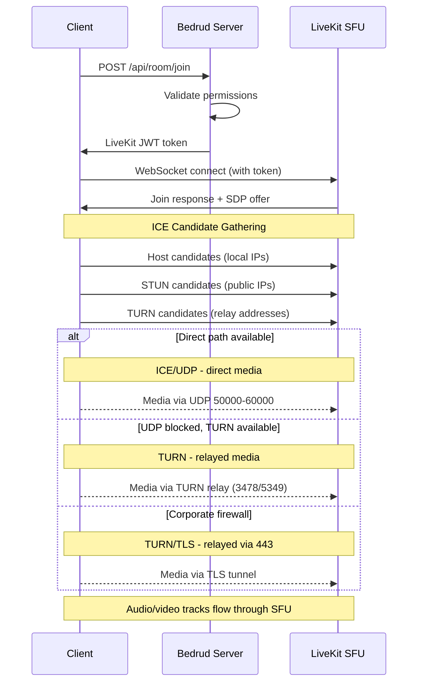
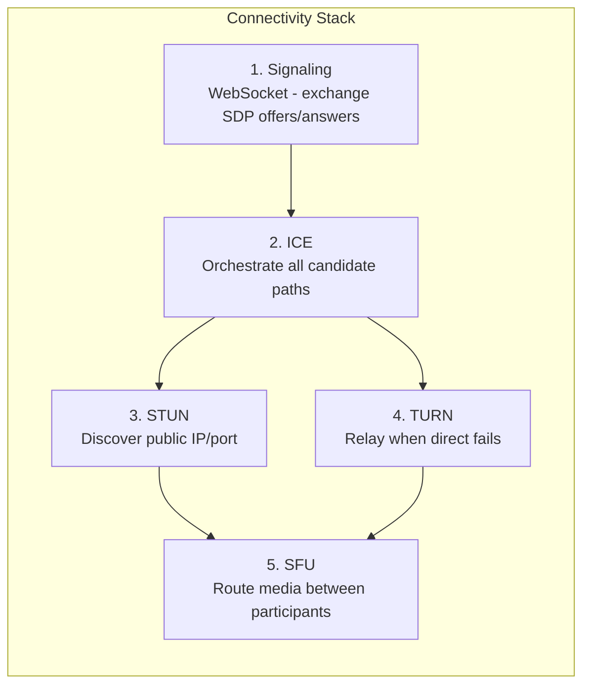
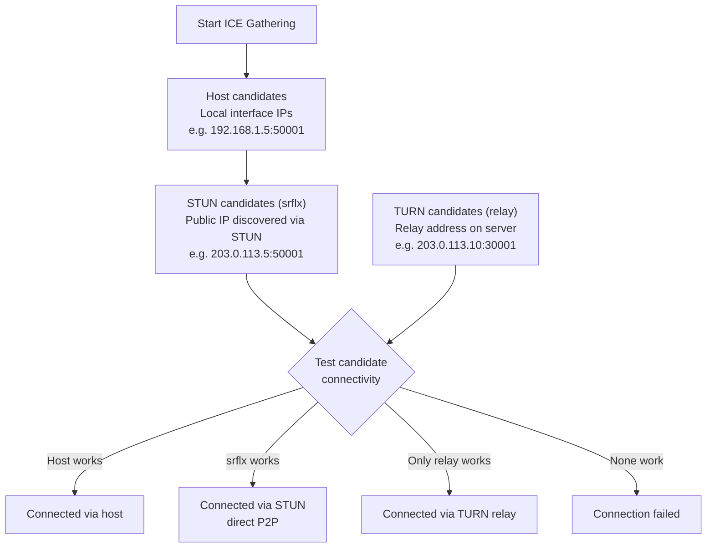
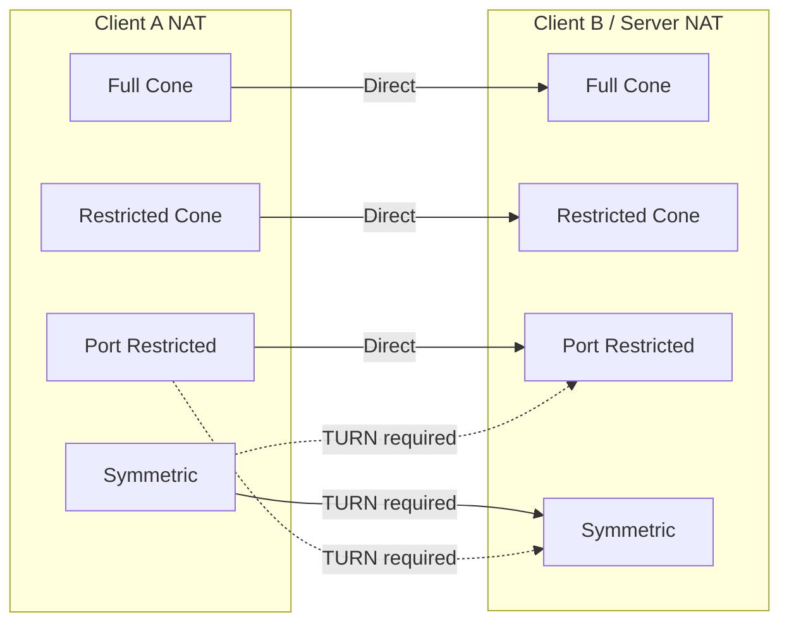

كيف يؤسس العملاء اتصالات وسائط في الوقت الفعلي في بدرود. يغطي مسار الاتصال الكامل: الإشارات و`ICE` و`STUN` و`TURN` ومسار وسائط `SFU`.

---

## نظرة عامة

يتطلب WebRTC سلسلة من الخطوات قبل أن يتدفق الصوت والفيديو بين العميل والخادم. يستخدم بدرود بنية `SFU` (وحدة الإرسال الانتقائي) من LiveKit - يتصل العملاء بالخادم، وليس ببعضهم. **هذا يعني أن مسار الشبكة بين العميل والخادم فقط هو المهم**، وليس الاتصال بين المشاركين فرديًا.



---

## مسار الاتصال

خمس طبقات تعمل معًا لتأسيس مسار الوسائط:



### تفاصيل الطبقات

**١. الإشارات** - يتبادل العميل والخادم بيانات الاتصال الوصفية باستخدام عروض وإجابات `SDP` (بروتوكول وصف الجلسة) عبر WebSocket. هذا ليس وسائط - إنه مرحلة الإعداد. يُوَجِّه بدرود الإشارات عبر خادم API إلى مثيل LiveKit المدمج.

**٢. `ICE` (إنشاء الاتصال التفاعلي)** - يجمع جميع مسارات الاتصال الممكنة، المسماة مرشحين، ويختبرها حسب الأولوية. `ICE` هو إطار عمل - ينسق محاولات الاتصال لكنه ليس بروتوكولًا بحد ذاته.

**٣. `STUN` (أدوات عبور الجلسة لـ NAT)** - بروتوكول خفيف. يرسل العميل طلب ربط إلى خادم `STUN`، الذي يرد بعنوان IP العام للعميل والمنفذ. يُختَبر هذا المرشح "الانعكاسي الخادمي" للاتصال المباشر. يعمل لحوالي 80% من الاتصالات.

**٤. `TURN` (العبور باستخدام المرحلات حول NAT)** - عندما يفشل الاتصال المباشر، يخصص `TURN` عنوان مرحل على الخادم. تُمرَّر جميع حزم الوسائط عبر هذا المرحل. أعلى تكلفة - عرض نطاق الخادم يزداد مع المستخدمين المُرحَّلين. راجع [دليل خادم TURN](turn-server.mdx) للتغطية المعمقة.

**٥. `SFU` (وحدة الإرسال الانتقائي)** - بمجرد تأسيس مسار النقل، يُوجِّه `SFU` الخاص بـ LiveKit الوسائط بين المشاركين. يرسل كل مشارك تدفقًا واحدًا للأعلى؛ يُعيد `SFU` توجيه نسخ للمشاركين الآخرين. هذا ليس نظير-لنظير - الخادم دائمًا في المسار.

---

## جمع مرشحي ICE



يجمع `ICE` ثلاثة أنواع من المرشحين في وقت واحد:

| النوع | المصدر | الأولوية | طريقة العمل |
|------|--------|----------|-------------|
| **host** | واجهات الشبكة المحلية | الأعلى | IP مباشر من الجهاز. يعمل على الشبكة المحلية. |
| **srflx** (انعكاسي خادمي) | استجابة خادم `STUN` | متوسطة | عنوان IP العام المكتشف عبر `STUN`. يعلم لمعظم أنواع `NAT`. |
| **relay** (مرحل) | تخصيص خادم `TURN` | الأدنى | عنوان على خادم `TURN`. يعمل دائمًا. أعلى تكلفة. |

يختبر `ICE` جميع المرشحين ويختار الزوج الأعلى أولوية الذي ينجح. إذا نجح `srflx`، يتخطى `relay`.

---

## أنواع NAT والاتصال

تؤثر أنواع `NAT` المختلفة على إمكانية الاتصال المباشر:



| نوع NAT | الوصف | P2P مباشر | يحتاج TURN |
|----------|-------------|------------|-----------|
| **مخروطي كامل** | جميع الطلبات من نفس IP/منفذ داخلي تُربَط بنفس IP/منفذ عام. أي مضيف خارجي يمكنه الإرسال. | نعم | لا |
| **مخروطي مقيد** | نفس الربط كالمخروطي الكامل، لكن فقط المضيفون الخارجيون الذين استلموا حزمة يمكنهم الرد. | عادةً | لا |
| **مخروطي مقيد المنفذ** | مشابه للمخروطي المقيد، لكن `NAT` يقيد رقم المنفذ الخارجي أيضًا. النوع الأكثر شيوعًا في موجهات المنازل. | عادةً | نادرًا |
| **متماثل** | ربط IP/منفذ عام مختلف لكل وجهة. العنوان المكتشف عبر `STUN` لا يمكن إعادة استخدامه. | لا (عندما يكون كلاهما متماثلًا) | **نعم** |

**نقطة رئيسية:** بما أن الخادم يمتلك عنوان IP عام ونطاق منافذ قابل للتنبؤ، تعمل معظم أنواع `NAT` مباشرة. `TURN` مطلوب بشكل أساسي عندما يمنع جدار حماية العميل UDP الصادر بالكامل.

---

## ملخص التهيئة

مفاتيح تهيئة بدرود/LiveKit التي تؤثر على اتصال WebRTC:

**مفاتيح `livekit.yaml`:**

```yaml
rtc:
  port_range_start: 50000       # UDP media port range start
  port_range_end: 60000         # UDP media port range end
  tcp_port: 7881                # ICE/TCP fallback port
  stun_servers:                 # External STUN servers (optional)
    - stun:stun.l.google.com:19302
  use_external_ip: true         # Advertise public IP in ICE candidates

turn:
  enabled: true                 # Enable embedded TURN
  domain: "turn.example.com"    # TURN domain (DNS must resolve)
  udp_port: 3478                # TURN/UDP + STUN port
  tls_port: 5349                # TURN/TLS port (or 443)
  cert_file: /path/to/turn.crt  # TLS cert for TURN/TLS
  key_file: /path/to/turn.key   # TLS key for TURN/TLS
  relay_range_start: 30000      # Relay port range start
  relay_range_end: 40000        # Relay port range end
  external_tls: false           # L4 LB terminates TLS
```

**مفاتيح `config.yaml` (خادم بدرود):**

```yaml
server:
  port: 8090                    # API port (signaling proxied through this)
  enableTLS: true               # HTTPS for signaling
  domain: "meet.example.com"    # Public domain
```

### تصحيح مشاكل الاتصال

| العَرَض | التحقق |
|---------|-------|
| لا يمكن الاتصال إطلاقًا | هل `rtc.use_external_ip: true`؟ هل جدار الحماية مفتوح على 443 + نطاق UDP؟ |
| يتصل لكن بدون صوت/فيديو | هل UDP 50000-60000 محظور؟ تحقق من مرشحي `ICE` في المتصفح. |
| اتصال بطيء | مرحل `TURN` نشط (تحقق من المرشحين). متوقع إذا كان العميل خلف `NAT` صارم. |
| يفشل خلف شبكة مؤسسية | `TURN`/TLS غير مُهيأ. اضبط `turn.tls_port: 443` مع شهادة صالحة. |
| يعمل على الشبكة المحلية، يفشل عن بُعد | عنوان IP العام غير مُعلَن. اضبط `rtc.use_external_ip: true`. |

لاستكشاف مشاكل `TURN` بعمق، راجع [دليل خادم TURN](/ar/docs/architecture/turn-server).

---

## انظر أيضًا

- [دليل خادم TURN](/ar/docs/architecture/turn-server) - بنية `TURN` وتهيئته وTLS وتصحيح الأخطاء
- [تكامل LiveKit](/ar/docs/backend/livekit) - كيف يُدمَج LiveKit في بدرود
- [نظرة عامة على البنية](/ar/docs/architecture/overview) - بنية النظام الكاملة
- [TLS الداخلي](/ar/docs/guides/internal-tls) - TLS للشبكات المعزولة
