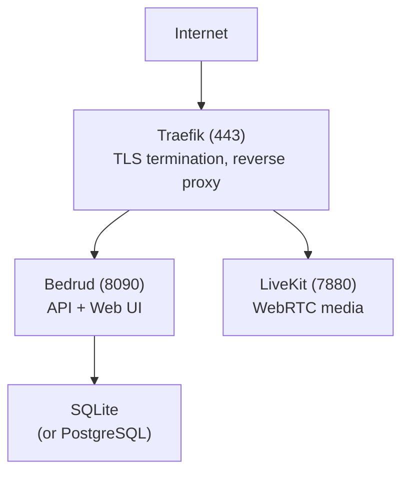

يشرح هذا الدليل كيفية نشر Bedrud على خادم إنتاج.

## خيارات النشر

| الطريقة | الأفضل لـ |
|--------|----------|
| [مدير الحزم (apt/AUR)](#package-manager) | تثبيت مُدار على توزيعات Linux المدعومة |
| [CLI آلي](#automated-cli-deployment) | إعداد بعيد سريع |
| [تثبيت يدوي](#manual-installation) | تحكم كامل في الإعدادات |
| [Docker](#docker-deployment) | البيئات الحاوية |
| [وضع الجهاز الجاهز](/ar/docs/guides/appliance) | إعداد شامل بملف ثنائي واحد |

---

## مدير الحزم

ثبّت Bedrud على Debian/Ubuntu أو Arch Linux باستخدام مدير الحزم الأصلي. هذه هي الطريقة الموصى بها لعمليات نشر الخادم المستمرة حيث تريد تحديثات تلقائية عبر `apt upgrade` أو AUR.

راجع [دليل تثبيت الحزم](/ar/docs/guides/packages) للتعليمات الكاملة، بما في ذلك إضافة مفتاح GPG الخاص بـ apt والمستودع.

```bash
# Ubuntu / Debian
sudo apt install bedrud

# Arch Linux (AUR)
yay -S bedrud-bin
```

بعد التثبيت، شغّل المثبّت التفاعلي لإعداد TLS وخدمات systemd وقاعدة البيانات:

```bash
sudo bedrud install
```

---

## النشر عبر CLI الآلي

أسرع طريقة للنشر. شغّله من جهازك المحلي:

**المتطلبات الأساسية:** Python 3.10+، [uv](https://github.com/astral-sh/uv)، ووصول SSH إلى الخادم الهدف.

```bash
cd tools/cli
uv run python bedrud.py --auto-config \
  --ip <server-ip> \
  --user root \
  --auth-key ~/.ssh/id_rsa \
  --domain meet.example.com \
  --acme-email admin@example.com
```

سيقوم هذا بـ:

١. بناء الملف الثنائي للخلفية محليًا
٢. ضغطه ورفعه عبر rsync
٣. إزالة خوادم الويب المتعارضة
٤. إعداد جدار الحماية
٥. تثبيت وبدء الخدمات على الخادم

### خيارات CLI

| العلم | الوصف |
|------|-------------|
| `--ip` | عنوان IP للخادم |
| `--user` | مستخدم SSH (الافتراضي: root) |
| `--auth-key` | المسار إلى مفتاح SSH الخاص |
| `--domain` | اسم النطاق لـ Let's Encrypt |
| `--acme-email` | البريد الإلكتروني لـ Let's Encrypt |
| `--uninstall` | إزالة Bedrud من الخادم |

---

## التثبيت اليدوي

### ١. بناء الملف الثنائي

```bash
make build-dist
```

ينتج `dist/bedrud_linux_amd64.tar.xz`.

### ٢. الرفع إلى الخادم

```bash
scp dist/bedrud_linux_amd64.tar.xz root@server:/tmp/
ssh root@server "cd /tmp && tar xf bedrud_linux_amd64.tar.xz"
```

### ٣. التثبيت

```bash
ssh root@server
sudo /tmp/bedrud install --tls --domain meet.example.com --email admin@example.com
```

راجع [دليل التثبيت](/ar/docs/getting-started/installation) لجميع سيناريوهات التثبيت.

### ٤. إنشاء مستخدم مسؤول

<CreateAdmin />

---

## النشر عبر Docker

ابنِ وشغّل باستخدام Docker:

```bash
docker build -t bedrud .
docker run -d --name bedrud -p 8090:8090 -p 7880:7880 -v bedrud-data:/var/lib/bedrud bedrud
```

صورة مبنية مسبقًا متاحة أيضًا:

```bash
docker pull ghcr.io/bedrud-ir/bedrud:latest
```

راجع [دليل Docker](/ar/docs/guides/docker) للتفاصيل الكاملة بما في ذلك الأقراص والإعدادات وDocker Compose.

---

## بنية الإنتاج



لاتصال WebRTC، افتح هذه المنافذ أيضًا على جدار الحماية:

| المنفذ | البروتوكول | الغرض |
|------|----------|---------|
| 3478 | UDP | TURN/UDP + STUN |
| 5349 | TCP | TURN/TLS (أو استخدم 443) |
| 7881 | TCP | احتياطي ICE/TCP |
| 50000-60000 | UDP | تدفقات وسائط RTC |

راجع [اتصال WebRTC](/ar/docs/architecture/webrtc-connectivity) للاطلاع على حزمة الاتصال الكاملة.

<SystemdServices />

### إدارة الخدمات

```bash
# Check status
systemctl status bedrud livekit

# Restart
systemctl restart bedrud

# View logs
journalctl -u bedrud -f
tail -f /var/log/bedrud/bedrud.log
```

---

## مواقع الملفات (الإنتاج)

| المسار | المحتوى |
|------|---------|
| `/usr/local/bin/bedrud` | الملف الثنائي |
| `/etc/bedrud/config.yaml` | إعدادات الخادم |
| `/etc/bedrud/livekit.yaml` | إعدادات LiveKit |
| `/var/lib/bedrud/bedrud.db` | قاعدة بيانات SQLite |
| `/var/log/bedrud/bedrud.log` | سجلات التطبيق |

---

## CI/CD

### خط أنابيب الإصدار

يُفعَّل سير عمل `release.yml` عند وسوم الإصدارات (`v*`) وينتج:

| المُنتَج | الوصف |
|---|---|
| `bedrud_linux_amd64.tar.xz` / `bedrud_linux_arm64.tar.xz` | ملفات الخادم الثنائية (Linux x86_64 / ARM64) |
| `bedrud_amd64.deb` / `bedrud_arm64.deb` | حزم Debian/Ubuntu (الخادم) |
| صورة Docker (`ghcr.io/bedrud-ir/bedrud`) | صورة حاوية متعددة البُنى مدفوعة إلى GHCR |
| `bedrud-desktop-linux-x86_64.AppImage` | سطح المكتب - AppImage عالمي لـ Linux |
| `bedrud-desktop-linux-x86_64.deb` | سطح المكتب - حزمة Debian/Ubuntu |
| `bedrud-desktop-linux-x86_64.tar.xz` | سطح المكتب - أرشيف محمول لـ Linux |
| `bedrud-desktop-windows-x86_64-setup.exe` / `-arm64-setup.exe` | سطح المكتب - مثبّت NSIS لـ Windows |
| `bedrud-desktop-windows-x86_64.zip` / `-arm64.zip` | سطح المكتب - محمول Windows |
| `bedrud-desktop-macos-x86_64.tar.gz` / `-arm64.tar.gz` | سطح المكتب - محمول macOS (غير مُوقَّع) |
| Android APK (تصحيح + إصدار، لكل بُنية) | بنيات عميل Android |
| iOS IPA (اختياري، يتطلب توقيعًا) | أرشيف عميل iOS |

جميع المُنتَجات تُرفق بإصدار GitHub.

### بنيات ليلية

يُنتج سير عمل `dev-nightly.yml` بنيات تطوير وفق جدول زمني.

### فحوصات CI

كل دفع إلى `main` وكل طلب سحب يُشغّل:

| الفحص | المنصة |
|-------|----------|
| `go vet` + البناء + الاختبارات | ubuntu-latest (Go 1.24) |
| فحص الأنواع + البناء | ubuntu-latest (Bun) |
| الفحص + اختبارات الوحدة | ubuntu-latest (JDK 17) |
| البناء + الاختبار | macos-15 (Xcode) |
