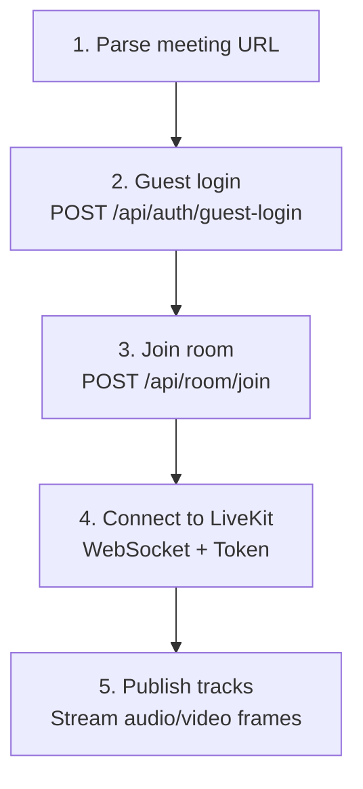
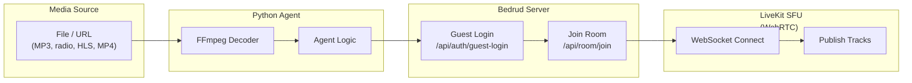

Bedrud enthält Python-basierte Bot-Agenten, die Meeting-Räumen beitreten und Medieninhalte streamen können. Diese sind nützlich für Hintergrundmusik, Radiostreams oder die Freigabe von Videoinhalten.

## Verfügbare Agenten

| Agent | Beschreibung | Medientyp |
|-------|-------------|-----------|
| `music_agent` | Spielt Audiodateien in einem Raum ab | Audio (PCM) |
| `radio_agent` | Streamt Internet-Radiosender | Audio (PCM über FFmpeg) |
| `video_stream_agent` | Teilt Videoinhalte (HLS, MP4) | Video + Audio |

## Wie Agenten funktionieren

Alle Agenten folgen demselben Verbindungsmuster:





## Music Agent

Spielt Audiodateien (MP3, WAV usw.) in einem Meeting-Raum ab.

### Einrichtung

```bash
cd agents/music_agent
pip install -r requirements.txt
```

**Abhängigkeiten:** `httpx`, `livekit`, `pydub`

### Verwendung

```bash
python agent.py "https://meet.example.com/m/room-name"
```

### Funktionsweise

1. Dekodiert Audiodateien mit `pydub`
2. Konvertiert zu PCM-Frames
3. Veröffentlicht Audio-Frames als Mikrofon-Track in LiveKit

> Siehe [Music Agent README](https://github.com/bedrud-ir/bedrud/tree/main/agents/music_agent) für Einrichtungs- und Verwendungsanweisungen.

---

## Radio Agent

Streamt Internet-Radiosender in einen Meeting-Raum unter Verwendung von FFmpeg zur Audiodekodierung.

### Einrichtung

```bash
cd agents/radio_agent
pip install -r requirements.txt
```

**Abhängigkeiten:** `httpx`, `livekit`

**Systemanforderung:** FFmpeg muss installiert sein (`brew install ffmpeg` oder `apt install ffmpeg`)

### Verwendung

```bash
python agent.py "https://meet.example.com/m/room-name"
```

### Funktionsweise

1. Verbindet sich mit einer Radio-Stream-URL
2. Leitet den Stream durch FFmpeg zur Dekodierung in rohes PCM
3. Veröffentlicht PCM-Audio-Frames in LiveKit

> Siehe [Radio Agent README](https://github.com/bedrud-ir/bedrud/tree/main/agents/radio_agent) für Einrichtungs- und Verwendungsanweisungen.

---

## Video Stream Agent

Teilt Video und Audio von einer URL (HLS/m3u8, MP4) in einem Meeting-Raum.

### Einrichtung

```bash
cd agents/video_stream_agent
pip install -r requirements.txt
```

**Abhängigkeiten:** `httpx`, `livekit`

**Systemanforderung:** FFmpeg muss installiert sein

### Verwendung

```bash
python agent.py "https://meet.example.com/m/room-name"
```

### Funktionsweise

1. Führt zwei FFmpeg-Prozesse parallel aus:
    - **Video:** Dekodiert zu YUV420p-Rohframes (1280x720 @ 30fps)
    - **Audio:** Dekodiert zu PCM-Samples
2. Veröffentlicht Video als Bildschirmfreigabe-Track
3. Veröffentlicht Audio als Mikrofon-Track

> Siehe [Video Stream Agent README](https://github.com/bedrud-ir/bedrud/tree/main/agents/video_stream_agent) für Einrichtungs- und Verwendungsanweisungen.

### Videospezifikationen

| Einstellung | Wert |
|------------|------|
| Breite | 1280 |
| Höhe | 720 |
| FPS | 30 |
| Pixelformat | YUV420p |

---

## Einen eigenen Agenten schreiben

Um einen neuen Agenten zu erstellen, folgen Sie diesem Muster:

```python
import httpx
from livekit import rtc

# 1. Parse the meeting URL to extract room name
room_name = parse_url(meeting_url)

# 2. Guest login
client = httpx.Client(base_url=server_url)
resp = client.post("/api/auth/guest-login", json={"name": "Bot Name"})
token = resp.json()["token"]

# 3. Join room
client.headers["Authorization"] = f"Bearer {token}"
resp = client.post("/api/room/join", json={"roomName": room_name})
lk_token = resp.json()["token"]

# 4. Connect to LiveKit
room = rtc.Room()
await room.connect(livekit_url, lk_token)

# 5. Publish tracks
source = rtc.AudioSource(sample_rate=48000, num_channels=1)
track = rtc.LocalAudioTrack.create_audio_track("audio", source)
await room.local_participant.publish_track(track)

# 6. Stream frames
while has_data:
    frame = get_next_frame()
    await source.capture_frame(frame)
```

---

## Siehe auch

- [Music Agent README](https://github.com/bedrud-ir/bedrud/tree/main/agents/music_agent) - Einrichtung und Verwendung
- [Radio Agent README](https://github.com/bedrud-ir/bedrud/tree/main/agents/radio_agent) - Einrichtung und Verwendung
- [Video Stream Agent README](https://github.com/bedrud-ir/bedrud/tree/main/agents/video_stream_agent) - Einrichtung und Verwendung
