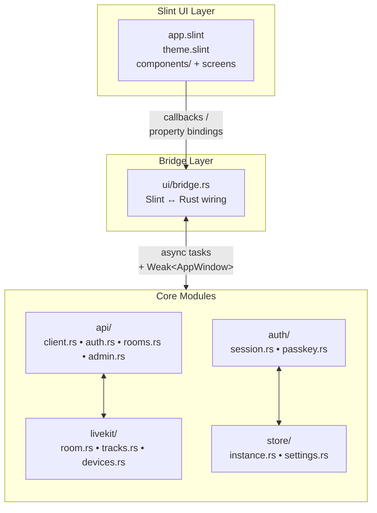

Der Bedrud-Desktop-Client ist eine native Windows- und Linux-Anwendung, die mit **Rust** und dem **Slint**-UI-Toolkit erstellt wurde. Er bietet das gleiche Kern-Meeting-Erlebnis wie die Web- und Mobile-Clients, kompiliert zu einem einzelnen Binary ohne Laufzeitabhängigkeiten.

## Technologie-Stack

| Komponente | Technologie |
|------------|------------|
| Sprache | Rust (stable) |
| UI-Toolkit | Slint 1.x |
| HTTP-Client | reqwest (async, TLS) |
| Medien | LiveKit Rust SDK |
| Speicherung | serde_json + OS-Keyring (libsecret / Windows Credential Store) |
| Build-System | Cargo Workspace |

## Plattformunterstützung

| Plattform | Renderer | Binary |
|-----------|----------|--------|
| Windows 10/11 | Direct3D 11 | `bedrud-desktop.exe` |
| Linux x86_64 | OpenGL / Vulkan (über EGL/Wayland/X11) | `bedrud-desktop` |
| macOS | _(noch nicht verfügbar - Web-App verwenden)_ | - |

## Quellcode-Struktur

```
apps/desktop/
├── Cargo.toml              # Crate definition
├── build.rs                # Slint compile step
├── src/
│   ├── main.rs             # Entry point - initialises app + event loop
│   ├── app.rs              # Top-level AppState and startup logic
│   ├── api/
│   │   ├── client.rs       # Shared HTTP client (base URL, JWT injection)
│   │   ├── auth.rs         # Login, register, refresh
│   │   ├── rooms.rs        # Room list, join, create
│   │   └── admin.rs        # Admin endpoints
│   ├── auth/
│   │   ├── session.rs      # JWT storage and refresh loop
│   │   └── passkey.rs      # FIDO2 passkey stub
│   ├── livekit/
│   │   ├── room.rs         # Room connection lifecycle
│   │   ├── tracks.rs       # Audio/video track management
│   │   └── devices.rs      # Microphone / camera enumeration
│   ├── store/
│   │   ├── instance.rs     # Multi-instance persistence
│   │   └── settings.rs     # User preferences
│   └── ui/
│       ├── mod.rs
│       └── bridge.rs       # Slint ↔ Rust callback wiring
└── ui/
    ├── app.slint            # Root component, page router
    ├── theme.slint          # Colours, typography, spacing tokens
    ├── components/          # Button, Input, Card, Avatar
    ├── auth/                # Login and Register screens
    ├── dashboard/           # Room list, Create-room dialog
    ├── meeting/             # Controls bar, participant tiles, chat
    ├── admin/               # Admin panel, user table
    └── settings.slint       # Settings screen
```

## Architektur



### Wichtige Designentscheidungen

- **Slints Kompilierzeit-UI** - `.slint`-Dateien werden zur Build-Zeit über `build.rs` in Rust kompiliert. Es gibt keine Layout-Engine zur Laufzeit; die UI ist vollständig nativ.
- **`bridge.rs` als einzige UI↔Logik-Grenze** - Alle Slint-Callbacks werden an einer Stelle verdrahtet, was die Geschäftslogik aus der UI-Schicht heraushält und die Brücke leicht zu prüfen macht.
- **`Weak<AppWindow>` in Callbacks** - Slint-UI-Handles sind `!Send`, daher aktualisieren Hintergrund-Tasks eine gespeicherte `Weak`-Referenz im UI-Thread, um Eigenschaften zu setzen, anstatt das Handle über Threads hinweg zu teilen.
- **Multi-Instance über `store/instance.rs`** - Identisch zu den Mobile-Apps: Instanzen werden als JSON-Datei im OS-Konfigurationsverzeichnis serialisiert; jede Instanz hat ihren eigenen `APIClient` und `AuthSession`.

## Lokaler Build

### Voraussetzungen

- Rust Stable-Toolchain (`rustup toolchain install stable`)
- **Linux:** `libfontconfig`, `libxkbcommon`, `libwayland`, `libgles2`, `libdbus`, `libsecret`

  ```bash
  sudo apt-get install -y \
    libfontconfig1-dev libxkbcommon-dev libxkbcommon-x11-dev \
    libwayland-dev libgles2-mesa-dev libegl1-mesa-dev \
    libdbus-1-dev libsecret-1-dev \
    libasound2-dev
  ```

- **Windows:** Visual Studio Build Tools (MSVC) mit der C++-Workload

### Build

```bash
# Debug build (fast compile, no optimisations)
make dev-desktop          # runs the app immediately after build

# Release build
make build-desktop        # → target/release/bedrud-desktop (Linux)
                           # → target/release/bedrud-desktop.exe (Windows)
```

Oder direkt mit Cargo:

```bash
cargo build -p bedrud-desktop                          # debug
cargo build -p bedrud-desktop --release                # optimised
cargo run   -p bedrud-desktop                          # run immediately
```

## CI

Die Desktop-App wird in der CI bei jedem Push auf `main` und bei Pull Requests gebaut:

| Job | Runner | Was geprüft wird |
|-----|--------|-----------------|
| `Desktop – Build & Test` | `ubuntu-latest` | `cargo build`, `cargo test` |

Release-Builds erzeugen zwei Artefakte:

| Artefakt | Runner | Format |
|----------|--------|--------|
| `bedrud-desktop-linux-x86_64.tar.xz` | `ubuntu-latest` | tar.xz |
| `bedrud-desktop-windows-x86_64.zip` | `windows-latest` | zip |
