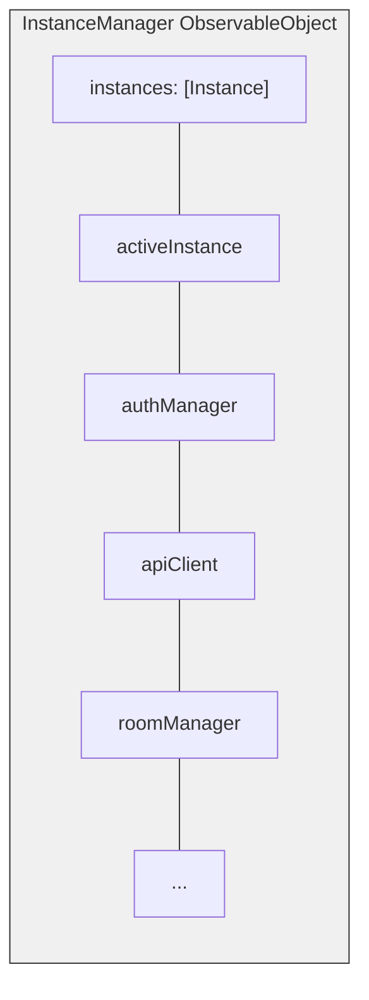
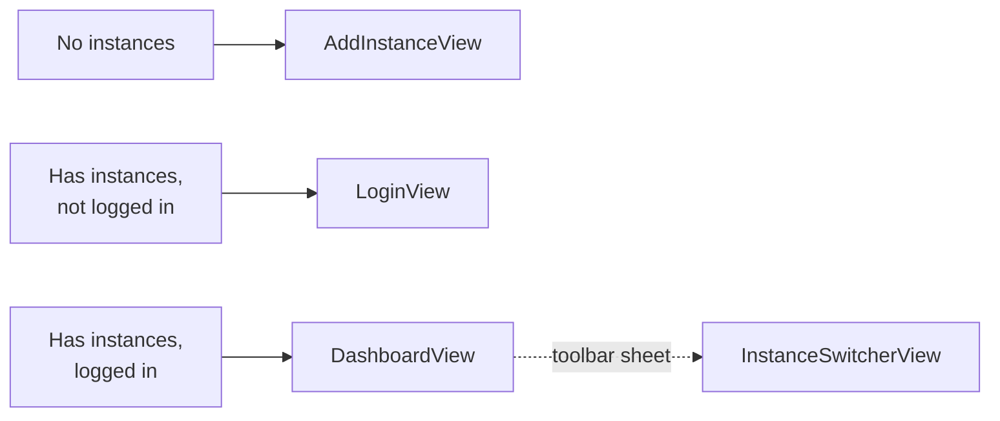

Die Bedrud iOS-App ist mit SwiftUI erstellt und bietet ein natives Video-Meeting-Erlebnis mit Multi-Instance-Unterstützung und sicherer Speicherung von Anmeldeinformationen.

## Technologie-Stack

| Technologie | Version | Zweck |
|------------|---------|-------|
| Swift | 5.9+ | Sprache |
| SwiftUI | Aktuell | UI-Framework |
| LiveKit Swift SDK | 2.0+ | WebRTC-Medien |
| KeychainAccess | 4.2.2+ | Sichere Speicherung von Anmeldeinformationen |

**Deployment-Ziel:** iOS 18.0

## Projektkonfiguration

Das Projekt verwendet **XCodeGen** zur Projektgenerierung aus `project.yml`:

- Bundle-ID: `com.bedrud.ios`
- Generierung mit: `xcodegen generate`

## Verzeichnisstruktur

```text
apps/ios/Bedrud/
├── BedrudApp.swift                # App entry point
├── Core/
│   ├── API/
│   │   └── APIClient.swift        # URLSession-based REST client
│   ├── Auth/
│   │   └── AuthManager.swift      # Token management, login/logout
│   ├── Instance/
│   │   ├── InstanceManager.swift  # Central multi-instance orchestrator
│   │   └── InstanceStore.swift    # Persistent instance storage (UserDefaults)
│   └── LiveKit/
│       └── RoomManager.swift      # LiveKit room connection manager
├── Features/
│   ├── Auth/
│   │   ├── LoginView.swift        # Login screen
│   │   └── RegisterView.swift     # Registration screen
│   ├── Dashboard/
│   │   └── DashboardView.swift    # Room list and management
│   ├── Meeting/
│   │   └── MeetingView.swift      # Video call interface
│   ├── Profile/
│   │   └── ProfileView.swift      # User profile
│   ├── Instance/
│   │   ├── AddInstanceView.swift  # Add server instance
│   │   └── InstanceSwitcherView.swift  # Switch between instances
│   ├── Settings/
│   │   └── SettingsView.swift     # App settings
│   ├── JoinByURL/
│   │   └── JoinByURLView.swift    # Deep link handling
│   └── Main/
│       └── MainTabView.swift      # Tab navigation
├── Models/
│   ├── User.swift
│   ├── Room.swift
│   └── Instance.swift
└── Design/
    └── Components/                # Reusable SwiftUI components
```

## Multi-Instance-Architektur

Die iOS-App spiegelt die Android-Architektur für die Multi-Instance-Unterstützung wider.



### Schlüsselmuster

Abhängigkeiten sind `@Published`-Eigenschaften auf `InstanceManager`, einem `ObservableObject`. Views empfangen ihn über `@EnvironmentObject`:

```swift
struct DashboardView: View {
    @EnvironmentObject var instanceManager: InstanceManager

    var body: some View {
        if let authManager = instanceManager.authManager {
            // Render authenticated UI
        }
    }
}
```

### Navigationsablauf



Der Instanzwechsler erscheint als `.sheet`, der aus der Dashboard-Toolbar aufgerufen wird.

## App-Einstiegspunkt

`BedrudApp.swift` initialisiert die Kerndienste und injiziert sie in die SwiftUI-Umgebung:

```swift
@main
struct BedrudApp: App {
    @StateObject var instanceStore = InstanceStore()
    @StateObject var instanceManager = InstanceManager()
    @StateObject var settingsStore = SettingsStore()

    var body: some Scene {
        WindowGroup {
            ContentView()
                .environmentObject(instanceStore)
                .environmentObject(instanceManager)
                .environmentObject(settingsStore)
        }
    }
}
```

## Funktionen

### Sichere Speicherung

Verwendet **KeychainAccess** zur Speicherung von JWT-Token und sensiblen Anmeldeinformationen anstelle von UserDefaults.

### Deep Linking

Verarbeitet URLs für den direkten Raumbeitritt und Raum-Codes.

### Einstellungen

Benutzereinstellungen werden über `SettingsStore` mithilfe von UserDefaults gespeichert.

## Build

```bash
# Open in Xcode
make dev-ios

# Build archive (Release)
make build-ios

# Export IPA (requires ExportOptions.plist)
make export-ios

# Build for simulator (Debug)
make build-ios-sim
```

### Voraussetzungen

- Xcode (aktuellste stabile Version)
- iOS 18.0 als Deployment-Ziel
- Für Geräte-Builds: Apple-Entwicklerkonto und Provisioning-Profil
