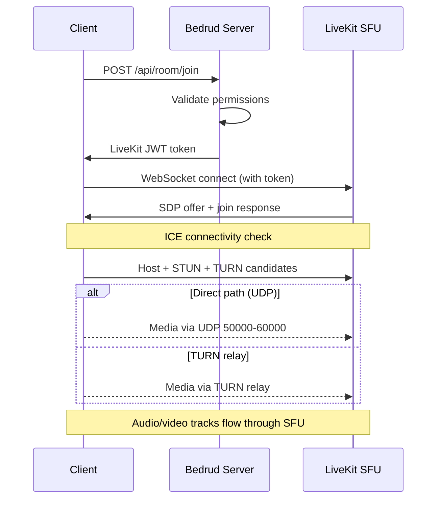

Bedrud ist ein Monorepo mit einem Go-Server, drei Client-Anwendungen, Python-Bot-Agenten und gemeinsam genutzten Paketen. Diese Seite beschreibt, wie die Komponenten zusammenhängen.

## Allgemeines Diagramm

```
┌──────────────────────────────────────────────────────────────┐
│                          Clients                             │
│                                                              │
│  ┌─────────┐  ┌──────────┐  ┌────────┐  ┌───────────────┐   │
│  │  Web    │  │ Android  │  │  iOS   │  │ Desktop       │   │
│  │ React   │  │ Compose  │  │SwiftUI │  │ Rust + Slint  │   │
│  └────┬────┘  └────┬─────┘  └───┬────┘  └──────┬────────┘   │
│       │            │            │              │             │
│       └────────────┼────────────┼──────────────┘             │
│                    │                                         │
│               REST API + WebSocket                          │
└────────────────────┼────────────────────────────────────────┘
                           │
┌────────────────────────┼────────────────────────────────┐
│                   Bedrud Server                         │
│                        │                                │
│  ┌─────────────────────┴──────────────────────────┐     │
│  │              Fiber HTTP Router                  │     │
│  │  /api/auth/*  /api/room/*  /api/admin/*        │     │
│  └──────────┬─────────────────────┬───────────────┘     │
│             │                     │                     │
│  ┌──────────┴──────────┐  ┌──────┴────────────────┐     │
│  │   GORM / SQLite     │  │  LiveKit Protocol SDK │     │
│  │   (or PostgreSQL)   │  │  (token generation,   │     │
│  │                     │  │   room management)    │     │
│  └─────────────────────┘  └──────────┬────────────┘     │
│                                      │                  │
│                           ┌──────────┴────────────┐     │
│                           │  Embedded LiveKit      │     │
│                           │  Media Server (WebRTC) │     │
│                           └───────────────────────┘     │
└─────────────────────────────────────────────────────────┘
```

## Komponenten

### Server (`server/`)

Das Go-Backend ist der Kern von Bedrud. Es ist verantwortlich für:

- **REST API** - Authentifizierung, Raumverwaltung, Administratoroperationen
- **Statische Dateiauslieferung** - Das kompilierte Web-Frontend wird über `//go:embed` eingebettet
- **LiveKit-Integration** - Erstellt Token und verwaltet Räume über das LiveKit Protocol SDK
- **Eingebetteter LiveKit-Server** - Der Media-Server-Binary läuft als Kindprozess

Der Server verwendet das **Fiber**-Webframework (ähnlich wie Express.js in Node.js) und **GORM** als ORM-Schicht. Er unterstützt SQLite für die Entwicklung und PostgreSQL für den Produktivbetrieb.

Siehe [Server-Architektur](/de/docs/architecture/server) für Details.

### Web-Frontend (`apps/web/`)

Eine **React**-Anwendung, die mit TanStack Start, TailwindCSS v4 und shadcn/ui erstellt wurde. Im Produktivbetrieb wird sie auf dem Server vorgerendert und die Client-Assets werden in das Go-Binary eingebettet.

Wichtige Funktionen:

- Video-Meeting-Benutzeroberfläche mit LiveKit Client SDK
- JWT-basierte Authentifizierung mit automatischem Token-Refresh
- Admin-Dashboard für Benutzer- und Raumverwaltung
- Designsystem mit einheitlicher Komponentenbibliothek

Siehe [Web-Frontend](/de/docs/architecture/web) für Details.

### Android-App (`apps/android/`)

Eine native Android-App, die mit **Jetpack Compose** und **Kotlin** erstellt wurde. Verwendet Koin für Dependency Injection und Retrofit für HTTP.

Wichtige Funktionen:

- Vollständiges Video-Meeting-Erlebnis mit LiveKit Android SDK
- Picture-in-Picture-Modus
- Deep Link-Verarbeitung (`bedrud.com/m/*` und `bedrud.com/c/*`)
- Anrufverwaltung mit Androids ConnectionService
- Multi-Instance-Unterstützung (Verbindung zu mehreren Servern)

Siehe [Android-App](/de/docs/architecture/android) für Details.

### iOS-App (`apps/ios/`)

Eine native iOS-App, die mit **SwiftUI** erstellt wurde. Verwendet KeychainAccess für die sichere Speicherung von Anmeldeinformationen und LiveKit Swift SDK für Medien.

Wichtige Funktionen:

- Vollständiges Video-Meeting-Erlebnis
- Multi-Instance-Unterstützung
- Deep Link-Verarbeitung
- Keychain-basierte sichere Speicherung

Siehe [iOS-App](/de/docs/architecture/ios) für Details.

### Desktop-App (`apps/desktop/`)

Eine native Windows- und Linux-Desktopanwendung, die mit **Rust** und dem **Slint**-UI-Toolkit erstellt wurde. Kompiliert zu einem einzelnen Binary ohne Laufzeitabhängigkeiten.

Wichtige Funktionen:

- Vollständiges Video-Meeting-Erlebnis über das LiveKit Rust SDK
- Natives Windows (Direct3D 11) und Linux (OpenGL/Vulkan) Rendering
- Multi-Instance-Unterstützung (Verbindung zu mehreren Bedrud-Servern)
- OS-Keyring-Integration für sichere Speicherung von Anmeldeinformationen

Siehe [Desktop-App](/de/docs/architecture/desktop) für Details.

### Bot-Agenten (`agents/`)

Python-Skripte, die als Bots an Meeting-Räumen teilnehmen und Medieninhalte streamen:

- **Music Agent** - Spielt Audiodateien ab
- **Radio Agent** - Streamt Internet-Radiosender
- **Video Stream Agent** - Teilt Videoinhalte (HLS, MP4)

Siehe [Bot-Agenten](/de/docs/architecture/agents) für Details.

## Authentifizierungsablauf

```
Client                    Server                    Database
  │                         │                          │
  ├─POST /api/auth/login───►│                          │
  │                         ├──verify credentials─────►│
  │                         │◄─────────────────────────┤
  │◄──access + refresh JWT──┤                          │
  │                         │                          │
  ├─GET /api/room/list──────►│  (Authorization header)  │
  │  (Bearer <access_token>)│                          │
  │◄──room list─────────────┤                          │
```

Alle authentifizierten Anfragen verwenden JWT-Token im `Authorization`-Header. Der `authFetch`-Wrapper des Web-Frontends übernimmt das Anhängen des Tokens und das automatische Refresh.

Unterstützte Authentifizierungsmethoden:

| Methode | Endpunkt | Beschreibung |
|---------|----------|--------------|
| E-Mail/Passwort | `POST /api/auth/login` | Klassische Anmeldeinformationen |
| Registrierung | `POST /api/auth/register` | Neukontoerstellung |
| Gast | `POST /api/auth/guest-login` | Vorübergehender Zugriff nur mit Name |
| OAuth | `GET /api/auth/:provider/login` | Google, GitHub, Twitter |
| Passkeys | `POST /api/auth/passkey/*` | FIDO2/WebAuthn-Biometrie |

## Meeting-Verbindungsablauf



1. Der Client fordert über die REST API den Beitritt zu einem Raum an
2. Der Server validiert die Berechtigungen und generiert ein signiertes LiveKit-Token
3. Der Client verbindet sich direkt über WebSocket mit LiveKit unter Verwendung des Tokens
4. ICE sammelt Kandidaten (Host, STUN, TURN) und wählt den besten Pfad aus
5. Audio-/Video-Tracks werden über die SFU von LiveKit geleitet

Siehe [WebRTC-Konnektivität](/de/docs/architecture/webrtc-connectivity) für den vollständigen Verbindungs-Stack.

## Datenmodell

### Benutzer

| Feld | Typ | Beschreibung |
|------|-----|--------------|
| ID | uint | Primärschlüssel |
| Email | string | Eindeutige E-Mail-Adresse |
| Name | string | Anzeigename |
| Password | string | Gehashtes Passwort (leer bei OAuth/Gast) |
| Avatar | string | Avatar-URL |
| Provider | string | Authentifizierungsanbieter (`local`, `google`, `github`, `twitter`, `guest`) |
| Role | string | `user` oder `admin` |

### Raum

| Feld | Typ | Beschreibung |
|------|-----|--------------|
| ID | uint | Primärschlüssel |
| AdminID | uint | Fremdschlüssel → User.ID (Raumersteller) |
| Name | string | Raumname / URL-Slug |
| IsPublic | bool | Ob Gäste ohne Einladung beitreten können |
| ChatEnabled | bool | Ob der Chat im Raum aktiv ist |
| VideoEnabled | bool | Ob Video erlaubt ist |
| Participants | []User | Benutzer, die sich derzeit im Raum befinden |

### Passkey

| Feld | Typ | Beschreibung |
|------|-----|--------------|
| ID | uint | Primärschlüssel |
| UserID | uint | Fremdschlüssel → User.ID |
| CredentialID | []byte | WebAuthn Credential-ID |
| PublicKey | []byte | WebAuthn Public Key |
| Counter | uint32 | WebAuthn Sign Count |

### RefreshToken

| Feld | Typ | Beschreibung |
|------|-----|--------------|
| Token | string | Der Refresh-Token-String |
| UserID | uint | Fremdschlüssel → User.ID |
| ExpiresAt | time | Ablaufzeitstempel des Tokens |

## Bereitstellungsarchitektur

Im Produktivbetrieb läuft Bedrud als zwei systemd-Dienste:

| Dienst | Binary | Zweck |
|--------|--------|-------|
| `bedrud.service` | `bedrud --run` | API-Server + eingebettetes Web-Frontend |
| `livekit.service` | `bedrud --livekit` | WebRTC-Media-Server |

Beide werden von einem einzelnen Binary verwaltet. Traefik oder ein anderer Reverse Proxy übernimmt die TLS-Terminierung und leitet den Datenverkehr weiter.

Siehe [Bereitstellungsleitfaden](/de/docs/guides/deployment) für Einrichtungsanweisungen.

## Schlüsselbegriffe

Diese Begriffe tauchen in der gesamten Architekturdokumentation auf:

| Begriff | Vollständiger Name | Bedeutung |
|---------|-------------------|-----------|
| **SFU** | Selective Forwarding Unit | Ein Media-Server, der Streams von jedem Teilnehmer empfängt und an andere weiterleitet. Clients verbinden sich mit dem Server, nicht miteinander. |
| **SDP** | Session Description Protocol | Das Format zur Beschreibung von WebRTC-Verbindungsparametern (Codecs, Auflösungen, Medientypen). |
| **ICE** | Interactive Connectivity Establishment | Ein Framework, das alle möglichen Netzwerkpfade zwischen Client und Server sammelt und den besten auswählt. |
| **STUN** | Session Traversal Utilities for NAT | Ein leichtgewichtiges Protokoll, das einem Client hilft, seine öffentliche IP-Adresse zu ermitteln. Funktioniert bei den meisten Verbindungen. |
| **TURN** | Traversal Using Relays around NAT | Ein Protokoll, das alle Medien über den Server weiterleitet, wenn keine direkte Verbindung möglich ist. Letzter Ausweg, höchste Bandbreitenkosten. |
| **NAT** | Network Address Translation | Eine Router-Funktion, die private interne Adressen einer öffentlichen Adresse zuordnet. Kann direkte WebRTC-Verbindungen blockieren, abhängig vom Typ. |
| **srflx** | Server Reflexive | Ein Typ von ICE-Kandidat, der die öffentliche IP des Clients repräsentiert, ermittelt über STUN. |
| **WebRTC** | Web Real-Time Communication | Der Browser- und Mobile-API-Standard für Echtzeit-Audio, -Video und Datentransfer. |

## Siehe auch

- [WebRTC-Konnektivität](/de/docs/architecture/webrtc-connectivity) - vollständiger STUN/ICE/TURN/SFU-Verbindungs-Stack
- [TURN-Server-Leitfaden](/de/docs/architecture/turn-server) - TURN-Relay-Architektur und Konfiguration
- [LiveKit-Integration](/de/docs/backend/livekit) - wie Bedrud LiveKit einbettet
