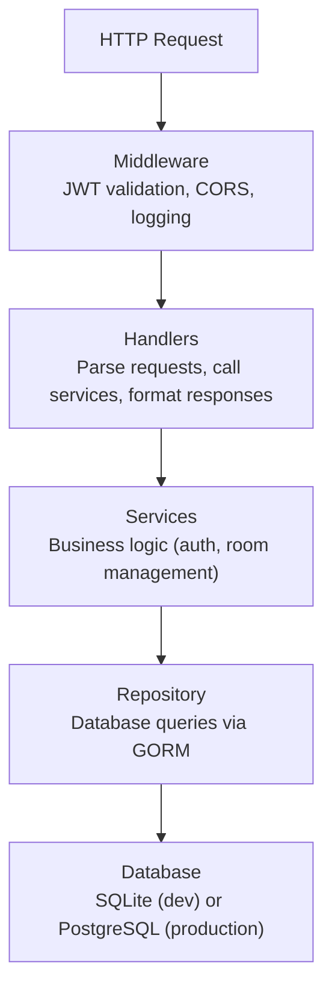

Der Bedrud-Server ist eine Go-Anwendung, die die REST API bereitstellt, das eingebettete Web-Frontend ausliefert und den LiveKit-Media-Server verwaltet.

## Technologie-Stack

| Technologie | Zweck |
|------------|-------|
| Go 1.24 | Hauptsprache |
| Fiber v2 | Webframework (Express-ähnlich) |
| GORM | ORM für SQLite und PostgreSQL |
| LiveKit Protocol SDK | WebRTC-Raum- und Token-Verwaltung |
| Zerolog | Strukturiertes JSON-Logging |
| Goth | Multi-Provider-OAuth2 |
| go-passkeys | FIDO2/WebAuthn-Unterstützung |
| golang-jwt | JWT-Token-Erstellung und -Validierung |
| gocron | Hintergrund-Job-Scheduling |
| Swagger (swaggo) | API-Dokumentationsgenerierung |

## Verzeichnisstruktur

```
server/
├── cmd/
│   ├── server/main.go        # Development entry point
│   └── bedrud/main.go        # Production entry point (with install/livekit flags)
├── internal/
│   ├── auth/                  # Authentication services
│   │   ├── auth.go            # Core auth service (register, login, OAuth)
│   │   ├── jwt.go             # JWT token creation and validation
│   │   └── session_store.go   # Gorilla session store for OAuth state
│   ├── database/              # Database initialization and migrations
│   ├── handlers/              # HTTP request handlers (controller layer)
│   │   ├── auth_handler.go    # Auth endpoints
│   │   ├── room.go            # Room endpoints
│   │   └── users.go           # User management endpoints
│   ├── middleware/             # Fiber middleware
│   │   └── auth.go            # JWT validation, permission checks
│   ├── models/                # GORM models (database schemas)
│   │   ├── user.go            # User model
│   │   ├── room.go            # Room model
│   │   └── passkey.go         # Passkey model
│   ├── repository/            # Data access layer (SQL via GORM)
│   │   ├── user_repository.go
│   │   ├── room_repository.go
│   │   └── passkey_repository.go
│   ├── livekit/               # Embedded LiveKit server management
│   ├── scheduler/             # Background job scheduling
│   └── utils/                 # TLS and other utilities
├── frontend/                  # Embedded web frontend (populated at build time)
├── config.yaml                # Development configuration
├── livekit.yaml               # Development LiveKit configuration
├── go.mod
└── go.sum
```

## Schichtenarchitektur

Der Server folgt einer dreischichtigen Architektur:



## Wichtige Muster

### Eingebettetes Frontend

Das Web-Frontend wird zu statischen Dateien kompiliert und über `//go:embed` in das Go-Binary eingebettet:

```go
//go:embed frontend/*
var frontendFS embed.FS
```

Zur Build-Zeit führt `bun run build:embed` ein SSR-Pre-Rendering der React-App durch und kopiert `dist/client/` nach `server/frontend/`. Der Go-Compiler bündelt es dann in das Binary. Der Fiber-Server liefert diese Dateien für alle Nicht-API-Routen aus.

### JWT-Authentifizierung

Die Middleware extrahiert das JWT aus dem `Authorization: Bearer <token>`-Header, validiert es und hängt den Benutzerkontext an die Anfrage an. Geschützte Routen verwenden die `RequireAccess`-Middleware zur Prüfung der Benutzerrollen.

### LiveKit-Token-Generierung

Wenn ein Benutzer einem Raum beitritt, führt der Server Folgendes aus:

1. Validiert die Raumberechtigungen
2. Erstellt ein mit dem API-Secret signiertes LiveKit-Zugangstoken
3. Gibt das Token an den Client zurück
4. Der Client verbindet sich direkt unter Verwendung des Tokens mit LiveKit

### Swagger-Dokumentation

Die API-Dokumentation wird automatisch aus Code-Anmerkungen mit swaggo generiert. In der Entwicklung ist sie unter `/api/swagger/` verfügbar.

## Datenbank

### SQLite (Standard)

Für die Entwicklung und kleine Bereitstellungen verwendet Bedrud SQLite. Die Datenbankdatei wird am konfigurierten `database.path` gespeichert (Standard: `data.db`).

### PostgreSQL

Für den Produktivbetrieb mit höheren Parallelitätsanforderungen konfigurieren Sie eine PostgreSQL-Verbindungszeichenfolge. GORM verarbeitet beide Dialekte transparent.

### Migrationen

GORM migriert das Schema beim Start automatisch basierend auf den Model-Structs. Die Modelle sind in `internal/models/` definiert.

## Hintergrund-Jobs

Der `gocron`-Scheduler führt periodische Aufgaben aus, wie z. B.:
- Bereinigung abgelaufener Refresh-Token
- Entfernen veralteter Raumteilnehmer

---

## Siehe auch

- [Backend-Code-Struktur](/de/docs/backend/structure) - Verzeichnisübersicht und Coding-Standards
- [API-Handler](/de/docs/backend/api-handlers) - Routing und Anfrage-Lebenszyklus
- [Datenbank und Modelle](/de/docs/backend/database) - GORM-Modelle und Repository-Muster
- [Authentifizierungsablauf](/de/docs/backend/authentication) - JWT-, OAuth- und Passkey-Interna
