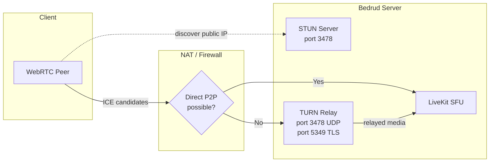
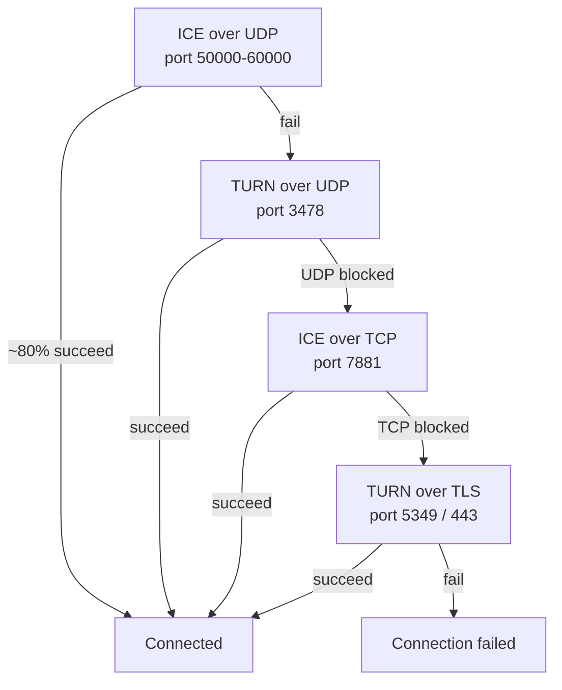
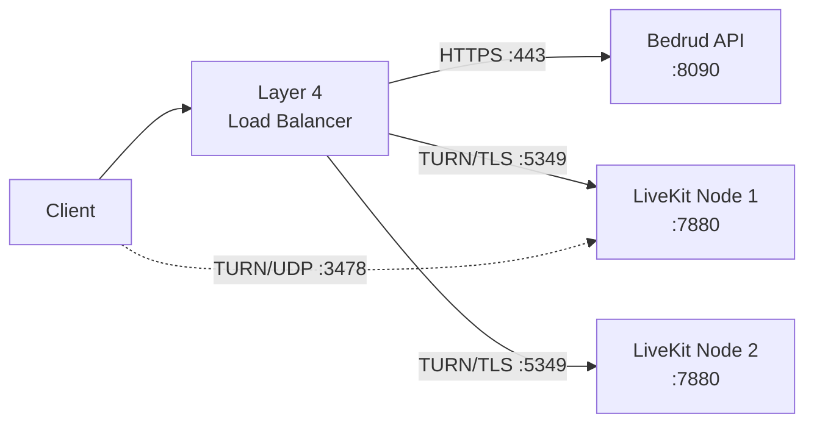
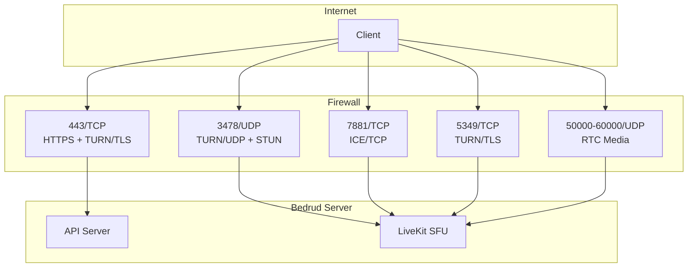

Bedrud bettet über LiveKit einen TURN-Server ein, um Medien für Clients hinter restriktiven NATs oder Firewalls weiterzuleiten. Diese Seite behandelt Architektur, Konfiguration und Fehlerbehebung.

---

## Was ist TURN

**TURN** (Traversal Using Relays around NAT) ist ein Protokoll, das Medienpakete über einen Server weiterleitet, wenn zwei Endpunkte keine direkte Verbindung herstellen können.

**Verwandte Protokolle:**

| Protokoll | Rolle | Kosten |
|-----------|-------|--------|
| **STUN** | Öffentliche IP/Port ermitteln. Leichtgewichtig. | Keine (Server sieht nur kleine Binding-Anfragen) |
| **ICE** | Framework, das alle Konnektivitätsoptionen in Prioritätsreihenfolge testet. | Keine (nur Koordination) |
| **TURN** | Alle Medien weiterleiten, wenn der direkte Pfad fehlschlägt. Letzter Ausweg. | Hoch (Serverbandbreite = alle weitergeleiteten Medien) |

Siehe [WebRTC-Konnektivität](/de/docs/architecture/webrtc-connectivity) für den vollständigen Verbindungs-Stack.

---

## TURN in Bedrud

LiveKit enthält einen eingebetteten TURN-Server. Keine externe Infrastruktur erforderlich.

### Relay-Architektur



### Verbindungspriorität

LiveKit testet Verbindungstypen in Reihenfolge. Jeder Fallback erhöht die Latenz und Serverkosten:



| Priorität | Typ | Port | Typisches Szenario |
|-----------|-----|------|-------------------|
| 1 | ICE/UDP (direkt) | 50000-60000 | Die meisten Verbindungen. Kein Relay. |
| 2 | TURN/UDP | 3478 | Symmetrisches NAT, P2P blockiert. |
| 3 | ICE/TCP | 7881 | UDP blockiert (VPN, einige Firewalls). |
| 4 | TURN/TLS | 5349 oder 443 | Unternehmensfirewall, nur HTTPS ausgehend. |

---

## Wann TURN aktiviert wird

TURN aktiviert sich, wenn der direkte Medienpfad fehlschlägt. Häufige Ursachen:

- **Symmetrisches NAT auf beiden Seiten** - Sowohl der Client als auch der Server haben symmetrisches NAT. Das NAT weist für jedes Ziel einen anderen öffentlichen Port zu, sodass die über STUN ermittelte Adresse unerreichbar wird.
- **Unternehmensfirewall** - blockiert ausgehendes UDP vollständig. Nur TCP-Port 443 erlaubt.
- **VPN-Einschränkungen** - einige VPNs fangen WebRTC-Verkehr ab oder blockieren ihn.
- **Cloud-VMs ohne öffentliche IP** - einige Cloud-Anbieter verwenden NAT, das direktes ICE bricht.

Die meisten Benutzer (~80 %) benötigen nie TURN. Der direkte UDP-Pfad funktioniert.

### Bandbreitenkosten

Wenn TURN weiterleitet, überträgt der Server alle Medien für diesen Teilnehmer. Ungefähre Bandbreite pro Stream:

| Stream-Typ | Bitrate | Pro weitergeleitetem Teilnehmer |
|------------|---------|--------------------------------|
| Audio (Opus) | ~32 Kbps | ~32 Kbps |
| Video 720p (VP8) | ~1,5 Mbps | ~1,5 Mbps Upload + 1,5 Mbps Download pro abonniertem Track |
| Bildschirmfreigabe 1080p | ~2,5 Mbps | ~2,5 Mbps |

Für ein 5-Personen-Meeting mit einem weitergeleiteten Teilnehmer: Der Server verarbeitet ca. 1,5 Mbps zusätzlich für das Video-Relay dieses Teilnehmers. Multiplizieren Sie diese Werte mit der Anzahl der weitergeleiteten Teilnehmer, um die gesamte Serverbandbreite abzuschätzen.

---

## Konfiguration

**Datei:** `server/config/livekit.yaml` (Entwicklung) oder `/etc/bedrud/livekit.yaml` (Produktion)

```yaml
turn:
  enabled: true
  domain: "turn.example.com"
  udp_port: 3478
  tls_port: 5349
  cert_file: /etc/bedrud/turn.crt
  key_file: /etc/bedrud/turn.key
  relay_range_start: 30000
  relay_range_end: 40000
  external_tls: false
```

### Schlüsselreferenz

| Schlüssel | Standard | Beschreibung |
|-----------|---------|--------------|
| `enabled` | `true` | Eingebetteten TURN-Server aktivieren. |
| `domain` | `localhost` | Domain, die Clients angekündigt wird. Muss zur öffentlichen IP des Servers auflösen. |
| `udp_port` | `3478` | TURN/UDP-Port. Dient auch STUN-Binding-Anfragen, wenn TURN aktiviert ist. |
| `tls_port` | `5349` | TURN/TLS-Port. Auf `443` setzen, wenn kein Load Balancer TLS terminiert. |
| `cert_file` | - | TLS-Zertifikat für TURN/TLS. Erforderlich, wenn TURN/TLS-Clients vorhanden sind. |
| `key_file` | - | Privater TLS-Schlüssel passend zu `cert_file`. |
| `relay_range_start` | `30000` | Start des UDP-Portbereichs für weitergeleitete Medienpakete. |
| `relay_range_end` | `40000` | Ende des Relay-Portbereichs. Jeder weitergeleitete Teilnehmer verbraucht Ports aus diesem Bereich. |
| `external_tls` | `false` | Auf `true` setzen, wenn ein Layer-4-Load-Balancer TURN/TLS terminiert. LiveKit überspringt dann sein eigenes TLS auf dem TURN-Port. |

### `use_external_ip`-Interaktion

In derselben `livekit.yaml`, unter `rtc:`:

```yaml
rtc:
  use_external_ip: true
```

Muss `true` sein, damit TURN korrekt funktioniert. Wenn `false`, enthalten ICE-Kandidaten interne (private) IP-Adressen, die Clients im Internet nicht erreichen können.

---

## Produktiv-TLS-Einrichtung

TURN/TLS erfordert ein eigenes TLS-Zertifikat. Zwei Ansätze:

### Einzelne Domain (ohne Load Balancer)

Verwenden Sie das TLS-Zertifikat des Servers erneut. Setzen Sie `tls_port` auf `443`:

```yaml
turn:
  enabled: true
  domain: "meet.example.com"
  tls_port: 443
  cert_file: /etc/bedrud/meet.example.com.crt
  key_file: /etc/bedrud/meet.example.com.key
```

Die TURN-Domain und die Serverdomain sind identisch. Port 443 verarbeitet sowohl die HTTPS-API als auch TURN/TLS - LiveKit unterscheidet nach Protokoll.

### Dedizierte TURN-Domain (mit Load Balancer)



```yaml
turn:
  enabled: true
  domain: "turn.example.com"
  tls_port: 5349
  external_tls: true
```

Der Load Balancer terminiert TLS. `external_tls: true` teilt LiveKit mit, dass bereits entschlüsselter Datenverkehr erwartet wird.

---

## Port- und Firewall-Referenz



| Port | Protokoll | Dienst | Erforderlich | Hinweise |
|------|-----------|--------|-------------|---------|
| 443 | TCP | HTTPS + TURN/TLS | Ja | API + Web-UI. Auch TURN/TLS wenn `tls_port: 443`. |
| 3478 | UDP | TURN/UDP + STUN | Empfohlen | Doppelfunktion: STUN-Binding + TURN-Relay. |
| 5349 | TCP | TURN/TLS | Falls kein LB | Dedizierter TURN/TLS-Port. Entfällt bei Verwendung von Port 443. |
| 7881 | TCP | ICE/TCP | Empfohlen | Fallback wenn UDP blockiert, aber TLS nicht benötigt wird. |
| 50000-60000 | UDP | RTC-Medien | Ja | ICE-Kandidaten-Ports. Jeder Teilnehmer verwendet 2 Ports. |
| 7880 | TCP | LiveKit-API | Intern | WebSocket-Signalisierung. In Produktion nicht direkt freigegeben. |

### Minimale Firewall-Regeln

Für grundlegende Konnektivität:

```
Allow TCP 443    (HTTPS + TURN/TLS)
Allow UDP 3478   (TURN/UDP + STUN)
Allow UDP 50000-60000  (RTC media)
```

Für maximale Kompatibilität (Unternehmensnetzwerke):

```
Also allow TCP 7881  (ICE/TCP)
Also allow TCP 5349  (TURN/TLS, if not using port 443)
```

---

## Testen und Fehlerbehebung

### Browser: chrome://webrtc-internals

1. Öffnen Sie `chrome://webrtc-internals` in Chrome/Edge vor dem Beitreten zu einem Meeting.
2. Erstellen Sie einen Dump.
3. Suchen Sie nach **ICE-Kandidatenpaaren** im Stats-Tab.
4. Die Kandidatentypen verraten den Verbindungspfad:

| Kandidatentyp | Bedeutung |
|--------------|-----------|
| `host` | Lokale IP. Direkte Schnittstelle. |
| `srflx` (Server Reflexive) | Über STUN ermittelte öffentliche IP. Direktes P2P funktioniert. |
| `relay` | TURN-Relay aktiv. Medien gehen über den Server. |

Wenn Sie `relay`-Kandidaten als aktives Paar sehen, verarbeitet TURN diese Verbindung.

### LiveKit Client SDK-Ereignisse

Alle LiveKit-SDKs senden Verbindungsstatus-Ereignisse:

```typescript
room.on(RoomEvent.Connected, () => {
  console.log("Connected");
});

room.on(RoomEvent.Reconnecting, () => {
  console.log("Connection lost, reconnecting...");
});
```

Prüfen Sie `room.localParticipant.connectionQuality` für Verbindungsstatistiken.

### LiveKit-Serverprotokolle

Erhöhen Sie die Protokollebene in `livekit.yaml`:

```yaml
logging:
  level: debug
```

Suchen Sie nach Protokolleinträgen, die Folgendes enthalten:
- `ICE` - Status der Kandidatensammlung
- `TURN` - Relay-Zuweisungsereignisse
- `relay` - Aktive Relay-Verbindungen

### Manueller TURN-Test mit turnutils

Installieren Sie das Paket `coturn-utils` und testen Sie die TURN-Konnektivität:

```bash
turnutils_uclient -t -p 3478 -W devkey -u devkey turn.example.com
```

- `-t` - TCP verwenden
- `-p` - TURN-Port
- Anmeldeinformationen durch Produktionswerte ersetzen

Bei erfolgreicher Ausführung werden zugewiesene Relay-Adressen angezeigt.

---

## Fehlerbehebung

| Symptom | Wahrscheinliche Ursache | Lösung |
|---------|------------------------|--------|
| Clients können sich nicht verbinden, Timeout | TURN-Ports durch Firewall blockiert | UDP 3478, TCP 5349, UDP 50000-60000 öffnen |
| TURN/TLS schlägt fehl | Fehlendes oder nicht übereinstimmendes TLS-Zertifikat | `cert_file`/`key_file`-Pfade prüfen. Zertifikat muss zu `domain` passen. |
| TURN/TLS schlägt mit LB fehl | `external_tls` nicht gesetzt | `external_tls: true` in der Konfiguration setzen. |
| Einseitiges Audio/Video | Relay-Portbereich blockiert | `relay_range_start` bis `relay_range_end` UDP öffnen. |
| Hohe Serverbandbreite | Viele Clients hinter NAT verwenden Relay | Erwartet. Server skalieren oder Relay-Benutzer reduzieren. |
| `relay`-Kandidaten obwohl `srflx` erwartet | `use_external_ip: false` | `rtc.use_external_ip: true` setzen. |
| TURN-Domain löst nicht auf | DNS falsch konfiguriert | `dig +short turn.example.com` muss die öffentliche IP des Servers zurückgeben. |
| Clients hinter Unternehmensfirewall | Nur Port 443 erlaubt | `turn.tls_port: 443` setzen. Zertifikat muss gültig sein. |
| `turn.enabled: true` aber kein Relay | Direkter Pfad funktioniert (gut) | TURN ist Fallback. Kein Relay = besser. Mit `chrome://webrtc-internals` verifizieren. |

### Schnelle Diagnose-Checkliste

1. `dig +short <turn.domain>` gibt die korrekte öffentliche IP zurück?
2. Firewall erlaubt UDP 3478, TCP 5349, UDP 50000-60000?
3. `tls_port: 443` oder `5349` stimmt mit den Firewall-Regeln überein?
4. `cert_file` und `key_file` existieren und sind lesbar?
5. Zertifikat-CN/SAN stimmt mit `turn.domain` überein?
6. `rtc.use_external_ip: true` gesetzt?
7. LiveKit-Protokolle zeigen keine TURN-bezogenen Fehler?

---

## Siehe auch

- [WebRTC-Konnektivität](/de/docs/architecture/webrtc-connectivity) - vollständiger STUN/ICE/TURN/SFU-Verbindungs-Stack
- [LiveKit-Integration](/de/docs/backend/livekit) - wie Bedrud LiveKit einbettet
- [Konfigurationsreferenz](/de/docs/getting-started/configuration) - alle Konfigurationsoptionen
- [Internes TLS](/de/docs/guides/internal-tls) - TLS für isolierte Netzwerke
- [Bereitstellungsleitfaden](/de/docs/guides/deployment) - Schritte zur Produktionsbereitstellung
