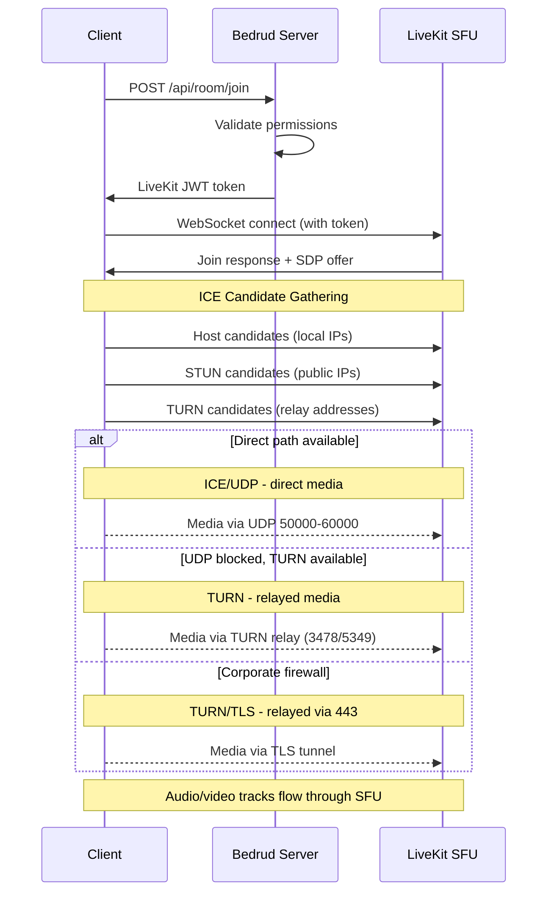
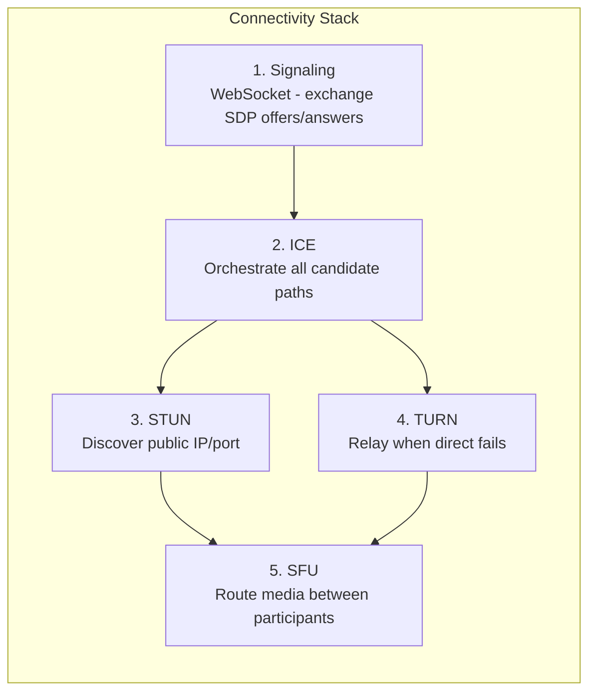
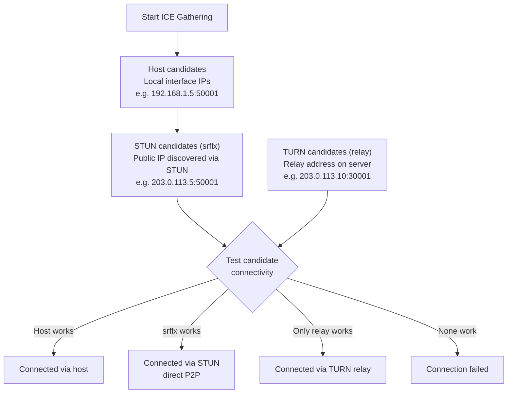
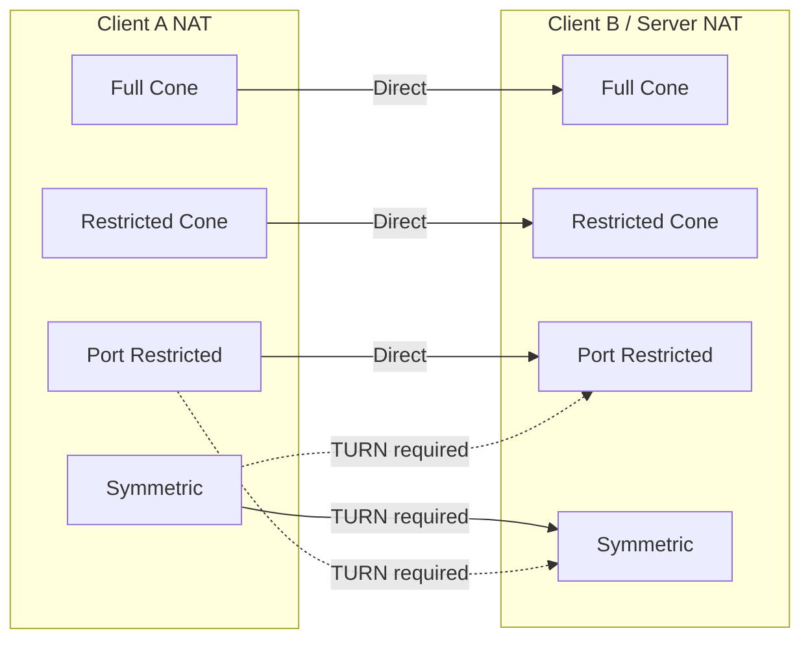

Wie Clients in Bedrud Echtzeit-Medienverbindungen herstellen. Behandelt den vollständigen Verbindungs-Stack: Signalisierung, ICE, STUN, TURN und den SFU-Medienpfad.

---

## Übersicht

WebRTC erfordert eine Reihe von Schritten, bevor Audio und Video zwischen Client und Server fließen. Bedrud verwendet die SFU-Architektur (Selective Forwarding Unit) von LiveKit - Clients verbinden sich mit dem Server, nicht miteinander. **Das bedeutet, dass nur der Client-zu-Server-Netzwerkpfad relevant ist**, nicht die Verbindung zwischen einzelnen Teilnehmern.



---

## Verbindungs-Stack

Fünf Schichten arbeiten zusammen, um den Medienpfad herzustellen:



### Schichtdetails

**1. Signalisierung** - Client und Server tauschen Verbindungsmetadaten über SDP-Angebote und -Antworten (Session Description Protocol) über WebSocket aus. Dies ist keine Medienübertragung - es ist die Aufbauphase. Bedrud leitet die Signalisierung über den API-Server an die eingebettete LiveKit-Instanz weiter.

**2. ICE (Interactive Connectivity Establishment)** - Sammelt alle möglichen Verbindungspfade, sogenannte Kandidaten, und testet sie in Prioritätsreihenfolge. ICE ist ein Framework - es koordiniert die Verbindungsversuche, ist aber selbst kein Protokoll.

**3. STUN (Session Traversal Utilities for NAT)** - Leichtgewichtiges Protokoll. Der Client sendet eine Binding-Anfrage an den STUN-Server, der mit der öffentlichen IP und dem Port des Clients antwortet. Dieser „Server-Reflexive"-Kandidat wird dann auf direkte Konnektivität getestet. Funktioniert bei ca. 80 % der Verbindungen.

**4. TURN (Traversal Using Relays around NAT)** - Wenn die direkte Konnektivität fehlschlägt, weist TURN eine Relay-Adresse auf dem Server zu. Alle Medienpakete werden über dieses Relay weitergeleitet. Höchste Kosten - die Serverbandbreite skaliert mit der Anzahl der Relay-Benutzer. Siehe den [TURN-Server-Leitfaden](turn-server.mdx) für ausführliche Informationen.

**5. SFU (Selective Forwarding Unit)** - Sobald der Transportpfad hergestellt ist, leitet die SFU von LiveKit Medien zwischen Teilnehmern weiter. Jeder Teilnehmer sendet einen Stream nach oben; die SFU leitet Kopien an andere Teilnehmer weiter. Dies ist kein Peer-to-Peer - der Server ist immer im Pfad.

---

## ICE-Kandidatensammlung



ICE sammelt gleichzeitig drei Kandidatentypen:

| Typ | Quelle | Priorität | Funktionsweise |
|-----|--------|-----------|----------------|
| **host** | Lokale Netzwerkschnittstellen | Höchste | Direkte IP vom Rechner. Funktioniert im LAN. |
| **srflx** (Server Reflexive) | STUN-Server-Antwort | Mittel | Öffentliche IP, ermittelt über STUN. Funktioniert bei den meisten NAT-Typen. |
| **relay** | TURN-Server-Zuweisung | Niedrigste | Adresse auf dem TURN-Server. Funktioniert immer. Höchste Kosten. |

ICE testet alle Kandidaten und wählt das Paar mit der höchsten Priorität, das erfolgreich ist. Wenn `srflx` funktioniert, wird `relay` übersprungen.

---

## NAT-Typen und Konnektivität

Unterschiedliche NAT-Typen beeinflussen, ob direkte Konnektivität funktioniert:



| NAT-Typ | Beschreibung | Direktes P2P | TURN erforderlich |
|---------|-------------|--------------|-------------------|
| **Full Cone** | Alle Anfragen von derselben internen IP/Port werden auf dieselbe öffentliche IP/Port abgebildet. Jeder externe Host kann daran senden. | Ja | Nein |
| **Restricted Cone** | Gleiche Abbildung wie Full Cone, aber nur externe Hosts, die ein Paket erhalten haben, können zurücksenden. | Meistens | Nein |
| **Port Restricted Cone** | Ähnlich wie Restricted Cone, aber der NAT schränkt auch die externe Portnummer ein. Der häufigste Heimrouter-Typ. | Meistens | Selten |
| **Symmetric** | Unterschiedliche öffentliche IP/Port-Abbildung pro Ziel. Die über STUN ermittelte Adresse kann nicht wiederverwendet werden. | Nein (wenn beide symmetrisch) | **Ja** |

**Wichtige Erkenntnis:** Da der Server eine öffentliche IP und einen vorhersagbaren Portbereich hat, funktionieren die meisten NAT-Typen direkt. TURN wird hauptsächlich benötigt, wenn die Firewall des Clients ausgehendes UDP vollständig blockiert.

---

## Konfigurationsübersicht

Welche Bedrud/LiveKit-Konfigurationsschlüssel die WebRTC-Konnektivität beeinflussen:

**`livekit.yaml`-Schlüssel:**

```yaml
rtc:
  port_range_start: 50000       # UDP media port range start
  port_range_end: 60000         # UDP media port range end
  tcp_port: 7881                # ICE/TCP fallback port
  stun_servers:                 # External STUN servers (optional)
    - stun:stun.l.google.com:19302
  use_external_ip: true         # Advertise public IP in ICE candidates

turn:
  enabled: true                 # Enable embedded TURN
  domain: "turn.example.com"    # TURN domain (DNS must resolve)
  udp_port: 3478                # TURN/UDP + STUN port
  tls_port: 5349                # TURN/TLS port (or 443)
  cert_file: /path/to/turn.crt  # TLS cert for TURN/TLS
  key_file: /path/to/turn.key   # TLS key for TURN/TLS
  relay_range_start: 30000      # Relay port range start
  relay_range_end: 40000        # Relay port range end
  external_tls: false           # L4 LB terminates TLS
```

**`config.yaml`-Schlüssel (Bedrud-Server):**

```yaml
server:
  port: 8090                    # API port (signaling proxied through this)
  enableTLS: true               # HTTPS for signaling
  domain: "meet.example.com"    # Public domain
```

### Fehlerbehebung bei Konnektivitätsproblemen

| Symptom | Prüfung |
|---------|---------|
| Überhaupt keine Verbindung möglich | `rtc.use_external_ip: true`? Firewall offen auf 443 + UDP-Bereich? |
| Verbindet, aber kein Audio/Video | UDP 50000-60000 blockiert? ICE-Kandidaten im Browser prüfen. |
| Langsame Verbindung | TURN-Relay aktiv (Kandidaten prüfen). Erwartet bei Client hinter striktem NAT. |
| Scheitert in Unternehmensnetzwerken | TURN/TLS nicht konfiguriert. `turn.tls_port: 443` mit gültigem Zertifikat setzen. |
| Funktioniert im LAN, nicht aus der Ferne | Öffentliche IP nicht angekündigt. `rtc.use_external_ip: true` setzen. |

Für ausführliche TURN-Fehlerbehebung siehe den [TURN-Server-Leitfaden](/de/docs/architecture/turn-server).

---

## Siehe auch

- [TURN-Server-Leitfaden](/de/docs/architecture/turn-server) - TURN-Architektur, Konfiguration, TLS, Fehlerbehebung
- [LiveKit-Integration](/de/docs/backend/livekit) - wie Bedrud LiveKit einbettet
- [Architekturübersicht](/de/docs/architecture/overview) - vollständige Systemarchitektur
- [Internes TLS](/de/docs/guides/internal-tls) - TLS für isolierte Netzwerke
