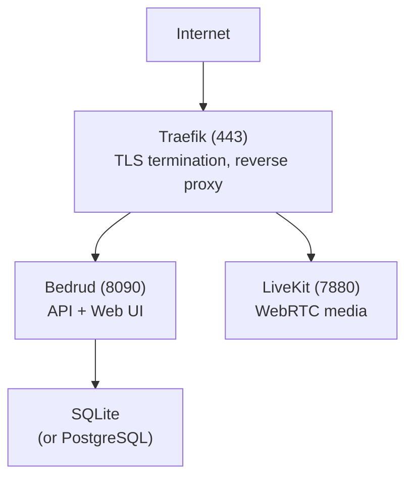

Diese Anleitung erklärt, wie Sie Bedrud auf einem Produktionsserver bereitstellen.

## Bereitstellungsoptionen

| Methode | Am besten für |
|---------|---------------|
| [Paketverwaltung (apt/AUR)](#package-manager) | Verwaltete Installation auf unterstützten Linux-Distributionen |
| [Automatisierte CLI](#automated-cli-deployment) | Schnelles Remote-Setup |
| [Manuelle Installation](#manual-installation) | Volle Kontrolle über die Konfiguration |
| [Docker](#docker-deployment) | Containerisierte Umgebungen |
| [Appliance-Modus](/de/docs/guides/appliance) | Single-Binary-All-in-One-Setup |

---

## Paketverwaltung

Installieren Sie Bedrud auf Debian/Ubuntu oder Arch Linux über den nativen Paketmanager. Dies ist die empfohlene Methode für dauerhafte Serverbereitstellungen, bei denen Sie automatische Updates über `apt upgrade` oder das AUR wünschen.

Siehe die [Paketinstallationsanleitung](/de/docs/guides/packages) für vollständige Anweisungen, einschließlich des Hinzufügens des apt-GPG-Schlüssels und des Repositorys.

```bash
# Ubuntu / Debian
sudo apt install bedrud

# Arch Linux (AUR)
yay -S bedrud-bin
```

Führen Sie nach der Installation das interaktive Installationsprogramm aus, um TLS, systemd-Dienste und die Datenbank zu konfigurieren:

```bash
sudo bedrud install
```

---

## Automatisierte CLI-Bereitstellung

Der schnellste Weg zur Bereitstellung. Führen Sie es von Ihrem lokalen Rechner aus:

**Voraussetzungen:** Python 3.10+, [uv](https://github.com/astral-sh/uv) und SSH-Zugriff auf den Zielserver.

```bash
cd tools/cli
uv run python bedrud.py --auto-config \
  --ip <server-ip> \
  --user root \
  --auth-key ~/.ssh/id_rsa \
  --domain meet.example.com \
  --acme-email admin@example.com
```

Dies wird:

1. Das Backend-Binary lokal erstellen
2. Es komprimieren und per rsync hochladen
3. Konfliktreiche Webserver entfernen
4. Die Firewall konfigurieren
5. Dienste auf dem Server installieren und starten

### CLI-Optionen

| Flag | Beschreibung |
|------|-------------|
| `--ip` | Server-IP-Adresse |
| `--user` | SSH-Benutzer (Standard: root) |
| `--auth-key` | Pfad zum privaten SSH-Schlüssel |
| `--domain` | Domainname für Let's Encrypt |
| `--acme-email` | E-Mail für Let's Encrypt |
| `--uninstall` | Bedrud vom Server entfernen |

---

## Manuelle Installation

### 1. Binary erstellen

```bash
make build-dist
```

Dies erzeugt `dist/bedrud_linux_amd64.tar.xz`.

### 2. Auf den Server hochladen

```bash
scp dist/bedrud_linux_amd64.tar.xz root@server:/tmp/
ssh root@server "cd /tmp && tar xf bedrud_linux_amd64.tar.xz"
```

### 3. Installieren

```bash
ssh root@server
sudo /tmp/bedrud install --tls --domain meet.example.com --email admin@example.com
```

Siehe die [Installationsanleitung](/de/docs/getting-started/installation) für alle Installationsszenarien.

### 4. Administrator erstellen

<CreateAdmin />

---

## Docker-Bereitstellung

Erstellen und Ausführen mit Docker:

```bash
docker build -t bedrud .
docker run -d --name bedrud -p 8090:8090 -p 7880:7880 -v bedrud-data:/var/lib/bedrud bedrud
```

Ein vorgefertigtes Image ist ebenfalls verfügbar:

```bash
docker pull ghcr.io/bedrud-ir/bedrud:latest
```

Siehe die [Docker-Anleitung](/de/docs/guides/docker) für vollständige Details inklusive Volumes, Konfiguration und Docker Compose.

---

## Produktionsarchitektur



Für WebRTC-Konnektivität öffnen Sie zusätzlich diese Ports in der Firewall:

| Port | Protokoll | Zweck |
|------|-----------|-------|
| 3478 | UDP | TURN/UDP + STUN |
| 5349 | TCP | TURN/TLS (oder 443 verwenden) |
| 7881 | TCP | ICE/TCP-Fallback |
| 50000-60000 | UDP | RTC-Medienstreams |

Siehe [WebRTC-Konnektivität](/de/docs/architecture/webrtc-connectivity) für den vollständigen Konnektivitäts-Stack.

<SystemdServices />

### Dienste verwalten

```bash
# Check status
systemctl status bedrud livekit

# Restart
systemctl restart bedrud

# View logs
journalctl -u bedrud -f
tail -f /var/log/bedrud/bedrud.log
```

---

## Dateipfade (Produktion)

| Pfad | Inhalt |
|------|--------|
| `/usr/local/bin/bedrud` | Binary |
| `/etc/bedrud/config.yaml` | Serverkonfiguration |
| `/etc/bedrud/livekit.yaml` | LiveKit-Konfiguration |
| `/var/lib/bedrud/bedrud.db` | SQLite-Datenbank |
| `/var/log/bedrud/bedrud.log` | Anwendungsprotokolle |

---

## CI/CD

### Release-Pipeline

Der `release.yml`-Workflow wird bei Versions-Tags (`v*`) ausgelöst und erzeugt:

| Artefakt | Beschreibung |
|---|---|
| `bedrud_linux_amd64.tar.xz` / `bedrud_linux_arm64.tar.xz` | Server-Binaries (Linux x86_64 / ARM64) |
| `bedrud_amd64.deb` / `bedrud_arm64.deb` | Debian/Ubuntu-Pakete (Server) |
| Docker-Image (`ghcr.io/bedrud-ir/bedrud`) | Multi-Arch-Container-Image, pushed to GHCR |
| `bedrud-desktop-linux-x86_64.AppImage` | Desktop - universelles Linux-AppImage |
| `bedrud-desktop-linux-x86_64.deb` | Desktop - Debian/Ubuntu-Paket |
| `bedrud-desktop-linux-x86_64.tar.xz` | Desktop - Linux-portables Tar-Archiv |
| `bedrud-desktop-windows-x86_64-setup.exe` / `-arm64-setup.exe` | Desktop - Windows-NSIS-Installer |
| `bedrud-desktop-windows-x86_64.zip` / `-arm64.zip` | Desktop - Windows-portabel |
| `bedrud-desktop-macos-x86_64.tar.gz` / `-arm64.tar.gz` | Desktop - macOS-portabel (nicht signiert) |
| Android APK (Debug + Release, pro Arch) | Android-Client-Builds |
| iOS IPA (optional, Signierung erforderlich) | iOS-Client-Archiv |

Alle Artefakte werden an das GitHub-Release angehängt.

### Nightly-Builds

Der `dev-nightly.yml`-Workflow erzeugt zeitgesteuerte Development-Builds.

### CI-Prüfungen

Bei jedem Push auf `main` und jedem Pull Request werden folgende Prüfungen ausgeführt:

| Prüfung | Plattform |
|---------|-----------|
| `go vet` + Build + Tests | ubuntu-latest (Go 1.24) |
| Typprüfung + Build | ubuntu-latest (Bun) |
| Lint + Unit-Tests | ubuntu-latest (JDK 17) |
| Build + Test | macos-15 (Xcode) |
