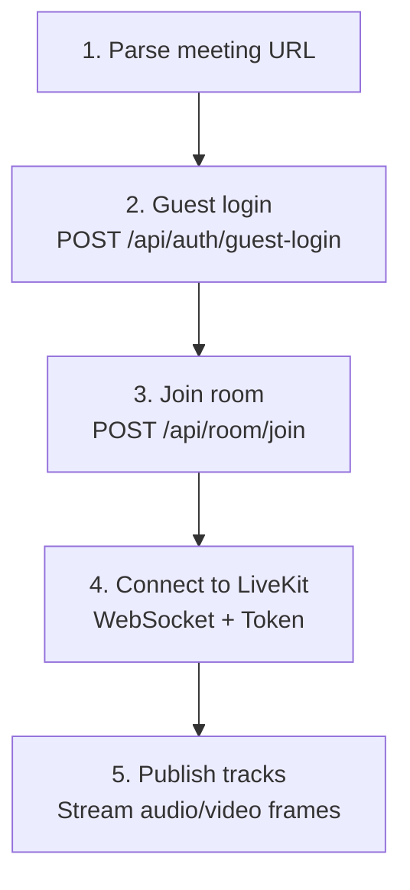
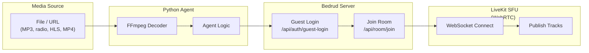

Bedrud includes Python-based bot agents that can join meeting rooms and stream media content. These are useful for background music, radio streams, or sharing video content.

## Available Agents

| Agent | Description | Media Type |
|-------|-------------|-----------|
| `music_agent` | Plays audio files into a room | Audio (PCM) |
| `radio_agent` | Streams internet radio stations | Audio (PCM via FFmpeg) |
| `video_stream_agent` | Shares video content (HLS, MP4) | Video + Audio |

## How Agents Work

All agents follow the same connection pattern:





## Music Agent

Plays audio files (MP3, WAV, etc.) into a meeting room.

### Setup

```bash
cd agents/music_agent
pip install -r requirements.txt
```

**Dependencies:** `httpx`, `livekit`, `pydub`

### Usage

```bash
python agent.py "https://meet.example.com/m/room-name"
```

### How It Works

1. Decodes audio files using `pydub`
2. Converts to PCM frames
3. Publishes audio frames to LiveKit as a microphone track

> See [Music Agent README](https://github.com/bedrud-ir/bedrud/tree/main/agents/music_agent) for setup and usage instructions.

---

## Radio Agent

Streams internet radio stations into a meeting room using FFmpeg for audio decoding.

### Setup

```bash
cd agents/radio_agent
pip install -r requirements.txt
```

**Dependencies:** `httpx`, `livekit`

**System requirement:** FFmpeg must be installed (`brew install ffmpeg` or `apt install ffmpeg`)

### Usage

```bash
python agent.py "https://meet.example.com/m/room-name"
```

### How It Works

1. Connects to a radio stream URL
2. Pipes the stream through FFmpeg to decode to raw PCM
3. Publishes PCM audio frames to LiveKit

> See [Radio Agent README](https://github.com/bedrud-ir/bedrud/tree/main/agents/radio_agent) for setup and usage instructions.

---

## Video Stream Agent

Shares video and audio from a URL (HLS/m3u8, MP4) into a meeting room.

### Setup

```bash
cd agents/video_stream_agent
pip install -r requirements.txt
```

**Dependencies:** `httpx`, `livekit`

**System requirement:** FFmpeg must be installed

### Usage

```bash
python agent.py "https://meet.example.com/m/room-name"
```

### How It Works

1. Runs two FFmpeg processes in parallel:
    - **Video:** Decodes to YUV420p raw frames (1280x720 @ 30fps)
    - **Audio:** Decodes to PCM samples
2. Publishes video as a screen share track
3. Publishes audio as a microphone track

> See [Video Stream Agent README](https://github.com/bedrud-ir/bedrud/tree/main/agents/video_stream_agent) for setup and usage instructions.

### Video Specifications

| Setting | Value |
|---------|-------|
| Width | 1280 |
| Height | 720 |
| FPS | 30 |
| Pixel Format | YUV420p |

---

## Writing a Custom Agent

To create a new agent, follow this pattern:

```python
import httpx
from livekit import rtc

# 1. Parse the meeting URL to extract room name
room_name = parse_url(meeting_url)

# 2. Guest login
client = httpx.Client(base_url=server_url)
resp = client.post("/api/auth/guest-login", json={"name": "Bot Name"})
token = resp.json()["token"]

# 3. Join room
client.headers["Authorization"] = f"Bearer {token}"
resp = client.post("/api/room/join", json={"roomName": room_name})
lk_token = resp.json()["token"]

# 4. Connect to LiveKit
room = rtc.Room()
await room.connect(livekit_url, lk_token)

# 5. Publish tracks
source = rtc.AudioSource(sample_rate=48000, num_channels=1)
track = rtc.LocalAudioTrack.create_audio_track("audio", source)
await room.local_participant.publish_track(track)

# 6. Stream frames
while has_data:
    frame = get_next_frame()
    await source.capture_frame(frame)
```

---

## See also

- [Music Agent README](https://github.com/bedrud-ir/bedrud/tree/main/agents/music_agent) - setup and usage
- [Radio Agent README](https://github.com/bedrud-ir/bedrud/tree/main/agents/radio_agent) - setup and usage
- [Video Stream Agent README](https://github.com/bedrud-ir/bedrud/tree/main/agents/video_stream_agent) - setup and usage
