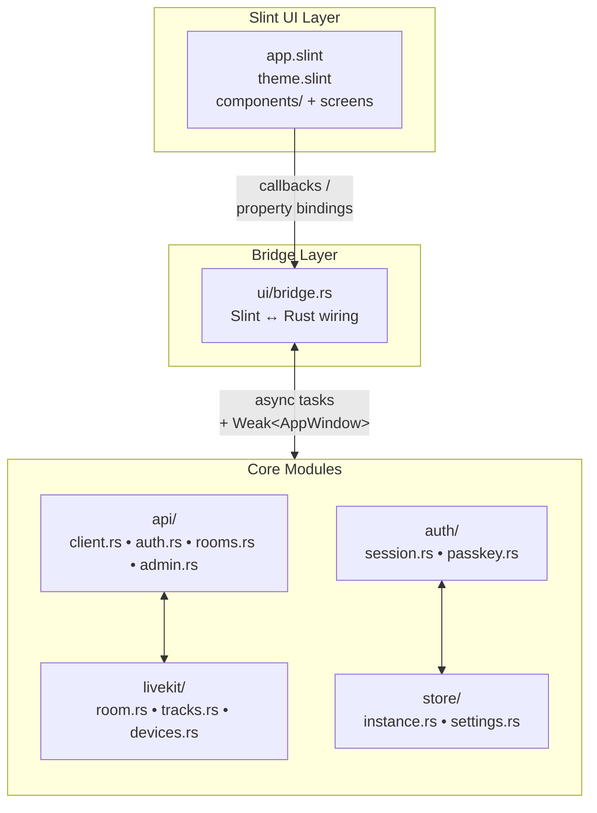

The Bedrud desktop client is a native Windows and Linux application built with **Rust** and the **Slint** UI toolkit. It provides the same core meeting experience as the web and mobile clients, compiled to a single binary with no runtime dependencies.

## Technology Stack

| Component | Technology |
|-----------|-----------|
| Language | Rust (stable) |
| UI toolkit | Slint 1.x |
| HTTP client | reqwest (async, TLS) |
| Media | LiveKit Rust SDK |
| Storage | serde_json + OS keyring (libsecret / Windows Credential Store) |
| Build system | Cargo workspace |

## Platform Support

| Platform | Renderer | Binary |
|----------|----------|--------|
| Windows 10/11 | Direct3D 11 | `bedrud-desktop.exe` |
| Linux x86_64 | OpenGL / Vulkan (via EGL/Wayland/X11) | `bedrud-desktop` |
| macOS | _(not yet - use the web app)_ | - |

## Source Layout

```
apps/desktop/
├── Cargo.toml              # Crate definition
├── build.rs                # Slint compile step
├── src/
│   ├── main.rs             # Entry point - initialises app + event loop
│   ├── app.rs              # Top-level AppState and startup logic
│   ├── api/
│   │   ├── client.rs       # Shared HTTP client (base URL, JWT injection)
│   │   ├── auth.rs         # Login, register, refresh
│   │   ├── rooms.rs        # Room list, join, create
│   │   └── admin.rs        # Admin endpoints
│   ├── auth/
│   │   ├── session.rs      # JWT storage and refresh loop
│   │   └── passkey.rs      # FIDO2 passkey stub
│   ├── livekit/
│   │   ├── room.rs         # Room connection lifecycle
│   │   ├── tracks.rs       # Audio/video track management
│   │   └── devices.rs      # Microphone / camera enumeration
│   ├── store/
│   │   ├── instance.rs     # Multi-instance persistence
│   │   └── settings.rs     # User preferences
│   └── ui/
│       ├── mod.rs
│       └── bridge.rs       # Slint ↔ Rust callback wiring
└── ui/
    ├── app.slint            # Root component, page router
    ├── theme.slint          # Colours, typography, spacing tokens
    ├── components/          # Button, Input, Card, Avatar
    ├── auth/                # Login and Register screens
    ├── dashboard/           # Room list, Create-room dialog
    ├── meeting/             # Controls bar, participant tiles, chat
    ├── admin/               # Admin panel, user table
    └── settings.slint       # Settings screen
```

## Architecture



### Key design decisions

- **Slint's compile-time UI** - `.slint` files are compiled into Rust at build time via `build.rs`. There is no layout engine at runtime; the UI is fully native.
- **`bridge.rs` as the only UI↔logic boundary** - all Slint callbacks are wired in one place, keeping business logic out of the UI layer and making the bridge easy to audit.
- **`Weak<AppWindow>` in callbacks** - Slint UI handles are `!Send`, so background tasks upgrade a stored `Weak` reference on the UI thread to set properties, rather than sharing the handle across threads.
- **Multi-instance via `store/instance.rs`** - identical to the mobile apps: instances are serialised to a JSON file in the OS config directory; each instance has its own `APIClient` and `AuthSession`.

## Building Locally

### Prerequisites

- Rust stable toolchain (`rustup toolchain install stable`)
- **Linux:** `libfontconfig`, `libxkbcommon`, `libwayland`, `libgles2`, `libdbus`, `libsecret`

  ```bash
  sudo apt-get install -y \
    libfontconfig1-dev libxkbcommon-dev libxkbcommon-x11-dev \
    libwayland-dev libgles2-mesa-dev libegl1-mesa-dev \
    libdbus-1-dev libsecret-1-dev \
    libasound2-dev
  ```

- **Windows:** Visual Studio Build Tools (MSVC) with the C++ workload

### Build

```bash
# Debug build (fast compile, no optimisations)
make dev-desktop          # runs the app immediately after build

# Release build
make build-desktop        # → target/release/bedrud-desktop (Linux)
                           # → target/release/bedrud-desktop.exe (Windows)
```

Or with Cargo directly:

```bash
cargo build -p bedrud-desktop                          # debug
cargo build -p bedrud-desktop --release                # optimised
cargo run   -p bedrud-desktop                          # run immediately
```

## CI

The desktop app is built in CI on every push to `main` and on pull requests:

| Job | Runner | What it checks |
|-----|--------|----------------|
| `Desktop – Build & Test` | `ubuntu-latest` | `cargo build`, `cargo test` |

Release builds produce two artifacts:

| Artifact | Runner | Format |
|----------|--------|--------|
| `bedrud-desktop-linux-x86_64.tar.xz` | `ubuntu-latest` | tar.xz |
| `bedrud-desktop-windows-x86_64.zip` | `windows-latest` | zip |
