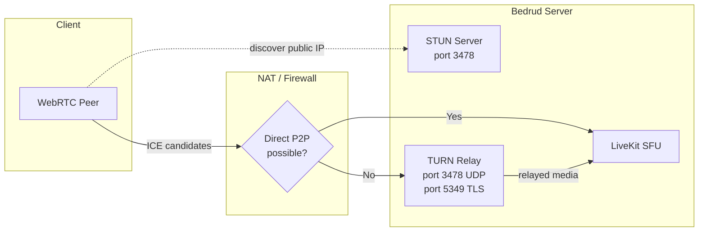
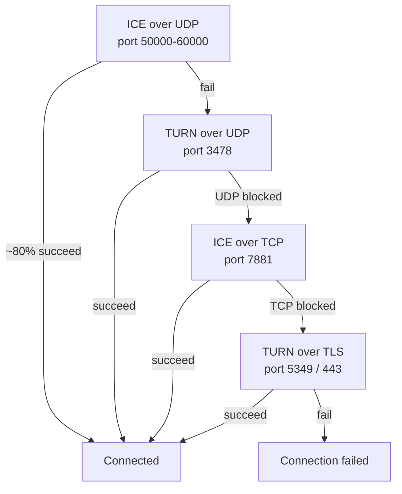
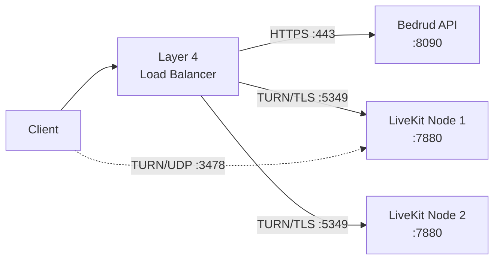
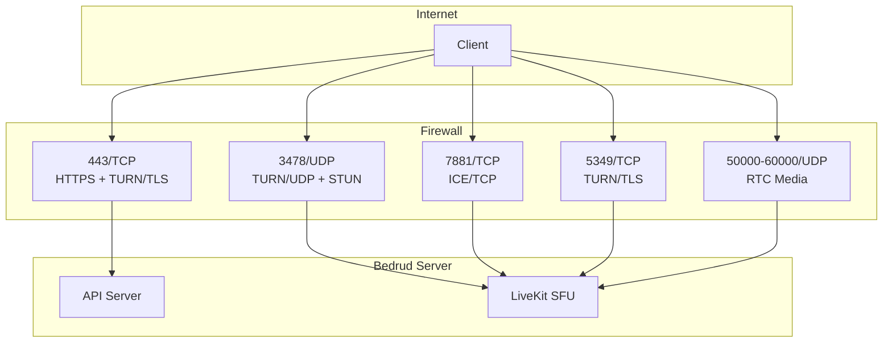

Bedrud embeds a TURN server via LiveKit to relay media for clients behind restrictive NATs or firewalls. This page covers architecture, configuration, and troubleshooting.

---

## What is TURN

**TURN** (Traversal Using Relays around NAT) is a protocol that forwards media packets through a server when two endpoints cannot connect directly.

**Related protocols:**

| Protocol | Role | Cost |
|----------|------|------|
| **STUN** | Discover public IP/port. Lightweight. | None (server only sees small binding requests) |
| **ICE** | Framework that tries all connectivity options in priority order. | None (orchestration only) |
| **TURN** | Relay all media when direct path fails. Last resort. | High (server bandwidth = all relayed media) |

See [WebRTC Connectivity](/en/docs/architecture/webrtc-connectivity) for the full connectivity stack.

---

## TURN in Bedrud

LiveKit includes an embedded TURN server. No external infrastructure needed.

### Relay Architecture



### Connection Priority

LiveKit tries connection types in order. Each fallback adds latency and server cost:



| Priority | Type | Port | Typical scenario |
|----------|------|------|-----------------|
| 1 | ICE/UDP (direct) | 50000-60000 | Most connections. No relay. |
| 2 | TURN/UDP | 3478 | Symmetric NAT, P2P blocked. |
| 3 | ICE/TCP | 7881 | UDP blocked (VPN, some firewalls). |
| 4 | TURN/TLS | 5349 or 443 | Corporate firewall, only HTTPS outbound. |

---

## When TURN Activates

TURN activates when direct media path fails. Common causes:

- **Symmetric NAT on both peers** - Both the client and server have Symmetric NAT. The NAT assigns a different public port for each destination, so the address discovered by STUN becomes unreachable.
- **Corporate firewall** - blocks outbound UDP entirely. Only TCP port 443 allowed.
- **VPN restrictions** - some VPNs intercept or block WebRTC traffic.
- **Cloud VMs without public IP** - some cloud providers use NAT that breaks direct ICE.

Most users (~80%) never hit TURN. Direct UDP path works.

### Bandwidth Cost

When TURN relays, the server carries all media for that participant. Approximate per-stream bandwidth:

| Stream type | Bitrate | Per relayed participant |
|-------------|---------|------------------------|
| Audio (Opus) | ~32 Kbps | ~32 Kbps |
| Video 720p (VP8) | ~1.5 Mbps | ~1.5 Mbps up + 1.5 Mbps down per subscribed track |
| Screen share 1080p | ~2.5 Mbps | ~2.5 Mbps |

For a 5-person meeting with one relayed participant: server handles ~1.5 Mbps extra for that participant's video relay. Multiply these values by the number of relayed participants to estimate total server bandwidth.

---

## Configuration

**File:** `server/config/livekit.yaml` (dev) or `/etc/bedrud/livekit.yaml` (production)

```yaml
turn:
  enabled: true
  domain: "turn.example.com"
  udp_port: 3478
  tls_port: 5349
  cert_file: /etc/bedrud/turn.crt
  key_file: /etc/bedrud/turn.key
  relay_range_start: 30000
  relay_range_end: 40000
  external_tls: false
```

### Key Reference

| Key | Default | Description |
|-----|---------|-------------|
| `enabled` | `true` | Enable embedded TURN server. |
| `domain` | `localhost` | Domain advertised to clients. Must resolve to server's public IP. |
| `udp_port` | `3478` | TURN/UDP port. Also serves STUN binding requests when TURN is enabled. |
| `tls_port` | `5349` | TURN/TLS port. Set to `443` if no load balancer terminates TLS. |
| `cert_file` | - | TLS certificate for TURN/TLS. Required when TURN/TLS clients exist. |
| `key_file` | - | TLS private key matching `cert_file`. |
| `relay_range_start` | `30000` | Start of UDP port range used for relayed media packets. |
| `relay_range_end` | `40000` | End of relay port range. Each relayed participant consumes ports from this range. |
| `external_tls` | `false` | Set `true` when a Layer 4 load balancer terminates TURN/TLS. LiveKit skips its own TLS on the TURN port. |

### `use_external_ip` Interaction

In the same `livekit.yaml`, under `rtc:`:

```yaml
rtc:
  use_external_ip: true
```

Must be `true` for TURN to work correctly. When `false`, ICE candidates contain internal (private) IP addresses that clients on the internet cannot reach.

---

## Production TLS Setup

TURN/TLS requires its own TLS certificate. Two approaches:

### Single Domain (No Load Balancer)

Reuse the server's TLS certificate. Set `tls_port` to `443`:

```yaml
turn:
  enabled: true
  domain: "meet.example.com"
  tls_port: 443
  cert_file: /etc/bedrud/meet.example.com.crt
  key_file: /etc/bedrud/meet.example.com.key
```

The TURN domain and server domain are the same. Port 443 handles both HTTPS API and TURN/TLS - LiveKit distinguishes by protocol.

### Dedicated TURN Domain (With Load Balancer)



```yaml
turn:
  enabled: true
  domain: "turn.example.com"
  tls_port: 5349
  external_tls: true
```

The load balancer terminates TLS. `external_tls: true` tells LiveKit to expect already-decrypted traffic.

---

## Port & Firewall Reference



| Port | Protocol | Service | Required | Notes |
|------|----------|---------|----------|-------|
| 443 | TCP | HTTPS + TURN/TLS | Yes | API + web UI. Also TURN/TLS if `tls_port: 443`. |
| 3478 | UDP | TURN/UDP + STUN | Recommended | Dual purpose: STUN binding + TURN relay. |
| 5349 | TCP | TURN/TLS | If no LB | Dedicated TURN/TLS port. Skip if using port 443. |
| 7881 | TCP | ICE/TCP | Recommended | Fallback when UDP blocked but TLS not needed. |
| 50000-60000 | UDP | RTC media | Yes | ICE candidate ports. Each participant uses 2 ports. |
| 7880 | TCP | LiveKit API | Internal | WebSocket signaling. Not exposed directly in production. |

### Minimum Firewall Rules

For basic connectivity:

```
Allow TCP 443    (HTTPS + TURN/TLS)
Allow UDP 3478   (TURN/UDP + STUN)
Allow UDP 50000-60000  (RTC media)
```

For maximum compatibility (corporate networks):

```
Also allow TCP 7881  (ICE/TCP)
Also allow TCP 5349  (TURN/TLS, if not using port 443)
```

---

## Testing & Debugging

### Browser: chrome://webrtc-internals

1. Open `chrome://webrtc-internals` in Chrome/Edge before joining a meeting.
2. Create a dump.
3. Look for **ICE candidate pairs** in the Stats tab.
4. Candidate types tell you the connection path:

| Candidate type | Meaning |
|---------------|---------|
| `host` | Local IP. Direct interface. |
| `srflx` (server reflexive) | STUN-discovered public IP. Direct P2P working. |
| `relay` | TURN relay active. Media goes through server. |

If you see `relay` candidates as the active pair, TURN is handling that connection.

### LiveKit Client SDK Events

All LiveKit SDKs emit connection state events:

```typescript
room.on(RoomEvent.Connected, () => {
  console.log("Connected");
});

room.on(RoomEvent.Reconnecting, () => {
  console.log("Connection lost, reconnecting...");
});
```

Check `room.localParticipant.connectionQuality` for connection stats.

### LiveKit Server Logs

Increase log level to debug in `livekit.yaml`:

```yaml
logging:
  level: debug
```

Look for log entries containing:
- `ICE` - candidate gathering status
- `TURN` - relay allocation events
- `relay` - active relay connections

### Manual TURN Test with turnutils

Install `coturn-utils` package, then test TURN connectivity:

```bash
turnutils_uclient -t -p 3478 -W devkey -u devkey turn.example.com
```

- `-t` - use TCP
- `-p` - TURN port
- Replace credentials with production values

Success output shows allocated relay addresses.

---

## Troubleshooting

| Symptom | Likely Cause | Fix |
|---------|-------------|-----|
| Clients can't connect, timeout | TURN ports blocked by firewall | Open UDP 3478, TCP 5349, UDP 50000-60000 |
| TURN/TLS fails | Missing or mismatched TLS cert | Verify `cert_file`/`key_file` paths. Check cert matches `domain`. |
| TURN/TLS fails with LB | `external_tls` not set | Set `external_tls: true` in config. |
| One-way audio/video | Relay port range blocked | Open `relay_range_start` to `relay_range_end` UDP. |
| High server bandwidth | Many clients behind NAT using relay | Expected. Scale server or reduce relay users. |
| `relay` candidates but `srflx` expected | `use_external_ip: false` | Set `rtc.use_external_ip: true`. |
| TURN domain doesn't resolve | DNS misconfigured | `dig +short turn.example.com` must return server's public IP. |
| Clients behind corporate firewall | Only port 443 allowed | Set `turn.tls_port: 443`. Ensure cert is valid. |
| `turn.enabled: true` but no relay | Direct path works (good) | TURN is fallback. No relay = better. Verify with `chrome://webrtc-internals`. |

### Quick Diagnostic Checklist

1. `dig +short <turn.domain>` returns correct public IP?
2. Firewall allows UDP 3478, TCP 5349, UDP 50000-60000?
3. `tls_port: 443` or `5349` matches firewall rules?
4. `cert_file` and `key_file` exist and are readable?
5. Certificate CN/SAN matches `turn.domain`?
6. `rtc.use_external_ip: true` set?
7. LiveKit logs show no TURN-related errors?

---

## See also

- [WebRTC Connectivity](/en/docs/architecture/webrtc-connectivity) - full STUN/ICE/TURN/SFU connectivity stack
- [LiveKit Integration](/en/docs/backend/livekit) - how Bedrud embeds LiveKit
- [Configuration Reference](/en/docs/getting-started/configuration) - all config options
- [Internal TLS](/en/docs/guides/internal-tls) - TLS for isolated networks
- [Deployment Guide](/en/docs/guides/deployment) - production deployment steps
