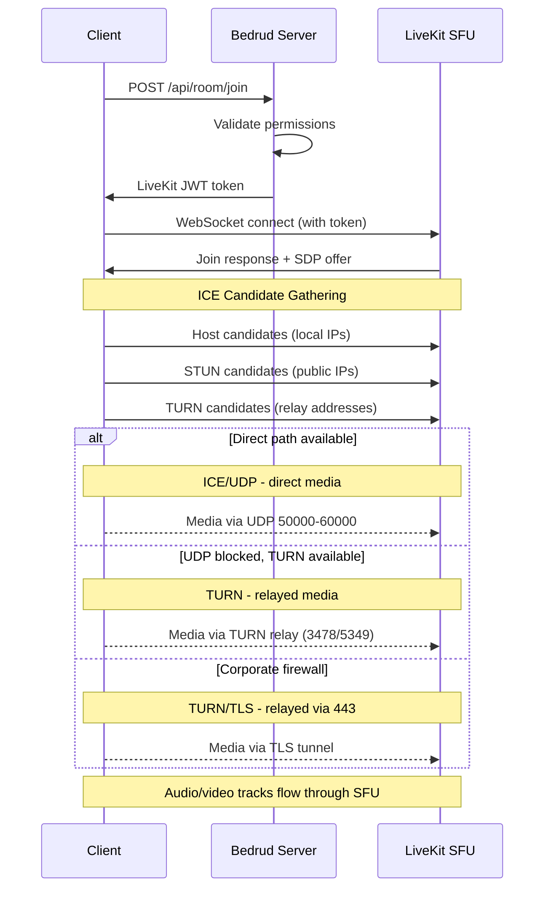
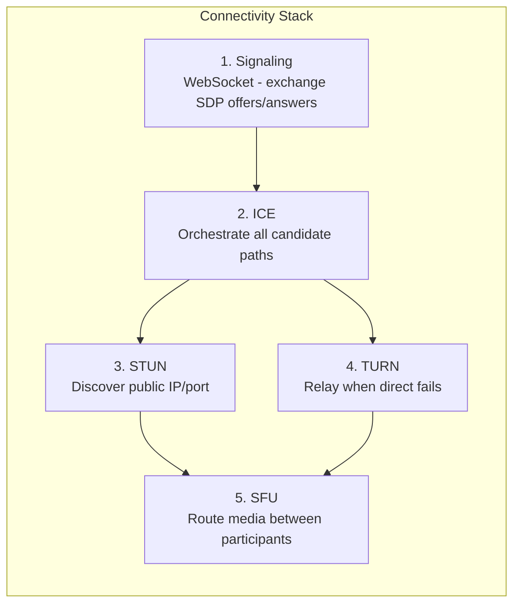
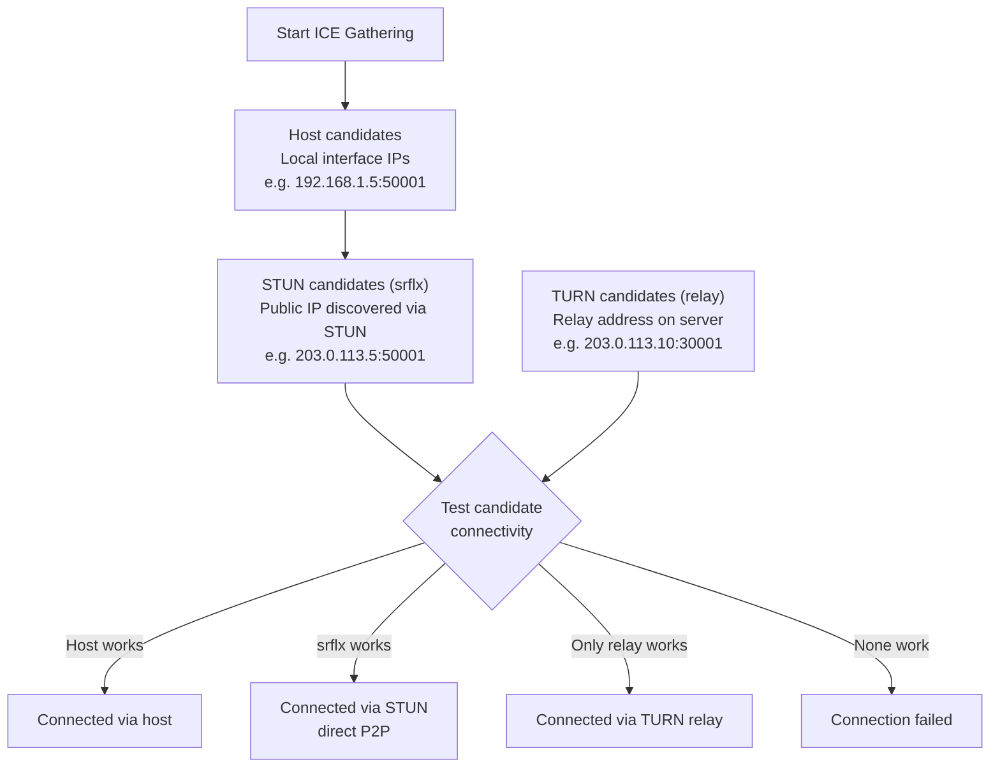
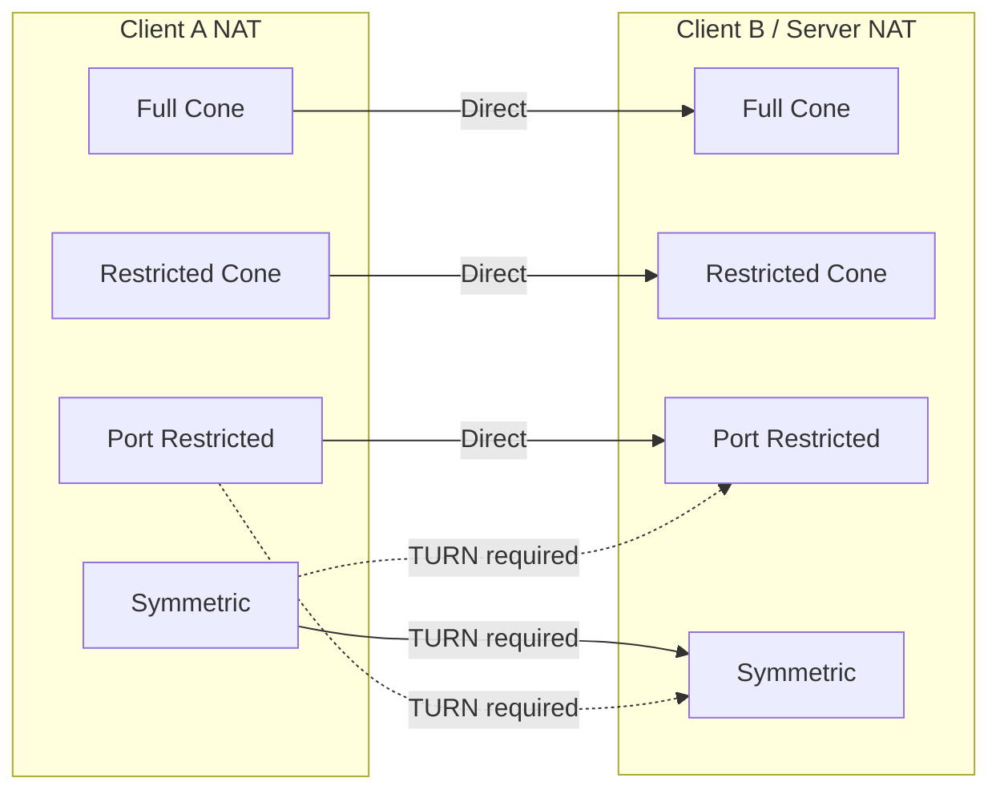

How clients establish real-time media connections in Bedrud. Covers the full connectivity stack: signaling, ICE, STUN, TURN, and the SFU media path.

---

## Overview

WebRTC requires a series of steps before audio and video flow between client and server. Bedrud uses LiveKit's SFU (Selective Forwarding Unit) architecture - clients connect to the server, not to each other. **This means only the client-to-server network path matters**, not the connection between individual participants.



---

## Connectivity Stack

Five layers work together to establish the media path:



### Layer Details

**1. Signaling** - Client and server exchange connection metadata using SDP (Session Description Protocol) offers and answers via WebSocket. This is not media - it is the setup phase. Bedrud proxies signaling through the API server to the embedded LiveKit instance.

**2. ICE (Interactive Connectivity Establishment)** - Gathers all possible connection paths, called candidates, and tests them in order of priority. ICE is a framework - it coordinates the connection attempts but is not a protocol itself.

**3. STUN (Session Traversal Utilities for NAT)** - Lightweight protocol. Client sends a binding request to the STUN server, which responds with the client's public IP and port. This "server reflexive" candidate is then tested for direct connectivity. Works for ~80% of connections.

**4. TURN (Traversal Using Relays around NAT)** - When direct connectivity fails, TURN allocates a relay address on the server. All media packets are forwarded through this relay. Highest cost - server bandwidth scales with relayed users. See the [TURN Server Guide](turn-server.mdx) for deep coverage.

**5. SFU (Selective Forwarding Unit)** - Once the transport path is established, LiveKit's SFU routes media between participants. Each participant sends one stream up; the SFU forwards copies to other participants. This is not peer-to-peer - the server is always in the path.

---

## ICE Candidate Gathering



ICE gathers three candidate types simultaneously:

| Type | Source | Priority | How it works |
|------|--------|----------|-------------|
| **host** | Local network interfaces | Highest | Direct IP from machine. Works on LAN. |
| **srflx** (server reflexive) | STUN server response | Medium | Public IP discovered via STUN. Works for most NAT types. |
| **relay** | TURN server allocation | Lowest | Address on TURN server. Always works. Highest cost. |

ICE tests all candidates and selects the highest-priority pair that succeeds. If `srflx` works, it skips `relay`.

---

## NAT Types & Connectivity

Different NAT types affect whether direct connectivity works:



| NAT Type | Description | Direct P2P | Needs TURN |
|----------|-------------|------------|-----------|
| **Full Cone** | All requests from same internal IP/port map to same public IP/port. Any external host can send to it. | Yes | No |
| **Restricted Cone** | Same mapping as Full Cone, but only external hosts that received a packet can send back. | Usually | No |
| **Port Restricted Cone** | Similar to Restricted Cone, but the NAT also restricts the external port number. Most common home router type. | Usually | Rarely |
| **Symmetric** | Different public IP/port mapping per destination. The STUN-discovered address cannot be reused. | No (when both symmetric) | **Yes** |

**Key insight:** Since the server has a public IP and predictable port range, most NAT types work directly. TURN is mainly needed when the client's firewall blocks outbound UDP entirely.

---

## Configuration Summary

Which Bedrud/LiveKit config keys affect WebRTC connectivity:

**`livekit.yaml` keys:**

```yaml
rtc:
  port_range_start: 50000       # UDP media port range start
  port_range_end: 60000         # UDP media port range end
  tcp_port: 7881                # ICE/TCP fallback port
  stun_servers:                 # External STUN servers (optional)
    - stun:stun.l.google.com:19302
  use_external_ip: true         # Advertise public IP in ICE candidates

turn:
  enabled: true                 # Enable embedded TURN
  domain: "turn.example.com"    # TURN domain (DNS must resolve)
  udp_port: 3478                # TURN/UDP + STUN port
  tls_port: 5349                # TURN/TLS port (or 443)
  cert_file: /path/to/turn.crt  # TLS cert for TURN/TLS
  key_file: /path/to/turn.key   # TLS key for TURN/TLS
  relay_range_start: 30000      # Relay port range start
  relay_range_end: 40000        # Relay port range end
  external_tls: false           # L4 LB terminates TLS
```

**`config.yaml` keys (Bedrud server):**

```yaml
server:
  port: 8090                    # API port (signaling proxied through this)
  enableTLS: true               # HTTPS for signaling
  domain: "meet.example.com"    # Public domain
```

### Debugging Connectivity Issues

| Symptom | Check |
|---------|-------|
| Can't connect at all | `rtc.use_external_ip: true`? Firewall open on 443 + UDP range? |
| Connects but no audio/video | UDP 50000-60000 blocked? Check ICE candidates in browser. |
| Slow connection | TURN relay active (check candidates). Expected if client behind strict NAT. |
| Fails behind corporate network | TURN/TLS not configured. Set `turn.tls_port: 443` with valid cert. |
| Works on LAN, fails remotely | Public IP not advertised. Set `rtc.use_external_ip: true`. |

For deep TURN troubleshooting, see the [TURN Server Guide](/en/docs/architecture/turn-server).

---

## See also

- [TURN Server Guide](/en/docs/architecture/turn-server) - TURN architecture, configuration, TLS, debugging
- [LiveKit Integration](/en/docs/backend/livekit) - how Bedrud embeds LiveKit
- [Architecture Overview](/en/docs/architecture/overview) - full system architecture
- [Internal TLS](/en/docs/guides/internal-tls) - TLS for isolated networks
