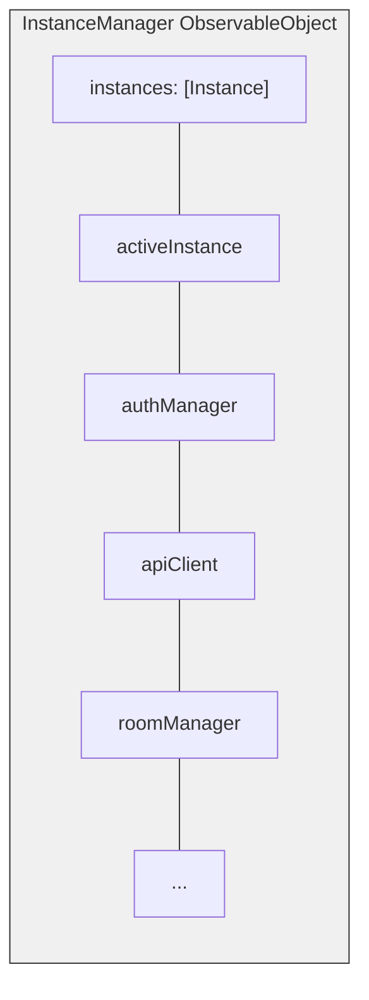
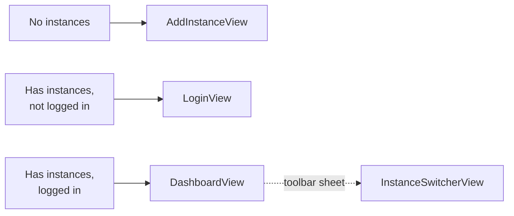

La aplicación iOS de Bedrud está construida con SwiftUI, proporcionando una experiencia nativa de reunión de video con soporte multiinstancia y almacenamiento seguro de credenciales.

## Stack Tecnológico

| Tecnología | Versión | Propósito |
|-----------|---------|---------|
| Swift | 5.9+ | Lenguaje |
| SwiftUI | Último | Framework de UI |
| LiveKit Swift SDK | 2.0+ | Medios WebRTC |
| KeychainAccess | 4.2.2+ | Almacenamiento seguro de credenciales |

**Destino de despliegue:** iOS 18.0

## Configuración del Proyecto

El proyecto usa **XCodeGen** para la generación del proyecto desde `project.yml`:

- Bundle ID: `com.bedrud.ios`
- Generado con: `xcodegen generate`

## Estructura de Directorios

```text
apps/ios/Bedrud/
├── BedrudApp.swift                # Punto de entrada de la aplicación
├── Core/
│   ├── API/
│   │   └── APIClient.swift        # Cliente REST basado en URLSession
│   ├── Auth/
│   │   └── AuthManager.swift      # Gestión de tokens, login/logout
│   ├── Instance/
│   │   ├── InstanceManager.swift  # Orquestador central multiinstancia
│   │   └── InstanceStore.swift    # Almacenamiento persistente de instancias (UserDefaults)
│   └── LiveKit/
│       └── RoomManager.swift      # Gestor de conexión de sala LiveKit
├── Features/
│   ├── Auth/
│   │   ├── LoginView.swift        # Pantalla de inicio de sesión
│   │   └── RegisterView.swift     # Pantalla de registro
│   ├── Dashboard/
│   │   └── DashboardView.swift    # Lista y gestión de salas
│   ├── Meeting/
│   │   └── MeetingView.swift      # Interfaz de videollamada
│   ├── Profile/
│   │   └── ProfileView.swift      # Perfil de usuario
│   ├── Instance/
│   │   ├── AddInstanceView.swift  # Añadir instancia de servidor
│   │   └── InstanceSwitcherView.swift  # Cambiar entre instancias
│   ├── Settings/
│   │   └── SettingsView.swift     # Configuración de la aplicación
│   ├── JoinByURL/
│   │   └── JoinByURLView.swift    # Manejo de enlaces profundos
│   └── Main/
│       └── MainTabView.swift      # Navegación por pestañas
├── Models/
│   ├── User.swift
│   ├── Room.swift
│   └── Instance.swift
└── Design/
    └── Components/                # Componentes SwiftUI reutilizables
```

## Arquitectura Multiinstancia

La aplicación iOS refleja la arquitectura de Android para el soporte multiinstancia.



### Patrón Clave

Las dependencias son propiedades `@Published` en `InstanceManager`, que es un `ObservableObject`. Las vistas las reciben vía `@EnvironmentObject`:

```swift
struct DashboardView: View {
    @EnvironmentObject var instanceManager: InstanceManager

    var body: some View {
        if let authManager = instanceManager.authManager {
            // Renderizar UI autenticada
        }
    }
}
```

### Flujo de Navegación



El conmutador de instancias aparece como un `.sheet` activado desde la barra de herramientas del Dashboard.

## Punto de Entrada de la Aplicación

`BedrudApp.swift` inicializa los servicios centrales y los inyecta en el entorno SwiftUI:

```swift
@main
struct BedrudApp: App {
    @StateObject var instanceStore = InstanceStore()
    @StateObject var instanceManager = InstanceManager()
    @StateObject var settingsStore = SettingsStore()

    var body: some Scene {
        WindowGroup {
            ContentView()
                .environmentObject(instanceStore)
                .environmentObject(instanceManager)
                .environmentObject(settingsStore)
        }
    }
}
```

## Características

### Almacenamiento Seguro

Usa **KeychainAccess** para almacenar tokens JWT y credenciales sensibles, en lugar de UserDefaults.

### Enlaces Profundos

Maneja URLs para unión directa a salas y códigos de sala.

### Configuración

Las preferencias del usuario se persisten vía `SettingsStore` usando UserDefaults.

## Construcción

```bash
# Abrir en Xcode
make dev-ios

# Construir archivo (Release)
make build-ios

# Exportar IPA (requiere ExportOptions.plist)
make export-ios

# Construir para simulador (Debug)
make build-ios-sim
```

### Requisitos

- Xcode (última versión estable)
- Destino de despliegue iOS 18.0
- Para construcciones de dispositivo: cuenta de desarrollador de Apple y perfil de aprovisionamiento
