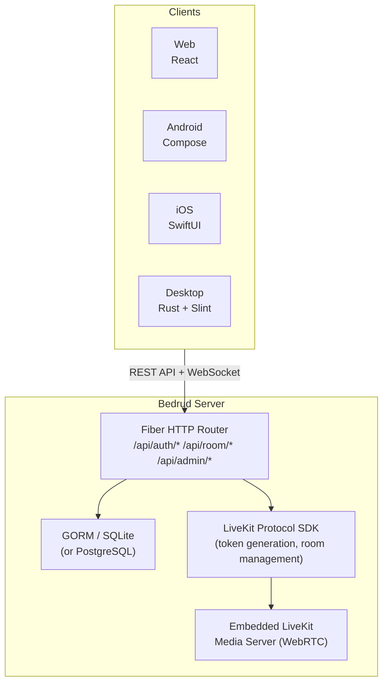
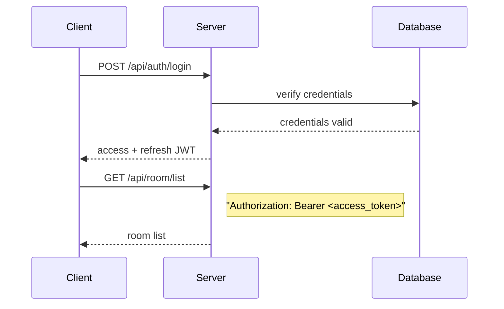
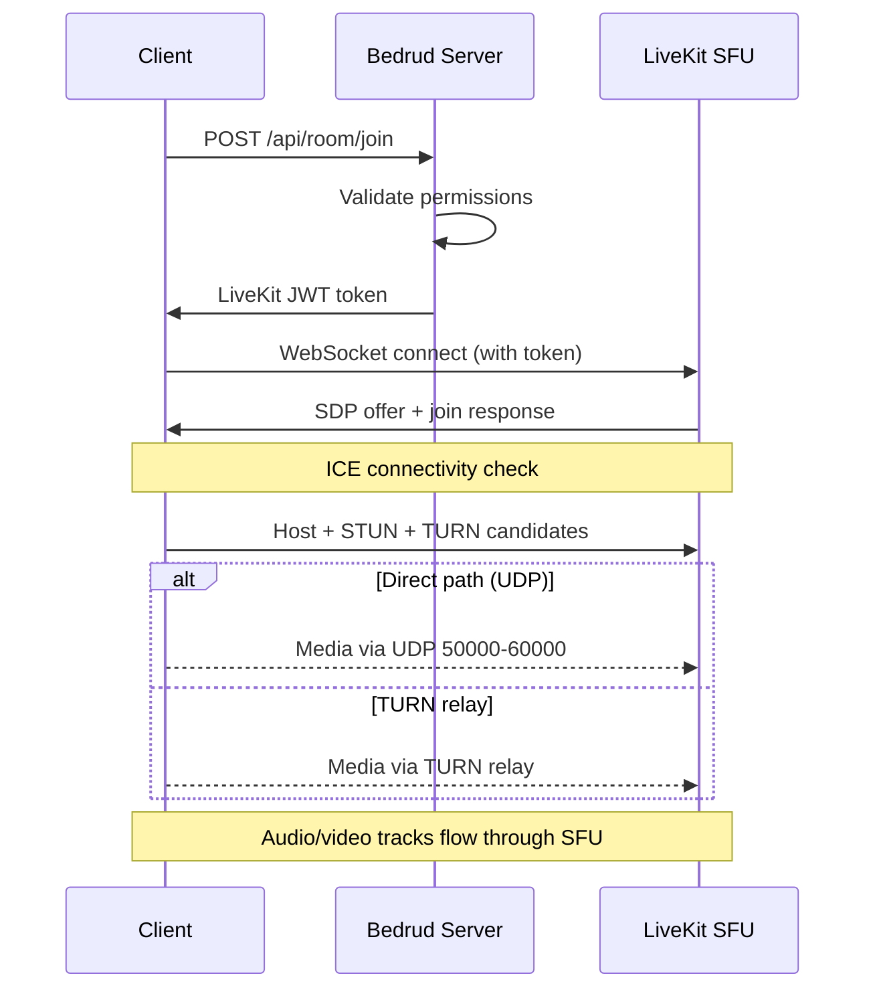

Bedrud es un monorepo que contiene un servidor Go, tres aplicaciones cliente, agentes de bot Python y paquetes compartidos. Esta página describe cómo se relacionan los componentes entre sí.

## Diagrama de Alto Nivel

## Componentes

### Servidor (`server/`)

El backend en Go es el núcleo de Bedrud. Maneja:

- **REST API** - autenticación, gestión de salas, operaciones de administración
- **Servicio de archivos estáticos** - el frontend web compilado se incrusta vía `//go:embed`
- **Integración con LiveKit** - genera tokens y gestiona salas a través del LiveKit Protocol SDK
- **Servidor LiveKit incrustado** - el binario del servidor multimedia se ejecuta como proceso hijo

El servidor utiliza el framework web **Fiber** (similar a Express.js en Node.js) y **GORM** como capa ORM. Soporta SQLite para desarrollo y PostgreSQL para producción.

Consulte [Arquitectura del Servidor](/es/docs/architecture/server) para obtener detalles.

### Frontend Web (`apps/web/`)

Una aplicación **React** construida con TanStack Start, TailwindCSS v4 y shadcn/ui. En producción, se pre-renderiza en el servidor y los activos del cliente se incrustan en el binario Go.

Capacidades clave:

- Interfaz de usuario de videoconferencia con LiveKit Client SDK
- Autenticación basada en JWT con actualización automática de tokens
- Panel de administración para gestión de usuarios y salas
- Sistema de diseño con biblioteca de componentes consistente

Consulte [Frontend Web](/es/docs/architecture/web) para obtener detalles.

### Aplicación Android (`apps/android/`)

Una aplicación Android nativa construida con **Jetpack Compose** y **Kotlin**. Usa Koin para inyección de dependencias y Retrofit para HTTP.

Capacidades clave:

- Experiencia completa de videoconferencia con LiveKit Android SDK
- Modo de imagen en imagen
- Manejo de enlaces profundos (`bedrud.com/m/*` y `bedrud.com/c/*`)
- Gestión de llamadas con ConnectionService de Android
- Soporte multi-instancia (conectarse a múltiples servidores)

Consulte [Aplicación Android](/es/docs/architecture/android) para obtener detalles.

### Aplicación iOS (`apps/ios/`)

Una aplicación iOS nativa construida con **SwiftUI**. Usa KeychainAccess para almacenamiento seguro de credenciales y LiveKit Swift SDK para medios.

Capacidades clave:

- Experiencia completa de videoconferencia
- Soporte multi-instancia
- Manejo de enlaces profundos
- Almacenamiento seguro basado en Keychain

Consulte [Aplicación iOS](/es/docs/architecture/ios) para obtener detalles.

### Aplicación de Escritorio (`apps/desktop/`)

Una aplicación de escritorio nativa para Windows y Linux construida con **Rust** y el toolkit de interfaz de usuario **Slint**. Se compila en un solo binario sin dependencias de tiempo de ejecución.

Capacidades clave:

- Experiencia completa de videoconferencia vía LiveKit Rust SDK
- Renderizado nativo de Windows (Direct3D 11) y Linux (OpenGL/Vulkan)
- Soporte multi-instancia (conectarse a múltiples servidores Bedrud)
- Integración con el llavero del sistema operativo para almacenamiento seguro de credenciales

Consulte [Aplicación de Escritorio](/es/docs/architecture/desktop) para obtener detalles.

### Agentes Bot (`agents/`)

Scripts Python que se unen a salas de reuniones como bots y transmiten contenido multimedia:

- **Music Agent** - reproduce archivos de audio
- **Radio Agent** - transmite estaciones de radio de internet
- **Video Stream Agent** - comparte contenido de video (HLS, MP4)

Consulte [Agentes Bot](/es/docs/architecture/agents) para obtener detalles.

## Flujo de Autenticación

Todas las solicitudes autenticadas usan tokens JWT en el encabezado `Authorization`. El wrapper `authFetch` del frontend web maneja el adjunto de tokens y la actualización automática.

Métodos de autenticación admitidos:

| Method | Endpoint | Description |
|--------|----------|-------------|
| Email/Password | `POST /api/auth/login` | Credenciales tradicionales |
| Registration | `POST /api/auth/register` | Creación de nueva cuenta |
| Guest | `POST /api/auth/guest-login` | Acceso temporal solo con nombre |
| OAuth | `GET /api/auth/:provider/login` | Google, GitHub, Twitter |
| Passkeys | `POST /api/auth/passkey/*` | Biometría FIDO2/WebAuthn |

## Flujo de Conexión de Reunión

1. El cliente solicita unirse a una sala vía la REST API
2. El servidor valida permisos y genera un token LiveKit firmado
3. El cliente se conecta directamente a LiveKit vía WebSocket usando el token
4. ICE recopila candidatos (host, STUN, TURN) y selecciona la mejor ruta
5. Las pistas de audio/video fluyen a través del SFU de LiveKit

Consulte [Conectividad WebRTC](/es/docs/architecture/webrtc-connectivity) para obtener la pila completa de conectividad.

## Modelo de Datos

### Usuario

| Field | Type | Description |
|-------|------|-------------|
| ID | uint | Clave primaria |
| Email | string | Dirección de correo único |
| Name | string | Nombre para mostrar |
| Password | string | Contraseña hasheada (vacío para OAuth/invitado) |
| Avatar | string | URL del avatar |
| Provider | string | Proveedor de autenticación (`local`, `google`, `github`, `twitter`, `guest`) |
| Role | string | `user` o `admin` |

### Sala

| Field | Type | Description |
|-------|------|-------------|
| ID | uint | Clave primaria |
| AdminID | uint | Clave foránea → User.ID (creador de la sala) |
| Name | string | Nombre de la sala / slug de URL |
| IsPublic | bool | Si los invitados pueden unirse sin invitación |
| ChatEnabled | bool | Si el chat en la sala está activo |
| VideoEnabled | bool | Si se permite video |
| Participants | []User | Usuarios actualmente en la sala |

### Passkey

| Field | Type | Description |
|-------|------|-------------|
| ID | uint | Clave primaria |
| UserID | uint | Clave foránea → User.ID |
| CredentialID | []byte | ID de credencial WebAuthn |
| PublicKey | []byte | Clave pública WebAuthn |
| Counter | uint32 | Contador de firma WebAuthn |

### RefreshToken

| Field | Type | Description |
|-------|------|-------------|
| Token | string | La cadena del token de actualización |
| UserID | uint | Clave foránea → User.ID |
| ExpiresAt | time | Marca de tiempo de expiración del token |

## Arquitectura de Despliegue

En producción, Bedrud se ejecuta como dos servicios systemd:

| Service | Binary | Purpose |
|---------|--------|---------|
| `bedrud.service` | `bedrud --run` | API server + frontend web incrustado |
| `livekit.service` | `bedrud --livekit` | Servidor multimedia WebRTC |

Ambos son gestionados por un solo binario. Traefik u otro proxy inverso maneja la terminación TLS y enruta el tráfico.

Consulte [Guía de Despliegue](/es/docs/guides/deployment) para obtener instrucciones de configuración.

## Términos Clave

Estos términos aparecen en toda la documentación de arquitectura:

| Term | Full Name | Meaning |
|------|-----------|---------|
| **SFU** | Selective Forwarding Unit | Un servidor multimedia que recibe transmisiones de cada participante y las reenvía a otros. Los clientes se conectan al servidor, no entre sí. |
| **SDP** | Session Description Protocol | El formato utilizado para describir parámetros de conexión WebRTC (códecs, resoluciones, tipos de medios). |
| **ICE** | Interactive Connectivity Establishment | Un marco que recopila todas las rutas de red posibles entre cliente y servidor, luego selecciona la mejor. |
| **STUN** | Session Traversal Utilities for NAT | Un protocolo ligero que ayuda a un cliente a descubrir su dirección IP pública. Funciona para la mayoría de las conexiones. |
| **TURN** | Traversal Using Relays around NAT | Un protocolo que retransmite todos los medios a través del servidor cuando no es posible una conexión directa. Último recurso, mayor costo de ancho de banda. |
| **NAT** | Network Address Translation | Una función del enrutador que asigna direcciones internas privadas a una dirección pública. Puede bloquear conexiones WebRTC directas dependiendo del tipo. |
| **srflx** | Server Reflexive | Un tipo de candidato ICE que representa la IP pública del cliente, descubierta vía STUN. |
| **WebRTC** | Web Real-Time Communication | El estándar de API de navegador y móvil para transferencia de audio, video y datos en tiempo real. |

## Véase También

- [Conectividad WebRTC](/es/docs/architecture/webrtc-connectivity) - pila completa de conectividad STUN/ICE/TURN/SFU
- [Guía del Servidor TURN](/es/docs/architecture/turn-server) - arquitectura y configuración del relé TURN
- [Integración con LiveKit](/es/docs/backend/livekit) - cómo Bedrud incrusta LiveKit
