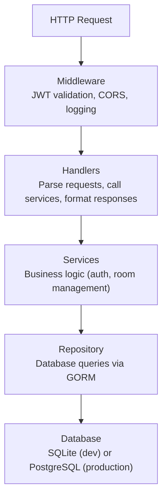

El servidor Bedrud es una aplicación Go que proporciona la REST API, sirve el frontend web incrustado y gestiona el servidor multimedia LiveKit.

## Stack Tecnológico

| Technology | Purpose |
|-----------|---------|
| Go 1.24 | Lenguaje principal |
| Fiber v2 | Framework web (tipo Express) |
| GORM | ORM para SQLite y PostgreSQL |
| LiveKit Protocol SDK | Gestión de salas y tokens WebRTC |
| Zerolog | Registro estructurado JSON |
| Goth | OAuth2 multi-proveedor |
| go-passkeys | Soporte FIDO2/WebAuthn |
| golang-jwt | Creación y validación de tokens JWT |
| gocron | Programación de trabajos en segundo plano |
| Swagger (swaggo) | Generación de documentación de API |

## Estructura de Directorios

```
server/
├── cmd/
│   ├── server/main.go        # Punto de entrada de desarrollo
│   └── bedrud/main.go        # Punto de entrada de producción (con flags install/livekit)
├── internal/
│   ├── auth/                  # Servicios de autenticación
│   │   ├── auth.go            # Servicio principal de autenticación (registro, login, OAuth)
│   │   ├── jwt.go             # Creación y validación de tokens JWT
│   │   └── session_store.go   # Almacén de sesiones Gorilla para estado OAuth
│   ├── database/              # Inicialización y migraciones de base de datos
│   ├── handlers/              # Manejadores de solicitudes HTTP (capa de controlador)
│   │   ├── auth_handler.go    # Endpoints de autenticación
│   │   ├── room.go            # Endpoints de salas
│   │   └── users.go           # Endpoints de gestión de usuarios
│   ├── middleware/             # Middleware de Fiber
│   │   └── auth.go            # Validación JWT, verificación de permisos
│   ├── models/                # Modelos GORM (esquemas de base de datos)
│   │   ├── user.go            # Modelo de usuario
│   │   ├── room.go            # Modelo de sala
│   │   └── passkey.go         # Modelo de passkey
│   ├── repository/            # Capa de acceso a datos (SQL vía GORM)
│   │   ├── user_repository.go
│   │   ├── room_repository.go
│   │   └── passkey_repository.go
│   ├── livekit/               # Gestión del servidor LiveKit incrustado
│   ├── scheduler/             # Programación de trabajos en segundo plano
│   └── utils/                 # TLS y otras utilidades
├── frontend/                  # Frontend web incrustado (poblado en tiempo de compilación)
├── config.yaml                # Configuración de desarrollo
├── livekit.yaml               # Configuración de LiveKit de desarrollo
├── go.mod
└── go.sum
```

## Arquitectura en Capas

El servidor sigue una arquitectura de tres capas:



## Patrones Clave

### Frontend Incrustado

El frontend web se compila en archivos estáticos y se incrusta en el binario Go usando `//go:embed`:

```go
//go:embed frontend/*
var frontendFS embed.FS
```

En tiempo de compilación, `bun run build:embed` pre-renderiza la aplicación React SSR y copia `dist/client/` en `server/frontend/`. El compilador de Go luego lo empaqueta en el binario. El servidor Fiber sirve estos archivos para cualquier ruta que no sea de API.

### Autenticación JWT

El middleware extrae el JWT del encabezado `Authorization: Bearer <token>`, lo valida y adjunta el contexto del usuario a la solicitud. Las rutas protegidas usan el middleware `RequireAccess` para verificar los roles de usuario.

### Generación de Tokens LiveKit

Cuando un usuario se une a una sala, el servidor:

1. Valida los permisos de la sala
2. Crea un token de acceso LiveKit firmado con el secreto de API
3. Devuelve el token al cliente
4. El cliente se conecta directamente a LiveKit usando el token

### Documentación Swagger

La documentación de la API se genera automáticamente desde anotaciones de código usando swaggo. En desarrollo, está disponible en `/api/swagger/`.

## Base de Datos

### SQLite (Predeterminado)

Para desarrollo y pequeños despliegues, Bedrud usa SQLite. El archivo de base de datos se almacena en la ruta configurada `database.path` (predeterminado: `data.db`).

### PostgreSQL

Para producción con requisitos de concurrencia más altos, configure una cadena de conexión de PostgreSQL. GORM maneja ambos dialectos de forma transparente.

### Migraciones

GORM auto-migra el esquema al inicio basándose en las estructuras de los modelos. Los modelos se definen en `internal/models/`.

## Trabajos en Segundo Plano

El programador `gocron` ejecuta tareas periódicas tales como:
- Limpieza de tokens de actualización caducados
- Eliminación de participantes de salas obsoletos

---

## Véase también

- [Estructura del Código Backend](/es/docs/backend/structure) - mapa de directorios y estándares de codificación
- [Manejadores de API](/es/docs/backend/api-handlers) - enrutamiento y ciclo de vida de solicitudes
- [Base de Datos y Modelos](/es/docs/backend/database) - modelos GORM y patrón de repositorio
- [Flujo de Autenticación](/es/docs/backend/authentication) - internos de JWT, OAuth y passkeys
