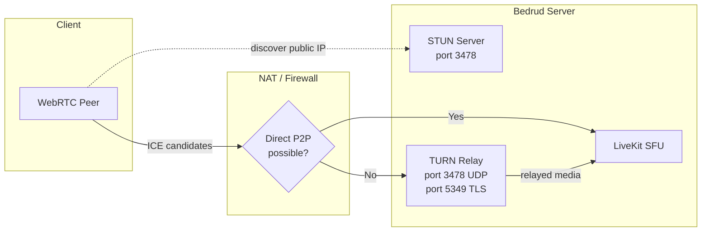
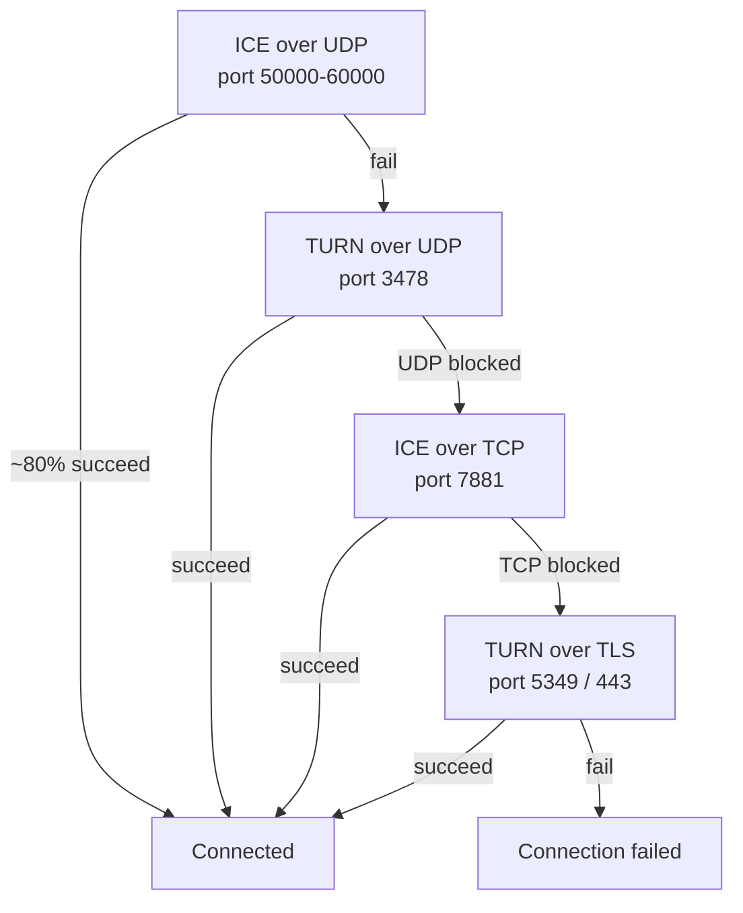
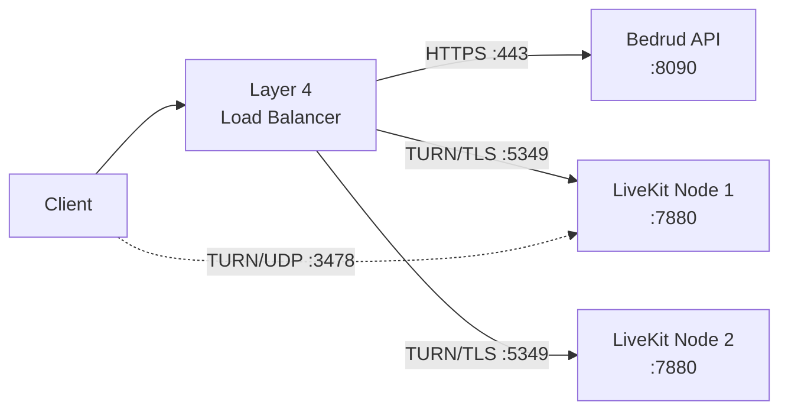
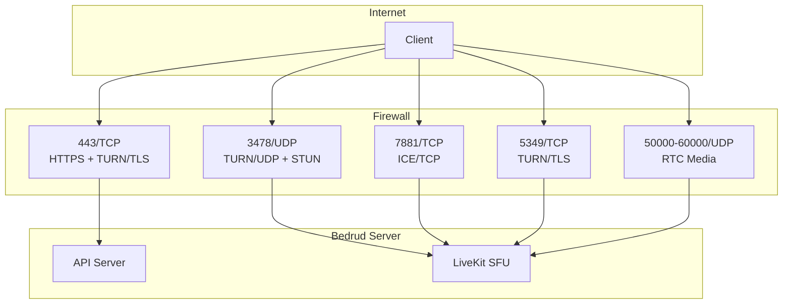

Bedrud incrusta un servidor TURN a través de LiveKit para retransmitir medios para clientes detrás de NATs o firewalls restrictivos. Esta página cubre arquitectura, configuración y solución de problemas.

---

## Qué es TURN

**TURN** (Traversal Using Relays around NAT) es un protocolo que reenvía paquetes de medios a través de un servidor cuando dos endpoints no pueden conectarse directamente.

**Protocolos relacionados:**

| Protocol | Role | Cost |
|----------|------|------|
| **STUN** | Descubrir IP/puerto público. Ligero. | Ninguno (el servidor solo ve pequeñas solicitudes de enlace) |
| **ICE** | Marco que prueba todas las opciones de conectividad en orden de prioridad. | Ninguno (solo orquestación) |
| **TURN** | Retransmitir todos los medios cuando falla la ruta directa. Último recurso. | Alto (ancho de banda del servidor = todos los medios retransmitidos) |

Consulte [Conectividad WebRTC](/es/docs/architecture/webrtc-connectivity) para obtener la pila completa de conectividad.

---

## TURN en Bedrud

LiveKit incluye un servidor TURN incrustado. No se necesita infraestructura externa.

### Arquitectura de Retransmisión



### Prioridad de Conexión

LiveKit prueba tipos de conexión en orden. Cada respaldo añade latencia y costo del servidor:



| Priority | Type | Port | Typical scenario |
|----------|------|------|-----------------|
| 1 | ICE/UDP (direct) | 50000-60000 | La mayoría de las conexiones. Sin retransmisión. |
| 2 | TURN/UDP | 3478 | NAT simétrico, P2P bloqueado. |
| 3 | ICE/TCP | 7881 | UDP bloqueado (VPN, algunos firewalls). |
| 4 | TURN/TLS | 5349 o 443 | Firewall corporativo, solo HTTPS saliente. |

---

## Cuándo se Activa TURN

TURN se activa cuando falla la ruta de medios directa. Causas comunes:

- **NAT simétrico en ambos pares** - Tanto el cliente como el servidor tienen NAT simétrico. El NAT asigna un puerto público diferente para cada destino, por lo que la dirección descubierta por STUN se vuelve inalcanzable.
- **Firewall corporativo** - bloquea completamente el UDP saliente. Solo se permite el puerto TCP 443.
- **Restricciones de VPN** - algunas VPN interceptan o bloquean el tráfico WebRTC.
- **VMs en la nube sin IP pública** - algunos proveedores de nube usan NAT que rompe el ICE directo.

La mayoría de los usuarios (~80%) nunca golpean TURN. La ruta UDP directa funciona.

### Costo de Ancho de Banda

Cuando TURN retransmite, el servidor lleva todos los medios de ese participante. Ancho de banda aproximado por transmisión:

| Stream type | Bitrate | Por participante retransmitido |
|-------------|---------|------------------------|
| Audio (Opus) | ~32 Kbps | ~32 Kbps |
| Video 720p (VP8) | ~1.5 Mbps | ~1.5 Mbps subida + 1.5 Mbps bajada por pista suscrita |
| Compartir pantalla 1080p | ~2.5 Mbps | ~2.5 Mbps |

Para una reunión de 5 personas con un participante retransmitido: el servidor maneja ~1.5 Mbps adicionales para la retransmisión de video de ese participante. Multiplique estos valores por el número de participantes retransmitidos para estimar el ancho de banda total del servidor.

---

## Configuración

**Archivo:** `server/config/livekit.yaml` (desarrollo) o `/etc/bedrud/livekit.yaml` (producción)

```yaml
turn:
  enabled: true
  domain: "turn.example.com"
  udp_port: 3478
  tls_port: 5349
  cert_file: /etc/bedrud/turn.crt
  key_file: /etc/bedrud/turn.key
  relay_range_start: 30000
  relay_range_end: 40000
  external_tls: false
```

### Referencia de Claves

| Key | Default | Description |
|-----|---------|-------------|
| `enabled` | `true` | Habilitar servidor TURN incrustado. |
| `domain` | `localhost` | Dominio anunciado a los clientes. Debe resolver a la IP pública del servidor. |
| `udp_port` | `3478` | Puerto TURN/UDP. También sirve solicitudes de enlace STUN cuando TURN está habilitado. |
| `tls_port` | `5349` | Puerto TURN/TLS. Establezca en `443` si ningún balanceador de carga termina TLS. |
| `cert_file` | - | Certificado TLS para TURN/TLS. Requerido cuando existen clientes TURN/TLS. |
| `key_file` | - | Clave privada TLS que coincide con `cert_file`. |
| `relay_range_start` | `30000` | Inicio del rango de puertos UDP utilizado para paquetes de medios retransmitidos. |
| `relay_range_end` | `40000` | Fin del rango de puertos de retransmisión. Cada participante retransmitido consume puertos de este rango. |
| `external_tls` | `false` | Establezca `true` cuando un balanceador de carga de capa 4 termina TURN/TLS. LiveKit omite su propio TLS en el puerto TURN. |

### Interacción con `use_external_ip`

En el mismo `livekit.yaml`, bajo `rtc:`:

```yaml
rtc:
  use_external_ip: true
```

Debe ser `true` para que TURN funcione correctamente. Cuando es `false`, los candidatos ICE contienen direcciones IP internas (privadas) que los clientes en internet no pueden alcanzar.

---

## Configuración TLS de Producción

TURN/TLS requiere su propio certificado TLS. Dos enfoques:

### Dominio Único (Sin Balanceador de Carga)

Reutilice el certificado TLS del servidor. Establezca `tls_port` en `443`:

```yaml
turn:
  enabled: true
  domain: "meet.example.com"
  tls_port: 443
  cert_file: /etc/bedrud/meet.example.com.crt
  key_file: /etc/bedrud/meet.example.com.key
```

El dominio TURN y el dominio del servidor son los mismos. El puerto 443 maneja tanto la API HTTPS como TURN/TLS - LiveKit distingue por protocolo.

### Dominio TURN Dedicado (Con Balanceador de Carga)



```yaml
turn:
  enabled: true
  domain: "turn.example.com"
  tls_port: 5349
  external_tls: true
```

El balanceador de carga termina TLS. `external_tls: true` le dice a LiveKit que espere tráfico ya descifrado.

---

## Referencia de Puertos y Firewall



| Port | Protocol | Service | Required | Notes |
|------|----------|---------|----------|-------|
| 443 | TCP | HTTPS + TURN/TLS | Sí | API + interfaz web. También TURN/TLS si `tls_port: 443`. |
| 3478 | UDP | TURN/UDP + STUN | Recomendado | Doble propósito: enlace STUN + retransmisión TURN. |
| 5349 | TCP | TURN/TLS | Si no hay LB | Puerto TURN/TLS dedicado. Omitir si usa el puerto 443. |
| 7881 | TCP | ICE/TCP | Recomendado | Respaldo cuando UDP está bloqueado pero TLS no es necesario. |
| 50000-60000 | UDP | medios RTC | Sí | Puertos de candidatos ICE. Cada participante usa 2 puertos. |
| 7880 | TCP | API de LiveKit | Interno | Señalización WebSocket. No expuesto directamente en producción. |

### Reglas Mínimas de Firewall

Para conectividad básica:

```
Allow TCP 443    (HTTPS + TURN/TLS)
Allow UDP 3478   (TURN/UDP + STUN)
Allow UDP 50000-60000  (RTC media)
```

Para máxima compatibilidad (redes corporativas):

```
Also allow TCP 7881  (ICE/TCP)
Also allow TCP 5349  (TURN/TLS, si no usa el puerto 443)
```

---

## Pruebas y Depuración

### Navegador: chrome://webrtc-internals

1. Abra `chrome://webrtc-internals` en Chrome/Edge antes de unirse a una reunión.
2. Cree un volcado.
3. Busque **pares de candidatos ICE** en la pestaña Stats.
4. Los tipos de candidatos le dicen la ruta de conexión:

| Candidate type | Meaning |
|---------------|---------|
| `host` | IP local. Interfaz directa. |
| `srflx` (server reflexive) | IP pública descubierta por STUN. P2P directo funcionando. |
| `relay` | Relé TURN activo. Los medios pasan a través del servidor. |

Si ve candidatos `relay` como el par activo, TURN está manejando esa conexión.

### Eventos del SDK Cliente de LiveKit

Todos los SDK de LiveKit emiten eventos de estado de conexión:

```typescript
room.on(RoomEvent.Connected, () => {
  console.log("Connected");
});

room.on(RoomEvent.Reconnecting, () => {
  console.log("Connection lost, reconnecting...");
});
```

Verifique `room.localParticipant.connectionQuality` para estadísticas de conexión.

### Registros del Servidor LiveKit

Aumente el nivel de registro a debug en `livekit.yaml`:

```yaml
logging:
  level: debug
```

Busque entradas de registro que contengan:
- `ICE` - estado de recopilación de candidatos
- `TURN` - eventos de asignación de retransmisión
- `relay` - conexiones de retransmisión activas

### Prueba Manual de TURN con turnutils

Instale el paquete `coturn-utils`, luego pruebe la conectividad TURN:

```bash
turnutils_uclient -t -p 3478 -W devkey -u devkey turn.example.com
```

- `-t` - usar TCP
- `-p` - puerto TURN
- Reemplace las credenciales con valores de producción

La salida de éxito muestra direcciones de retransmisión asignadas.

---

## Solución de Problemas

| Symptom | Likely Cause | Fix |
|---------|-------------|-----|
| Los clientes no pueden conectar, tiempo de espera | Puertos TURN bloqueados por firewall | Abra UDP 3478, TCP 5349, UDP 50000-60000 |
| TURN/TLS falla | Certificado TLS faltante o no coincidente | Verifique las rutas `cert_file`/`key_file`. Verifique que el certificado coincida con `domain`. |
| TURN/TLS falla con LB | `external_tls` no establecido | Establezca `external_tls: true` en la configuración. |
| Audio/video unidireccional | Rango de puertos de retransmisión bloqueado | Abra UDP desde `relay_range_start` hasta `relay_range_end`. |
| Alto ancho de banda del servidor | Muchos clientes detrás de NAT usando retransmisión | Esperado. Escale el servidor o reduzca los usuarios de retransmisión. |
| Candidatos `relay` pero se esperaba `srflx` | `use_external_ip: false` | Establezca `rtc.use_external_ip: true`. |
| El dominio TURN no resuelve | DNS mal configurado | `dig +short turn.example.com` debe devolver la IP pública del servidor. |
| Clientes detrás de firewall corporativo | Solo puerto 443 permitido | Establezca `turn.tls_port: 443`. Asegúrese de que el certificado sea válido. |
| `turn.enabled: true` pero sin retransmisión | La ruta directa funciona (bien) | TURN es respaldo. Sin retransmisión = mejor. Verifique con `chrome://webrtc-internals`. |

### Lista de Verificación de Diagnóstico Rápido

1. ¿`dig +short <turn.domain>` devuelve la IP pública correcta?
2. ¿El firewall permite UDP 3478, TCP 5349, UDP 50000-60000?
3. ¿`tls_port: 443` o `5349` coincide con las reglas del firewall?
4. ¿`cert_file` y `key_file` existen y son legibles?
5. ¿El CN/SAN del certificado coincide con `turn.domain`?
6. ¿`rtc.use_external_ip: true` está establecido?
7. ¿Los registros de LiveKit no muestran errores relacionados con TURN?

---

## Véase también

- [Conectividad WebRTC](/es/docs/architecture/webrtc-connectivity) - pila completa de conectividad STUN/ICE/TURN/SFU
- [Integración con LiveKit](/es/docs/backend/livekit) - cómo Bedrud incrusta LiveKit
- [Referencia de Configuración](/es/docs/getting-started/configuration) - todas las opciones de configuración
- [TLS Interno](/es/docs/guides/internal-tls) - TLS para redes aisladas
- [Guía de Despliegue](/es/docs/guides/deployment) - pasos de despliegue de producción
