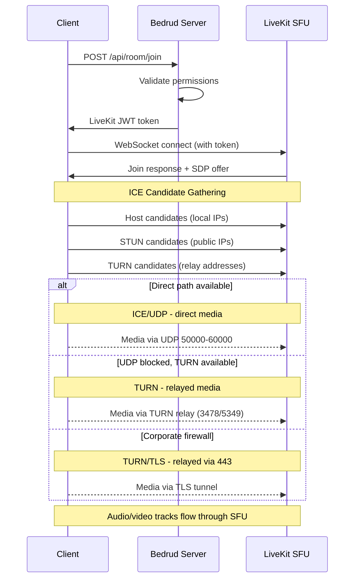
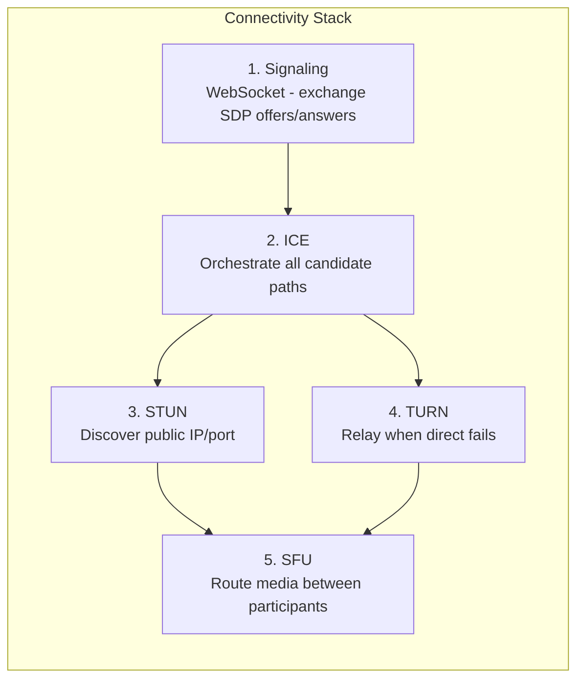
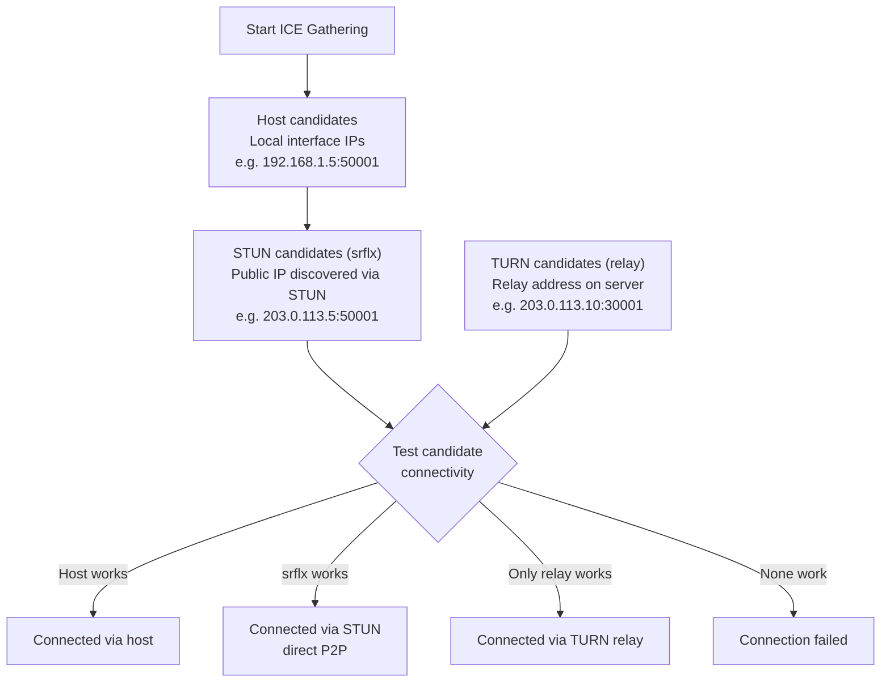
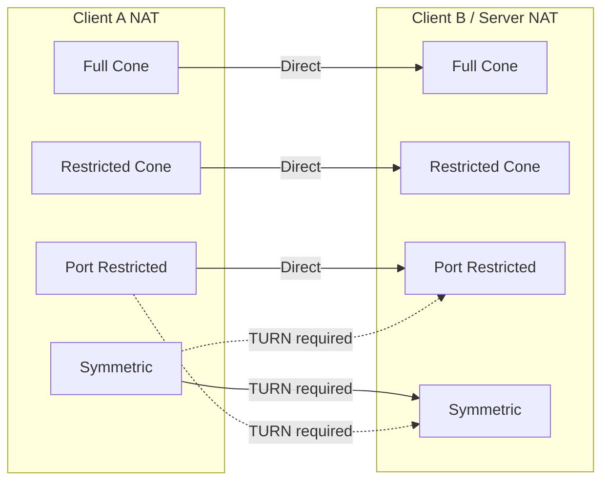

Cómo los clientes establecen conexiones de medios en tiempo real en Bedrud. Cubre la pila completa de conectividad: señalización, ICE, STUN, TURN y la ruta de medios SFU.

---

## Resumen

WebRTC requiere una serie de pasos antes de que el audio y el video fluyan entre cliente y servidor. Bedrud usa la arquitectura SFU (Selective Forwarding Unit) de LiveKit - los clientes se conectan al servidor, no entre sí. **Esto significa que solo importa la ruta de red de cliente a servidor**, no la conexión entre participantes individuales.



---

## Pila de Conectividad

Cinco capas trabajan juntas para establecer la ruta de medios:



### Detalles de las Capas

**1. Señalización** - El cliente y el servidor intercambian metadatos de conexión usando ofertas y respuestas SDP (Session Description Protocol) vía WebSocket. Esto no son medios - es la fase de configuración. Bedrud proxy la señalización a través del servidor API hacia la instancia LiveKit incrustada.

**2. ICE (Interactive Connectivity Establishment)** - Recopila todas las rutas de conexión posibles, llamadas candidatos, y las prueba en orden de prioridad. ICE es un marco - coordina los intentos de conexión pero no es un protocolo en sí mismo.

**3. STUN (Session Traversal Utilities for NAT)** - Protocolo ligero. El cliente envía una solicitud de enlace al servidor STUN, que responde con la IP y puerto público del cliente. Este candidato "server reflexive" se prueba luego para conectividad directa. Funciona para ~80% de las conexiones.

**4. TURN (Traversal Using Relays around NAT)** - Cuando la conectividad directa falla, TURN asigna una dirección de retransmisión en el servidor. Todos los paquetes de medios se reenvían a través de este relé. Mayor costo - el ancho de banda del servidor escala con los usuarios retransmitidos. Consulte la [Guía del Servidor TURN](turn-server.mdx) para una cobertura profunda.

**5. SFU (Selective Forwarding Unit)** - Una vez que se establece la ruta de transporte, el SFU de LiveKit enruta medios entre participantes. Cada participante envía una transmisión hacia arriba; el SFU reenvía copias a otros participantes. Esto no es peer-to-peer - el servidor siempre está en la ruta.

---

## Recopilación de Candidatos ICE



ICE recopila tres tipos de candidatos simultáneamente:

| Type | Source | Priority | How it works |
|------|--------|----------|-------------|
| **host** | Interfaces de red local | Más alta | IP directa de la máquina. Funciona en LAN. |
| **srflx** (server reflexive) | Respuesta del servidor STUN | Media | IP pública descubierta vía STUN. Funciona para la mayoría de tipos de NAT. |
| **relay** | Asignación del servidor TURN | Más baja | Dirección en el servidor TURN. Siempre funciona. Mayor costo. |

ICE prueba todos los candidatos y selecciona el par de mayor prioridad que tenga éxito. Si `srflx` funciona, omite `relay`.

---

## Tipos de NAT y Conectividad

Diferentes tipos de NAT afectan si la conectividad directa funciona:



| NAT Type | Description | Direct P2P | Needs TURN |
|----------|-------------|------------|-----------|
| **Full Cone** | Todas las solicitudes desde la misma IP/puerto interno se asignan a la misma IP/puerto público. Cualquier host externo puede enviar a ella. | Sí | No |
| **Restricted Cone** | La misma asignación que Full Cone, pero solo los hosts externos que recibieron un paquete pueden enviar de vuelta. | Generalmente | No |
| **Port Restricted Cone** | Similar a Restricted Cone, pero el NAT también restringe el número de puerto externo. Tipo de enrutador doméstico más común. | Generalmente | Raramente |
| **Symmetric** | Diferente asignación de IP/puerto público por destino. La dirección descubierta por STUN no se puede reutilizar. | No (cuando ambos son simétricos) | **Sí** |

**Perspectiva clave:** Dado que el servidor tiene una IP pública y un rango de puertos predecible, la mayoría de los tipos de NAT funcionan directamente. TURN se necesita principalmente cuando el firewall del cliente bloquea completamente el UDP saliente.

---

## Resumen de Configuración

Qué claves de configuración de Bedrud/LiveKit afectan la conectividad WebRTC:

**Claves de `livekit.yaml`:**

```yaml
rtc:
  port_range_start: 50000       # Inicio del rango de puertos de medios UDP
  port_range_end: 60000         # Fin del rango de puertos de medios UDP
  tcp_port: 7881                # Puerto de respaldo ICE/TCP
  stun_servers:                 # Servidores STUN externos (opcional)
    - stun:stun.l.google.com:19302
  use_external_ip: true         # Anunciar IP pública en candidatos ICE

turn:
  enabled: true                 # Habilitar TURN incrustado
  domain: "turn.example.com"    # Dominio TURN (DNS debe resolver)
  udp_port: 3478                # Puerto TURN/UDP + STUN
  tls_port: 5349                # Puerto TURN/TLS (o 443)
  cert_file: /path/to/turn.crt  # Certificado TLS para TURN/TLS
  key_file: /path/to/turn.key   # Clave TLS para TURN/TLS
  relay_range_start: 30000      # Inicio del rango de puertos de retransmisión
  relay_range_end: 40000        # Fin del rango de puertos de retransmisión
  external_tls: false           # LB de capa 4 termina TLS
```

**Claves de `config.yaml` (servidor Bedrud):**

```yaml
server:
  port: 8090                    # Puerto API (señalización proxy a través de esto)
  enableTLS: true               # HTTPS para señalización
  domain: "meet.example.com"    # Dominio público
```

### Depuración de Problemas de Conectividad

| Symptom | Check |
|---------|-------|
| No se puede conectar en absoluto | ¿`rtc.use_external_ip: true`? ¿Firewall abierto en 443 + rango UDP? |
| Se conecta pero sin audio/video | ¿UDP 50000-60000 bloqueado? Verifique candidatos ICE en el navegador. |
| Conexión lenta | Relé TURN activo (verifique candidatos). Esperado si el cliente está detrás de NAT estricto. |
| Falla detrás de red corporativa | TURN/TLS no configurado. Establezca `turn.tls_port: 443` con certificado válido. |
| Funciona en LAN, falla remotamente | IP pública no anunciada. Establezca `rtc.use_external_ip: true`. |

Para una solución profunda de problemas de TURN, consulte la [Guía del Servidor TURN](/es/docs/architecture/turn-server).

---

## Véase también

- [Guía del Servidor TURN](/es/docs/architecture/turn-server) - arquitectura TURN, configuración, TLS, depuración
- [Integración con LiveKit](/es/docs/backend/livekit) - cómo Bedrud incrusta LiveKit
- [Resumen de Arquitectura](/es/docs/architecture/overview) - arquitectura completa del sistema
- [TLS Interno](/es/docs/guides/internal-tls) - TLS para redes aisladas
