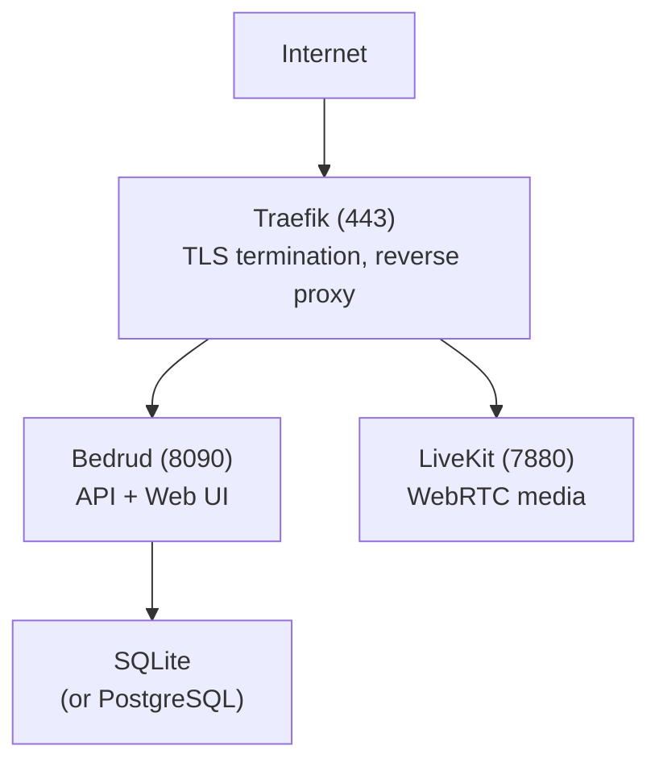

Esta guía explica cómo desplegar Bedrud en un servidor de producción.

## Opciones de despliegue

| Método | Ideal para |
|--------|------------|
| [Gestor de paquetes (apt/AUR)](#package-manager) | Instalación gestionada en distribuciones Linux compatibles |
| [CLI automatizada](#automated-cli-deployment) | Configuración remota rápida |
| [Instalación manual](#manual-installation) | Control total sobre la configuración |
| [Docker](#docker-deployment) | Entornos conteinerizados |
| [Modo appliance](/es/docs/guides/appliance) | Configuración todo-en-uno de binario único |

---

## Gestor de paquetes

Instala Bedrud en Debian/Ubuntu o Arch Linux usando el gestor de paquetes nativo. Este es el método recomendado para despliegues de servidor persistentes donde quieres actualizaciones automáticas mediante `apt upgrade` o AUR.

Consulta la [guía de instalación por paquetes](/es/docs/guides/packages) para instrucciones completas, incluyendo cómo añadir la clave GPG y el repositorio de apt.

```bash
# Ubuntu / Debian
sudo apt install bedrud

# Arch Linux (AUR)
yay -S bedrud-bin
```

Después de la instalación, ejecuta el instalador interactivo para configurar TLS, servicios systemd y la base de datos:

```bash
sudo bedrud install
```

---

## Despliegue automatizado con CLI

La forma más rápida de desplegar. Ejecuta desde tu máquina local:

**Requisitos previos:** Python 3.10+, [uv](https://github.com/astral-sh/uv) y acceso SSH al servidor de destino.

```bash
cd tools/cli
uv run python bedrud.py --auto-config \
  --ip <server-ip> \
  --user root \
  --auth-key ~/.ssh/id_rsa \
  --domain meet.example.com \
  --acme-email admin@example.com
```

Esto hará lo siguiente:

1. Compilar el binario del backend localmente
2. Comprimir y subirlo mediante rsync
3. Limpiar servidores web conflictivos
4. Configurar el firewall
5. Instalar e iniciar los servicios en el servidor

### Opciones de CLI

| Opción | Descripción |
|--------|-------------|
| `--ip` | Dirección IP del servidor |
| `--user` | Usuario SSH (predeterminado: root) |
| `--auth-key` | Ruta a la clave privada SSH |
| `--domain` | Nombre de dominio para Let's Encrypt |
| `--acme-email` | Email para Let's Encrypt |
| `--uninstall` | Eliminar Bedrud del servidor |

---

## Instalación manual

### 1. Compilar el binario

```bash
make build-dist
```

Esto genera `dist/bedrud_linux_amd64.tar.xz`.

### 2. Subir al servidor

```bash
scp dist/bedrud_linux_amd64.tar.xz root@server:/tmp/
ssh root@server "cd /tmp && tar xf bedrud_linux_amd64.tar.xz"
```

### 3. Instalar

```bash
ssh root@server
sudo /tmp/bedrud install --tls --domain meet.example.com --email admin@example.com
```

Consulta la [guía de instalación](/es/docs/getting-started/installation) para todos los escenarios de instalación.

### 4. Crear usuario administrador

<CreateAdmin />

---

## Despliegue con Docker

Compila y ejecuta con Docker:

```bash
docker build -t bedrud .
docker run -d --name bedrud -p 8090:8090 -p 7880:7880 -v bedrud-data:/var/lib/bedrud bedrud
```

También hay una imagen precompilada disponible:

```bash
docker pull ghcr.io/bedrud-ir/bedrud:latest
```

Consulta la [guía de Docker](/es/docs/guides/docker) para obtener detalles completos incluyendo volúmenes, configuración y Docker Compose.

---

## Arquitectura de producción



Para la conectividad WebRTC, también abre estos puertos en el firewall:

| Puerto | Protocolo | Propósito |
|--------|-----------|-----------|
| 3478 | UDP | TURN/UDP + STUN |
| 5349 | TCP | TURN/TLS (o usar 443) |
| 7881 | TCP | ICE/TCP fallback |
| 50000-60000 | UDP | Flujos de medios RTC |

Consulta [Conectividad WebRTC](/es/docs/architecture/webrtc-connectivity) para la pila completa de conectividad.

<SystemdServices />

### Gestión de servicios

```bash
# Verificar estado
systemctl status bedrud livekit

# Reiniciar
systemctl restart bedrud

# Ver logs
journalctl -u bedrud -f
tail -f /var/log/bedrud/bedrud.log
```

---

## Ubicación de archivos (producción)

| Ruta | Contenido |
|------|-----------|
| `/usr/local/bin/bedrud` | Binario |
| `/etc/bedrud/config.yaml` | Configuración del servidor |
| `/etc/bedrud/livekit.yaml` | Configuración de LiveKit |
| `/var/lib/bedrud/bedrud.db` | Base de datos SQLite |
| `/var/log/bedrud/bedrud.log` | Logs de la aplicación |

---

## CI/CD

### Pipeline de lanzamientos

El workflow `release.yml` se dispara con tags de versión (`v*`) y produce:

| Artefacto | Descripción |
|-----------|-------------|
| `bedrud_linux_amd64.tar.xz` / `bedrud_linux_arm64.tar.xz` | Binarios del servidor (Linux x86_64 / ARM64) |
| `bedrud_amd64.deb` / `bedrud_arm64.deb` | Paquetes Debian/Ubuntu (servidor) |
| Imagen Docker (`ghcr.io/bedrud-ir/bedrud`) | Imagen contenedora multi-arquitectura publicada en GHCR |
| `bedrud-desktop-linux-x86_64.AppImage` | Escritorio - AppImage universal de Linux |
| `bedrud-desktop-linux-x86_64.deb` | Escritorio - Paquete Debian/Ubuntu |
| `bedrud-desktop-linux-x86_64.tar.xz` | Escritorio - Tarball portátil de Linux |
| `bedrud-desktop-windows-x86_64-setup.exe` / `-arm64-setup.exe` | Escritorio - Instalador NSIS de Windows |
| `bedrud-desktop-windows-x86_64.zip` / `-arm64.zip` | Escritorio - Portable de Windows |
| `bedrud-desktop-macos-x86_64.tar.gz` / `-arm64.tar.gz` | Escritorio - Portable de macOS (sin firmar) |
| Android APK (depuración + producción, por arquitectura) | Builds del cliente Android |
| iOS IPA (opcional, requiere firma) | Archivo del cliente iOS |

Todos los artefactos se adjuntan al lanzamiento en GitHub.

### Builds nocturnos

El workflow `dev-nightly.yml` produce builds de desarrollo de forma programada.

### Verificaciones de CI

Cada push a `main` y cada pull request ejecuta:

| Verificación | Plataforma |
|--------------|------------|
| `go vet` + build + tests | ubuntu-latest (Go 1.24) |
| Verificación de tipos + build | ubuntu-latest (Bun) |
| Lint + tests unitarios | ubuntu-latest (JDK 17) |
| Build + test | macos-15 (Xcode) |
