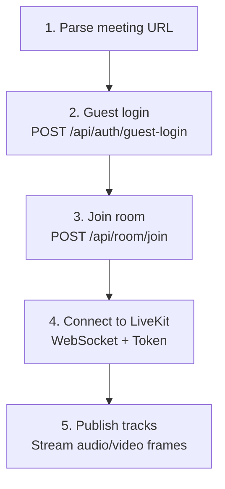
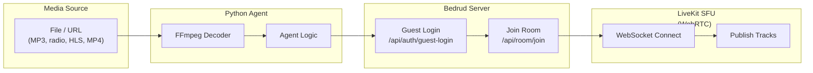

بدرود شامل عوامل ربات مبتنی بر Python است که می‌توانند به اتاق‌های جلسه بپیوندند و محتوای مدیا را استریم کنند. این موارد برای موسیقی پس‌زمینه، استریم‌های رادیو، یا اشتراک محتوای ویدیویی مفید هستند.

## عوامل موجود

| عامل | توضیح | نوع مدیا |
|-------|-------|-----------|
| `music_agent` | فایل‌های صوتی را در اتاق پخش می‌کند | صوتی (PCM) |
| `radio_agent` | ایستگاه‌های رادیو اینترنتی را استریم می‌کند | صوتی (PCM از طریق FFmpeg) |
| `video_stream_agent` | محتوای ویدیویی را به اشتراک می‌گذارد (HLS، MP4) | ویدیو + صدا |

## نحوه کار عوامل

همه عوامل الگوی اتصال یکسان را دنبال می‌کنند:





## عامل موزیک

فایل‌های صوتی (MP3، WAV و غیره) را در یک اتاق جلسه پخش می‌کند.

### راه‌اندازی

```bash
cd agents/music_agent
pip install -r requirements.txt
```

**وابستگی‌ها:** `httpx`، `livekit`، `pydub`

### استفاده

```bash
python agent.py "https://meet.example.com/m/room-name"
```

### نحوه کارکرد

۱. فایل‌های صوتی را با استفاده از `pydub` دیکد می‌کند
۲. به فریم‌های PCM تبدیل می‌کند
۳. فریم‌های صوتی را به LiveKit به عنوان یک میکروفون‌ترک منتشر می‌کند

> برای دستورالعمل‌های راه‌اندازی و استفاده به [Music Agent README](https://github.com/bedrud-ir/bedrud/tree/main/agents/music_agent) مراجعه کنید.

---

## عامل رادیو

ایستگاه‌های رادیو اینترنتی را در یک اتاق جلسه با استفاده از FFmpeg برای دیکد صوتی استریم می‌کند.

### راه‌اندازی

```bash
cd agents/radio_agent
pip install -r requirements.txt
```

**وابستگی‌ها:** `httpx`، `livekit`

**نیاز سیستم:** FFmpeg باید نصب باشد (`brew install ffmpeg` یا `apt install ffmpeg`)

### استفاده

```bash
python agent.py "https://meet.example.com/m/room-name"
```

### نحوه کارکرد

۱. به URL استریم رادیو متصل می‌شود
۲. جریان را از طریق FFmpeg به PCM خام دیکد می‌کند
۳. فریم‌های صوتی PCM را به LiveKit منتشر می‌کند

> برای دستورالعمل‌های راه‌اندازی و استفاده به [Radio Agent README](https://github.com/bedrud-ir/bedrud/tree/main/agents/radio_agent) مراجعه کنید.

---

## عامل استریم ویدیو

ویدیو و صدا را از یک URL (HLS/m3u8، MP4) در یک اتاق جلسه به اشتراک می‌گذارد.

### راه‌اندازی

```bash
cd agents/video_stream_agent
pip install -r requirements.txt
```

**وابستگی‌ها:** `httpx`، `livekit`

**نیاز سیستم:** FFmpeg باید نصب باشد

### استفاده

```bash
python agent.py "https://meet.example.com/m/room-name"
```

### نحوه کارکرد

۱. دو فرآیند FFmpeg را موازی اجرا می‌کند:
    - **ویدیو:** دیکد به فریم‌های خام YUV420p (۱۲۸۰x۷۲۰ @ ۳۰fps)
    - **صدا:** دیکد به نمونه‌های PCM
۲. ویدیو را به عنوان یک screen-share ترک منتشر می‌کند
۳. صدا را به عنوان یک میکروفون‌ترک منتشر می‌کند

> برای دستورالعمل‌های راه‌اندازی و استفاده به [Video Stream Agent README](https://github.com/bedrud-ir/bedrud/tree/main/agents/video_stream_agent) مراجعه کنید.

### مشخصات ویدیو

| تنظیم | مقدار |
|---------|-------|
| عرض | ۱۲۸۰ |
| ارتفاع | ۷۲۰ |
| FPS | ۳۰ |
| فرمت پیکسل | YUV420p |

---

## نوشتن عامل سفارشی

برای ایجاد یک عامل جدید، این الگو را دنبال کنید:

```python
import httpx
from livekit import rtc

# ۱. URL جلسه را تحلیل کنید تا نام اتاق استخراج شود
room_name = parse_url(meeting_url)

# ۲. ورود مهمان
client = httpx.Client(base_url=server_url)
resp = client.post("/api/auth/guest-login", json={"name": "Bot Name"})
token = resp.json()["token"]

# ۳. پیوستن به اتاق
client.headers["Authorization"] = f"Bearer {token}"
resp = client.post("/api/room/join", json={"roomName": room_name})
lk_token = resp.json()["token"]

# ۴. اتصال به LiveKit
room = rtc.Room()
await room.connect(livekit_url, lk_token)

# ۵. انتشار ترک‌ها
source = rtc.AudioSource(sample_rate=48000, num_channels=1)
track = rtc.LocalAudioTrack.create_audio_track("audio", source)
await room.local_participant.publish_track(track)

# ۶. استریم فریم‌ها
while has_data:
    frame = get_next_frame()
    await source.capture_frame(frame)
```

---

## همچنین ببینید

- [Music Agent README](https://github.com/bedrud-ir/bedrud/tree/main/agents/music_agent) - راه‌اندازی و استفاده
- [Radio Agent README](https://github.com/bedrud-ir/bedrud/tree/main/agents/radio_agent) - راه‌اندازی و استفاده
- [Video Stream Agent README](https://github.com/bedrud-ir/bedrud/tree/main/agents/video_stream_agent) - راه‌اندازی و استفاده
