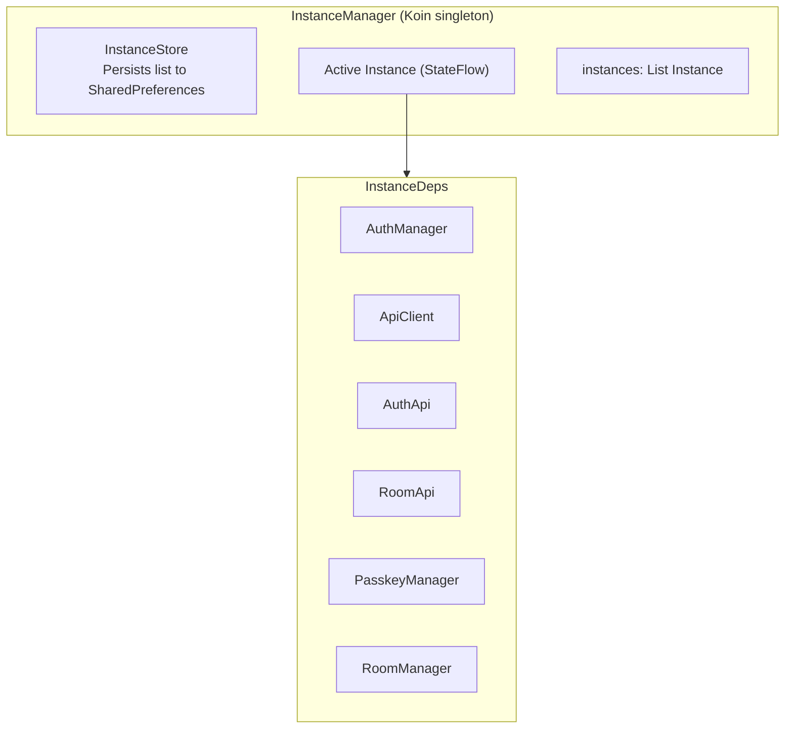
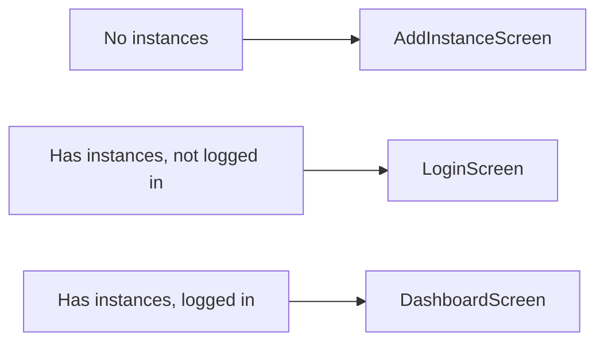

اپلیکیشن Android بدرود با Jetpack Compose و Kotlin ساخته شده است، تجربه جلسه ویدیویی بومی با تصویر در تصویر، لینک عمیق، و پشتیبانی چند نمونه را فراهم می‌کند.

## پشته فناوری

| فناوری | نسخه | هدف |
|-----------|-------|-----|
| Kotlin | 2.1.0 | زبان |
| Jetpack Compose | Material 3 | جعبه ابزار UI |
| Koin | 4.0.0 | تزریق وابستگی |
| Retrofit + OkHttp | Latest | کلاینت HTTP |
| LiveKit Android SDK | 2.23.3 | مدیا WebRTC |
| Credentials API | Latest | پشتیبانی کلید عبور |
| Encrypted SharedPreferences | Latest | ذخیره امن |
| Coil | Latest | بارگذاری تصویر |

**هدف:** Min SDK 28، Target SDK 35، JDK 17

## ساختار دایرکتوری

```
apps/android/app/src/main/java/com/bedrud/app/
├── BedrudApplication.kt           # کلاس Application (init Koin)
├── MainActivity.kt                # نقطه ورودی single-activity
├── core/
│   ├── api/                       # کلاینت API Retrofit
│   │   ├── ApiClient.kt           # کلاینت HTTP پایه با interceptor احراز هویت
│   │   ├── AuthApi.kt             # تعاریف نقطه پایانی Auth
│   │   └── RoomApi.kt             # تعاریف نقطه پایانی Room
│   ├── auth/
│   │   └── AuthManager.kt         # مدیریت توکن، ورود/خروج
│   ├── call/
│   │   ├── CallService.kt         # سرویس پیش‌زمینه برای تماس‌ها
│   │   └── CallConnectionService.kt  # ConnectionService اندروید
│   ├── deeplink/
│   │   └── DeepLinkHandler.kt     # مدیریت لینک‌های عمیق bedrud.com
│   ├── di/
│   │   └── AppModule.kt           # تعاریف ماژول Koin
│   ├── instance/
│   │   ├── InstanceManager.kt     # ارکستراتور چند نمونه مرکزی
│   │   ├── InstanceStore.kt       # ذخیره نمونه پایدار
│   │   └── InstanceDeps.kt        # کانتینر وابستگی هر نمونه
│   ├── livekit/
│   │   └── RoomManager.kt         # مدیر اتصال اتاق LiveKit
│   └── pip/
│       └── PipManager.kt          # کنترل‌کننده تصویر در تصویر
├── models/
│   ├── User.kt                    # مدل داده کاربر
│   ├── Room.kt                    # مدل داده اتاق
│   ├── Instance.kt                # مدل داده نمونه سرور
│   └── ApiResponse.kt             # wrappers پاسخ API
└── ui/
    ├── screens/
    │   ├── auth/
    │   │   ├── LoginScreen.kt     # ورود ایمیل/رمز + کلید عبور
    │   │   └── RegisterScreen.kt  # ثبت‌نام حساب
    │   ├── dashboard/
    │   │   └── DashboardScreen.kt # لیست اتاق و مدیریت
    │   ├── meeting/
    │   │   └── MeetingScreen.kt   # رابط تماس ویدیویی
    │   ├── instance/
    │   │   ├── AddInstanceScreen.kt    # افزودن نمونه سرور
    │   │   └── InstanceSwitcher.kt     # جابجایی بین نمونه‌ها
    │   ├── profile/
    │   │   └── ProfileScreen.kt   # پروفایل کاربر
    │   └── settings/
    │       └── SettingsScreen.kt  # تنظیمات اپلیکیشن
    ├── components/                 # کامپوننت‌های قابل استفاده مجدد Compose
    └── theme/                      # تعریف تم Material 3
```

## معماری چند نمونه

اپلیکیشن Android اتصال همزمان به چندین سرور بدرود را پشتیبانی می‌کند.



### الگوی کلیدی

همه وابستگی‌های هر نمونه به عنوان `StateFlow<T?>` در `InstanceManager` در معرض قرار می‌گیرند. Composable‌ها آنها را جمع می‌کنند:

```kotlin
val authManager = instanceManager.authManager.collectAsState().value ?: return
val roomApi = instanceManager.roomApi.collectAsState().value ?: return
```

الگوی `?: return` تضمین می‌کند که composable تا زمانی که نمونه به طور کامل مقداردهی نشود، رندر نمی‌شود.

### جریان ناوبری



جابجایی نمونه به عنوان `ModalBottomSheet` که از نوار Dashboard راه‌اندازی می‌شود ظاهر می‌شود.

## ویژگی‌ها

### لینک عمیق

اپلیکیشن URLهای مطابق را مدیریت می‌کند:

- `https://bedrud.com/m/*` - پیوستن مستقیم به اتاق
- `https://bedrud.com/c/*` - پیوستن به اتاق با کد

از طریق فیلترهای intent در `AndroidManifest.xml` پیکربندی شده است.

### مدیریت تماس

- **CallService** - سرویس پیش‌زمینه که اتصال را در حین تماس زنده نگه می‌دارد
- **CallConnectionService** - با چارچوب تلفنی اندروید برای رابط تماس مناسب یکپارچه می‌شود
- مجوزهای مورد نیاز: `MANAGE_OWN_CALLS`، `FOREGROUND_SERVICE_PHONE_CALL`، `FOREGROUND_SERVICE_CAMERA`، `FOREGROUND_SERVICE_MICROPHONE`

### تصویر در تصویر

صفحه جلسه از حالت PiP پشتیبانی می‌کند، به کاربران اجازه می‌دهد در حالی که از اپلیکیشن‌های دیگر استفاده می‌کنند، فید ویدیو را ببینند.

### کلیدهای عبور

از Credentials API اندروید برای ثبت‌نام و ورود کلید عبور FIDO2/WebAuthn استفاده می‌کند.

## ساخت

```bash
# Debug APK
make build-android-debug

# Release APK (نیاز به keystore.properties دارد)
make build-android

# ساخت + نصب روی دستگاه متصل
make release-android

# باز کردن در Android Studio
make dev-android
```

### امضای Release

ساخت‌های Release نیاز به یک فایل `keystore.properties` در ریشه پروژه android با پیکربندی امضای شما دارند.
