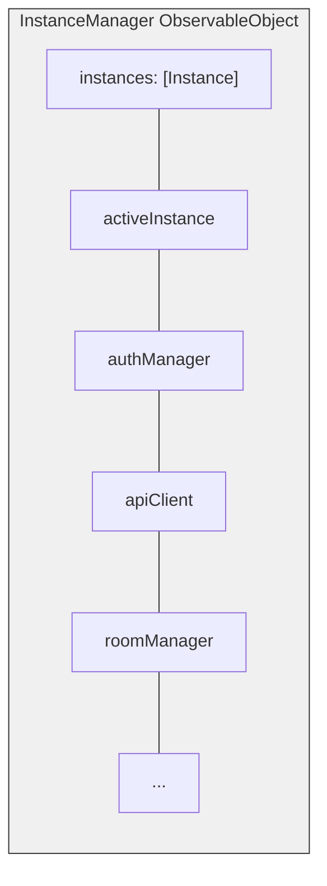
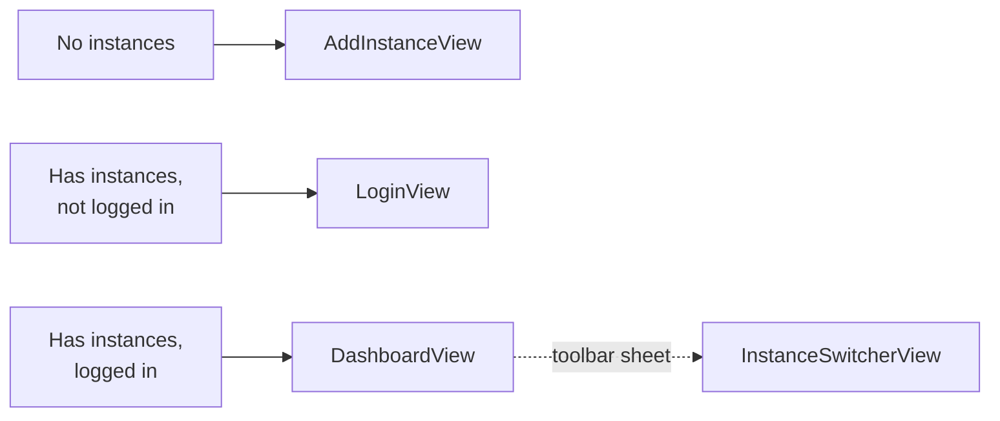

اپلیکیشن iOS بدرود با SwiftUI ساخته شده است، تجربه جلسه ویدیویی بومی با پشتیبانی چند نمونه و ذخیره امن اعتبارنامه را فراهم می‌کند.

## پشته فناوری

| فناوری | نسخه | هدف |
|-----------|-------|-----|
| Swift | 5.9+ | زبان |
| SwiftUI | Latest | فریم‌ورک UI |
| LiveKit Swift SDK | 2.0+ | مدیا WebRTC |
| KeychainAccess | 4.2.2+ | ذخیره امن اعتبارنامه |

**هدف استقرار:** iOS 18.0

## پیکربندی پروژه

پروژه از **XCodeGen** برای تولید پروژه از `project.yml` استفاده می‌کند:

- Bundle ID: `com.bedrud.ios`
- تولید شده با: `xcodegen generate`

## ساختار دایرکتوری

```text
apps/ios/Bedrud/
├── BedrudApp.swift                # نقطه ورودی اپ
├── Core/
│   ├── API/
│   │   └── APIClient.swift        # کلاینت REST مبتنی بر URLSession
│   ├── Auth/
│   │   └── AuthManager.swift      # مدیریت توکن، ورود/خروج
│   ├── Instance/
│   │   ├── InstanceManager.swift  # ارکستراتور چند نمونه مرکزی
│   │   └── InstanceStore.swift    # ذخیره نمونه پایدار (UserDefaults)
│   └── LiveKit/
│       └── RoomManager.swift      # مدیر اتصال اتاق LiveKit
├── Features/
│   ├── Auth/
│   │   ├── LoginView.swift        # صفحه ورود
│   │   └── RegisterView.swift     # صفحه ثبت‌نام
│   ├── Dashboard/
│   │   └── DashboardView.swift    # لیست اتاق و مدیریت
│   ├── Meeting/
│   │   └── MeetingView.swift      # رابط تماس ویدیویی
│   ├── Profile/
│   │   └── ProfileView.swift      # پروفایل کاربر
│   ├── Instance/
│   │   ├── AddInstanceView.swift  # افزودن نمونه سرور
│   │   └── InstanceSwitcherView.swift  # جابجایی بین نمونه‌ها
│   ├── Settings/
│   │   └── SettingsView.swift     # تنظیمات اپلیکیشن
│   ├── JoinByURL/
│   │   └── JoinByURLView.swift    # مدیریت لینک عمیق
│   └── Main/
│       └── MainTabView.swift      # ناوبری تب
├── Models/
│   ├── User.swift
│   ├── Room.swift
│   └── Instance.swift
└── Design/
    └── Components/                # کامپوننت‌های قابل استفاده مجدد SwiftUI
```

## معماری چند نمونه

اپلیکیشن iOS معماری Android را برای پشتیبانی چند نمونه منعکس می‌کند.



### الگوی کلیدی

وابستگی‌ها ویژگی‌های `@Published` روی `InstanceManager` هستند، که یک `ObservableObject` است. Views آن را از طریق `@EnvironmentObject` دریافت می‌کنند:

```swift
struct DashboardView: View {
    @EnvironmentObject var instanceManager: InstanceManager

    var body: some View {
        if let authManager = instanceManager.authManager {
            // Render authenticated UI
        }
    }
}
```

### جریان ناوبری



جابجایی نمونه به عنوان `.sheet` که از نوار Dashboard راه‌اندازی می‌شود ظاهر می‌شود.

## نقطه ورودی اپلیکیشن

`BedrudApp.swift` سرویس‌های اصلی را مقداردهی اولیه می‌کند و آنها را در محیط SwiftUI تزریق می‌کند:

```swift
@main
struct BedrudApp: App {
    @StateObject var instanceStore = InstanceStore()
    @StateObject var instanceManager = InstanceManager()
    @StateObject var settingsStore = SettingsStore()

    var body: some Scene {
        WindowGroup {
            ContentView()
                .environmentObject(instanceStore)
                .environmentObject(instanceManager)
                .environmentObject(settingsStore)
        }
    }
}
```

## ویژگی‌ها

### ذخیره امن

از **KeychainAccess** برای ذخیره توکن‌های JWT و اعتبارنامه‌های حساس استفاده می‌کند، به جای UserDefaults.

### لینک عمیق

URLها را برای پیوستن مستقیم به اتاق و کدهای اتاق مدیریت می‌کند.

### تنظیمات

ترجیحات کاربر از طریق `SettingsStore` با استفاده از UserDefaults پایدار می‌شوند.

## ساخت

```bash
# باز کردن در Xcode
make dev-ios

# ساخت آرشیو (Release)
make build-ios

# صادر IPA (نیاز به ExportOptions.plist دارد)
make export-ios

# ساخت برای شبیه‌ساز (Debug)
make build-ios-sim
```

### نیازی‌ها

- Xcode (آخرین نسخه پایدار)
- هدف استقرار iOS 18.0
- برای ساخت دستگاه: حساب توسعه‌ده اپل و پروفایل تأمین
