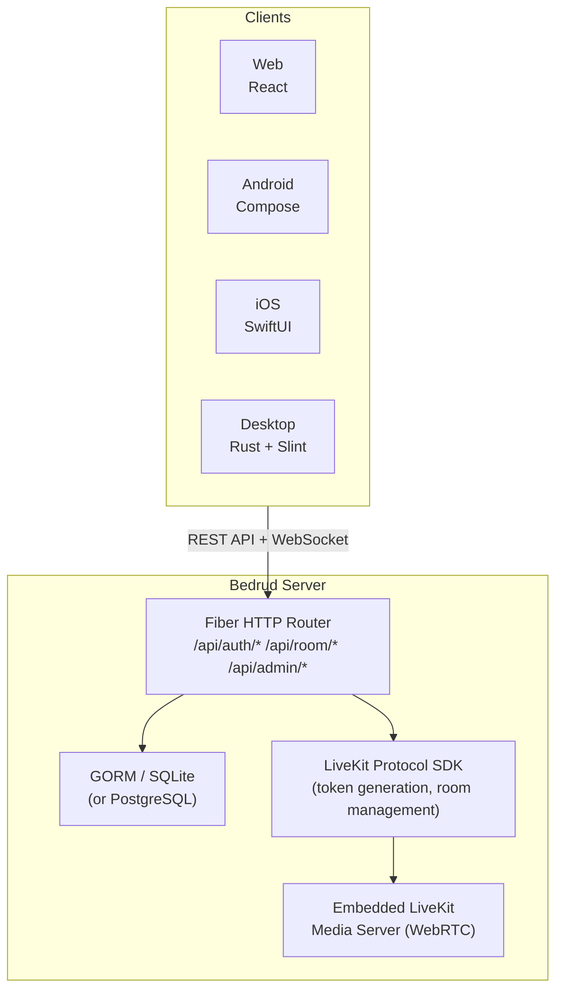
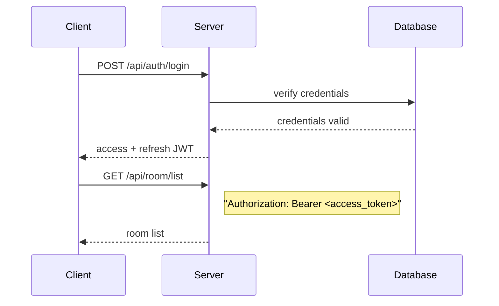
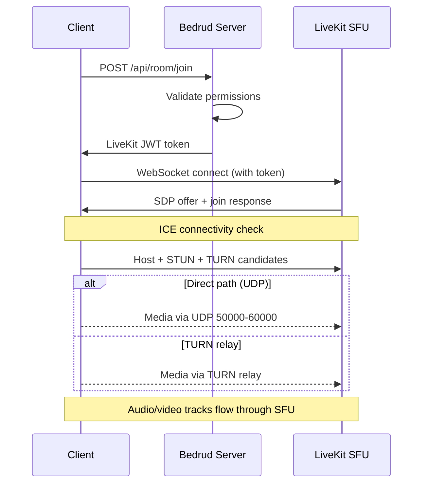

بدرود یک monorepo شامل سرور Go، سه اپلیکیشن کلاینت، agentهای Python و پکیج‌های مشترک است. این صفحه نشان می‌دهد اجزا چگونه به هم متصل‌اند.

## نمودار سطح بالا

## اجزا

### سرور (`server/`)

backend Go هسته اصلی بدرود است. وظایف آن:

- **REST API** — احراز هویت، مدیریت اتاق، عملیات ادمین
- **فایل‌های استاتیک** — frontend کامپایل‌شده با `//go:embed` در باینری embed شده
- **یکپارچگی LiveKit** — تولید token و مدیریت اتاق‌ها با LiveKit Protocol SDK
- **LiveKit داخلی** — media server به عنوان فرآیند فرزند اجرا می‌شود

سرور از **Fiber** (فریم‌ورک وب مشابه Express.js) و **GORM** (ORM) استفاده می‌کند. SQLite برای توسعه، PostgreSQL برای production.

برای جزئیات [معماری سرور](/fa/docs/architecture/server) را ببینید.

### فرانت‌اند وب (`apps/web/`)

اپلیکیشن **React** با TanStack Start، TailwindCSS v4 و shadcn/ui. در production، SSR انجام می‌شود و assetها در باینری Go embed می‌شوند.

قابلیت‌های کلیدی:

- Web UI جلسه ویدیویی با LiveKit Client SDK
- احراز هویت مبتنی بر JWT با تازه‌سازی خودکار توکن
- داشبورد ادمین برای مدیریت کاربران و اتاق‌ها
- سیستم طراحی با کتابخانه کامپوننت سازگار

برای جزئیات به [فرانت‌اند وب](/fa/docs/architecture/web) ببینید.

### اپلیکیشن Android (`apps/android/`)

یک اپلیکیشن بومی Android ساخته شده با **Jetpack Compose** و **Kotlin**. از Koin برای تزریق وابستگی و Retrofit برای HTTP استفاده می‌کند.

قابلیت‌های کلیدی:

- تجربه کامل جلسه ویدیویی با LiveKit Android SDK
- حالت تصویر در تصویر
- مدیریت لینک عمیق (`bedrud.com/m/*` و `bedrud.com/c/*`)
- مدیریت تماس با ConnectionService اندروید
- پشتیبانی چند نمونه (اتصال به چندین سرور)

برای جزئیات به [اپلیکیشن Android](/fa/docs/architecture/android) ببینید.

### اپلیکیشن iOS (`apps/ios/`)

یک اپلیکیشن بومی iOS ساخته شده با **SwiftUI**. از KeychainAccess برای ذخیره امن اعتبارنامه و LiveKit Swift SDK برای مدیا استفاده می‌کند.

قابلیت‌های کلیدی:

- تجربه کامل جلسه ویدیویی
- پشتیبانی چند نمونه
- مدیریت لینک عمیق
- ذخیره امن مبتنی بر Keychain

برای جزئیات به [اپلیکیشن iOS](/fa/docs/architecture/ios) ببینید.

### اپلیکیشن دسکتاپ (`apps/desktop/`)

یک اپلیکیشن دسکتاپ بومی Windows و Linux ساخته شده با **Rust** و جعبه ابزار UI **Slint**. به یک باینری تکی کامپایل می‌شود بدون وابستگی‌های زمان اجرا.

قابلیت‌های کلیدی:

- تجربه کامل جلسه ویدیویی از طریق LiveKit Rust SDK
- رندر بومی Windows (Direct3D 11) و Linux (OpenGL/Vulkan)
- پشتیبانی چند نمونه (اتصال به چندین سرور بدرود)
- یکپارچی با keyring سیستم‌عامل برای ذخیره امن اعتبارنامه

برای جزئیات به [اپلیکیشن دسکتاپ](/fa/docs/architecture/desktop) ببینید.

### عوامل ربات (`agents/`)

اسکریپت‌های Python که به عنوان ربات به اتاق‌های جلسه می‌پیوندند و محتوای مدیا را استریم می‌کنند:

- **عامل موزیک** - فایل‌های صوتی را پخش می‌کند
- **عامل رادیو** - ایستگاه‌های رادیو اینترنتی را استریم می‌کند
- **عامل استریم ویدیو** - محتوای ویدیویی را به اشتراک می‌گذارد (HLS، MP4)

برای جزئیات به [عوامل ربات](/fa/docs/architecture/agents) ببینید.

## جریان احراز هویت

همه درخواست‌های احراز هویت شده از توکن‌های JWT در هدر `Authorization` استفاده می‌کنند. wrapper `authFetch` فرانت‌اند وب پیوست توکن و تازه‌سازی خودکار را مدیریت می‌کند.

روش‌های احراز هویت پشتیبانی شده:

| روش | Endpoint | توضیح |
|------|----------|-------|
| ایمیل/رمز عبور | `POST /api/auth/login` | اعتبارنامه‌های سنتی |
| ثبت‌نام | `POST /api/auth/register` | ایجاد حساب جدید |
| مهمان | `POST /api/auth/guest-login` | دسترسی موقت فقط با نام |
| OAuth | `GET /api/auth/:provider/login` | Google، GitHub، Twitter |
| کلیدهای عبور | `POST /api/auth/passkey/*` | بیومتریک FIDO2/WebAuthn |

## جریان اتصال جلسه

۱. کلاینت درخواست پیوستن به اتاق را از طریق REST API می‌دهد
۲. سرور مجوزها را تأیید می‌کند و یک توکن LiveKit امضا شده تولید می‌کند
۳. کلاینت مستقیماً به LiveKit از طریق WebSocket با استفاده از توکن متصل می‌شود
۴. ICE نامزدها را جمع‌آوری می‌کند (host، STUN، TURN) و بهترین مسیر را انتخاب می‌کند
۵. ترک‌های صوتی/ویدیویی از طریق SFU LiveKit جریان می‌یابند

برای پشته اتصال کامل به [اتصال WebRTC](/fa/docs/architecture/webrtc-connectivity) ببینید.

## مدل داده

### کاربر

| فیلد | نوع | توضیح |
|------|------|-------|
| ID | uint | کلید اصلی |
| Email | string | آدرس ایمیل منحصر به فرد |
| Name | string | نام نمایشی |
| Password | string | رمز عبور هش شده (خالی برای OAuth/مهمان) |
| Avatar | string | URL آواتار |
| Provider | string | provider احراز هویت (`local`، `google`، `github`، `twitter`، `guest`) |
| Role | string | `user` یا `admin` |

### اتاق

| فیلد | نوع | توضیح |
|------|------|-------|
| ID | uint | کلید اصلی |
| AdminID | uint | کلید خارجی → User.ID (سازنده اتاق) |
| Name | string | نام اتاق / slug URL |
| IsPublic | bool | آیا مهمانان می‌توانند بدون دعوت بپیوندند |
| ChatEnabled | bool | آیا چت در اتاق فعال است |
| VideoEnabled | bool | آیا ویدیو مجاز است |
| Participants | []User | کاربرانی که در حال حاضر در اتاق هستند |

### کلید عبور

| فیلد | نوع | توضیح |
|------|------|-------|
| ID | uint | کلید اصلی |
| UserID | uint | کلید خارجی → User.ID |
| CredentialID | []byte | شناسه اعتبار WebAuthn |
| PublicKey | []byte | کلید عمومی WebAuthn |
| Counter | uint32 | تعداد امضای WebAuthn |

### توکن تازه‌سازی

| فیلد | نوع | توضیح |
|------|------|-------|
| Token | string | رشته توکن تازه‌سازی |
| UserID | uint | کلید خارجی → User.ID |
| ExpiresAt | time | مهر زمان انقضای توکن |

## معماری استقرار

در تولید، بدرود به عنوان دو سرویس systemd اجرا می‌شود:

| سرویس | باینری | هدف |
|---------|--------|-----|
| `bedrud.service` | `bedrud --run` | سرور API + فرانت‌اند وب جاسازی‌شده |
| `livekit.service` | `bedrud --livekit` | media server WebRTC |

هر دو توسط یک باینری تکی مدیریت می‌شوند. Traefik یا reverse proxy دیگر خاتمه TLS را مدیریت می‌کند و ترافیک را مسیریابی می‌کند.

برای دستورالعمل‌های تنظیم به [راهنمای استقرار](/fa/docs/guides/deployment) ببینید.

## اصطلاحات کلیدی

این اصطلاحات در سرتاسر مستندات معماری ظاهر می‌شوند:

| اصطلاح | نام کامل | معنی |
|---------|-----------|-------|
| **SFU** | واحد ارسال انتخابی | یک media server که جریان‌ها را از هر شرکت‌کننده دریافت می‌کند و به دیگران ارسال می‌کند. کلاینت‌ها به سرور متصل می‌شوند، نه به همدیگر. |
| **SDP** | پروتکل توضیح جلسه | فرمت استفاده شده برای توصیف پارامترهای اتصال WebRTC (کدک‌ها، رزولوشن‌ها، انواع مدیا). |
| **ICE** | ایجاد اتصال تعاملی | یک چارچوب که تمام مسیرهای شبکه ممکن بین کلاینت و سرور را جمع‌آوری می‌کند، سپس بهترین را انتخاب می‌کند. |
| **STUN** | ابزارهای عبور جلسه برای NAT | یک پروتکل سبک که به کلاینت کمک می‌کند آدرس IP عمومی خود را کشف کند. برای اکثر اتصالات کار می‌کند. |
| **TURN** | عبور با استفاده از رله‌ها در اطراف NAT | یک پروتکل که تمام مدیا را از طریق سرور رله می‌کند وقتی اتصال مستقیم غیرممکن است. آخرین راه حل، بالاترین هزینه پهنای باند. |
| **NAT** | ترجمه آدرس شبکه | یک ویژگی روتر که آدرس‌های خصوصی داخلی را به یک آدرس عمومی نگاشت می‌کند. بسته به نوع می‌تواند اتصال مستقیم WebRTC را مسدود کند. |
| **srflx** | بازتابی سرور | یک نوع نامزد ICE که نشان‌دهنده IP عمومی کلاینت است، کشف شده از طریق STUN. |
| **WebRTC** | ارتباط زمان واقعی وب | استاندارد API مرورگر و موبایل برای انتقال صدا، ویدیو و داده در زمان واقعی. |

## همچنین ببینید

- [اتصال WebRTC](/fa/docs/architecture/webrtc-connectivity) - پشته اتصال کامل STUN/ICE/TURN/SFU
- [راهنمای سرور TURN](/fa/docs/architecture/turn-server) - معماری و پیکربندی رله TURN
- [یکپارچگی LiveKit](/fa/docs/backend/livekit) - نحوه جاسازی LiveKit در بدرود
