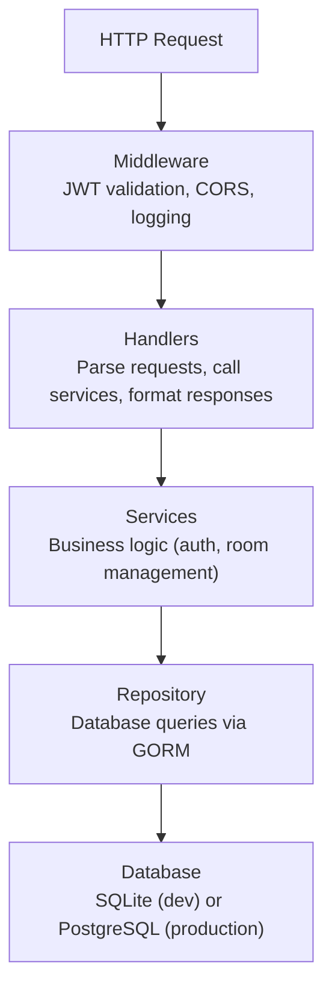

سرور بدرود یک اپلیکیشن Go است که REST API را ارائه می‌دهد، frontend داخلی را سرو می‌کند و media server LiveKit را مدیریت می‌کند.

## پشته فناوری

| فناوری | هدف |
|-----------|-----|
| Go 1.24 | زبان اصلی |
| Fiber v2 | فریم‌ورک وب (شبیه Express) |
| GORM | ORM برای SQLite و PostgreSQL |
| LiveKit Protocol SDK | مدیریت اتاق و توکن WebRTC |
| Zerolog | لاگ‌بندی ساختاریافته JSON |
| Goth | OAuth2 چند provider |
| go-passkeys | پشتیبانی FIDO2/WebAuthn |
| golang-jwt | ایجاد و تأیید توکن JWT |
| gocron | زمان‌بندی کار پس‌زمینه |
| Swagger (swaggo) | تولید مستندات API |

## ساختار دایرکتوری

```
server/
├── cmd/
│   ├── server/main.go        # نقطه ورودی توسعه
│   └── bedrud/main.go        # نقطه ورودی تولید (با فلگ‌های install/livekit)
├── internal/
│   ├── auth/                  # خدمات احراز هویت
│   │   ├── auth.go            # سرویس احراز هویت اصلی (ثبت‌نام، ورود، OAuth)
│   │   ├── jwt.go             # ایجاد و تأیید توکن JWT
│   │   └── session_store.go   # ذخیره جلسه Gorilla برای وضعیت OAuth
│   ├── database/              # مقداردهی اولیه دیتابیس و مهاجرت‌ها
│   ├── handlers/              # هندلرهای درخواست HTTP (لایه کنترلر)
│   │   ├── auth_handler.go    # نقاط پایانی احراز هویت
│   │   ├── room.go            # نقاط پایانی اتاق
│   │   └── users.go           # نقاط پایانی مدیریت کاربر
│   ├── middleware/             # middleware Fiber
│   │   └── auth.go            # تأیید JWT، بررسی مجوزها
│   ├── models/                # مدل‌های GORM (اسکیم‌های دیتابیس)
│   │   ├── user.go            # مدل کاربر
│   │   ├── room.go            # مدل اتاق
│   │   └── passkey.go         # مدل کلید عبور
│   ├── repository/            # لایه دسترسی به داده (SQL از طریق GORM)
│   │   ├── user_repository.go
│   │   ├── room_repository.go
│   │   └── passkey_repository.go
│   ├── livekit/               # مدیریت سرور LiveKit جاسازی‌شده
│   ├── scheduler/             # زمان‌بندی کار پس‌زمینه
│   └── utils/                 # TLS و سایر ابزارها
├── frontend/                  # فرانت‌اند وب جاسازی‌شده (در زمان ساخت پر می‌شود)
├── config.yaml                # پیکربندی توسعه
├── livekit.yaml               # پیکربندی LiveKit توسعه
├── go.mod
└── go.sum
```

## معماری لایه‌ای

سرور یک معماری سه لایه را دنبال می‌کند:



## الگوهای کلیدی

### فرانت‌اند جاسازی‌شده

فرانت‌اند وب به فایل‌های استاتیک کامپایل می‌شود و در باینری Go با استفاده از `//go:embed` جاسازی می‌شود:

```go
//go:embed frontend/*
var frontendFS embed.FS
```

در زمان ساخت، `bun run build:embed` SSR اپلیکیشن React را از پیش رندر می‌کند و `dist/client/` را در `server/frontend/` کپی می‌کند. کامپایلر Go سپس آن را در باینری بسته می‌کند. سرور Fiber این فایل‌ها را برای هر مسیر غیر API سرویس می‌کند.

### احراز هویت JWT

middleware JWT را از هدر `Authorization: Bearer <token>` استخراج می‌کند، آن را تأیید می‌کند، و زمینه کاربر را به درخواست متصل می‌کند. مسیرهای محافظت شده از middleware `RequireAccess` برای بررسی نقش‌های کاربر استفاده می‌کنند.

### تولید توکن LiveKit

وقتی کاربری به اتاقی می‌پیوندد، سرور:

۱. مجوزهای اتاق را تأیید می‌کند
۲. یک توکن دسترسی LiveKit امضا شده با رمز API ایجاد می‌کند
۳. توکن را به کلاینت برمی‌گرداند
۴. کلاینت مستقیماً به LiveKit با استفاده از توکن متصل می‌شود

### مستندات Swagger

مستندات API به طور خودکار از حاشیه‌نویسی‌های کد با استفاده از swaggo تولید می‌شوند. در توسعه، در `/api/swagger/` در دسترس است.

## دیتابیس

### SQLite (پیش‌فرض)

برای توسعه و استقرارهای کوچک. فایل دیتابیس در `database.path` ذخیره می‌شود (پیش‌فرض: `data.db`).

### PostgreSQL

برای production با concurrency بالا. GORM هر دو دیتابیس را شفاف مدیریت می‌کند.

### Migrationها

GORM schema را در شروع به‌صورت خودکار بر اساس structهای مدل migration می‌کند. مدل‌ها در `internal/models/` تعریف شده‌اند.

## کارهای پس‌زمینه

زمان‌سنج `gocron` وظایف دوره‌ای مانند زیر را اجرا می‌کند:
- پاک کردن توکن‌های تازه‌سازی منقضی شده
- حذف شرکت‌کنندگان اتاق قدیمی

---

## همچنین ببینید

- [ساختار کد بک‌اند](/fa/docs/backend/structure) - نقشه دایرکتوری و استانداردهای کدنویسی
- [هندلرهای API](/fa/docs/backend/api-handlers) - مسیریابی و چرخه عمر درخواست
- [دیتابیس و مدل‌ها](/fa/docs/backend/database) - مدل‌های GORM و الگوی repository
- [جریان احراز هویت](/fa/docs/backend/authentication) - جزئیات داخلی JWT، OAuth، و کلیدهای عبور
