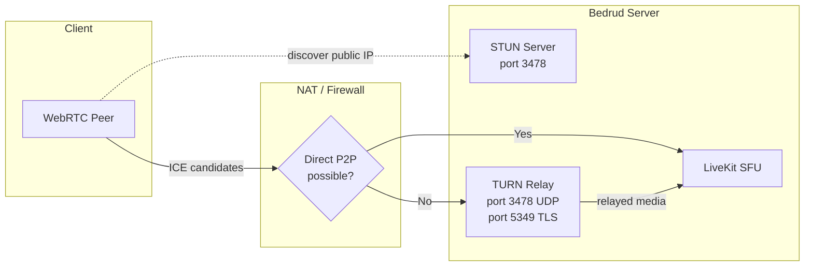
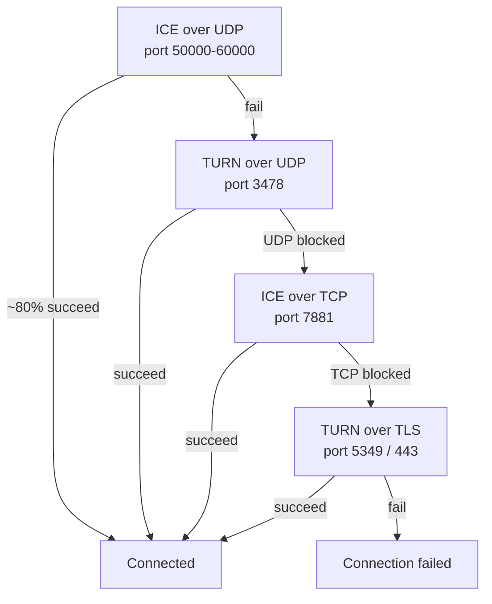
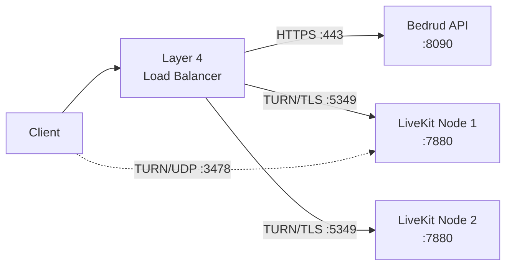
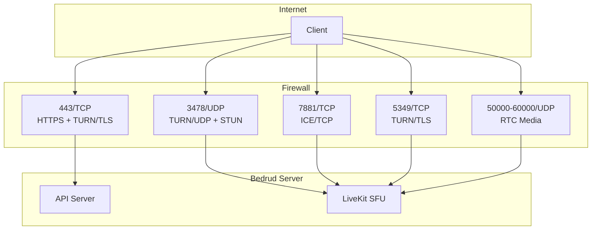

بدرود یک سرور TURN از طریق LiveKit جاسازی می‌کند تا مدیا را برای کلاینت‌های پشت NAT‌های محدود یا فایروال‌ها رله کند. این صفحه معماری، پیکربندی، و عیب‌یابی را پوشش می‌دهد.

---

## TURN چیست

**TURN** (Traversal Using Relays around NAT) یک پروتکل است که بسته‌های مدیا را از طریق سرور ارسال می‌کند وقتی دو نقطه پایانی نمی‌توانند مستقیماً متصل شوند.

**پروتکل‌های مرتبط:**

| پروتکل | نقش | هزینه |
|----------|------|-----|
| **STUN** | کشف IP/پورت عمومی. سبک. | هیچ (سرور فقط درخواست‌های اتصال کوچک را می‌بیند) |
| **ICE** | چارچوب که تمام گزینه‌های اتصال را به ترتیب اولویت امتحان می‌کند. | هیچ (فقط هماهنگی) |
| **TURN** | رله تمام مدیا وقتی مسیر مستقیم شکست می‌خورد. آخرین راه حل. | بالا (پهنای باند سرور = تمام مدیا رله شده) |

برای پشته اتصال کامل به [اتصال WebRTC](/fa/docs/architecture/webrtc-connectivity) ببینید.

---

## TURN در بدرود

LiveKit شامل یک سرور TURN جاسازی‌شده است. هیچ زیرساخت خارجی لازم نیست.

### معماری رله



### اولویت اتصال

LiveKit انواع اتصال را به ترتیب امتحان می‌کند. هر fallback تأخیر و هزینه سرور اضافه می‌کند:



| اولویت | نوع | پورت | سناریوی معمول |
|----------|------|------|-----------------|
| ۱ | ICE/UDP (مستقیم) | ۵۰۰۰۰-۶۰۰۰۰ | اکثر اتصالات. بدون رله. |
| ۲ | TURN/UDP | ۳۴۷۸ | NAT symmetric، P2P مسدود. |
| ۳ | ICE/TCP | ۷۸۸۱ | UDP مسدود (VPN، برخی فایروال‌ها). |
| ۴ | TURN/TLS | ۵۳۴۹ یا ۴۴۳ | فایروال شرکتی، فقط خروجی HTTPS. |

---

## وقتی TURN فعال می‌شود

TURN فعال می‌شود وقتی مسیر مدیا مستقیم شکست می‌خورد. دلایل رایج:

- **NAT symmetric در هر دو طرف** - کلاینت و سرور هر دو NAT symmetric دارند. NAT یک پورت عمومی متفاوت برای هر مقصد تخصیص می‌کند، بنابراین آدرس کشف شده توسط STUN غیرقابل دسترس می‌شود.
- **فایروال شرکتی** - خروجی UDP را به طور کامل مسدود می‌کند. فقط پورت TCP ۴۴۳ مجاز است.
- **محدودیت‌های VPN** - برخی VPN‌ها ترافیک WebRTC را رهگیری یا مسدود می‌کنند.
- **VMهای ابری بدون IP عمومی** - برخی ارائه‌دهندگان ابری از NAT استفاده می‌کنند که ICE مستقیم را می‌شکند.

اکثر کاربران (~۸۰٪) هرگز به TURN برنمی‌خورند. مسیر UDP مستقیم کار می‌کند.

### هزینه پهنای باند

وقتی TURN رله می‌کند، سرور تمام مدیا را برای آن شرکت‌کننده حمل می‌کند. پهنای باند تقریبی در هر جریان:

| نوع جریان | نرخ بیت | برای هر شرکت‌کننده رله شده |
|-------------|---------|-------------------------------|
| صدا (Opus) | ~۳۲ Kbps | ~۳۲ Kbps |
| ویدیو ۷۲۰p (VP8) | ~۱.۵ Mbps | ~۱.۵ Mbps بالا + ۱.۵ Mbps پایین در هر ترک مشترک |
| اشتراک صفحه ۱۰۸۰p | ~۲.۵ Mbps | ~۲.۵ Mbps |

برای یک جلسه ۵ نفره با یک شرکت‌کننده رله شده: سرور ~۱.۵ Mbps اضافه برای رله ویدیوی آن شرکت‌کننده را مدیریت می‌کند. این مقادیر را در تعداد شرکت‌کنندگان رله شده ضرب کنید تا پهنای باند کل سرور را تخمین زنید.

---

## پیکربندی

**فایل:** `server/config/livekit.yaml` (توسعه) یا `/etc/bedrud/livekit.yaml` (تولید)

```yaml
turn:
  enabled: true
  domain: "turn.example.com"
  udp_port: 3478
  tls_port: 5349
  cert_file: /etc/bedrud/turn.crt
  key_file: /etc/bedrud/turn.key
  relay_range_start: 30000
  relay_range_end: 40000
  external_tls: false
```

### مرجع کلید

| کلید | پیش‌فرض | توضیح |
|------|---------|-------|
| `enabled` | `true` | فعال کردن سرور TURN جاسازی‌شده. |
| `domain` | `localhost` | دامنه آگه شده به کلاینت‌ها. باید به IP عمومی سرور حل شود. |
| `udp_port` | `3478` | پورت TURN/UDP. همچنین درخواست‌های اتصال STUN را هنگام فعال بودن TURN سرویس می‌دهد. |
| `tls_port` | `5349` | پورت TURN/TLS. به `443` تنظیم کنید اگر بالانس‌کن بار TLS را خاتمه نمی‌کند. |
| `cert_file` | - | گواهی TLS برای TURN/TLS. مورد نیاز وقتی کلاینت‌های TURN/TLS وجود دارند. |
| `key_file` | - | کلید خصوصی TLS مطابق `cert_file`. |
| `relay_range_start` | `30000` | شروع محدوده پورت UDP استفاده شده برای بسته‌های مدیا رله شده. |
| `relay_range_end` | `40000` | پایان محدوده پورت رله. هر شرکت‌کننده رله شده پورت‌هایی از این محدوده مصرف می‌کند. |
| `external_tls` | `false` | `true` تنظیم کنید وقتی بالانس‌کن بار لایه ۴ TURN/TLS را خاتمه می‌کند. LiveKit TLS خود را روی پورت TURN رد می‌کند. |

### تعامل `use_external_ip`

در همان `livekit.yaml`، در زیر `rtc:`:

```yaml
rtc:
  use_external_ip: true
```

باید `true` باشد تا TURN به درستی کار کند. وقتی `false` است، نامزدهای ICE شامل آدرس‌های IP داخلی (خصوصی) هستند که کلاینت‌ها در اینترنت نمی‌توانند به آنها دسترسی پیدا کنند.

---

## تنظیم TLS تولید

TURN/TLS به گواهی TLS خود نیاز دارد. دو رویکرد:

### دامنه تکی (بدون بالانس‌کن بار)

گواهی TLS سرور را استفاده مجدد کنید. `tls_port` را روی `443` تنظیم کنید:

```yaml
turn:
  enabled: true
  domain: "meet.example.com"
  tls_port: 443
  cert_file: /etc/bedrud/meet.example.com.crt
  key_file: /etc/bedrud/meet.example.com.key
```

دامنه TURN و دامنه سرور یکی هستند. پورت ۴۴۳ هم API HTTPS و هم TURN/TLS را مدیریت می‌کند - LiveKit توسط پروتکل تشخیص می‌دهد.

### دامنه TURN اختصاصی (با بالانس‌کن بار)



```yaml
turn:
  enabled: true
  domain: "turn.example.com"
  tls_port: 5349
  external_tls: true
```

بالانس‌کن بار TLS را خاتمه می‌دهد. `external_tls: true` به LiveKit می‌گوید انتظار ترافیک از پیش رمزگش شده را داشته باشد.

---

## مرجع پورت و فایروال



| پورت | پروتکل | سرویس | مورد نیاز | یادداشت |
|------|----------|---------|-------------|-------|
| ۴۴۳ | TCP | HTTPS + TURN/TLS | بله | API + Web UI. همچنین TURN/TLS اگر `tls_port: 443`. |
| ۳۴۷۸ | UDP | TURN/UDP + STUN | توصیه شده | دو منظوره: اتصال STUN + رله TURN. |
| ۵۳۴۹ | TCP | TURN/TLS | اگر بدون LB | پورت TURN/TLS اختصاصی. اگر از پورت ۴۴۳ استفاده می‌شود رد شوید. |
| ۷۸۸۱ | TCP | ICE/TCP | توصیه شده | Fallback وقتی UDP مسدود است اما TLS لازم نیست. |
| ۵۰۰۰۰-۶۰۰۰۰ | UDP | مدیا RTC | بله | پورت‌های نامزد ICE. هر شرکت‌کننده ۲ پورت استفاده می‌کند. |
| ۷۸۸۰ | TCP | API LiveKit | داخلی | سیگنالینگ WebSocket. در تولید مستقیماً در معرض نمایش نیست. |

### قوانین حداقلی فایروال

برای اتصال پایه:

```
Allow TCP 443    (HTTPS + TURN/TLS)
Allow UDP 3478   (TURN/UDP + STUN)
Allow UDP 50000-60000  (RTC media)
```

برای سازگاری حداکثری (شبکه‌های شرکتی):

```
Also allow TCP 7881  (ICE/TCP)
Also allow TCP 5349  (TURN/TLS, if not using port 443)
```

---

## تست و عیب‌یابی

### مرورگر: chrome://webrtc-internals

۱. `chrome://webrtc-internals` را در Chrome/Edge قبل از پیوستن به جلسه باز کنید.
۲. یک dump ایجاد کنید.
۳. در تب Stats به دنبال **جفت‌های نامزد ICE** بگردید.
۴. انواع نامزد مسیر اتصال را به شما می‌گویند:

| نوع نامزد | معنی |
|-----------|------|
| `host` | IP محلی. رابط مستقیم. |
| `srflx` (بازتابی سرور) | IP عمومی کشف شده توسط STUN. P2P مستقیم کار می‌کند. |
| `relay` | رله TURN فعال. مدیا از طریق سرور می‌رود. |

اگر نامزدهای `relay` را به عنوان جفت فعال می‌بینید، TURN آن اتصال را مدیریت می‌کند.

### رویدادهای SDK کلاینت LiveKit

همه SDKهای LiveKit رویدادهای وضعیت اتصال را صادر می‌کنند:

```typescript
room.on(RoomEvent.Connected, () => {
  console.log("Connected");
});

room.on(RoomEvent.Reconnecting, () => {
  console.log("Connection lost, reconnecting...");
});
```

آمار وضعیت اتصال را در `room.localParticipant.connectionQuality` بررسی کنید.

### لاگ‌های سرور LiveKit

سطح لاگ را به debug در `livekit.yaml` افزایش دهید:

```yaml
logging:
  level: debug
```

به دنبال ورودی‌های لاگ شامل موارد زیر بگردید:
- `ICE` - وضعیت جمع‌آوری نامزد
- `TURN` - رویدادهای تخصیص رله
- `relay` - اتصالات رله فعال

### تست دستی TURN با turnutils

بسته `coturn-utils` را نصب کنید، سپس اتصال TURN را تست کنید:

```bash
turnutils_uclient -t -p 3478 -W devkey -u devkey turn.example.com
```

- `-t` - استفاده از TCP
- `-p` - پورت TURN
- اعتبارنامه‌ها را با مقادیر تولید جایگزین کنید

خروجی موفق آدرس‌های رله تخصیص یافته را نشان می‌دهد.

---

## عیب‌یابی

| علامت | علت احتمالی | رفع |
|--------|--------------|-----|
| کلاینت‌ها نمی‌توانند متصل شوند، تایم‌اوت | پورت‌های TURN توسط فایروال مسدود شده | باز کردن UDP ۳۴۷۸، TCP ۵۳۴۹، UDP ۵۰۰۰۰-۶۰۰۰۰ |
| TURN/TLS شکست می‌خورد | گواهی TLS گم یا ناهمسان | مسیرهای `cert_file`/`key_file` را تأیید کنید. بررسی کنید گواهی با `domain` مطابقت دارد. |
| TURN/TLS با LB شکست می‌خورد | `external_tls` تنظیم نشده است | `external_tls: true` در تنظیمات تنظیم کنید. |
| صدا/ویدیو یک‌طرفه | محدوده پورت رله مسدود شده | باز کردن UDP از `relay_range_start` تا `relay_range_end`. |
| پهنای باند سرور بالا | بسیاری از کلاینت‌های پشت NAT از رله استفاده می‌کنند | مورد انتظار. سرور را مقیاس دهید یا کاربران رله را کاهش دهید. |
| نامزدهای `relay` اما `srflx` مورد انتظار | `use_external_ip: false` | `rtc.use_external_ip: true` را تنظیم کنید. |
| دامنه TURN حل نمی‌شود | DNS پیکربندی اشتباه | `dig +short turn.example.com` باید IP عمومی سرور را برگرداند. |
| کلاینت‌های پشت فایروال شرکتی | فقط پورت ۴۴۳ مجاز است | `turn.tls_port: 443` را تنظیم کنید. اطمینان حاصل کنید گواهی معتبر است. |
| `turn.enabled: true` اما بدون رله | مسیر مستقیم کار می‌کند (خوب) | TURN یک fallback است. بدون رله = بهتر. با `chrome://webrtc-internals` تأیید کنید. |

### چک‌لیست تشخیص سریع

۱. `dig +short <turn.domain>` IP عمومی صحیح را برمی‌گرداند؟
۲. فایروال UDP ۳۴۷۸، TCP ۵۳۴۹، UDP ۵۰۰۰۰-۶۰۰۰۰ را اجازه می‌دهد؟
۳. `tls_port: 443` یا `5349` با قوانین فایروال مطابقت دارد؟
۴. `cert_file` و `key_file` وجود دارند و قابل خواندن هستند؟
۵. CN/SAN گواهی با `turn.domain` مطابقت دارد؟
۶. `rtc.use_external_ip: true` تنظیم شده است؟
۷. لاگ‌های LiveKit هیچ خطای مرتبط با TURN را نشان نمی‌دهند؟

---

## همچنین ببینید

- [اتصال WebRTC](/fa/docs/architecture/webrtc-connectivity) - پشته اتصال کامل STUN/ICE/TURN/SFU
- [یکپارچگی LiveKit](/fa/docs/backend/livekit) - نحوه جاسازی LiveKit در بدرود
- [مرجع پیکربندی](/fa/docs/getting-started/configuration) - تمام گزینه‌های پیکربندی
- [TLS داخلی](/fa/docs/guides/internal-tls) - TLS برای شبکه‌های ایزوله
- [راهنمای استقرار](/fa/docs/guides/deployment) - مراحل استقرار تولید
