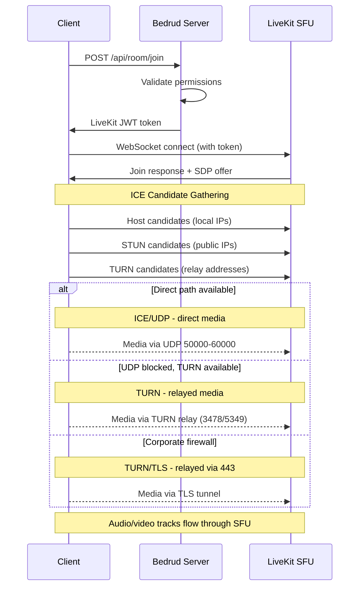
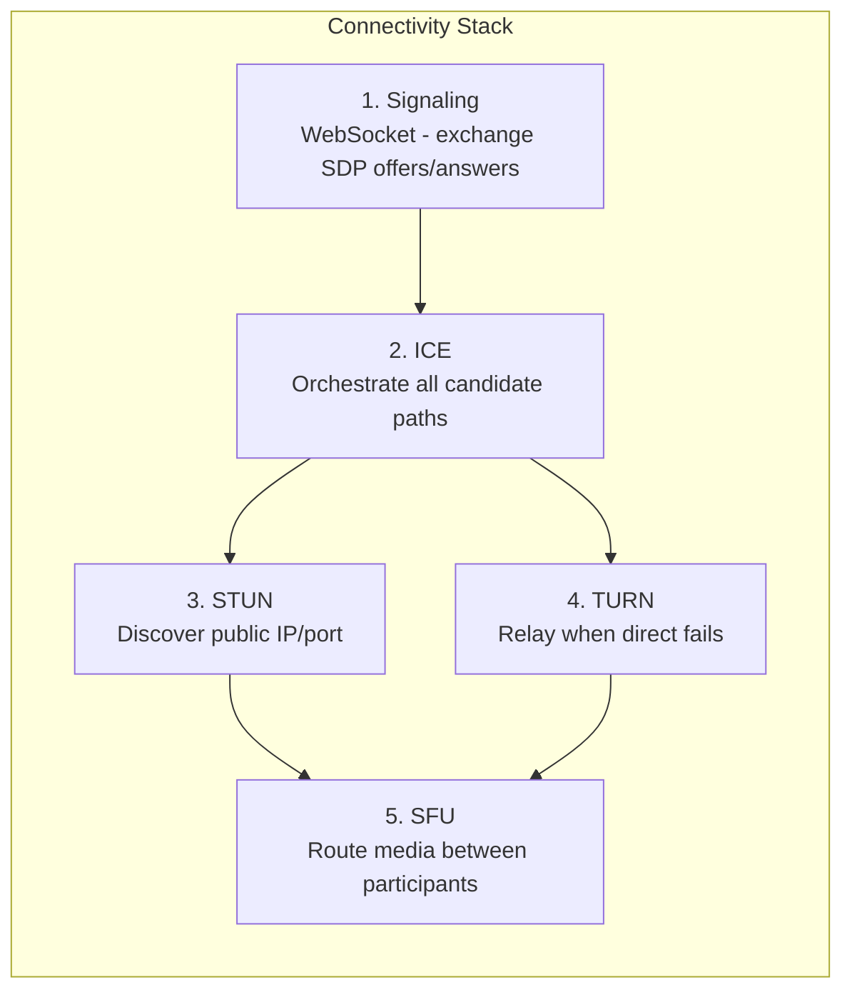
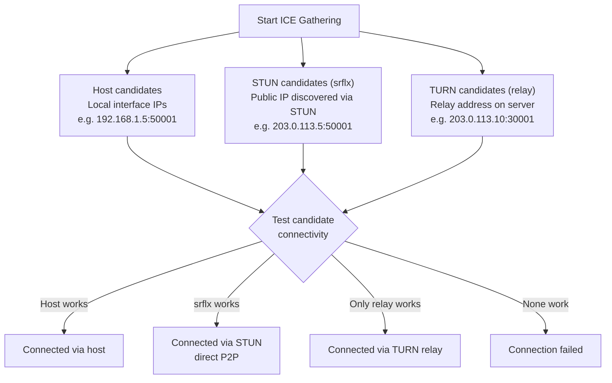
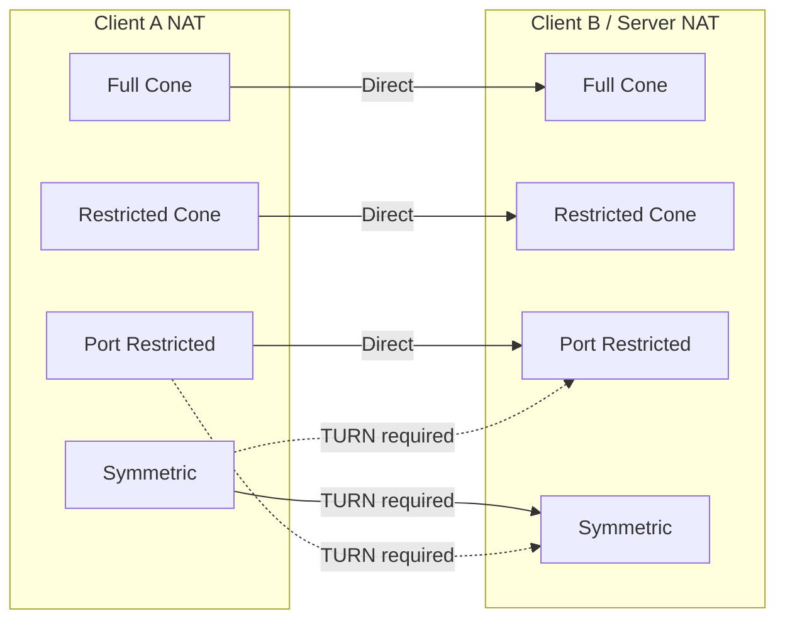

نحوه برقراری اتصالات مدیا زمان واقعی کلاینت‌ها در بدرود. پشته اتصال کامل را پوشش می‌دهد: سیگنالینگ، ICE، STUN، TURN، و مسیر مدیا SFU.

---

## نمای کلی

WebRTC نیاز به یک سری مراحل قبل از جریان صدا و ویدیو بین کلاینت و سرور دارد. بدرود از معماری SFU (واحد ارسال انتخابی) LiveKit استفاده می‌کند - کلاینت‌ها به سرور متصل می‌شوند، نه به همدیگر. **این یعنی فقط مسیر شبکه کلاینت-به-سرور مهم است**، نه اتصال بین شرکت‌کنندگان فردی.



---

## پشته اتصال

پنج لایه با هم کار می‌کنند تا مسیر مدیا را برقرار کنند:



### جزئیات لایه

**۱. سیگنالینگ** - کلاینت و سرور متادیت اتصال را با استفاده از پیشنهادها و پاسخ‌های SDP (پروتکل توضیح جلسه) از طریق WebSocket تبادل می‌کنند. این مدیا نیست - این فاز راه‌اندازی است. بدرود سیگنالینگ را از طریق سرور API به نمونه جاسازی‌شده LiveKit پراکسی می‌کند.

**۲. ICE (ایجاد اتصال تعاملی)** - تمام مسیرهای اتصال ممکن، نامزدها، جمع‌آوری می‌کند و آنها را به ترتیب اولویت تست می‌کند. ICE یک چارچوب است - تلاش‌های اتصال را هماهنگ می‌کند اما خود پروتکل نیست.

**۳. STUN (ابزارهای عبور جلسه برای NAT)** - پروتکل سبک. کلاینت یک درخواست اتصال به سرور STUN می‌فرستد، که با IP و پورت عمومی کلاینت پاسخ می‌دهد. این نامزد "بازتابی سرور" سپس برای اتصال مستقیم تست می‌شود. برای ~۸۰٪ اتصالات کار می‌کند.

**۴. TURN (عبور با استفاده از رله‌ها در اطراف NAT)** - وقتی اتصال مستقیم شکست می‌خورد، TURN یک آدرس رله روی سرور تخصیص می‌دهد. همه بسته‌های مدیا از طریق این رله ارسال می‌شوند. بالاترین هزینه - پهنای باند سرور با کاربران رله شده مقیاس می‌شود. برای پوشش عمیق به [راهنمای سرور TURN](turn-server.mdx) مراجعه کنید.

**۵. SFU (واحد ارسال انتخابی)** - پس از برقراری مسیر حمل، SFU LiveKit مدیا را بین شرکت‌کنندگان مسیریابی می‌کند. هر شرکت‌کننده یک جریان بالا می‌فرستد؛ SFU کپی‌ها را به شرکت‌کنندگان دیگر ارسال می‌کند. این همتا به همتا نیست - سرور همیشه در مسیر است.

---

## جمع‌آوری نامزد ICE



ICE سه نوع نامزد را همزمان جمع‌آوری می‌کند:

| نوع | منبع | اولویت | نحوه کارکرد |
|------|--------|---------|-------------|
| **host** | رابط‌های شبکه محلی | بالاترین | IP مستقیم از ماشین. روی LAN کار می‌کند. |
| **srflx** (بازتابی سرور) | پاسخ سرور STUN | متوسط | IP عمومی کشف شده از طریق STUN. برای اکثر انواع NAT کار می‌کند. |
| **relay** | تخصیص سرور TURN | پایین‌ترین | آدرس روی سرور TURN. همیشه کار می‌کند. بالاترین هزینه. |

ICE همه نامزدها را تست می‌کند و بالاترین جفت موفق را انتخاب می‌کند. اگر `srflx` کار کند، `relay` را رد می‌کند.

---

## انواع NAT و اتصال

انواع مختلف NAT بر روی اینکه آیا اتصال مستقیم کار می‌کند تأثیر می‌گذارند:



| نوع NAT | توضیح | P2P مستقیم | نیاز به TURN |
|----------|-------|-------------|---------------|
| **Full Cone** | تمام درخواست‌ها از همان IP/پورت داخلی به همان IP/پورت عمومی نگاشت می‌شوند. هر میزبان بیرونی می‌تواند به آن ارسال کند. | بله | خیر |
| **Restricted Cone** | نگاشت مشابه Full Cone، اما فقط میزبان‌های بیرونی که بسته دریافت کرده‌اند می‌توانند پاسخ دهند. | معمولاً | خیر |
| **Port Restricted Cone** | شبیه Restricted Cone، اما NAT همچنین شماره پورت بیرونی را محدود می‌کند. رایج‌ترین نوع روتر خانگی. | معمولاً | به ندرت |
| **Symmetric** | نگاشت IP/پورت عمومی متفاوت برای هر مقصد. آدرس کشف شده توسط STUN قابل استفاده مجدد نیست. | خیر (وقتی هر دو symmetric) | **بله** |

**بینش کلیدی:** از آنجا که سرور IP عمومی و محدوده پورت قابل پیش‌بینی دارد، اکثر انواع NAT به طور مستقیم کار می‌کنند. TURN عمدتاً زمانی لازم است که فایروال کلاینت خروجی UDP را به طور کامل مسدود کند.

---

## خلاصه پیکربندی

چه کلیدهای پیکربندی Bedrud/LiveKit بر اتصال WebRTC تأثیر می‌گذارند:

**کلیدهای `livekit.yaml`:**

```yaml
rtc:
  port_range_start: 50000       # شروع محدوده پورت مدیا UDP
  port_range_end: 60000         # پایان محدوده پورت مدیا UDP
  tcp_port: 7881                # پورت فallback ICE/TCP
  stun_servers:                 # سرورهای STUN خارجی (اختیاری)
    - stun:stun.l.google.com:19302
  use_external_ip: true         # Advertise public IP in ICE candidates

turn:
  enabled: true                 # فعال کردن TURN جاسازی‌شده
  domain: "turn.example.com"    # دامنه TURN (DNS باید حل شود)
  udp_port: 3478                # پورت TURN/UDP + STUN
  tls_port: 5349                # پورت TURN/TLS (یا 443)
  cert_file: /path/to/turn.crt  # گواهی TLS برای TURN/TLS
  key_file: /path/to/turn.key   # کلید TLS برای TURN/TLS
  relay_range_start: 30000      # شروع محدوده پورت رله
  relay_range_end: 40000        # پایان محدوده پورت رله
  external_tls: false           # L4 LB خاتمه TLS را انجام می‌دهد
```

**کلیدهای `config.yaml` (سرور Bedrud):**

```yaml
server:
  port: 8090                    # پورت API (سیگنالینگ از طریق این پراکسی می‌شود)
  enableTLS: true               # HTTPS برای سیگنالینگ
  domain: "meet.example.com"    # دامنه عمومی
```

### عیب‌یابی مشکلات اتصال

| علامت | بررسی |
|--------|-------|
| اصلاً نمی‌تواند متصل شود | `rtc.use_external_ip: true`؟ فایروال باز در ۴۴۳ + محدوده UDP؟ |
| متصل می‌شود اما صدا/ویدیو ندارد | UDP ۵۰۰۰۰-۶۰۰۰۰ مسدود است؟ نامزدهای ICE را در مرورگر بررسی کنید. |
| اتصال کند | رله TURN فعال است (نامزدها را بررسی کنید). مورد انتظار اگر کلاینت پشت NAT سختگیر باشد. |
| شکست خورد پشت شبکه شرکتی | TURN/TLS پیکربندی نشده است. `turn.tls_port: 443` را با گواهی معتبر تنظیم کنید. |
| روی LAN کار می‌کند، از راه شکست می‌خورد | IP عمومی آگه نشده است. `rtc.use_external_ip: true` را تنظیم کنید. |

برای عیب‌یابی عمیق TURN، به [راهنمای سرور TURN](/fa/docs/architecture/turn-server) مراجعه کنید.

---

## همچنین ببینید

- [راهنمای سرور TURN](/fa/docs/architecture/turn-server) - معماری، پیکربندی، TLS، عیب‌یابی TURN
- [یکپارچگی LiveKit](/fa/docs/backend/livekit) - نحوه جاسازی LiveKit در بدرود
- [نمای کلی معماری](/fa/docs/architecture/overview) - معماری کامل سیستم
- [TLS داخلی](/fa/docs/guides/internal-tls) - TLS برای شبکه‌های ایزوله
