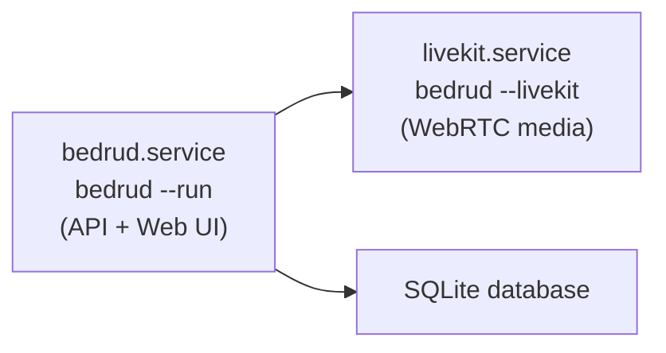

Bedrud برای اجرا به عنوان یک appliance مستقل برای جلسات ویدیویی طراحی شده است. یک فایل اجرایی باینری همه چیز مورد نیاز را بسته‌بندی می‌کند - فرانت‌اند، بک‌اند و media server LiveKit.

## ویژگی‌های کلیدی

| ویژگی | توضیحات |
|---------|-------------|
| بدون وابستگی خارجی | نیازی به Node.js، Redis یا media server جداگانه نیست |
| media server جاسازی‌شده | باینری LiveKit شامل و به صورت خودکار مدیریت می‌شود |
| فرانت‌اند جاسازی‌شده | UI React کامپایل و SSR از پیش رندرشده در باینری Go |
| ذخیره‌سازی SQLite | نیازی به سرور دیتابیس نیست |
| TLS داخلی | self-signed certificates یا Let's Encrypt |
| نصب‌کننده داخلی | پیکربندی systemd، دایرکتوری‌ها و تنظیمات |

## اجرای باینری

### شروع سرور Bedrud

```bash
./bedrud --run --config config.yaml
```

### شروع media server LiveKit

```bash
./bedrud --livekit --config livekit.yaml
```

باینری شامل هر دو سرور API و media server است. از فلگ‌ها برای انتخاب کدام‌یک را شروع کنید استفاده کنید.

## نصب

### نصب سریع (Debian/Ubuntu)

```bash
# با TLS Let's Encrypt
sudo ./bedrud install --tls --domain meet.example.com --email admin@example.com

# با self-signed certificate
sudo ./bedrud install --tls --ip 1.2.3.4

# HTTP ساده (فقط توسعه)
sudo ./bedrud install --ip 1.2.3.4
```

<InstallerSteps />

### معماری سرویس

پس از نصب، دو سرویس systemd اجرا می‌شوند:



## فایل‌های پیکربندی

| فایل | هدف |
|------|---------|
| `/etc/bedrud/config.yaml` | پیکربندی اصلی سرور |
| `/etc/bedrud/livekit.yaml` | پیکربندی media server |
| `/var/lib/bedrud/bedrud.db` | دیتابیس SQLite |
| `/var/log/bedrud/bedrud.log` | لاگ‌های برنامه |

به [مرجع پیکربندی](/fa/docs/getting-started/configuration) برای همه گزینه‌ها ببینید.

## پس از نصب

### ایجاد اولین مدیر خود

<CreateAdmin />

### بررسی وضعیت سرویس

```bash
systemctl status bedrud livekit
```

### مشاهده لاگ‌ها

```bash
tail -f /var/log/bedrud/bedrud.log
journalctl -u bedrud -f
```

## حذف نصب

```bash
sudo ./bedrud uninstall
```

این به طور کامل حذف می‌کند:

- فایل‌های سرویس systemd
- باینری از `/usr/local/bin/`
- پیکربندی در `/etc/bedrud/`
- داده‌ها در `/var/lib/bedrud/`
- لاگ‌ها در `/var/log/bedrud`
