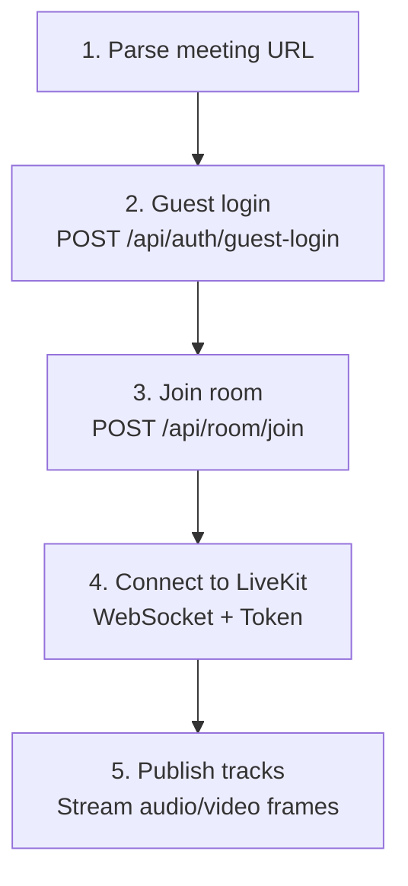
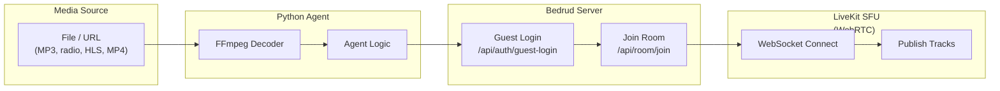

Bedrud inclut des agents bot basés sur Python qui peuvent rejoindre des meeting rooms et stream media content. Ces bots sont utiles pour background music, radio streams, ou sharing video content.

## Available Agents

| Agent | Description | Media Type |
|-------|-------------|-----------|
| `music_agent` | Plays audio files into a room | Audio (PCM) |
| `radio_agent` | Streams internet radio stations | Audio (PCM via FFmpeg) |
| `video_stream_agent` | Shares video content (HLS, MP4) | Video + Audio |

## How Agents Work

Tous les agents suivent le même connection pattern :





## Music Agent

Lit des fichiers audio (MP3, WAV, etc.) dans une meeting room.

### Setup

```bash
cd agents/music_agent
pip install -r requirements.txt
```

**Dependencies :** `httpx`, `livekit`, `pydub`

### Usage

```bash
python agent.py "https://meet.example.com/m/room-name"
```

### How It Works

1. Décode les fichiers audio en utilisant `pydub`
2. Convertit en PCM frames
3. Publie les audio frames vers LiveKit comme microphone track

> Voir [Music Agent README](https://github.com/bedrud-ir/bedrud/tree/main/agents/music_agent) pour les setup et usage instructions.

---

## Radio Agent

Streams des internet radio stations dans une meeting room en utilisant FFmpeg pour audio decoding.

### Setup

```bash
cd agents/radio_agent
pip install -r requirements.txt
```

**Dependencies :** `httpx`, `livekit`

**System requirement :** FFmpeg doit être installé (`brew install ffmpeg` ou `apt install ffmpeg`)

### Usage

```bash
python agent.py "https://meet.example.com/m/room-name"
```

### How It Works

1. Se connecte à une radio stream URL
2. Pipes le stream à travers FFmpeg pour decoder en raw PCM
3. Publie les PCM audio frames vers LiveKit

> Voir [Radio Agent README](https://github.com/bedrud-ir/bedrud/tree/main/agents/radio_agent) pour les setup et usage instructions.

---

## Video Stream Agent

Shares video et audio depuis une URL (HLS/m3u8, MP4) dans une meeting room.

### Setup

```bash
cd agents/video_stream_agent
pip install -r requirements.txt
```

**Dependencies :** `httpx`, `livekit`

**System requirement :** FFmpeg doit être installé

### Usage

```bash
python agent.py "https://meet.example.com/m/room-name"
```

### How It Works

1. Runs deux FFmpeg processes en parallèle :
    - **Video :** Décode en YUV420p raw frames (1280x720 @ 30fps)
    - **Audio :** Décode en PCM samples
2. Publie la vidéo comme screen share track
3. Publie l'audio comme microphone track

> Voir [Video Stream Agent README](https://github.com/bedrud-ir/bedrud/tree/main/agents/video_stream_agent) pour les setup et usage instructions.

### Video Specifications

| Setting | Value |
|---------|-------|
| Width | 1280 |
| Height | 720 |
| FPS | 30 |
| Pixel Format | YUV420p |

---

## Writing a Custom Agent

Pour créer un nouvel agent, suivez ce pattern :

```python
import httpx
from livekit import rtc

# 1. Parse la meeting URL pour extraire le room name
room_name = parse_url(meeting_url)

# 2. Guest login
client = httpx.Client(base_url=server_url)
resp = client.post("/api/auth/guest-login", json={"name": "Bot Name"})
token = resp.json()["token"]

# 3. Join room
client.headers["Authorization"] = f"Bearer {token}"
resp = client.post("/api/room/join", json={"roomName": room_name})
lk_token = resp.json()["token"]

# 4. Connect to LiveKit
room = rtc.Room()
await room.connect(livekit_url, lk_token)

# 5. Publish tracks
source = rtc.AudioSource(sample_rate=48000, num_channels=1)
track = rtc.LocalAudioTrack.create_audio_track("audio", source)
await room.local_participant.publish_track(track)

# 6. Stream frames
while has_data:
    frame = get_next_frame()
    await source.capture_frame(frame)
```

---

## See also

- [Music Agent README](https://github.com/bedrud-ir/bedrud/tree/main/agents/music_agent) - setup et usage
- [Radio Agent README](https://github.com/bedrud-ir/bedrud/tree/main/agents/radio_agent) - setup et usage
- [Video Stream Agent README](https://github.com/bedrud-ir/bedrud/tree/main/agents/video_stream_agent) - setup et usage
