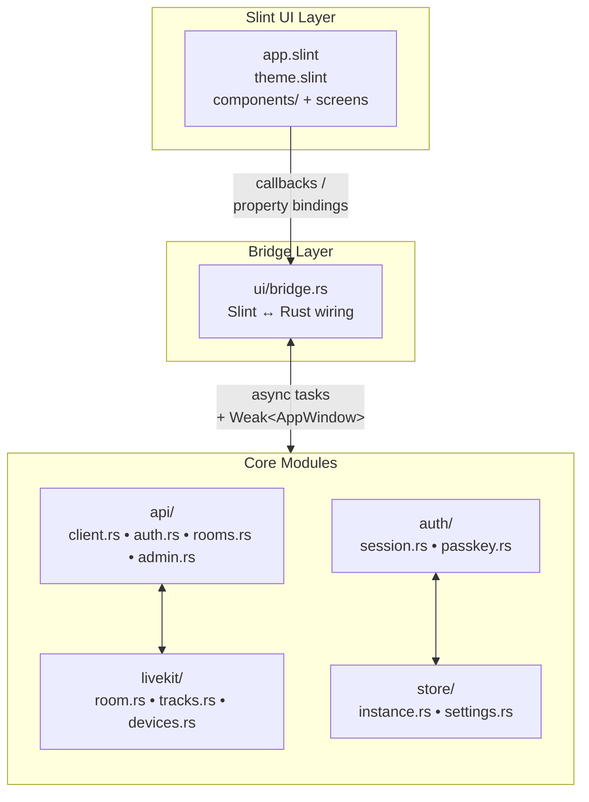

Le client de bureau Bedrud est une application native Windows et Linux construite avec **Rust** et le **Slint** UI toolkit. Elle offre la même core meeting experience que les web et mobile clients, compilée en un seul binaire sans runtime dependencies.

## Technology Stack

| Component | Technology |
|-----------|-----------|
| Language | Rust (stable) |
| UI toolkit | Slint 1.x |
| HTTP client | reqwest (async, TLS) |
| Media | LiveKit Rust SDK |
| Storage | serde_json + OS keyring (libsecret / Windows Credential Store) |
| Build system | Cargo workspace |

## Platform Support

| Platform | Renderer | Binary |
|----------|----------|--------|
| Windows 10/11 | Direct3D 11 | `bedrud-desktop.exe` |
| Linux x86_64 | OpenGL / Vulkan (via EGL/Wayland/X11) | `bedrud-desktop` |
| macOS | _(pas encore - utiliser l'app web)_ | - |

## Source Layout

```
apps/desktop/
├── Cargo.toml              # Crate definition
├── build.rs                # Slint compile step
├── src/
│   ├── main.rs             # Entry point - initialises app + event loop
│   ├── app.rs              # Top-level AppState et startup logic
│   ├── api/
│   │   ├── client.rs       # Shared HTTP client (base URL, JWT injection)
│   │   ├── auth.rs         # Login, register, refresh
│   │   ├── rooms.rs        # Room list, join, create
│   │   └── admin.rs        # Admin endpoints
│   ├── auth/
│   │   ├── session.rs      # JWT storage et refresh loop
│   │   └── passkey.rs      # FIDO2 passkey stub
│   ├── livekit/
│   │   ├── room.rs         # Room connection lifecycle
│   │   ├── tracks.rs       # Audio/video track management
│   │   └── devices.rs      | Microphone / camera enumeration
│   ├── store/
│   │   ├── instance.rs     # Multi-instance persistence
│   │   └── settings.rs     # User preferences
│   └── ui/
│       ├── mod.rs
│       └── bridge.rs       # Slint ↔ Rust callback wiring
└── ui/
    ├── app.slint            # Root component, page router
    ├── theme.slint          # Colours, typography, spacing tokens
    ├── components/          # Button, Input, Card, Avatar
    ├── auth/                # Login et Register screens
    ├── dashboard/           # Room list, Create-room dialog
    ├── meeting/             # Controls bar, participant tiles, chat
    ├── admin/               # Admin panel, user table
    └── settings.slint       # Settings screen
```

## Architecture



### Key design decisions

- **Slint's compile-time UI** - Les fichiers `.slint` sont compilés en Rust au build time via `build.rs`. Il n'y a pas de layout engine au runtime ; l'UI est entièrement native.
- **`bridge.rs` as the only UI↔logic boundary** - tous les Slint callbacks sont wired en un seul endroit, gardant la business logic hors de la UI layer et rendant le bridge facile à auditer.
- **`Weak<AppWindow>` in callbacks** - Les Slint UI handles sont `!Send`, donc les background tasks upgrade un stored `Weak` reference sur le UI thread pour set properties, plutôt que de partager le handle entre les threads.
- **Multi-instance via `store/instance.rs`** - identique aux mobile apps : les instances sont serialisées dans un fichier JSON dans le OS config directory ; chaque instance a son propre `APIClient` et `AuthSession`.

## Building Locally

### Prerequisites

- Rust stable toolchain (`rustup toolchain install stable`)
- **Linux :** `libfontconfig`, `libxkbcommon`, `libwayland`, `libgles2`, `libdbus`, `libsecret`

  ```bash
  sudo apt-get install -y \
    libfontconfig1-dev libxkbcommon-dev libxkbcommon-x11-dev \
    libwayland-dev libgles2-mesa-dev libegl1-mesa-dev \
    libdbus-1-dev libsecret-1-dev \
    libasound2-dev
  ```

- **Windows :** Visual Studio Build Tools (MSVC) avec la C++ workload

### Build

```bash
# Debug build (fast compile, no optimisations)
make dev-desktop          # runs l'app immédiatement après le build

# Release build
make build-desktop        # → target/release/bedrud-desktop (Linux)
                           # → target/release/bedrud-desktop.exe (Windows)
```

Ou directement avec Cargo :

```bash
cargo build -p bedrud-desktop                          # debug
cargo build -p bedrud-desktop --release                # optimisé
cargo run   -p bedrud-desktop                          # run immédiatement
```

## CI

L'application desktop est built en CI sur chaque push vers `main` et sur les pull requests :

| Job | Runner | Ce qu'elle vérifie |
|-----|--------|----------------|
| `Desktop – Build & Test` | `ubuntu-latest` | `cargo build`, `cargo test` |

Les release builds produisent deux artefacts :

| Artefact | Runner | Format |
|----------|--------|--------|
| `bedrud-desktop-linux-x86_64.tar.xz` | `ubuntu-latest` | tar.xz |
| `bedrud-desktop-windows-x86_64.zip` | `windows-latest` | zip |
