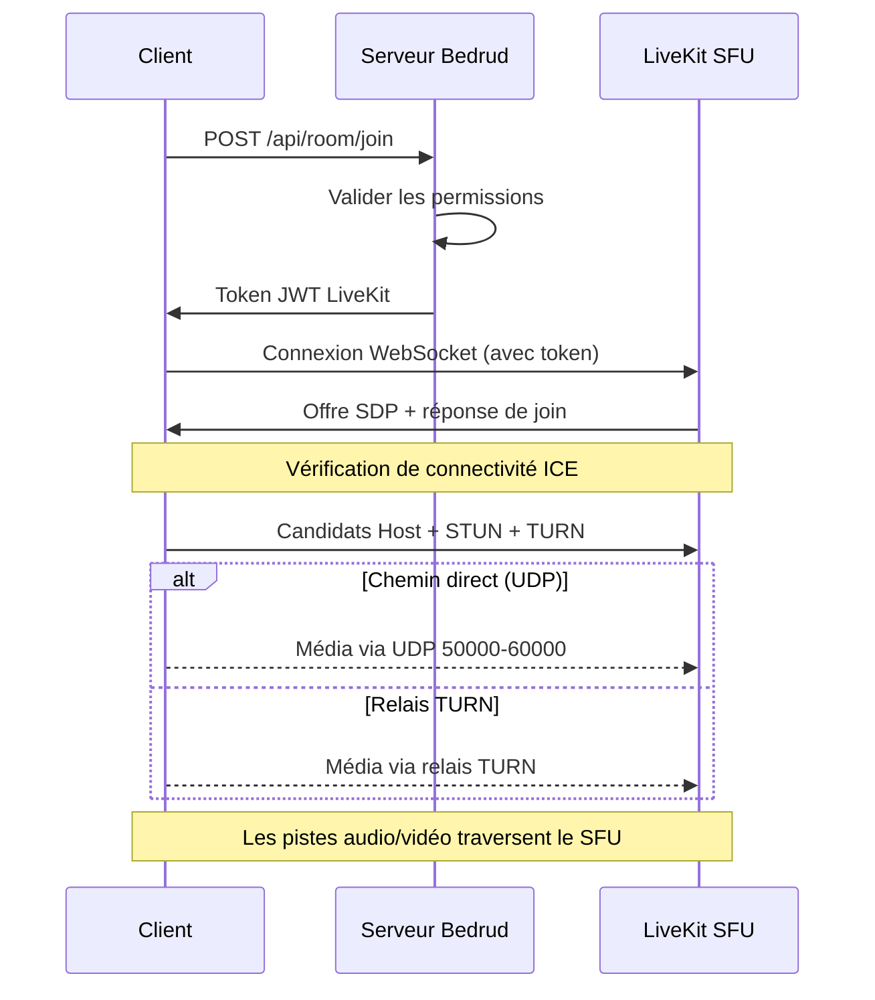

Bedrud est un monorepo contenant un serveur Go, trois applications clientes, des agents bot Python et des packages partagés. Cette page décrit comment les composants sont liés les uns aux autres.

## Diagramme de Haut Niveau

```
┌──────────────────────────────────────────────────────────────┐
│                          Clients                             │
│                                                              │
│  ┌─────────┐  ┌──────────┐  ┌────────┐  ┌───────────────┐   │
│  │  Web    │  │ Android  │  │  iOS   │  │ Desktop       │   │
│  │ React   │  │ Compose  │  │SwiftUI │  │ Rust + Slint  │   │
│  └────┬────┘  └────┬─────┘  └───┬────┘  └──────┬────────┘   │
│       │            │            │              │             │
│       └────────────┼────────────┼──────────────┘             │
│                    │                                         │
│               API REST + WebSocket                          │
└────────────────────┼────────────────────────────────────────┘
                           │
┌────────────────────────┼────────────────────────────────┐
│                   Serveur Bedrud                         │
│                        │                                │
│  ┌─────────────────────┴──────────────────────────┐     │
│  │              Routeur HTTP Fiber                │     │
│  │  /api/auth/*  /api/room/*  /api/admin/*        │     │
│  └──────────┬─────────────────────┬───────────────┘     │
│             │                     │                     │
│  ┌──────────┴──────────┐  ┌──────┴────────────────┐     │
│  │   GORM / SQLite     │  │  LiveKit Protocol SDK │     │
│  │   (ou PostgreSQL)   │  │  (génération de token,│     │
│  │                     │  │   gestion des salles) │     │
│  └─────────────────────┘  └──────────┬────────────┘     │
│                                      │                  │
│                           ┌──────────┴────────────┐     │
│                           │  Serveur LiveKit      │     │
│                           │  Intégré (Média WebRTC) │     │
│                           └───────────────────────┘     │
└─────────────────────────────────────────────────────────┘
```

## Composants

### Serveur (`server/`)

Le backend Go est le cœur de Bedrud. Il gère :

- **API REST** - authentification, gestion des salles, opérations admin
- **Service de fichiers statiques** - le frontend web compilé est intégré via `//go:embed`
- **Intégration LiveKit** - génère des tokens et gère les salles via le LiveKit Protocol SDK
- **Serveur LiveKit intégré** - le binaire du serveur média s'exécute comme processus enfant

Le serveur utilise le framework web **Fiber** (similaire à Express.js dans Node.js) et **GORM** comme couche ORM. Il prend en charge SQLite pour le développement et PostgreSQL pour la production.

Consultez [Architecture du Serveur](/fr/docs/architecture/server) pour les détails.

### Frontend Web (`apps/web/`)

Une application **React** construite avec TanStack Start, TailwindCSS v4 et shadcn/ui. En production, elle est pré-rendue sur le serveur et les assets client sont intégrés dans le binaire Go.

Capacités principales :

- Interface de réunion vidéo avec LiveKit Client SDK
- Authentification JWT avec rafraîchissement automatique des tokens
- Dashboard admin pour la gestion des utilisateurs et des salles
- Système de design avec une bibliothèque de composants cohérente

Consultez [Frontend Web](/fr/docs/architecture/web) pour les détails.

### Application Android (`apps/android/`)

Une application Android native construite avec **Jetpack Compose** et **Kotlin**. Utilise Koin pour l'injection de dépendances et Retrofit pour HTTP.

Capacités principales :

- Expérience complète de réunion vidéo avec LiveKit Android SDK
- Mode picture-in-picture
- Gestion des liens profonds (`bedrud.com/m/*` et `bedrud.com/c/*`)
- Gestion des appels avec ConnectionService d'Android
- Prise en charge multi-instance (connexion à plusieurs serveurs)

Consultez [Application Android](/fr/docs/architecture/android) pour les détails.

### Application iOS (`apps/ios/`)

Une application iOS native construite avec **SwiftUI**. Utilise KeychainAccess pour le stockage sécurisé des identifiants et LiveKit Swift SDK pour le média.

Capacités principales :

- Expérience complète de réunion vidéo
- Prise en charge multi-instance
- Gestion des liens profonds
- Stockage sécurisé basé sur le trousseau

Consultez [Application iOS](/fr/docs/architecture/ios) pour les détails.

### Application Desktop (`apps/desktop/`)

Une application de bureau native Windows et Linux construite avec **Rust** et le toolkit UI **Slint**. Compile en un seul binaire sans dépendances d'exécution.

Capacités principales :

- Expérience complète de réunion vidéo via LiveKit Rust SDK
- Rendu natif Windows (Direct3D 11) et Linux (OpenGL/Vulkan)
- Prise en charge multi-instance (connexion à plusieurs serveurs Bedrud)
- Intégration keyring OS pour le stockage sécurisé des identifiants

Consultez [Application Desktop](/fr/docs/architecture/desktop) pour les détails.

### Agents Bot (`agents/`)

Scripts Python qui rejoignent les salles de réunion comme bots et diffusent du contenu multimédia :

- **Agent Musique** - lit des fichiers audio
- **Agent Radio** - diffuse des stations de radio internet
- **Agent Flux Vidéo** - partage du contenu vidéo (HLS, MP4)

Consultez [Agents Bot](/fr/docs/architecture/agents) pour les détails.

## Flux d'Authentification

```
Client                    Serveur                    Base de données
  │                         │                          │
  ├─POST /api/auth/login───►│                          │
  │                         ├──vérifier les identifiants───►│
  │                         │◄─────────────────────────┤
  │◄──access + refresh JWT──┤                          │
  │                         │                          │
  ├─GET /api/room/list──────►│  (en-tête Authorization)  │
  │  (Bearer <access_token>)│                          │
  │◄──liste des salles───────┤                          │
```

Toutes les requêtes authentifiées utilisent des tokens JWT dans l'en-tête `Authorization`. Le wrapper `authFetch` du frontend web gère l'attachement des tokens et le rafraîchissement automatique.

Méthodes d'authentification prises en charge :

| Méthode | Endpoint | Description |
|---------|----------|-------------|
| Email/Mot de passe | `POST /api/auth/login` | Identifiants traditionnels |
| Inscription | `POST /api/auth/register` | Création de nouveau compte |
| Invité | `POST /api/auth/guest-login` | Accès temporaire avec juste un nom |
| OAuth | `GET /api/auth/:provider/login` | Google, GitHub, Twitter |
| Clés de passe | `POST /api/auth/passkey/*` | Biométrie FIDO2/WebAuthn |

## Flux de Connexion de Réunion



1. Le client demande à rejoindre une salle via l'API REST
2. Le serveur valide les permissions et génère un token LiveKit signé
3. Le client se connecte directement à LiveKit via WebSocket en utilisant le token
4. ICE rassemble les candidats (host, STUN, TURN) et sélectionne le meilleur chemin
5. Les pistes audio/vidéo traversent le SFU de LiveKit

Consultez [Connectivité WebRTC](/fr/docs/architecture/webrtc-connectivity) pour la pile complète de connectivité.

## Modèle de Données

### Utilisateur

| Champ | Type | Description |
|-------|------|-------------|
| ID | uint | Clé primaire |
| Email | string | Adresse email unique |
| Name | string | Nom d'affichage |
| Password | string | Mot de passe haché (vide pour OAuth/invité) |
| Avatar | string | URL de l'avatar |
| Provider | string | Fournisseur d'auth (`local`, `google`, `github`, `twitter`, `guest`) |
| Role | string | `user` ou `admin` |

### Salle

| Champ | Type | Description |
|-------|------|-------------|
| ID | uint | Clé primaire |
| AdminID | uint | Clé étrangère → User.ID (créateur de la salle) |
| Name | string | Nom de la salle / slug d'URL |
| IsPublic | bool | Si les invités peuvent rejoindre sans invitation |
| ChatEnabled | bool | Si le chat dans la salle est actif |
| VideoEnabled | bool | Si la vidéo est autorisée |
| Participants | []User | Utilisateurs actuellement dans la salle |

### Clé de Passe

| Champ | Type | Description |
|-------|------|-------------|
| ID | uint | Clé primaire |
| UserID | uint | Clé étrangère → User.ID |
| CredentialID | []byte | ID d'identifiant WebAuthn |
| PublicKey | []byte | Clé publique WebAuthn |
| Counter | uint32 | Compteur de signature WebAuthn |

### RefreshToken

| Champ | Type | Description |
|-------|------|-------------|
| Token | string | La chaîne du token de rafraîchissement |
| UserID | uint | Clé étrangère → User.ID |
| ExpiresAt | time | Horodatage d'expiration du token |

## Architecture de Déploiement

En production, Bedrud s'exécute comme deux services systemd :

| Service | Binaire | Utilisation |
|---------|---------|-------------|
| `bedrud.service` | `bedrud --run` | Serveur API + frontend web intégré |
| `livekit.service` | `bedrud --livekit` | Serveur média WebRTC |

Les deux sont gérés par un seul binaire. Traefik ou un autre reverse proxy gère la terminaison TLS et route le trafic.

Consultez [Guide de Déploiement](/fr/docs/guides/deployment) pour les instructions de configuration.

## Termes Clés

Ces termes apparaissent dans toute la documentation de l'architecture :

| Terme | Nom Complet | Signification |
|-------|-------------|---------------|
| **SFU** | Selective Forwarding Unit | Un serveur média qui reçoit les flux de chaque participant et les renvoie aux autres. Les clients se connectent au serveur, pas les uns aux autres. |
| **SDP** | Session Description Protocol | Le format utilisé pour décrire les paramètres de connexion WebRTC (codecs, résolutions, types de média). |
| **ICE** | Interactive Connectivity Establishment | Un framework qui rassemble tous les chemins réseau possibles entre client et serveur, puis sélectionne le meilleur. |
| **STUN** | Session Traversal Utilities for NAT | Un protocole léger qui aide un client à découvrir son adresse IP publique. Fonctionne pour la plupart des connexions. |
| **TURN** | Traversal Using Relays around NAT | Un protocole qui relaie tout le média via le serveur lorsqu'une connexion directe n'est pas possible. Dernier recours, coût le plus élevé en bande passante. |
| **NAT** | Network Address Translation | Une fonctionnalité de routeur qui mappe les adresses internes privées à une adresse publique. Peut bloquer les connexions WebRTC directes selon le type. |
| **srflx** | Server Reflexive | Un type de candidat ICE représentant l'IP publique du client, découvert via STUN. |
| **WebRTC** | Web Real-Time Communication | La standard API navigateur et mobile pour le transfert audio, vidéo et de données en temps réel. |

## Voir Aussi

- [Connectivité WebRTC](/fr/docs/architecture/webrtc-connectivity) - pile complète de connectivité STUN/ICE/TURN/SFU
- [Guide du Serveur TURN](/fr/docs/architecture/turn-server) - architecture et configuration du relais TURN
- [Intégration LiveKit](/fr/docs/backend/livekit) - comment Bedrud intègre LiveKit
