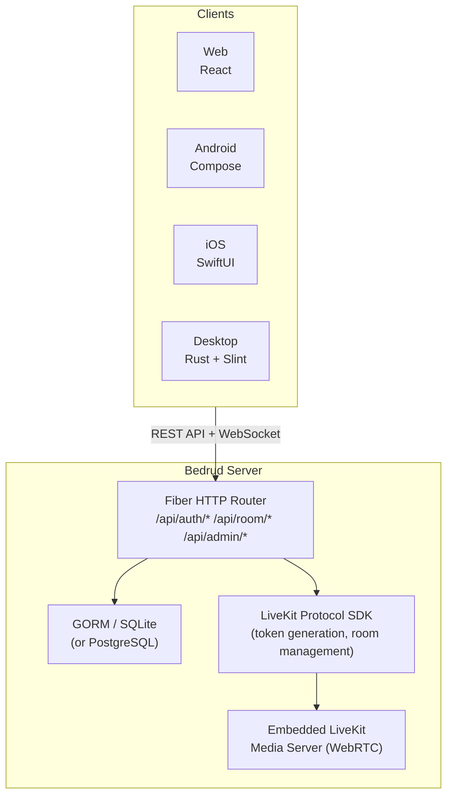
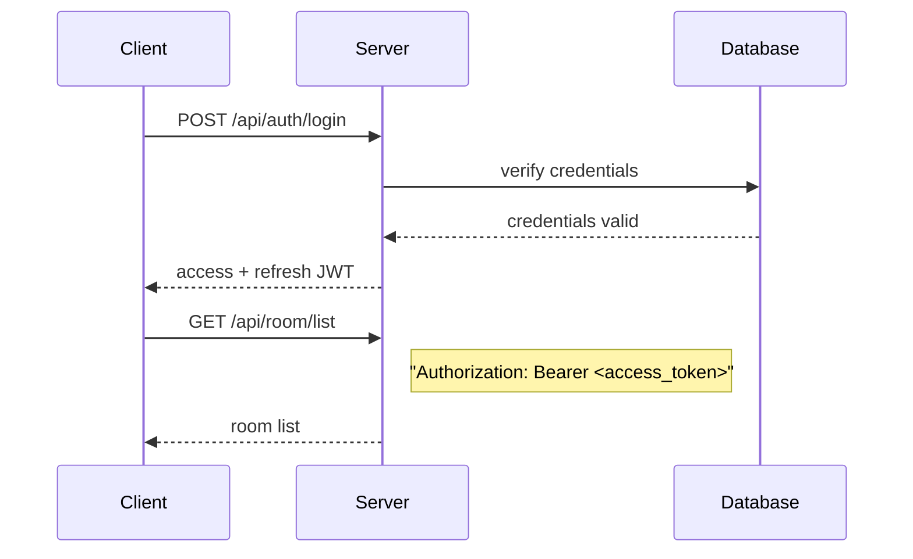
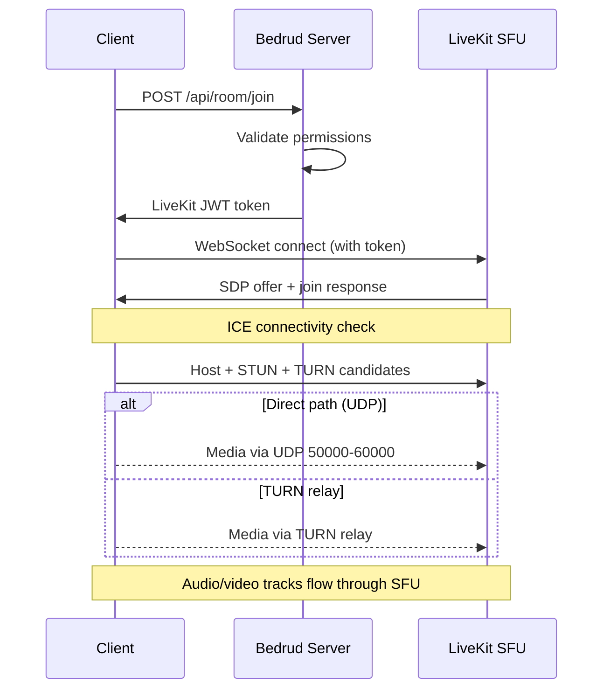

Bedrud est un monorepo contenant un serveur Go, trois applications client, des agents bot Python et des packages partagés. Cette page décrit comment les composants sont liés entre eux.

## Diagramme de haut niveau

## Composants

### Serveur (`server/`)

Le backend Go est le cœur de Bedrud. Il gère :

- **REST API** - authentification, gestion des salles, opérations d'administration
- **Static file serving** - le frontend web compilé est intégré via `//go:embed`
- **Intégration LiveKit** - génère des tokens et gère les salles via le LiveKit Protocol SDK
- **Embedded LiveKit server** - le binaire du serveur média s'exécute en tant que processus enfant

Le serveur utilise le framework web **Fiber** (similaire à Express.js dans Node.js) et **GORM** comme couche ORM. Il prend en charge SQLite pour le développement et PostgreSQL pour la production.

Voir [Architecture du serveur](/fr/docs/architecture/server) pour plus de détails.

### Web Frontend (`apps/web/`)

Une application **React** construite avec TanStack Start, TailwindCSS v4 et shadcn/ui. En production, elle est pré-rendue sur le serveur et les assets client sont intégrés dans le binaire Go.

Capacités clés :

- Video meeting UI avec LiveKit Client SDK
- JWT-based authentication avec rafraîchissement automatique des tokens
- Admin dashboard pour la gestion des utilisateurs et des salles
- Design system avec une bibliothèque de composants cohérente

Voir [Frontend web](/fr/docs/architecture/web) pour plus de détails.

### Android App (`apps/android/`)

Une application Android native construite avec **Jetpack Compose** et **Kotlin**. Utilise Koin pour l'injection de dépendances et Retrofit pour HTTP.

Capacités clés :

- Expérience complète de réunion vidéo avec LiveKit Android SDK
- Picture-in-picture mode
- Deep link handling (`bedrud.com/m/*` et `bedrud.com/c/*`)
- Call management avec Android's ConnectionService
- Multi-instance support (connexion à plusieurs serveurs)

Voir [Application Android](/fr/docs/architecture/android) pour plus de détails.

### iOS App (`apps/ios/`)

Une application iOS native construite avec **SwiftUI**. Utilise KeychainAccess pour le stockage sécurisé des identifiants et LiveKit Swift SDK pour les médias.

Capacités clés :

- Expérience complète de réunion vidéo
- Multi-instance support
- Deep link handling
- Keychain-based secure storage

Voir [Application iOS](/fr/docs/architecture/ios) pour plus de détails.

### Desktop App (`apps/desktop/`)

Une application de bureau native Windows et Linux construite avec **Rust** et le **Slint** UI toolkit. Compile en un seul binaire sans dépendances d'exécution.

Capacités clés :

- Expérience complète de réunion vidéo via LiveKit Rust SDK
- Native Windows (Direct3D 11) et Linux (OpenGL/Vulkan) rendering
- Multi-instance support (connexion à plusieurs serveurs Bedrud)
- OS keyring integration pour le stockage sécurisé des identifiants

Voir [Application de bureau](/fr/docs/architecture/desktop) pour plus de détails.

### Bot Agents (`agents/`)

Scripts Python qui rejoignent les salles de réunion en tant que bots et diffusent du contenu média :

- **Music Agent** - lit des fichiers audio
- **Radio Agent** - diffuse des stations de radio Internet
- **Video Stream Agent** - partage du contenu vidéo (HLS, MP4)

Voir [Agents bots](/fr/docs/architecture/agents) pour plus de détails.

## Authentication Flow

Toutes les requêtes authentifiées utilisent des tokens JWT dans l'en-tête `Authorization`. Le web frontend's `authFetch` wrapper gère l'attachement des tokens et le rafraîchissement automatique.

Méthodes d'authentification prises en charge :

| Méthode | Endpoint | Description |
|--------|----------|-------------|
| Email/Mot de passe | `POST /api/auth/login` | Identifiants traditionnels |
| Inscription | `POST /api/auth/register` | Création de nouveau compte |
| Invité | `POST /api/auth/guest-login` | Accès temporaire avec seulement un nom |
| OAuth | `GET /api/auth/:provider/login` | Google, GitHub, Twitter |
| Passkeys | `POST /api/auth/passkey/*` | Biométrie FIDO2/WebAuthn |

## Meeting Connection Flow

1. Le client demande à rejoindre une salle via l'API REST
2. Le serveur valide les permissions et génère un token LiveKit signé
3. Le client se connecte directement à LiveKit via WebSocket en utilisant le token
4. ICE rassemble les candidats (host, STUN, TURN) et sélectionne le meilleur chemin
5. Audio/video tracks flow through LiveKit's SFU

Voir [Connectivité WebRTC](/fr/docs/architecture/webrtc-connectivity) pour la pile de connectivité complète.

## Data Model

### User

| Champ | Type | Description |
|-------|------|-------------|
| ID | uint | Clé primaire |
| Email | string | Adresse email unique |
| Name | string | Nom d'affichage |
| Password | string | Mot de passe haché (vide pour OAuth/invité) |
| Avatar | string | Avatar URL |
| Provider | string | Auth provider (`local`, `google`, `github`, `twitter`, `guest`) |
| Role | string | `user` ou `admin` |

### Room

| Champ | Type | Description |
|-------|------|-------------|
| ID | uint | Clé primaire |
| AdminID | uint | Clé étrangère → User.ID (créateur de la salle) |
| Name | string | Nom de la salle / URL slug |
| IsPublic | bool | Si les invités peuvent rejoindre sans invitation |
| ChatEnabled | bool | Si le chat dans la salle est actif |
| VideoEnabled | bool | Si la vidéo est autorisée |
| Participants | []User | Utilisateurs actuellement dans la salle |

### Passkey

| Champ | Type | Description |
|-------|------|-------------|
| ID | uint | Clé primaire |
| UserID | uint | Clé étrangère → User.ID |
| CredentialID | []byte | WebAuthn credential ID |
| PublicKey | []byte | WebAuthn public key |
| Counter | uint32 | WebAuthn sign count |

### RefreshToken

| Champ | Type | Description |
|-------|------|-------------|
| Token | string | La chaîne du refresh token |
| UserID | uint | Clé étrangère → User.ID |
| ExpiresAt | time | Token expiration timestamp |

## Deployment Architecture

En production, Bedrud s'exécute comme deux systemd services :

| Service | Binaire | Objectif |
|---------|--------|---------|
| `bedrud.service` | `bedrud --run` | API server + embedded web frontend |
| `livekit.service` | `bedrud --livekit` | WebRTC media server |

Les deux sont gérés par un seul binaire. Traefik ou un autre reverse proxy gère la TLS termination et routes le trafic.

Voir [Guide de déploiement](/fr/docs/guides/deployment) pour les instructions de configuration.

## Key Terms

Ces termes apparaissent dans toute la documentation de l'architecture :

| Terme | Nom complet | Signification |
|------|-----------|---------|
| **SFU** | Selective Forwarding Unit | Un serveur média qui reçoit les flux de chaque participant et les transmet aux autres. Les clients se connectent au serveur, pas les uns aux autres. |
| **SDP** | Session Description Protocol | Le format utilisé pour décrire les paramètres de connexion WebRTC (codecs, résolutions, types de médias). |
| **ICE** | Interactive Connectivity Establishment | Un framework qui rassemble tous les chemins réseau possibles entre le client et le serveur, puis sélectionne le meilleur. |
| **STUN** | Session Traversal Utilities for NAT | Un protocole léger qui aide un client à découvrir son adresse IP publique. Fonctionne pour la plupart des connexions. |
| **TURN** | Traversal Using Relays around NAT | Un protocole qui relaie tous les médias via le serveur lorsqu'une connexion directe n'est pas possible. Dernier recours, coût le plus élevé en bande passante. |
| **NAT** | Network Address Translation | Une fonctionnalité de routeur qui mappe les adresses internes privées à une adresse publique. Peut bloquer les connexions WebRTC directes selon le type. |
| **srflx** | Server Reflexive | Un type de candidat ICE représentant l'IP publique du client, découvert via STUN. |
| **WebRTC** | Web Real-Time Communication | La standard API navigateur et mobile pour le transfert audio, vidéo et de données en temps réel. |

## Voir aussi

- [Connectivité WebRTC](/fr/docs/architecture/webrtc-connectivity) - pile de connectivité complète STUN/ICE/TURN/SFU
- [Guide du serveur TURN](/fr/docs/architecture/turn-server) - architecture et configuration du relai TURN
- [Intégration LiveKit](/fr/docs/backend/livekit) - comment Bedrud intègre LiveKit
