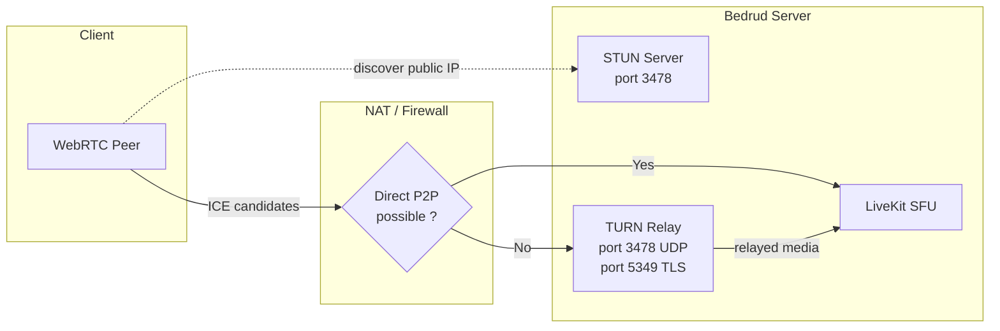
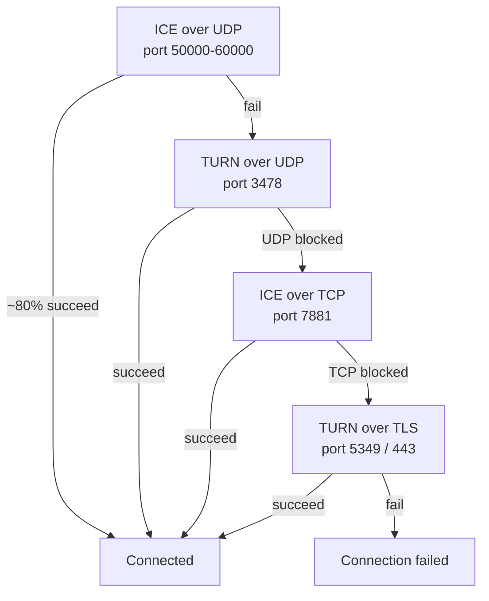
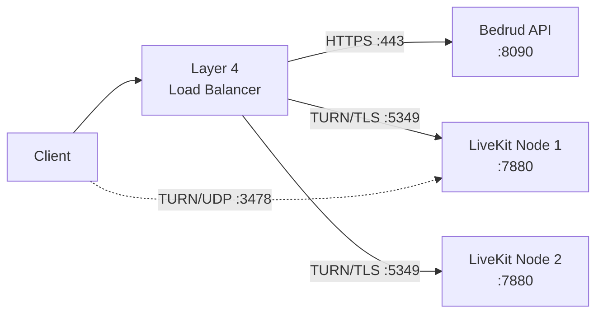
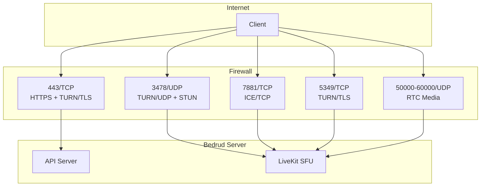

Bedrud embeds un TURN server via LiveKit pour relay media pour les clients derrière restrictive NATs ou firewalls. Cette page couvre l'architecture, la configuration, et le troubleshooting.

---

## What is TURN

**TURN** (Traversal Using Relays around NAT) est un protocol qui forwards media packets à travers un serveur quand deux endpoints ne peuvent pas connect directly.

**Related protocols :**

| Protocol | Role | Cost |
|----------|------|------|
| **STUN** | Discover public IP/port. Lightweight. | None (server seulement voit small binding requests) |
| **ICE** | Framework qui essaie tous les connectivity options en priority order. | None (orchestration seulement) |
| **TURN** | Relay tous les media quand le direct path échoue. Last resort. | High (server bandwidth = tous les relayed media) |

Voir [WebRTC Connectivity](/fr/docs/architecture/webrtc-connectivity) pour la full connectivity stack.

---

## TURN in Bedrud

LiveKit includes un embedded TURN server. No external infrastructure needed.

### Relay Architecture



### Connection Priority

LiveKit essaie les connection types en order. Chaque fallback ajoute de la latency et du server cost :



| Priority | Type | Port | Typical scenario |
|----------|------|------|-----------------|
| 1 | ICE/UDP (direct) | 50000-60000 | Most connections. No relay. |
| 2 | TURN/UDP | 3478 | Symmetric NAT, P2P blocked. |
| 3 | ICE/TCP | 7881 | UDP blocked (VPN, certains firewalls). |
| 4 | TURN/TLS | 5349 ou 443 | Corporate firewall, seulement HTTPS outbound. |

---

## When TURN Activates

TURN s'active quand le direct media path échoue. Common causes :

- **Symmetric NAT sur les deux peers** - Le client et le serveur ont tous les deux Symmetric NAT. Le NAT assigns un différent public port pour chaque destination, donc l'address discovered par STUN devient unreachable.
- **Corporate firewall** - blocks outbound UDP entirely. Seulement TCP port 443 allowed.
- **VPN restrictions** - certains VPNs interceptent ou block WebRTC traffic.
- **Cloud VMs sans public IP** - certains cloud providers utilisent NAT qui breaks direct ICE.

Most users (~80%) never hit TURN. Le direct UDP path works.

### Bandwidth Cost

Quand TURN relays, le serveur carries tous les media pour ce participant. Approximate per-stream bandwidth :

| Stream type | Bitrate | Per relayed participant |
|-------------|---------|------------------------|
| Audio (Opus) | ~32 Kbps | ~32 Kbps |
| Video 720p (VP8) | ~1.5 Mbps | ~1.5 Mbps up + 1.5 Mbps down per subscribed track |
| Screen share 1080p | ~2.5 Mbps | ~2.5 Mbps |

Pour une 5-person meeting avec un relayed participant : le serveur handles ~1.5 Mbps extra pour ce participant's video relay. Multiply ces valeurs par le nombre de relayed participants pour estimate total server bandwidth.

---

## Configuration

**File :** `server/config/livekit.yaml` (dev) ou `/etc/bedrud/livekit.yaml` (production)

```yaml
turn:
  enabled: true
  domain: "turn.example.com"
  udp_port: 3478
  tls_port: 5349
  cert_file: /etc/bedrud/turn.crt
  key_file: /etc/bedrud/turn.key
  relay_range_start: 30000
  relay_range_end: 40000
  external_tls: false
```

### Key Reference

| Key | Default | Description |
|-----|---------|-------------|
| `enabled` | `true` | Enable embedded TURN server. |
| `domain` | `localhost` | Domain advertised aux clients. Doit résoudre vers server's public IP. |
| `udp_port` | `3478` | TURN/UDP port. Sert également STUN binding requests quand TURN est enabled. |
| `tls_port` | `5349` | TURN/TLS port. Set à `443` si no load balancer terminates TLS. |
| `cert_file` | - | TLS certificate pour TURN/TLS. Required quand TURN/TLS clients exist. |
| `key_file` | - | TLS private key matching `cert_file`. |
| `relay_range_start` | `30000` | Start de UDP port range utilisé pour relayed media packets. |
| `relay_range_end` | `40000` | End de relay port range. Chaque relayed participant consumes ports depuis cette range. |
| `external_tls` | `false` | Set `true` quand un Layer 4 load balancer terminates TURN/TLS. LiveKit skips son propre TLS sur le TURN port. |

### `use_external_ip` Interaction

Dans le même `livekit.yaml`, sous `rtc:` :

```yaml
rtc:
  use_external_ip: true
```

Doit être `true` pour TURN à work correctement. Quand `false`, ICE candidates contiennent internal (private) IP addresses que les clients sur internet ne peuvent pas reach.

---

## Production TLS Setup

TURN/TLS nécessite son propre TLS certificate. Deux approches :

### Single Domain (No Load Balancer)

Réutiliser le server's TLS certificate. Set `tls_port` à `443` :

```yaml
turn:
  enabled: true
  domain: "meet.example.com"
  tls_port: 443
  cert_file: /etc/bedrud/meet.example.com.crt
  key_file: /etc/bedrud/meet.example.com.key
```

Le TURN domain et server domain sont les mêmes. Port 443 handles à la fois HTTPS API et TURN/TLS - LiveKit distinguishes par protocol.

### Dedicated TURN Domain (With Load Balancer)



```yaml
turn:
  enabled: true
  domain: "turn.example.com"
  tls_port: 5349
  external_tls: true
```

Le load balancer terminates TLS. `external_tls: true` tells LiveKit à expect already-decrypted traffic.

---

## Port & Firewall Reference



| Port | Protocol | Service | Required | Notes |
|------|----------|---------|----------|-------|
| 443 | TCP | HTTPS + TURN/TLS | Yes | API + web UI. Aussi TURN/TLS si `tls_port: 443`. |
| 3478 | UDP | TURN/UDP + STUN | Recommended | Dual purpose : STUN binding + TURN relay. |
| 5349 | TCP | TURN/TLS | If no LB | Dedicated TURN/TLS port. Skip si utilisant port 443. |
| 7881 | TCP | ICE/TCP | Recommended | Fallback quand UDP blocked mais TLS non needed. |
| 50000-60000 | UDP | RTC media | Yes | ICE candidate ports. Chaque participant utilise 2 ports. |
| 7880 | TCP | LiveKit API | Internal | WebSocket signaling. Not exposed directement en production. |

### Minimum Firewall Rules

Pour basic connectivity :

```
Allow TCP 443    (HTTPS + TURN/TLS)
Allow UDP 3478   (TURN/UDP + STUN)
Allow UDP 50000-60000  (RTC media)
```

Pour maximum compatibility (corporate networks) :

```
Also allow TCP 7881  (ICE/TCP)
Also allow TCP 5349  (TURN/TLS, si pas d'utilisation de port 443)
```

---

## Testing & Debugging

### Browser: chrome://webrtc-internals

1. Ouvrez `chrome://webrtc-internals` dans Chrome/Edge avant de rejoindre une meeting.
2. Créez un dump.
3. Regardez les **ICE candidate pairs** dans le Stats tab.
4. Candidate types vous disent la connection path :

| Candidate type | Meaning |
|---------------|---------|
| `host` | Local IP. Direct interface. |
| `srflx` (server reflexive) | STUN-discovered public IP. Direct P2P working. |
| `relay` | TURN relay active. Media va à travers le serveur. |

Si vous voyez `relay` candidates comme la active pair, TURN gère cette connection.

### LiveKit Client SDK Events

Tous les LiveKit SDKs emit connection state events :

```typescript
room.on(RoomEvent.Connected, () => {
  console.log("Connected");
});

room.on(RoomEvent.Reconnecting, () => {
  console.log("Connection lost, reconnecting...");
});
```

Check `room.localParticipant.connectionQuality` pour les connection stats.

### LiveKit Server Logs

Increase log level à debug dans `livekit.yaml` :

```yaml
logging:
  level: debug
```

Regardez les log entries contenant :
- `ICE` - candidate gathering status
- `TURN` - relay allocation events
- `relay` - active relay connections

### Manual TURN Test avec turnutils

Installez `coturn-utils` package, puis testez TURN connectivity :

```bash
turnutils_uclient -t -p 3478 -W devkey -u devkey turn.example.com
```

- `-t` - use TCP
- `-p` - TURN port
- Remplacez credentials avec production values

Success output montre les allocated relay addresses.

---

## Troubleshooting

| Symptom | Likely Cause | Fix |
|---------|-------------|-----|
| Clients can't connect, timeout | TURN ports blocked par firewall | Open UDP 3478, TCP 5349, UDP 50000-60000 |
| TURN/TLS fails | Missing ou mismatched TLS cert | Verify `cert_file`/`key_file` paths. Check cert matches `domain`. |
| TURN/TLS fails avec LB | `external_tls` pas set | Set `external_tls: true` dans config. |
| One-way audio/video | Relay port range blocked | Open `relay_range_start` à `relay_range_end` UDP. |
| High server bandwidth | Many clients derrière NAT utilisant relay | Expected. Scale server ou reduce relay users. |
| `relay` candidates mais `srflx` expected | `use_external_ip: false` | Set `rtc.use_external_ip: true`. |
| TURN domain doesn't resolve | DNS misconfigured | `dig +short turn.example.com` doit return server's public IP. |
| Clients derrière corporate firewall | Seulement port 443 allowed | Set `turn.tls_port: 443`. Ensure cert est valid. |
| `turn.enabled: true` mais no relay | Direct path works (bon) | TURN est fallback. No relay = better. Verify avec `chrome://webrtc-internals`. |

### Quick Diagnostic Checklist

1. `dig +short <turn.domain>` returns correct public IP ?
2. Firewall allows UDP 3478, TCP 5349, UDP 50000-60000 ?
3. `tls_port: 443` ou `5349` matches firewall rules ?
4. `cert_file` et `key_file` exist et sont readable ?
5. Certificate CN/SAN matches `turn.domain` ?
6. `rtc.use_external_ip: true` set ?
7. LiveKit logs show no TURN-related errors ?

---

## See also

- [WebRTC Connectivity](/fr/docs/architecture/webrtc-connectivity) - full STUN/ICE/TURN/SFU connectivity stack
- [LiveKit Integration](/fr/docs/backend/livekit) - comment Bedrud embeds LiveKit
- [Configuration Reference](/fr/docs/getting-started/configuration) - toutes les config options
- [Internal TLS](/fr/docs/guides/internal-tls) - TLS pour isolated networks
- [Deployment Guide](/fr/docs/guides/deployment) - production deployment steps
