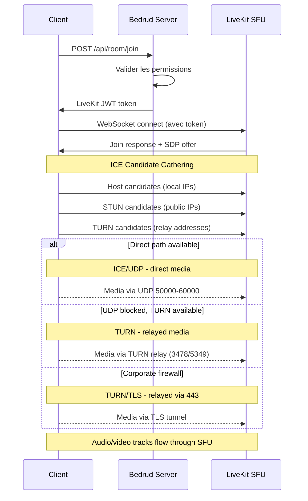
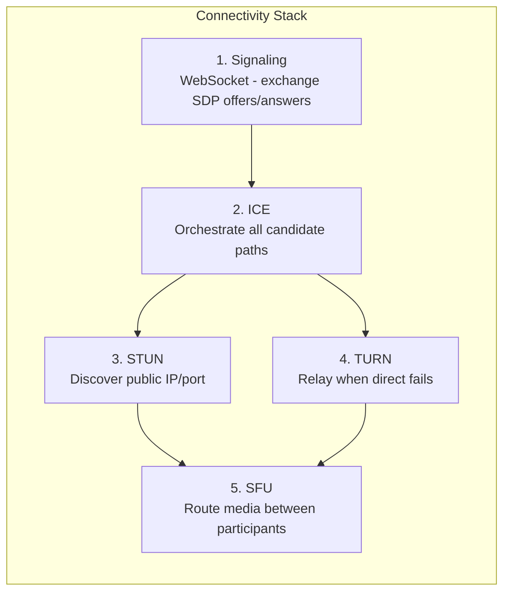
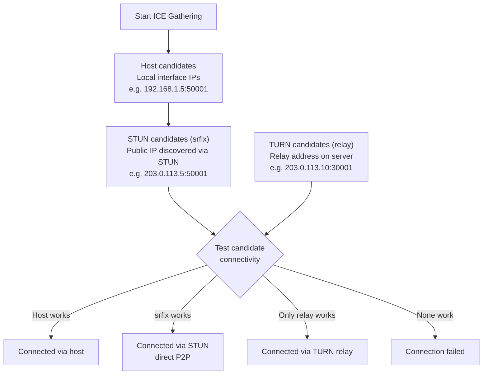
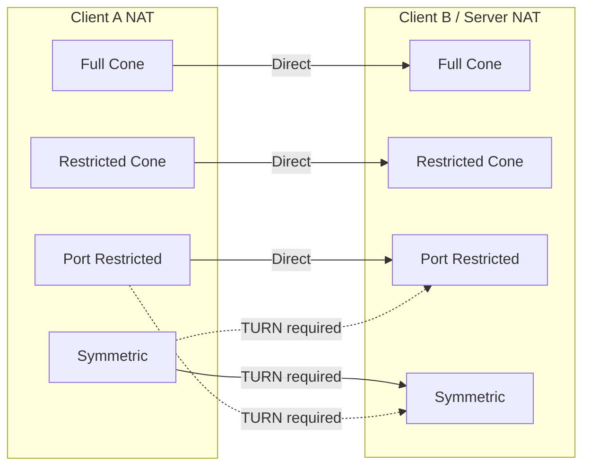

Comment les clients établissent des real-time media connections dans Bedrud. Couvre la full connectivity stack : signaling, ICE, STUN, TURN, et le SFU media path.

---

## Overview

WebRTC nécessite une série de steps avant que l'audio et la vidéo ne flow entre le client et le serveur. Bedrud utilise LiveKit's SFU (Selective Forwarding Unit) architecture - les clients connectent au serveur, pas les uns aux autres. **Cela signifie que seul le client-to-server network path matters**, pas la connection entre les individual participants.



---

## Connectivity Stack

Cinq layers travaillent ensemble pour établir le media path :



### Layer Details

**1. Signaling** - Le client et le serveur exchange connection metadata en utilisant SDP (Session Description Protocol) offers et answers via WebSocket. Ce n'est pas du media - c'est le setup phase. Bedrud proxies signaling à travers le API server vers l'embedded LiveKit instance.

**2. ICE (Interactive Connectivity Establishment)** - Gathers tous les possible connection paths, appelés candidates, et les tests en order de priority. ICE est un framework - il coordonne les connection attempts mais n'est pas un protocol lui-même.

**3. STUN (Session Traversal Utilities for NAT)** - Lightweight protocol. Le client envoie un binding request au STUN server, qui répond avec le client's public IP et port. Ce "server reflexive" candidate est ensuite testé pour direct connectivity. Works pour ~80% des connections.

**4. TURN (Traversal Using Relays around NAT)** - Quand la direct connectivity échoue, TURN alloue un relay address sur le serveur. Tous les media packets sont forwarded à travers ce relay. Highest cost - le server bandwidth scales avec les relayed users. Voir le [TURN Server Guide](turn-server.mdx) pour deep coverage.

**5. SFU (Selective Forwarding Unit)** - Une fois le transport path établi, LiveKit's SFU routes media entre les participants. Chaque participant envoie un stream up ; le SFU forwards copies aux autres participants. Ce n'est pas peer-to-peer - le serveur est toujours dans le path.

---

## ICE Candidate Gathering



ICE gathers trois candidate types simultanément :

| Type | Source | Priority | Comment cela fonctionne |
|------|--------|----------|-------------|
| **host** | Local network interfaces | Highest | Direct IP depuis machine. Works sur LAN. |
| **srflx** (server reflexive) | STUN server response | Medium | Public IP discovered via STUN. Works pour la plupart des NAT types. |
| **relay** | TURN server allocation | Lowest | Address sur TURN server. Always works. Highest cost. |

ICE teste tous les candidates et sélectionne le highest-priority pair qui succeeds. Si `srflx` works, il skips `relay`.

---

## NAT Types & Connectivity

Différents NAT types affectent si la direct connectivity works :



| NAT Type | Description | Direct P2P | Needs TURN |
|----------|-------------|------------|-----------|
| **Full Cone** | Tous les requests depuis la même internal IP/port map vers la même public IP/port. N'importe quel external host peut lui envoyer. | Yes | No |
| **Restricted Cone** | Même mapping que Full Cone, mais seuls les external hosts qui ont reçu un packet peuvent send back. | Usually | No |
| **Port Restricted Cone** | Similaire à Restricted Cone, mais le NAT restreint également le external port number. Most common home router type. | Usually | Rarely |
| **Symmetric** | Différent public IP/port mapping par destination. Le STUN-discovered address ne peut pas être réutilisé. | No (quand les deux sont symmetric) | **Yes** |

**Key insight :** Puisque le serveur a une public IP et predictable port range, la plupart des NAT types work directement. TURN est principalement nécessaire quand le client's firewall blocks outbound UDP entièrement.

---

## Configuration Summary

Quelles Bedrud/LiveKit config keys affectent la WebRTC connectivity :

**`livekit.yaml` keys :**

```yaml
rtc:
  port_range_start: 50000       # UDP media port range start
  port_range_end: 60000         # UDP media port range end
  tcp_port: 7881                # ICE/TCP fallback port
  stun_servers:                 # External STUN servers (optional)
    - stun:stun.l.google.com:19302
  use_external_ip: true         # Advertise public IP dans ICE candidates

turn:
  enabled: true                 # Enable embedded TURN
  domain: "turn.example.com"    # TURN domain (DNS doit résoudre)
  udp_port: 3478                # TURN/UDP + STUN port
  tls_port: 5349                # TURN/TLS port (ou 443)
  cert_file: /path/to/turn.crt  # TLS cert pour TURN/TLS
  key_file: /path/to/turn.key   # TLS key pour TURN/TLS
  relay_range_start: 30000      # Relay port range start
  relay_range_end: 40000        # Relay port range end
  external_tls: false           # L4 LB terminates TLS
```

**`config.yaml` keys (Bedrud server) :**

```yaml
server:
  port: 8090                    # API port (signaling proxied à travers ceci)
  enableTLS: true               # HTTPS pour signaling
  domain: "meet.example.com"    # Public domain
```

### Debugging Connectivity Issues

| Symptom | Check |
|---------|-------|
| Can't connect at all | `rtc.use_external_ip: true` ? Firewall open sur 443 + UDP range ? |
| Connects mais no audio/video | UDP 50000-60000 blocked ? Check ICE candidates dans browser. |
| Slow connection | TURN relay active (check candidates). Expected si le client derrière strict NAT. |
| Fails derrière corporate network | TURN/TLS not configured. Set `turn.tls_port: 443` avec valid cert. |
| Works sur LAN, fails remotely | Public IP not advertised. Set `rtc.use_external_ip: true`. |

Pour deep TURN troubleshooting, voir le [TURN Server Guide](/fr/docs/architecture/turn-server).

---

## See also

- [TURN Server Guide](/fr/docs/architecture/turn-server) - TURN architecture, configuration, TLS, debugging
- [LiveKit Integration](/fr/docs/backend/livekit) - comment Bedrud embeds LiveKit
- [Architecture Overview](/fr/docs/architecture/overview) - full system architecture
- [Internal TLS](/fr/docs/guides/internal-tls) - TLS pour isolated networks
