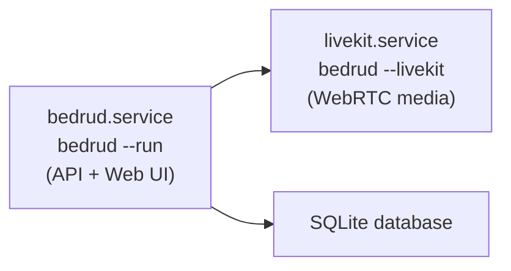

Bedrud est conçu pour fonctionner en tant qu'"appliance" autonome pour les réunions vidéo. Un seul exécutable binaire contient tout ce dont vous avez besoin - frontend, backend et le serveur média LiveKit.

## Fonctionnalités clés

| Fonctionnalité | Description |
|----------------|-------------|
| Zéro dépendance externe | Pas besoin de Node.js, Redis ou de serveur média séparé |
| Serveur média intégré | Binaire LiveKit inclus et géré automatiquement |
| Frontend intégré | Interface React compilée et pré-rendue SSR dans le binaire Go |
| Stockage SQLite | Aucun serveur de base de données requis |
| TLS intégré | Certificats auto-signés ou Let's Encrypt |
| Installateur intégré | Configure systemd, les répertoires et les configurations |

## Exécution du binaire

### Démarrer le serveur Bedrud

```bash
./bedrud --run --config config.yaml
```

### Démarrer le serveur média LiveKit

```bash
./bedrud --livekit --config livekit.yaml
```

Le binaire contient à la fois le serveur API et le serveur média. Utilisez les drapeaux pour choisir lequel démarrer.

## Installation

### Installation rapide (Debian/Ubuntu)

```bash
# Avec TLS Let's Encrypt
sudo ./bedrud install --tls --domain meet.example.com --email admin@example.com

# Avec certificat auto-signé
sudo ./bedrud install --tls --ip 1.2.3.4

# HTTP simple (dev uniquement)
sudo ./bedrud install --ip 1.2.3.4
```

<InstallerSteps />

### Architecture du service

Après l'installation, deux services systemd s'exécutent :



## Fichiers de configuration

| Fichier | Objectif |
|---------|----------|
| `/etc/bedrud/config.yaml` | Configuration principale du serveur |
| `/etc/bedrud/livekit.yaml` | Configuration du serveur média |
| `/var/lib/bedrud/bedrud.db` | Base de données SQLite |
| `/var/log/bedrud/bedrud.log` | Journaux de l'application |

Voir la [Référence de configuration](/fr/docs/getting-started/configuration) pour toutes les options.

## Post-installation

### Créer votre premier administrateur

<CreateAdmin />

### Vérifier l'état du service

```bash
systemctl status bedrud livekit
```

### Voir les journaux

```bash
tail -f /var/log/bedrud/bedrud.log
journalctl -u bedrud -f
```

## Désinstallation

```bash
sudo ./bedrud uninstall
```

Cela supprime complètement :

- Les fichiers de service systemd
- Le binaire de `/usr/local/bin/`
- La configuration dans `/etc/bedrud/`
- Les données dans `/var/lib/bedrud/`
- Les journaux dans `/var/log/bedrud`
