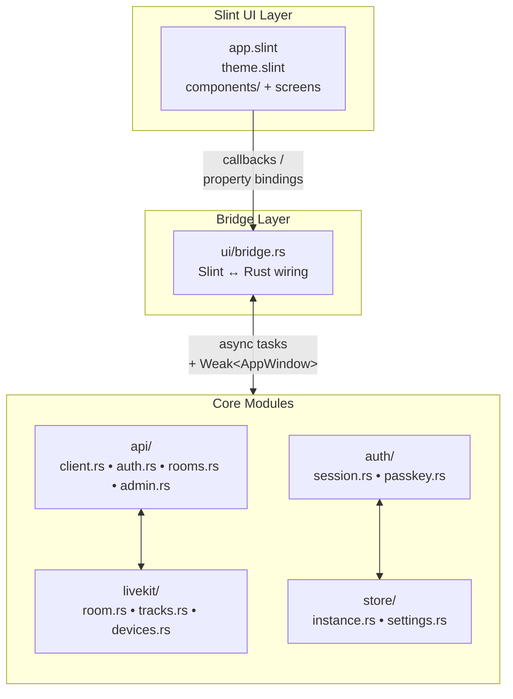

Bedrud デスクトップクライアントは **Rust** と **Slint** UI ツールキットで構築されたネイティブ Windows および Linux アプリケーションです。Web やモバイルクライアントと同じコア会議エクスペリエンスを提供し、ランタイム依存関係なしの単一バイナリにコンパイルされます。

## テクノロジースタック

| コンポーネント | テクノロジー |
|-----------|-----------|
| 言語 | Rust（stable） |
| UI ツールキット | Slint 1.x |
| HTTP クライアント | reqwest（async、TLS） |
| メディア | LiveKit Rust SDK |
| ストレージ | serde_json + OS キーリング（libsecret / Windows Credential Store） |
| ビルドシステム | Cargo workspace |

## プラットフォーム対応

| プラットフォーム | レンダラー | バイナリ |
|----------|----------|--------|
| Windows 10/11 | Direct3D 11 | `bedrud-desktop.exe` |
| Linux x86_64 | OpenGL / Vulkan（EGL/Wayland/X11 経由） | `bedrud-desktop` |
| macOS | _（未対応 - Web アプリを使用してください）_ | - |

## ソースコードレイアウト

```
apps/desktop/
├── Cargo.toml              # Crate definition
├── build.rs                # Slint compile step
├── src/
│   ├── main.rs             # Entry point - initialises app + event loop
│   ├── app.rs              # Top-level AppState and startup logic
│   ├── api/
│   │   ├── client.rs       # Shared HTTP client (base URL, JWT injection)
│   │   ├── auth.rs         # Login, register, refresh
│   │   ├── rooms.rs        # Room list, join, create
│   │   └── admin.rs        # Admin endpoints
│   ├── auth/
│   │   ├── session.rs      # JWT storage and refresh loop
│   │   └── passkey.rs      # FIDO2 passkey stub
│   ├── livekit/
│   │   ├── room.rs         # Room connection lifecycle
│   │   ├── tracks.rs       # Audio/video track management
│   │   └── devices.rs      # Microphone / camera enumeration
│   ├── store/
│   │   ├── instance.rs     # Multi-instance persistence
│   │   └── settings.rs     # User preferences
│   └── ui/
│       ├── mod.rs
│       └── bridge.rs       # Slint ↔ Rust callback wiring
└── ui/
    ├── app.slint            # Root component, page router
    ├── theme.slint          # Colours, typography, spacing tokens
    ├── components/          # Button, Input, Card, Avatar
    ├── auth/                # Login and Register screens
    ├── dashboard/           # Room list, Create-room dialog
    ├── meeting/             # Controls bar, participant tiles, chat
    ├── admin/               # Admin panel, user table
    └── settings.slint       # Settings screen
```

## アーキテクチャ



### 主要な設計判断

- **Slint のコンパイル時 UI** - `.slint` ファイルは `build.rs` 経由でビルド時に Rust にコンパイルされます。ランタイムにレイアウトエンジンはなく、UI は完全にネイティブです。
- **`bridge.rs` が唯一の UI↔ロジック境界** - すべての Slint コールバックが1箇所でワイヤリングされ、ビジネスロジックが UI レイヤーから分離され、ブリッジの監査が容易になります。
- **コールバック内の `Weak<AppWindow>`** - Slint UI ハンドルは `!Send` であるため、バックグラウンドタスクはハンドルをスレッド間で共有するのではなく、UI スレッドで保存済みの `Weak` 参照をアップグレードしてプロパティを設定します。
- **`store/instance.rs` によるマルチインスタンス** - モバイルアプリと同じ仕組み：インスタンスは OS 設定ディレクトリ内の JSON ファイルにシリアライズされ、各インスタンスが独自の `APIClient` と `AuthSession` を持ちます。

## ローカルビルド

### 前提条件

- Rust stable ツールチェーン（`rustup toolchain install stable`）
- **Linux：** `libfontconfig`、`libxkbcommon`、`libwayland`、`libgles2`、`libdbus`、`libsecret`

  ```bash
  sudo apt-get install -y \
    libfontconfig1-dev libxkbcommon-dev libxkbcommon-x11-dev \
    libwayland-dev libgles2-mesa-dev libegl1-mesa-dev \
    libdbus-1-dev libsecret-1-dev \
    libasound2-dev
  ```

- **Windows：** Visual Studio Build Tools（MSVC）with C++ ワークロード

### ビルド

```bash
# Debug build (fast compile, no optimisations)
make dev-desktop          # runs the app immediately after build

# Release build
make build-desktop        # → target/release/bedrud-desktop (Linux)
                           # → target/release/bedrud-desktop.exe (Windows)
```

または Cargo を直接使用：

```bash
cargo build -p bedrud-desktop                          # debug
cargo build -p bedrud-desktop --release                # optimised
cargo run   -p bedrud-desktop                          # run immediately
```

## CI

デスクトップアプリは `main` へのプッシュ時とプルリクエストで CI でビルドされます。

| ジョブ | ランナー | 内容 |
|-----|--------|----------------|
| `Desktop – Build & Test` | `ubuntu-latest` | `cargo build`、`cargo test` |

リリースビルドでは2つのアーティファクトが生成されます。

| アーティファクト | ランナー | フォーマット |
|----------|--------|--------|
| `bedrud-desktop-linux-x86_64.tar.xz` | `ubuntu-latest` | tar.xz |
| `bedrud-desktop-windows-x86_64.zip` | `windows-latest` | zip
