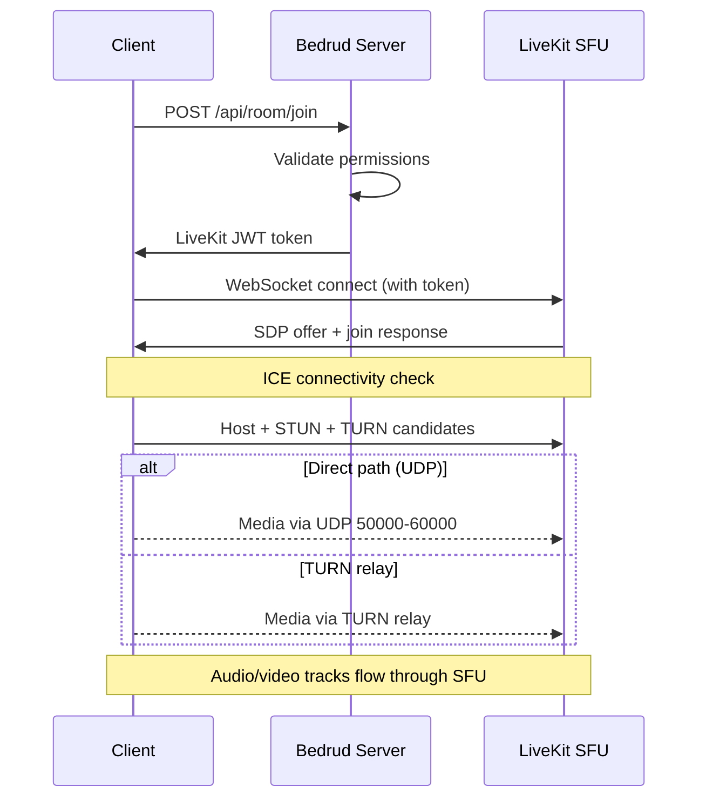

Bedrud は Go サーバー、3つのクライアントアプリケーション、Python Bot エージェント、共有パッケージを含むモノレポです。このページでは各コンポーネントの関係について説明します。

## 全体図

```
┌──────────────────────────────────────────────────────────────┐
│                          Clients                             │
│                                                              │
│  ┌─────────┐  ┌──────────┐  ┌────────┐  ┌───────────────┐   │
│  │  Web    │  │ Android  │  │  iOS   │  │ Desktop       │   │
│  │ React   │  │ Compose  │  │SwiftUI │  │ Rust + Slint  │   │
│  └────┬────┘  └────┬─────┘  └───┬────┘  └──────┬────────┘   │
│       │            │            │              │             │
│       └────────────┼────────────┼──────────────┘             │
│                    │                                         │
│               REST API + WebSocket                          │
└────────────────────┼────────────────────────────────────────┘
                          │
┌────────────────────────┼────────────────────────────────┐
│                   Bedrud Server                         │
│                        │                                │
│  ┌─────────────────────┴──────────────────────────┐     │
│  │              Fiber HTTP Router                  │     │
│  │  /api/auth/*  /api/room/*  /api/admin/*        │     │
│  └──────────┬─────────────────────┬───────────────┘     │
│             │                     │                     │
│  ┌──────────┴──────────┐  ┌──────┴────────────────┐     │
│  │   GORM / SQLite     │  │  LiveKit Protocol SDK │     │
│  │   (or PostgreSQL)   │  │  (token generation,   │     │
│  │                     │  │   room management)    │     │
│  └─────────────────────┘  └──────────┬────────────┘     │
│                                      │                  │
│                           ┌──────────┴────────────┐     │
│                           │  Embedded LiveKit      │     │
│                           │  Media Server (WebRTC) │     │
│                           └───────────────────────┘     │
└─────────────────────────────────────────────────────────┘
```

## コンポーネント

### サーバー（`server/`）

Go バックエンドは Bedrud の中核です。以下を処理します。

- **REST API** - 認証、ルーム管理、管理者操作
- **静的ファイル配信** - コンパイル済み Web フロントエンドは `//go:embed` で組み込まれる
- **LiveKit インテグレーション** - LiveKit Protocol SDK を使用してトークンを生成し、ルームを管理
- **組み込み LiveKit サーバー** - メディアサーバーバイナリが子プロセスとして実行

サーバーは **Fiber** Web フレームワーク（Node.js の Express.js に類似）と **GORM** ORM レイヤーを使用しています。開発には SQLite、本番には PostgreSQL をサポートします。

詳細は [サーバーアーキテクチャ](/ja/docs/architecture/server) を参照してください。

### Web フロントエンド（`apps/web/`）

TanStack Start、TailwindCSS v4、shadcn/ui で構築された **React** アプリケーションです。本番環境ではサーバー側でプリレンダリングされ、クライアントアセットが Go バイナリに組み込まれます。

主な機能：

- LiveKit Client SDK によるビデオ会議 UI
- 自動トークンリフレッシュ付き JWT ベースの認証
- ユーザーとルーム管理用の管理者ダッシュボード
- 一貫したコンポーネントライブラリを備えたデザインシステム

詳細は [Web フロントエンド](/ja/docs/architecture/web) を参照してください。

### Android アプリ（`apps/android/`）

**Jetpack Compose** と **Kotlin** で構築されたネイティブ Android アプリです。依存性注入に Koin、HTTP 通信に Retrofit を使用しています。

主な機能：

- LiveKit Android SDK によるフルビデオ会議エクスペリエンス
- ピクチャーインピクチャーモード
- ディープリンク handling（`bedrud.com/m/*` と `bedrud.com/c/*`）
- Android の ConnectionService による通話管理
- マルチインスタンスサポート（複数サーバーへの接続）

詳細は [Android アプリ](/ja/docs/architecture/android) を参照してください。

### iOS アプリ（`apps/ios/`）

**SwiftUI** で構築されたネイティブ iOS アプリです。安全な認証情報保存に KeychainAccess、メディア処理に LiveKit Swift SDK を使用しています。

主な機能：

- フルビデオ会議エクスペリエンス
- マルチインスタンスサポート
- ディープリンク handling
- Keychain ベースの安全な保存

詳細は [iOS アプリ](/ja/docs/architecture/ios) を参照してください。

### デスクトップアプリ（`apps/desktop/`）

**Rust** と **Slint** UI ツールキットで構築されたネイティブ Windows および Linux デスクトップアプリケーションです。ランタイム依存関係なしの単一バイナリにコンパイルされます。

主な機能：

- LiveKit Rust SDK によるフルビデオ会議エクスペリエンス
- ネイティブ Windows（Direct3D 11）および Linux（OpenGL/Vulkan）レンダリング
- マルチインスタンスサポート（複数の Bedrud サーバーへの接続）
- 安全な認証情報保存のための OS キーリング統合

詳細は [デスクトップアプリ](/ja/docs/architecture/desktop) を参照してください。

### Bot エージェント（`agents/`）

Bot として会議ルームに参加し、メディアコンテンツをストリーミングする Python スクリプト：

- **Music エージェント** - オーディオファイルの再生
- **Radio エージェント** - インターネットラジオ局のストリーミング
- **Video Stream エージェント** - ビデオコンテンツ（HLS、MP4）の共有

詳細は [Bot エージェント](/ja/docs/architecture/agents) を参照してください。

## 認証フロー

```
Client                    Server                    Database
  │                         │                          │
  ├─POST /api/auth/login───►│                          │
  │                         ├──verify credentials─────►│
  │                         │◄─────────────────────────┤
  │◄──access + refresh JWT──┤                          │
  │                         │                          │
  ├─GET /api/room/list──────►│  (Authorization header)  │
  │  (Bearer <access_token>)│                          │
  │◄──room list─────────────┤                          │
```

すべての認証済みリクエストは `Authorization` ヘッダーで JWT トークンを使用します。Web フロントエンドの `authFetch` ラッパーがトークンの付与と自動リフレッシュを処理します。

サポートされる認証方式：

| 方式 | エンドポイント | 説明 |
|--------|----------|-------------|
| Email/Password | `POST /api/auth/login` | 従来の認証情報 |
| 登録 | `POST /api/auth/register` | 新規アカウント作成 |
| ゲスト | `POST /api/auth/guest-login` | 名前のみで一時アクセス |
| OAuth | `GET /api/auth/:provider/login` | Google、GitHub、Twitter |
| パスキー | `POST /api/auth/passkey/*` | FIDO2/WebAuthn 生体認証 |

## 会議接続フロー



1. クライアントが REST API を経由してルームへの参加をリクエスト
2. サーバーが権限を検証し、署名付き LiveKit トークンを生成
3. クライアントがトークンを使用して LiveKit に WebSocket で直接接続
4. ICE が候補（host、STUN、TURN）を収集し、最適なパスを選択
5. 音声/ビデオトラックが LiveKit の SFU を通じて流れる

完全な接続スタックについては [WebRTC 接続](/ja/docs/architecture/webrtc-connectivity) を参照してください。

## データモデル

### User

| フィールド | 型 | 説明 |
|-------|------|-------------|
| ID | uint | プライマリキー |
| Email | string | 一意のメールアドレス |
| Name | string | 表示名 |
| Password | string | ハッシュ化されたパスワード（OAuth/ゲストの場合は空） |
| Avatar | string | アバター URL |
| Provider | string | 認証プロバイダー（`local`、`google`、`github`、`twitter`、`guest`） |
| Role | string | `user` または `admin` |

### Room

| フィールド | 型 | 説明 |
|-------|------|-------------|
| ID | uint | プライマリキー |
| AdminID | uint | 外部キー → User.ID（ルーム作成者） |
| Name | string | ルーム名 / URL スラッグ |
| IsPublic | bool | ゲストが招待なしで参加可能か |
| ChatEnabled | bool | ルーム内チャットが有効か |
| VideoEnabled | bool | ビデオが許可されているか |
| Participants | []User | ルーム内の現在のユーザー |

### Passkey

| フィールド | 型 | 説明 |
|-------|------|-------------|
| ID | uint | プライマリキー |
| UserID | uint | 外部キー → User.ID |
| CredentialID | []byte | WebAuthn 認証情報 ID |
| PublicKey | []byte | WebAuthn 公開鍵 |
| Counter | uint32 | WebAuthn 署名カウンター |

### RefreshToken

| フィールド | 型 | 説明 |
|-------|------|-------------|
| Token | string | リフレッシュトークン文字列 |
| UserID | uint | 外部キー → User.ID |
| ExpiresAt | time | トークン有効期限タイムスタンプ |

## デプロイメントアーキテクチャ

本番環境では、Bedrud は2つの systemd サービスとして実行されます。

| サービス | バイナリ | 目的 |
|---------|--------|---------|
| `bedrud.service` | `bedrud --run` | API サーバー + 組み込み Web フロントエンド |
| `livekit.service` | `bedrud --livekit` | WebRTC メディアサーバー |

両方とも単一のバイナリで管理されます。Traefik または別のリバースプロキシが TLS 終端とトラフィックルーティングを処理します。

セットアップ手順については [デプロイメントガイド](/ja/docs/guides/deployment) を参照してください。

## 主要な用語

これらの用語はアーキテクチャドキュメント全体に登場します。

| 用語 | 正式名称 | 意味 |
|------|-----------|---------|
| **SFU** | Selective Forwarding Unit | 各参加者からのストリームを受信して他の参加者に転送するメディアサーバー。クライアントは互いではなくサーバーに接続します。 |
| **SDP** | Session Description Protocol | WebRTC 接続パラメータ（コーデック、解像度、メディアタイプ）を記述するフォーマット。 |
| **ICE** | Interactive Connectivity Establishment | クライアントとサーバー間のすべての可能なネットワークパスを収集し、最適なものを選択するフレームワーク。 |
| **STUN** | Session Traversal Utilities for NAT | クライアントがパブリック IP アドレスを発見するのを支援する軽量プロトコル。ほとんどの接続で機能します。 |
| **TURN** | Traversal Using Relays around NAT | 直接接続が不可能な場合にすべてのメディアをサーバー経由でリレーするプロトコル。最後の手段で、帯域幅コストが最も高い。 |
| **NAT** | Network Address Translation | プライベートな内部アドレスをパブリックアドレスにマッピングするルーター機能。タイプによっては直接 WebRTC 接続を阻害します。 |
| **srflx** | Server Reflexive | STUN 経由で発見されたクライアントのパブリック IP を表す ICE 候補のタイプ。 |
| **WebRTC** | Web Real-Time Communication | リアルタイムの音声、ビデオ、データ転送のためのブラウザおよびモバイル API 標準。 |

## 関連項目

- [WebRTC 接続](/ja/docs/architecture/webrtc-connectivity) - 完全な STUN/ICE/TURN/SFU 接続スタック
- [TURN サーバーガイド](/ja/docs/architecture/turn-server) - TURN リレーアーキテクチャと設定
- [LiveKit インテグレーション](/ja/docs/backend/livekit) - Bedrud が LiveKit を組み込む方法
