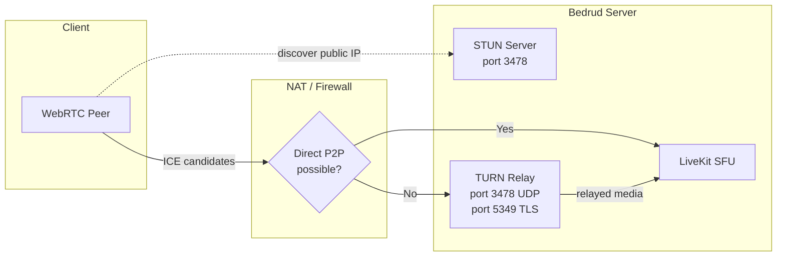
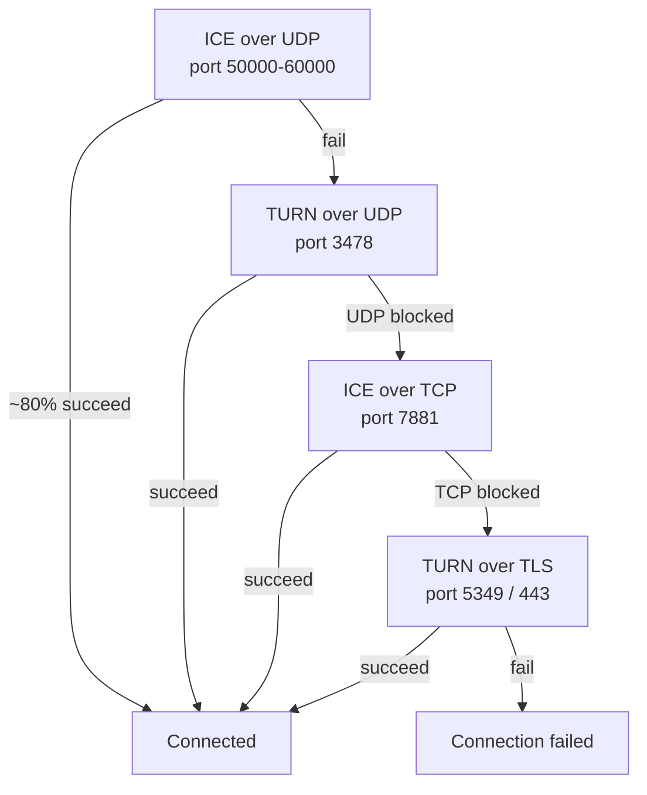
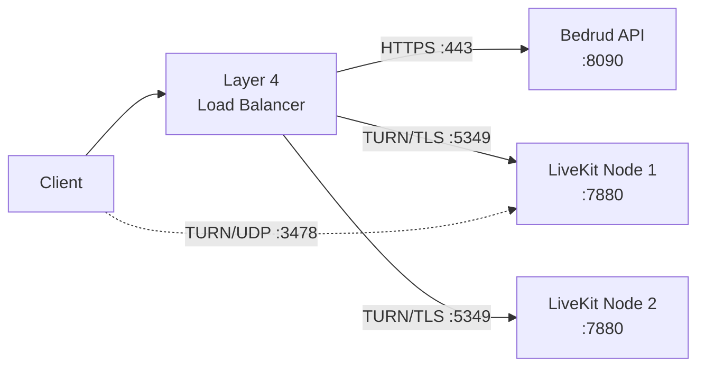
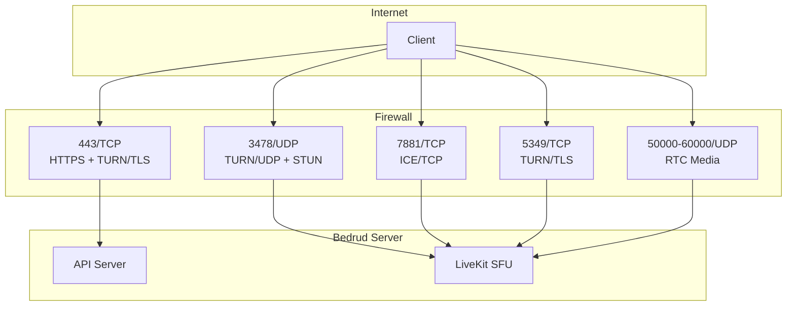

Bedrud は LiveKit 経由で TURN サーバーを組み込み、制限的な NAT やファイアウォールの背後にあるクライアントのメディアをリレーします。このページではアーキテクチャ、設定、トラブルシューティングについて説明します。

---

## TURN とは

**TURN**（Traversal Using Relays around NAT）は、2つのエンドポイントが直接接続できない場合に、メディアパケットをサーバー経由で転送するプロトコルです。

**関連プロトコル：**

| プロトコル | 役割 | コスト |
|----------|------|------|
| **STUN** | パブリック IP/ポートの発見。軽量。 | なし（サーバーは小さなバインディングリクエストのみを受信） |
| **ICE** | すべての接続オプションを優先順位に従って試行するフレームワーク。 | なし（調整のみ） |
| **TURN** | 直接パスが失敗した場合にすべてのメディアをリレー。最後の手段。 | 高い（サーバー帯域幅 = リレーされるすべてのメディア） |

完全な接続スタックについては [WebRTC 接続](/ja/docs/architecture/webrtc-connectivity) を参照してください。

---

## Bedrud における TURN

LiveKit には組み込みの TURN サーバーが含まれています。外部インフラは不要です。

### リレーアーキテクチャ



### 接続の優先順位

LiveKit は接続タイプを順番に試行します。フォールバックごとにレイテンシとサーバーコストが増加します。



| 優先度 | タイプ | ポート | 典型的なシナリオ |
|----------|------|------|-----------------|
| 1 | ICE/UDP（直接） | 50000-60000 | ほとんどの接続。リレーなし。 |
| 2 | TURN/UDP | 3478 | Symmetric NAT、P2P ブロック。 |
| 3 | ICE/TCP | 7881 | UDP ブロック（VPN、一部のファイアウォール）。 |
| 4 | TURN/TLS | 5349 または 443 | 企業ファイアウォール、HTTPS 送信のみ。 |

---

## TURN がアクティブになる条件

TURN は直接メディアパスが失敗した場合にアクティブになります。一般的な原因：

- **両端での Symmetric NAT** - クライアントとサーバーの両方が Symmetric NAT を持っています。NAT は宛先ごとに異なるパブリックポートを割り当てるため、STUN で発見されたアドレスに到達できません。
- **企業ファイアウォール** - 送信 UDP を完全にブロック。TCP ポート 443 のみ許可。
- **VPN の制限** - 一部の VPN が WebRTC トラフィックを傍受またはブロック。
- **パブリック IP のないクラウド VM** - 一部のクラウドプロバイダーは直接 ICE を阻害する NAT を使用。

ほとんどのユーザー（約 80%）は TURN に到達しません。直接 UDP パスが機能します。

### 帯域幅コスト

TURN がリレーする場合、サーバーはその参加者のすべてのメディアを処理します。ストリームあたりの概算帯域幅：

| ストリームタイプ | ビットレート | リレー参加者あたり |
|-------------|---------|------------------------|
| 音声（Opus） | ~32 Kbps | ~32 Kbps |
| ビデオ 720p（VP8） | ~1.5 Mbps | 購読トラックごとに ~1.5 Mbps 上り + 1.5 Mbps 下り |
| 画面共有 1080p | ~2.5 Mbps | ~2.5 Mbps |

5人の会議で1人がリレーされている場合、サーバーはその参加者のビデオリレーのために約 1.5 Mbps の追加帯域を処理します。リレー参加者の数を掛けて合計サーバー帯域幅を見積もってください。

---

## 設定

**ファイル：** `server/config/livekit.yaml`（開発）または `/etc/bedrud/livekit.yaml`（本番）

```yaml
turn:
  enabled: true
  domain: "turn.example.com"
  udp_port: 3478
  tls_port: 5349
  cert_file: /etc/bedrud/turn.crt
  key_file: /etc/bedrud/turn.key
  relay_range_start: 30000
  relay_range_end: 40000
  external_tls: false
```

### 設定キー参照

| キー | デフォルト | 説明 |
|-----|---------|-------------|
| `enabled` | `true` | 組み込み TURN サーバーを有効にします。 |
| `domain` | `localhost` | クライアントにアドバタイズされるドメイン。サーバーのパブリック IP に解決される必要があります。 |
| `udp_port` | `3478` | TURN/UDP ポート。TURN が有効な場合、STUN バインディングリクエストも処理します。 |
| `tls_port` | `5349` | TURN/TLS ポート。ロードバランサーが TLS を終端しない場合は `443` に設定。 |
| `cert_file` | - | TURN/TLS 用 TLS 証明書。TURN/TLS クライアントが存在する場合に必須。 |
| `key_file` | - | `cert_file` に対応する TLS 秘密鍵。 |
| `relay_range_start` | `30000` | リレーメディアパケットに使用される UDP ポート範囲の開始。 |
| `relay_range_end` | `40000` | リレーポート範囲の終了。リレー参加者ごとにこの範囲からポートを消費します。 |
| `external_tls` | `false` | Layer 4 ロードバランサーが TURN/TLS を終端する場合に `true` に設定。LiveKit は TURN ポートで独自の TLS をスキップします。 |

### `use_external_ip` との連携

同じ `livekit.yaml` の `rtc:` セクション：

```yaml
rtc:
  use_external_ip: true
```

TURN が正しく機能するには `true` である必要があります。`false` の場合、ICE 候補にはインターネット上のクライアントから到達できない内部（プライベート）IP アドレスが含まれます。

---

## 本番 TLS の設定

TURN/TLS には独自の TLS 証明書が必要です。2つのアプローチがあります。

### シングルドメイン（ロードバランサーなし）

サーバーの TLS 証明書を再利用します。`tls_port` を `443` に設定。

```yaml
turn:
  enabled: true
  domain: "meet.example.com"
  tls_port: 443
  cert_file: /etc/bedrud/meet.example.com.crt
  key_file: /etc/bedrud/meet.example.com.key
```

TURN ドメインとサーバードメインは同じです。ポート 443 は HTTPS API と TURN/TLS の両方を処理します。LiveKit はプロトコルで区別します。

### 専用 TURN ドメイン（ロードバランサーあり）



```yaml
turn:
  enabled: true
  domain: "turn.example.com"
  tls_port: 5349
  external_tls: true
```

ロードバランサーが TLS を終端します。`external_tls: true` は LiveKit に既に復号されたトラフィックを想定するよう指示します。

---

## ポートとファイアウォールの参照



| ポート | プロトコル | サービス | 必須 | 備考 |
|------|----------|---------|----------|-------|
| 443 | TCP | HTTPS + TURN/TLS | はい | API + Web UI。`tls_port: 443` の場合は TURN/TLS も兼用。 |
| 3478 | UDP | TURN/UDP + STUN | 推奨 | デュアルパーパス：STUN バインディング + TURN リレー。 |
| 5349 | TCP | TURN/TLS | LB なしの場合 | 専用 TURN/TLS ポート。ポート 443 を使用する場合は不要。 |
| 7881 | TCP | ICE/TCP | 推奨 | UDP がブロックされているが TLS が不要な場合のフォールバック。 |
| 50000-60000 | UDP | RTC メディア | はい | ICE 候補ポート。参加者ごとに 2 ポートを使用。 |
| 7880 | TCP | LiveKit API | 内部 | WebSocket シグナリング。本番では直接公開しません。 |

### 最小ファイアウォールルール

基本的な接続のため：

```
Allow TCP 443    (HTTPS + TURN/TLS)
Allow UDP 3478   (TURN/UDP + STUN)
Allow UDP 50000-60000  (RTC media)
```

最大限の互換性（企業ネットワーク）のため：

```
Also allow TCP 7881  (ICE/TCP)
Also allow TCP 5349  (TURN/TLS, if not using port 443)
```

---

## テストとデバッグ

### ブラウザ：chrome://webrtc-internals

1. Chrome/Edge で会議に参加する前に `chrome://webrtc-internals` を開きます。
2. ダンプを作成します。
3. Stats タブで **ICE candidate pairs** を探します。
4. 候補タイプが接続パスを示します。

| 候補タイプ | 意味 |
|---------------|---------|
| `host` | ローカル IP。直接インターフェース。 |
| `srflx`（サーバーリフレクシブ） | STUN で発見されたパブリック IP。直接 P2P が機能中。 |
| `relay` | TURN リレーアクティブ。メディアがサーバー経由。 |

`relay` 候補がアクティブペアとして表示される場合、TURN がその接続を処理しています。

### LiveKit クライアント SDK イベント

すべての LiveKit SDK は接続状態イベントを発行します。

```typescript
room.on(RoomEvent.Connected, () => {
  console.log("Connected");
});

room.on(RoomEvent.Reconnecting, () => {
  console.log("Connection lost, reconnecting...");
});
```

接続統計は `room.localParticipant.connectionQuality` を確認してください。

### LiveKit サーバーログ

`livekit.yaml` でログレベルを debug に上げます。

```yaml
logging:
  level: debug
```

以下を含むログエントリを確認します。

- `ICE` - 候補収集ステータス
- `TURN` - リレー割り当てイベント
- `relay` - アクティブなリレー接続

### turnutils による手動 TURN テスト

`coturn-utils` パッケージをインストールし、TURN 接続をテストします。

```bash
turnutils_uclient -t -p 3478 -W devkey -u devkey turn.example.com
```

- `-t` - TCP を使用
- `-p` - TURN ポート
- 認証情報は本番の値に置き換えてください

成功時の出力には割り当てられたリレーアドレスが表示されます。

---

## トラブルシューティング

| 症状 | 考えられる原因 | 修正 |
|---------|-------------|-----|
| クライアントが接続できない、タイムアウト | ファイアウォールで TURN ポートがブロック | UDP 3478、TCP 5349、UDP 50000-60000 を開放 |
| TURN/TLS が失敗する | TLS 証明書の欠落または不一致 | `cert_file`/`key_file` のパスを確認。証明書が `domain` と一致するか確認。 |
| ロードバランサー使用時の TURN/TLS 失敗 | `external_tls` 未設定 | 設定で `external_tls: true` を指定。 |
| 一方通行の音声/ビデオ | リレーポート範囲がブロック | `relay_range_start` から `relay_range_end` までの UDP を開放。 |
| サーバー帯域幅が高い | NAT 背後の多くのクライアントがリレーを使用 | 想定内。サーバーをスケールアップするかリレーユーザーを減らす。 |
| `relay` 候補が表示されるが `srflx` が期待される | `use_external_ip: false` | `rtc.use_external_ip: true` を設定。 |
| TURN ドメインが解決されない | DNS 設定ミス | `dig +short turn.example.com` がサーバーのパブリック IP を返す必要がある。 |
| 企業ファイアウォール背後のクライアント | ポート 443 のみ許可 | `turn.tls_port: 443` を設定。証明書が有効であることを確認。 |
| `turn.enabled: true` だがリレーなし | 直接パスが機能している（正常） | TURN はフォールバック。リレーなしの方が良い。`chrome://webrtc-internals` で確認。 |

### クイック診断チェックリスト

1. `dig +short <turn.domain>` が正しいパブリック IP を返すか？
2. ファイアウォールが UDP 3478、TCP 5349、UDP 50000-60000 を許可しているか？
3. `tls_port: 443` または `5349` がファイアウォールルールと一致するか？
4. `cert_file` と `key_file` が存在し、読み取り可能か？
5. 証明書の CN/SAN が `turn.domain` と一致するか？
6. `rtc.use_external_ip: true` が設定されているか？
7. LiveKit ログに TURN 関連のエラーがないか？

---

## 関連項目

- [WebRTC 接続](/ja/docs/architecture/webrtc-connectivity) - 完全な STUN/ICE/TURN/SFU 接続スタック
- [LiveKit インテグレーション](/ja/docs/backend/livekit) - Bedrud が LiveKit を組み込む方法
- [設定リファレンス](/ja/docs/getting-started/configuration) - すべての設定オプション
- [Internal TLS](/ja/docs/guides/internal-tls) - 分離ネットワーク向け TLS
- [デプロイメントガイド](/ja/docs/guides/deployment) - 本番デプロイメント手順
