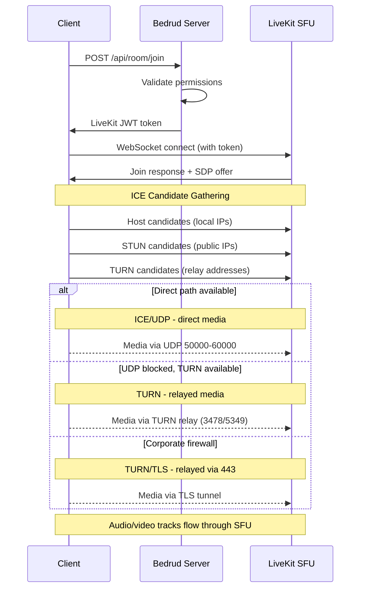
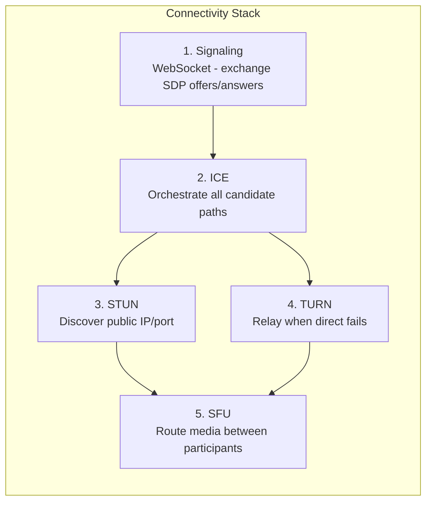
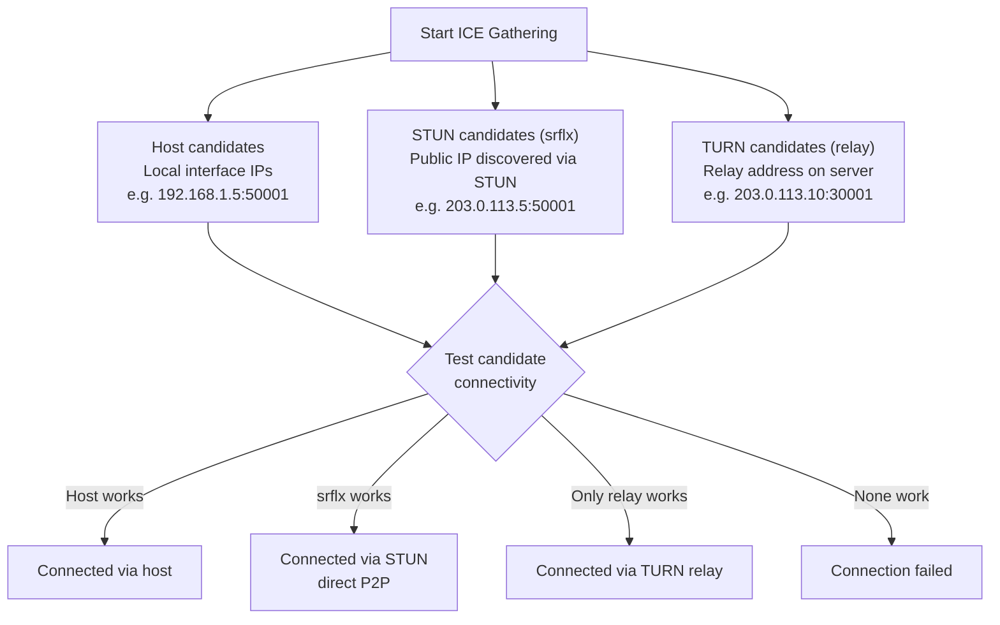
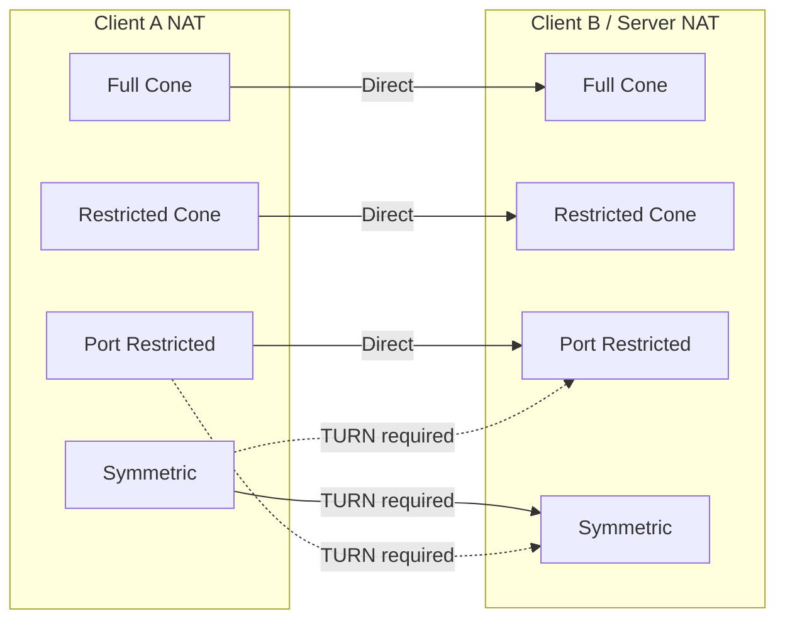

Bedrud でクライアントがリアルタイムメディア接続を確立する仕組みについて説明します。シグナリング、ICE、STUN、TURN、SFU メディアパスの完全な接続スタックをカバーします。

---

## 概要

WebRTC では、クライアントとサーバー間で音声とビデオが流れる前に一連の手順が必要です。Bedrud は LiveKit の SFU（Selective Forwarding Unit）アーキテクチャを使用しています。クライアントは互いではなく、サーバーに接続します。**つまり、個々の参加者間の接続ではなく、クライアントとサーバー間のネットワークパスのみが重要**です。



---

## 接続スタック

メディアパスを確立するために、5つのレイヤーが連携して動作します。



### 各レイヤーの詳細

**1. シグナリング** - クライアントとサーバーは WebSocket 経由で SDP（Session Description Protocol）のオファーとアンサーを使って接続メタデータを交換します。これはメディアではなく、セットアップフェーズです。Bedrud は API サーバー経由でシグナリングをプロキシし、組み込みの LiveKit インスタンスに転送します。

**2. ICE（Interactive Connectivity Establishment）** - 候補（candidates）と呼ばれるすべての可能な接続パスを収集し、優先順位に従ってテストします。ICE はフレームワークであり、接続の試行を調整するものですが、プロトコルそのものではありません。

**3. STUN（Session Traversal Utilities for NAT）** - 軽量プロトコルです。クライアントが STUN サーバーにバインディングリクエストを送信すると、サーバーはクライアントのパブリック IP とポートで応答します。この「サーバーリフレクシブ」候補が直接接続のためにテストされます。約 80% の接続で機能します。

**4. TURN（Traversal Using Relays around NAT）** - 直接接続に失敗した場合、TURN はサーバー上にリレーアドレスを割り当てます。すべてのメディアパケットはこのリレーを通じて転送されます。コストが最も高く、サーバーの帯域幅はリレーするユーザーに比例して増加します。詳細は [TURN サーバーガイド](turn-server.mdx) を参照してください。

**5. SFU（Selective Forwarding Unit）** - トランスポートパスが確立されると、LiveKit の SFU が参加者間でメディアをルーティングします。各参加者は一つのストリームを送信し、SFU がコピーを他の参加者に転送します。これはピアツーピアではなく、サーバーが常にパス上に存在します。

---

## ICE 候補の収集



ICE は3種類の候補タイプを同時に収集します。

| タイプ | 送信元 | 優先度 | 動作 |
|------|--------|----------|-------------|
| **host** | ローカルネットワークインターフェース | 最高 | マシンからの直接 IP。LAN 内で機能します。 |
| **srflx**（サーバーリフレクシブ） | STUN サーバーの応答 | 中 | STUN 経由で発見されたパブリック IP。ほとんどの NAT タイプで機能します。 |
| **relay** | TURN サーバーの割り当て | 最低 | TURN サーバー上のアドレス。常に機能します。コストが最も高い。 |

ICE はすべての候補をテストし、成功した最も優先度の高いペアを選択します。`srflx` が機能する場合、`relay` はスキップされます。

---

## NAT タイプと接続性

NAT タイプによって、直接接続が可能かどうかが変わります。



| NAT タイプ | 説明 | 直接 P2P | TURN 必要 |
|----------|-------------|------------|-----------|
| **Full Cone** | 同じ内部 IP/ポートからのすべてのリクエストが同じパブリック IP/ポートにマッピングされます。任意の外部ホストから送信可能です。 | はい | いいえ |
| **Restricted Cone** | Full Cone と同じマッピングですが、パケットを受信した外部ホストのみが送信できます。 | 通常 | いいえ |
| **Port Restricted Cone** | Restricted Cone に似ていますが、NAT が外部ポート番号も制限します。最も一般的な家庭用ルータータイプです。 | 通常 | まれ |
| **Symmetric** | 宛先ごとに異なるパブリック IP/ポートマッピング。STUN で発見されたアドレスは再利用できません。 | いいえ（両方が Symmetric の場合） | **はい** |

**重要なポイント:** サーバーはパブリック IP と予測可能なポート範囲を持っているため、ほとんどの NAT タイプで直接接続が機能します。TURN は主に、クライアントのファイアウォールが送信 UDP を完全にブロックしている場合に必要です。

---

## 設定の概要

Bedrud/LiveKit のどの設定キーが WebRTC 接続に影響するか：

**`livekit.yaml` の設定キー：**

```yaml
rtc:
  port_range_start: 50000       # UDP media port range start
  port_range_end: 60000         # UDP media port range end
  tcp_port: 7881                # ICE/TCP fallback port
  stun_servers:                 # External STUN servers (optional)
    - stun:stun.l.google.com:19302
  use_external_ip: true         # Advertise public IP in ICE candidates

turn:
  enabled: true                 # Enable embedded TURN
  domain: "turn.example.com"    # TURN domain (DNS must resolve)
  udp_port: 3478                # TURN/UDP + STUN port
  tls_port: 5349                # TURN/TLS port (or 443)
  cert_file: /path/to/turn.crt  # TLS cert for TURN/TLS
  key_file: /path/to/turn.key   # TLS key for TURN/TLS
  relay_range_start: 30000      # Relay port range start
  relay_range_end: 40000        # Relay port range end
  external_tls: false           # L4 LB terminates TLS
```

**`config.yaml` の設定キー（Bedrud サーバー）：**

```yaml
server:
  port: 8090                    # API port (signaling proxied through this)
  enableTLS: true               # HTTPS for signaling
  domain: "meet.example.com"    # Public domain
```

### 接続問題のデバッグ

| 症状 | 確認項目 |
|---------|-------|
| まったく接続できない | `rtc.use_external_ip: true`？ファイアウォールで 443 + UDP 範囲が開放されている？ |
| 接続できるが音声/ビデオがない | UDP 50000-60000 がブロックされている？ブラウザで ICE 候補を確認。 |
| 接続が遅い | TURN リレーがアクティブ（候補を確認）。厳格な NAT の背後の場合は想定内。 |
| 企業ネットワークで失敗する | TURN/TLS が未設定。`turn.tls_port: 443` を有効な証明書で設定。 |
| LAN では機能するがリモートで失敗する | パブリック IP がアドバタイズされていない。`rtc.use_external_ip: true` を設定。 |

TURN の詳細なトラブルシューティングについては、[TURN サーバーガイド](/ja/docs/architecture/turn-server) を参照してください。

---

## 関連項目

- [TURN サーバーガイド](/ja/docs/architecture/turn-server) - TURN アーキテクチャ、設定、TLS、デバッグ
- [LiveKit インテグレーション](/ja/docs/backend/livekit) - Bedrud が LiveKit を組み込む方法
- [アーキテクチャ概要](/ja/docs/architecture/overview) - システム全体のアーキテクチャ
- [Internal TLS](/ja/docs/guides/internal-tls) - 分離ネットワーク向け TLS
