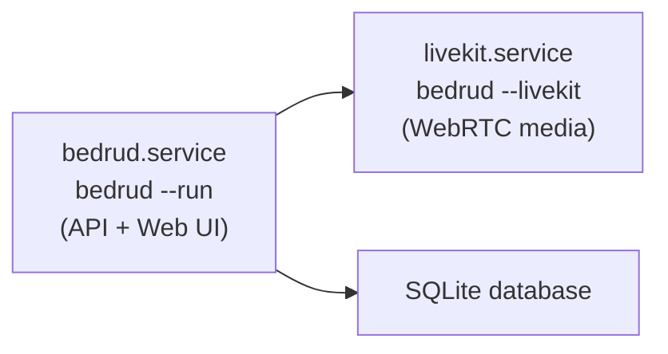

Bedrud はビデオ会議のための自己完結型「アプライアンス」として動作するよう設計されています。単一の実行可能バイナリにフロントエンド、バックエンド、LiveKit メディアサーバーがすべてパッケージ化されています。

## 主な機能

| 機能 | 説明 |
|---------|-------------|
| 外部依存関係ゼロ | Node.js、Redis、独立したメディアサーバーが不要 |
| 組み込みメディアサーバー | LiveKit バイナリが含まれ、自動的に管理 |
| 組み込みフロントエンド | React UI をコンパイルし、SSR で Go バイナリに事前レンダリング |
| SQLite ストレージ | データベースサーバーが不要 |
| 内蔵 TLS | 自己署名証明書または Let's Encrypt |
| 内蔵インストーラー | systemd、ディレクトリ、設定ファイルを自動構成 |

## バイナリの実行

### Bedrud サーバーの起動

```bash
./bedrud --run --config config.yaml
```

### LiveKit メディアサーバーの起動

```bash
./bedrud --livekit --config livekit.yaml
```

バイナリには API サーバーとメディアサーバーの両方が含まれています。フラグで起動するサーバーを選択します。

## インストール

### クイックインストール（Debian/Ubuntu）

```bash
# Let's Encrypt TLS を使用
sudo ./bedrud install --tls --domain meet.example.com --email admin@example.com

# 自己署名証明書を使用
sudo ./bedrud install --tls --ip 1.2.3.4

# プレーン HTTP（開発用のみ）
sudo ./bedrud install --ip 1.2.3.4
```

<InstallerSteps />

### サービスアーキテクチャ

インストール後、2つの systemd サービスが実行されます：



## 設定ファイル

| ファイル | 用途 |
|------|---------|
| `/etc/bedrud/config.yaml` | メインサーバー設定 |
| `/etc/bedrud/livekit.yaml` | メディアサーバー設定 |
| `/var/lib/bedrud/bedrud.db` | SQLite データベース |
| `/var/log/bedrud/bedrud.log` | アプリケーションログ |

すべてのオプションについては、[設定リファレンス](/ja/docs/getting-started/configuration)を参照してください。

## インストール後

### 最初の管理者を作成

<CreateAdmin />

### サービスステータスの確認

```bash
systemctl status bedrud livekit
```

### ログの表示

```bash
tail -f /var/log/bedrud/bedrud.log
journalctl -u bedrud -f
```

## アンインストール

```bash
sudo ./bedrud uninstall
```

以下を完全に削除します：

- systemd サービスファイル
- `/usr/local/bin/` からバイナリ
- `/etc/bedrud/` の設定ファイル
- `/var/lib/bedrud/` のデータ
- `/var/log/bedrud` のログ
