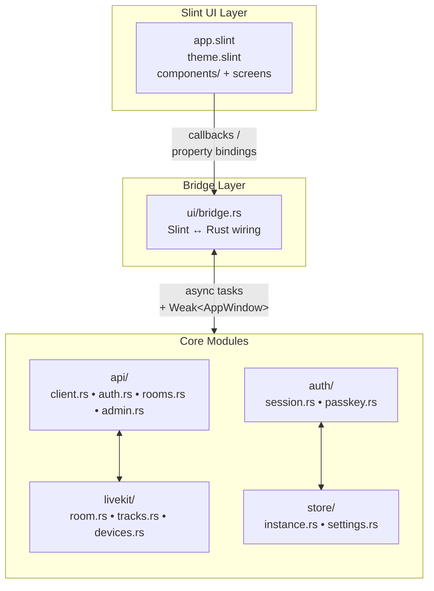

Десктопный клиент Bedrud - это нативное приложение для Windows и Linux, построенное на **Rust** и UI-фреймворке **Slint**. Оно предоставляет такой же базовый интерфейс видеоконференций, как веб- и мобильные клиенты, компилируясь в единый бинарник без зависимостей времени выполнения.

## Стек технологий

| Компонент | Технология |
|-----------|-----------|
| Язык | Rust (stable) |
| UI-фреймворк | Slint 1.x |
| HTTP-клиент | reqwest (async, TLS) |
| Медиа | LiveKit Rust SDK |
| Хранилище | serde_json + OS keyring (libsecret / Windows Credential Store) |
| Система сборки | Cargo workspace |

## Поддержка платформ

| Платформа | Рендерер | Бинарник |
|----------|----------|--------|
| Windows 10/11 | Direct3D 11 | `bedrud-desktop.exe` |
| Linux x86_64 | OpenGL / Vulkan (через EGL/Wayland/X11) | `bedrud-desktop` |
| macOS | _(пока недоступно - используйте веб-приложение)_ | - |

## Структура исходного кода

```
apps/desktop/
├── Cargo.toml              # Crate definition
├── build.rs                # Slint compile step
├── src/
│   ├── main.rs             # Entry point - initialises app + event loop
│   ├── app.rs              # Top-level AppState and startup logic
│   ├── api/
│   │   ├── client.rs       # Shared HTTP client (base URL, JWT injection)
│   │   ├── auth.rs         # Login, register, refresh
│   │   ├── rooms.rs        # Room list, join, create
│   │   └── admin.rs        # Admin endpoints
│   ├── auth/
│   │   ├── session.rs      # JWT storage and refresh loop
│   │   └── passkey.rs      # FIDO2 passkey stub
│   ├── livekit/
│   │   ├── room.rs         # Room connection lifecycle
│   │   ├── tracks.rs       # Audio/video track management
│   │   └── devices.rs      # Microphone / camera enumeration
│   ├── store/
│   │   ├── instance.rs     # Multi-instance persistence
│   │   └── settings.rs     # User preferences
│   └── ui/
│       ├── mod.rs
│       └── bridge.rs       # Slint ↔ Rust callback wiring
└── ui/
    ├── app.slint            # Root component, page router
    ├── theme.slint          # Colours, typography, spacing tokens
    ├── components/          # Button, Input, Card, Avatar
    ├── auth/                # Login and Register screens
    ├── dashboard/           # Room list, Create-room dialog
    ├── meeting/             # Controls bar, participant tiles, chat
    ├── admin/               # Admin panel, user table
    └── settings.slint       # Settings screen
```

## Архитектура



### Ключевые архитектурные решения

- **Компиляция UI во время сборки** - файлы `.slint` компилируются в Rust на этапе сборки через `build.rs`. Движок разметки во время выполнения отсутствует; UI полностью нативный.
- **`bridge.rs` как единая граница UI↔логика** - все callback-и Slint подключаются в одном месте, что отделяет бизнес-логику от UI-слоя и упрощает аудит моста.
- **`Weak<AppWindow>` в callback-ах** - дескрипторы UI Slint не являются `Send`, поэтому фоновые задачи обновляют сохранённую `Weak`-ссылку в UI-потоке для установки свойств, вместо передачи дескриптора между потоками.
- **Несколько экземпляров через `store/instance.rs`** - аналогично мобильным приложениям: экземпляры сериализуются в JSON-файл в конфигурационной директории ОС; каждый экземпляр имеет собственные `APIClient` и `AuthSession`.

## Локальная сборка

### Необходимые компоненты

- Стабильная версия Rust (`rustup toolchain install stable`)
- **Linux:** `libfontconfig`, `libxkbcommon`, `libwayland`, `libgles2`, `libdbus`, `libsecret`

  ```bash
  sudo apt-get install -y \
    libfontconfig1-dev libxkbcommon-dev libxkbcommon-x11-dev \
    libwayland-dev libgles2-mesa-dev libegl1-mesa-dev \
    libdbus-1-dev libsecret-1-dev \
    libasound2-dev
  ```

- **Windows:** Visual Studio Build Tools (MSVC) с рабочей нагрузкой C++

### Сборка

```bash
# Debug build (fast compile, no optimisations)
make dev-desktop          # runs the app immediately after build

# Release build
make build-desktop        # → target/release/bedrud-desktop (Linux)
                           # → target/release/bedrud-desktop.exe (Windows)
```

Или напрямую через Cargo:

```bash
cargo build -p bedrud-desktop                          # debug
cargo build -p bedrud-desktop --release                # optimised
cargo run   -p bedrud-desktop                          # run immediately
```

## CI

Десктопное приложение собирается в CI при каждом пуше в `main` и в pull-реквестах:

| Задача | Среда выполнения | Что проверяет |
|-----|--------|----------------|
| `Desktop – Build & Test` | `ubuntu-latest` | `cargo build`, `cargo test` |

Release-сборки создают два артефакта:

| Артефакт | Среда | Формат |
|----------|--------|--------|
| `bedrud-desktop-linux-x86_64.tar.xz` | `ubuntu-latest` | tar.xz |
| `bedrud-desktop-windows-x86_64.zip` | `windows-latest` | zip |
