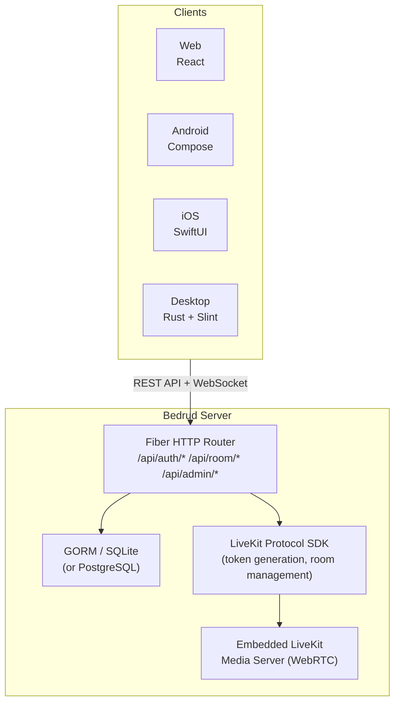
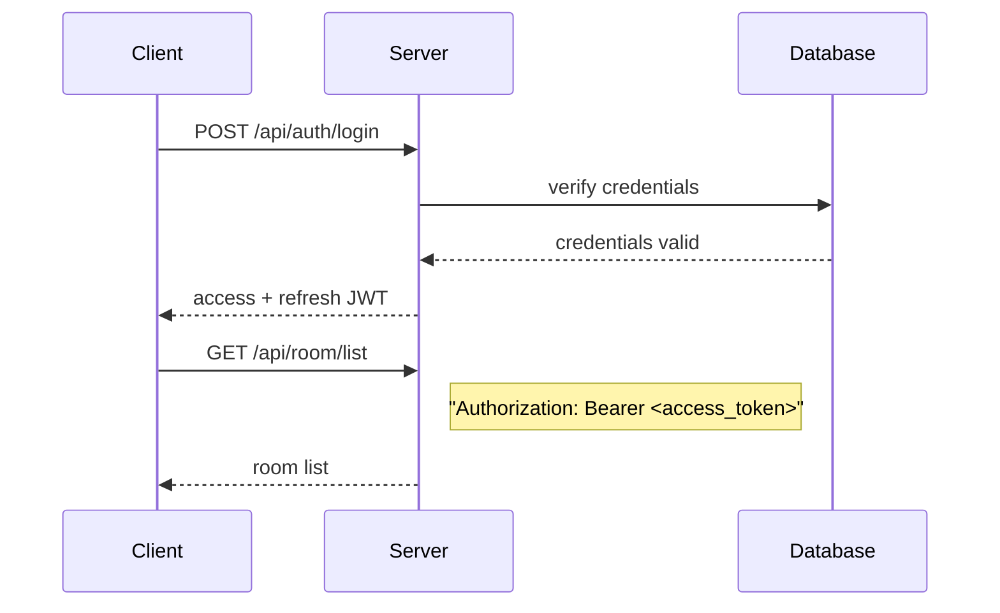
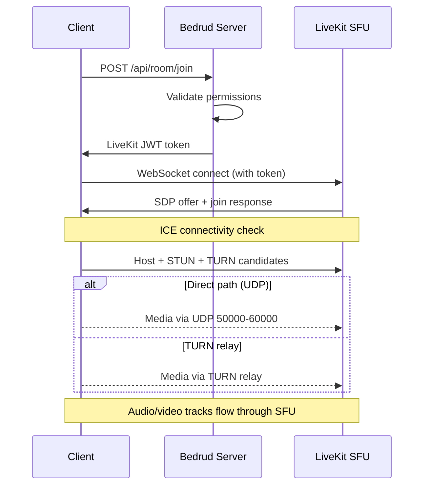

Bedrud - это монорепозиторий, содержащий сервер на Go, три клиентских приложения, ботов-агентов на Python и общие пакеты. Эта страница описывает взаимосвязь между компонентами.

## Высокоуровневая диаграмма

## Компоненты

### Сервер (`server/`)

Бэкенд на Go - ядро Bedrud. Он отвечает за:

- **REST API** - аутентификация, управление комнатами, административные операции
- **Раздача статических файлов** - скомпилированный веб-фронтенд встраивается через `//go:embed`
- **Интеграция с LiveKit** - генерация токенов и управление комнатами через LiveKit Protocol SDK
- **Встроенный сервер LiveKit** - бинарник медиасервера запускается как дочерний процесс

Сервер использует веб-фреймворк **Fiber** (аналог Express.js в Node.js) и **GORM** в качестве ORM. Поддерживает SQLite для разработки и PostgreSQL для продакшена.

Подробнее см. [Архитектура сервера](/ru/docs/architecture/server).

### Веб-фронтенд (`apps/web/`)

Приложение на **React**, построенное с TanStack Start, TailwindCSS v4 и shadcn/ui. В продакшене оно предварительно рендерится на сервере, а клиентские ресурсы встраиваются в бинарник Go.

Ключевые возможности:

- Интерфейс видеоконференций с LiveKit Client SDK
- Аутентификация на основе JWT с автоматическим обновлением токенов
- Панель администратора для управления пользователями и комнатами
- Система дизайна с единообразной библиотекой компонентов

Подробнее см. [Веб-фронтенд](/ru/docs/architecture/web).

### Приложение для Android (`apps/android/`)

Нативное приложение для Android, построенное на **Jetpack Compose** и **Kotlin**. Использует Koin для внедрения зависимостей и Retrofit для HTTP-запросов.

Ключевые возможности:

- Полноценный интерфейс видеоконференций с LiveKit Android SDK
- Режим «картинка в картинке»
- Обработка глубоких ссылок (`bedrud.com/m/*` и `bedrud.com/c/*`)
- Управление звонками через Android ConnectionService
- Поддержка нескольких экземпляров (подключение к нескольким серверам)

Подробнее см. [Приложение для Android](/ru/docs/architecture/android).

### Приложение для iOS (`apps/ios/`)

Нативное приложение для iOS, построенное на **SwiftUI**. Использует KeychainAccess для безопасного хранения учётных данных и LiveKit Swift SDK для работы с медиа.

Ключевые возможности:

- Полноценный интерфейс видеоконференций
- Поддержка нескольких экземпляров
- Обработка глубоких ссылок
- Безопасное хранение учётных данных в Keychain

Подробнее см. [Приложение для iOS](/ru/docs/architecture/ios).

### Десктопное приложение (`apps/desktop/`)

Нативное приложение для Windows и Linux, построенное на **Rust** и UI-фреймворке **Slint**. Компилируется в единый бинарник без зависимостей времени выполнения.

Ключевые возможности:

- Полноценный интерфейс видеоконференций через LiveKit Rust SDK
- Нативный рендеринг: Windows (Direct3D 11) и Linux (OpenGL/Vulkan)
- Поддержка нескольких экземпляров (подключение к нескольким серверам Bedrud)
- Интеграция с OS keyring для безопасного хранения учётных данных

Подробнее см. [Десктопное приложение](/ru/docs/architecture/desktop).

### Боты-агенты (`agents/`)

Скрипты на Python, которые подключаются к комнатам как боты и транслируют медиаконтент:

- **Музыкальный агент** - воспроизводит аудиофайлы
- **Радио-агент** - транслирует интернет-радиостанции
- **Видеостриминг-агент** - делится видеоконтеинтом (HLS, MP4)

Подробнее см. [Боты-агенты](/ru/docs/architecture/agents).

## Процесс аутентификации

Все аутентифицированные запросы используют JWT-токены в заголовке `Authorization`. Обёртка `authFetch` веб-фронтенда автоматически добавляет токен и обновляет его.

Поддерживаемые методы аутентификации:

| Метод | Эндпоинт | Описание |
|--------|----------|-------------|
| Email/пароль | `POST /api/auth/login` | Традиционные учётные данные |
| Регистрация | `POST /api/auth/register` | Создание нового аккаунта |
| Гостевой вход | `POST /api/auth/guest-login` | Временный доступ только по имени |
| OAuth | `GET /api/auth/:provider/login` | Google, GitHub, Twitter |
| Ключи доступа | `POST /api/auth/passkey/*` | Биометрия FIDO2/WebAuthn |

## Процесс подключения к конференции

1. Клиент запрашивает подключение к комнате через REST API
2. Сервер проверяет разрешения и генерирует подписанный LiveKit-токен
3. Клиент подключается напрямую к LiveKit через WebSocket, используя токен
4. ICE собирает кандидатов (host, STUN, TURN) и выбирает лучший маршрут
5. Аудио- и видеодорожки проходят через SFU LiveKit

Подробнее см. [Подключение WebRTC](/ru/docs/architecture/webrtc-connectivity) - полный стек подключения.

## Модель данных

### User

| Поле | Тип | Описание |
|-------|------|-------------|
| ID | uint | Первичный ключ |
| Email | string | Уникальный email-адрес |
| Name | string | Отображаемое имя |
| Password | string | Хэш пароля (пустой для OAuth/гостя) |
| Avatar | string | URL аватара |
| Provider | string | Провайдер аутентификации (`local`, `google`, `github`, `twitter`, `guest`) |
| Role | string | `user` или `admin` |

### Room

| Поле | Тип | Описание |
|-------|------|-------------|
| ID | uint | Первичный ключ |
| AdminID | uint | Внешний ключ → User.ID (создатель комнаты) |
| Name | string | Название комнаты / URL-слаг |
| IsPublic | bool | Могут ли гости присоединиться без приглашения |
| ChatEnabled | bool | Активен ли чат в комнате |
| VideoEnabled | bool | Разрешено ли видео |
| Participants | []User | Пользователи, находящиеся в комнате |

### Passkey

| Поле | Тип | Описание |
|-------|------|-------------|
| ID | uint | Первичный ключ |
| UserID | uint | Внешний ключ → User.ID |
| CredentialID | []byte | Идентификатор учётных данных WebAuthn |
| PublicKey | []byte | Публичный ключ WebAuthn |
| Counter | uint32 | Счётчик подписей WebAuthn |

### RefreshToken

| Поле | Тип | Описание |
|-------|------|-------------|
| Token | string | Строка refresh-токена |
| UserID | uint | Внешний ключ → User.ID |
| ExpiresAt | time | Время истечения токена |

## Архитектура развёртывания

В продакшене Bedrud работает как два сервиса systemd:

| Сервис | Бинарник | Назначение |
|---------|--------|---------|
| `bedrud.service` | `bedrud --run` | API-сервер + встроенный веб-фронтенд |
| `livekit.service` | `bedrud --livekit` | Медиасервер WebRTC |

Оба сервиса управляются единым бинарником. Traefik или другой обратный прокси обрабатывает TLS-терминацию и маршрутизацию трафика.

Инструкции по настройке см. в [Руководстве по развёртыванию](/ru/docs/guides/deployment).

## Ключевые термины

Эти термины встречаются в документации по архитектуре:

| Термин | Полное название | Значение |
|------|-----------|---------|
| **SFU** | Selective Forwarding Unit | Медиасервер, который получает потоки от каждого участника и перенаправляет их остальным. Клиенты подключаются к серверу, а не друг к другу. |
| **SDP** | Session Description Protocol | Формат описания параметров соединения WebRTC (кодеки, разрешения, типы медиа). |
| **ICE** | Interactive Connectivity Establishment | Фреймворк, который собирает все возможные сетевые маршруты между клиентом и сервером, затем выбирает лучший. |
| **STUN** | Session Traversal Utilities for NAT | Лёгкий протокол, помогающий клиенту узнать свой публичный IP-адрес. Работает для большинства соединений. |
| **TURN** | Traversal Using Relays around NAT | Протокол, который ретранслирует все медиаданные через сервер, когда прямое соединение невозможно. Последнее средство, наибольшая нагрузка на канал. |
| **NAT** | Network Address Translation | Функция маршрутизатора, сопоставляющая внутренние приватные адреса с публичным. Может блокировать прямые WebRTC-соединения в зависимости от типа. |
| **srflx** | Server Reflexive | Тип ICE-кандидата, представляющий публичный IP клиента, обнаруженный через STUN. |
| **WebRTC** | Web Real-Time Communication | Стандарт браузерного и мобильного API для передачи аудио, видео и данных в реальном времени. |

## См. также

- [Подключение WebRTC](/ru/docs/architecture/webrtc-connectivity) - полный стек подключения STUN/ICE/TURN/SFU
- [Руководство по TURN-серверу](/ru/docs/architecture/turn-server) - архитектура и настройка TURN-ретрансляции
- [Интеграция с LiveKit](/ru/docs/backend/livekit) - как Bedrud встраивает LiveKit
