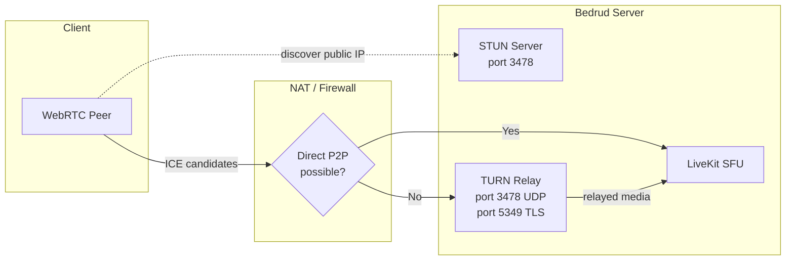
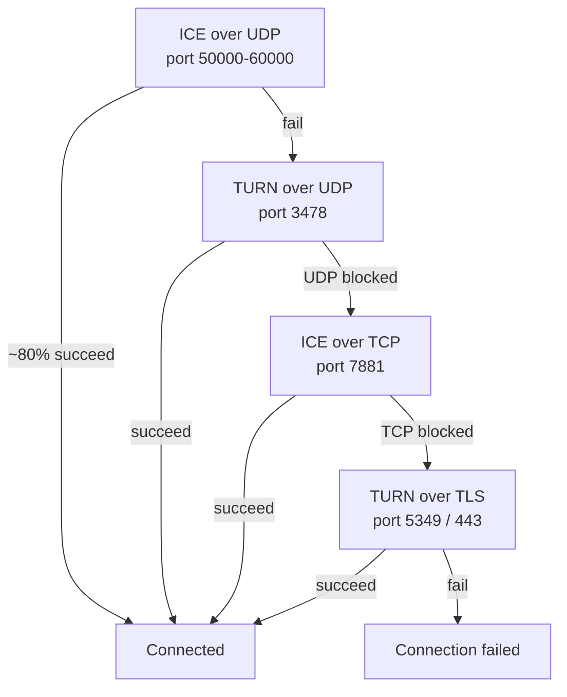
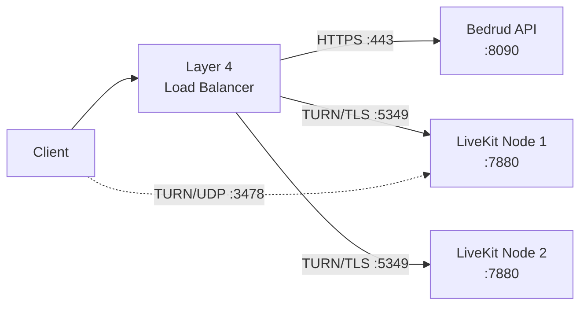
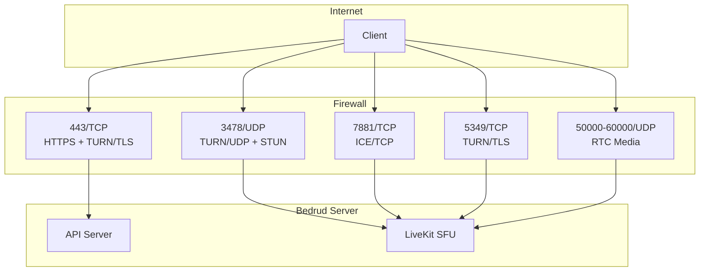

Bedrud встраивает TURN-сервер через LiveKit для ретрансляции медиа клиентам за ограничительными NAT или файрволами. Эта страница описывает архитектуру, конфигурацию и устранение неполадок.

---

## Что такое TURN

**TURN** (Traversal Using Relays around NAT) - это протокол, который пересылает медиапакеты через сервер, когда две конечные точки не могут соединиться напрямую.

**Связанные протоколы:**

| Протокол | Роль | Нагрузка |
|----------|------|------|
| **STUN** | Обнаружение публичного IP/порта. Лёгкий. | Отсутствует (сервер видит только небольшие binding-запросы) |
| **ICE** | Фреймворк, который проверяет все варианты подключения в порядке приоритета. | Отсутствует (только координация) |
| **TURN** | Ретрансляция всех медиаданных, когда прямой маршрут не работает. Последнее средство. | Высокая (пропускная способность сервера = все ретранслируемые медиа) |

См. [Подключение WebRTC](/ru/docs/architecture/webrtc-connectivity) для полного стека подключения.

---

## TURN в Bedrud

LiveKit включает встроенный TURN-сервер. Внешняя инфраструктура не требуется.

### Архитектура ретрансляции



### Приоритет подключений

LiveKit проверяет типы подключений по порядку. Каждый откат добавляет задержку и нагрузку на сервер:



| Приоритет | Тип | Порт | Типичный сценарий |
|----------|------|------|-----------------|
| 1 | ICE/UDP (прямое) | 50000-60000 | Большинство соединений. Без ретрансляции. |
| 2 | TURN/UDP | 3478 | Симметричный NAT, P2P заблокирован. |
| 3 | ICE/TCP | 7881 | UDP заблокирован (VPN, некоторые файрволы). |
| 4 | TURN/TLS | 5349 или 443 | Корпоративный файрвол, разрешён только исходящий HTTPS. |

---

## Когда активируется TURN

TURN активируется, когда прямой маршрут передачи медиа не работает. Типичные причины:

- **Симметричный NAT у обоих участников** - И у клиента, и у сервера симметричный NAT. NAT назначает разные публичные порты для каждого направления, поэтому адрес, обнаруженный через STUN, становится недоступным.
- **Корпоративный файрвол** - блокирует весь исходящий UDP. Разрешён только TCP-порт 443.
- **Ограничения VPN** - некоторые VPN перехватывают или блокируют трафик WebRTC.
- **Облачные ВМ без публичного IP** - некоторые облачные провайдеры используют NAT, нарушающий прямое ICE.

Большинство пользователей (~80%) никогда не используют TURN. Прямой UDP-маршрут работает.

### Нагрузка на канал

Когда TURN ретранслирует, сервер передаёт все медиаданные для этого участника. Приблизительная пропускная способность на поток:

| Тип потока | Битрейт | На одного ретранслируемого участника |
|-------------|---------|------------------------|
| Аудио (Opus) | ~32 Кбит/с | ~32 Кбит/с |
| Видео 720p (VP8) | ~1.5 Мбит/с | ~1.5 Мбит/с входящий + 1.5 Мбит/с исходящий на каждую подписанную дорожку |
| Демонстрация экрана 1080p | ~2.5 Мбит/с | ~2.5 Мбит/с |

Для 5--person конференции с одним ретранслируемым участником: сервер обрабатывает ~1.5 Мбит/с дополнительно для ретрансляции видео этого участника. Умножьте эти значения на количество ретранслируемых участников для оценки общей пропускной способности сервера.

---

## Конфигурация

**Файл:** `server/config/livekit.yaml` (разработка) или `/etc/bedrud/livekit.yaml` (продакшен)

```yaml
turn:
  enabled: true
  domain: "turn.example.com"
  udp_port: 3478
  tls_port: 5349
  cert_file: /etc/bedrud/turn.crt
  key_file: /etc/bedrud/turn.key
  relay_range_start: 30000
  relay_range_end: 40000
  external_tls: false
```

### Справочник ключей

| Ключ | По умолчанию | Описание |
|-----|---------|-------------|
| `enabled` | `true` | Включить встроенный TURN-сервер. |
| `domain` | `localhost` | Домен, анонсируемый клиентам. Должен разрешаться в публичный IP сервера. |
| `udp_port` | `3478` | Порт TURN/UDP. Также обслуживает STUN binding-запросы, когда TURN включён. |
| `tls_port` | `5349` | Порт TURN/TLS. Установите `443`, если нет балансировщика нагрузки, терминирующего TLS. |
| `cert_file` | - | TLS-сертификат для TURN/TLS. Необходим при наличии клиентов TURN/TLS. |
| `key_file` | - | TLS-приватный ключ, соответствующий `cert_file`. |
| `relay_range_start` | `30000` | Начало диапазона UDP-портов для ретранслируемых медиапакетов. |
| `relay_range_end` | `40000` | Конец диапазона портов ретрансляции. Каждый ретранслируемый участник использует порты из этого диапазона. |
| `external_tls` | `false` | Установите `true`, когда балансировщик нагрузки уровня 4 терминирует TURN/TLS. LiveKit пропускает собственный TLS на порту TURN. |

### Взаимодействие с `use_external_ip`

В том же файле `livekit.yaml`, в секции `rtc:`:

```yaml
rtc:
  use_external_ip: true
```

Должно быть `true` для корректной работы TURN. При значении `false` ICE-кандидаты содержат внутренние (приватные) IP-адреса, недоступные клиентам из интернета.

---

## Настройка TLS в продакшене

TURN/TLS требует собственный TLS-сертификат. Два подхода:

### Единый домен (без балансировщика нагрузки)

Используйте TLS-сертификат сервера повторно. Установите `tls_port` на `443`:

```yaml
turn:
  enabled: true
  domain: "meet.example.com"
  tls_port: 443
  cert_file: /etc/bedrud/meet.example.com.crt
  key_file: /etc/bedrud/meet.example.com.key
```

Домен TURN и домен сервера совпадают. Порт 443 обслуживает и HTTPS API, и TURN/TLS - LiveKit различает их по протоколу.

### Выделенный домен TURN (с балансировщиком нагрузки)



```yaml
turn:
  enabled: true
  domain: "turn.example.com"
  tls_port: 5349
  external_tls: true
```

Балансировщик нагрузки терминирует TLS. `external_tls: true` указывает LiveKit ожидать уже расшифрованный трафик.

---

## Справочник портов и файрвола



| Порт | Протокол | Сервис | Обязателен | Примечания |
|------|----------|---------|----------|-------|
| 443 | TCP | HTTPS + TURN/TLS | Да | API + веб-интерфейс. Также TURN/TLS, если `tls_port: 443`. |
| 3478 | UDP | TURN/UDP + STUN | Рекомендуется | Двойное назначение: STUN binding + ретрансляция TURN. |
| 5349 | TCP | TURN/TLS | Если нет LB | Выделенный порт TURN/TLS. Пропустите, если используется порт 443. |
| 7881 | TCP | ICE/TCP | Рекомендуется | Запасной вариант при заблокированном UDP без необходимости TLS. |
| 50000-60000 | UDP | RTC-медиа | Да | Порты ICE-кандидатов. Каждый участник использует 2 порта. |
| 7880 | TCP | LiveKit API | Внутренний | Сигнализация WebSocket. Не открывается напрямую в продакшене. |

### Минимальные правила файрвола

Для базовой связности:

```
Allow TCP 443    (HTTPS + TURN/TLS)
Allow UDP 3478   (TURN/UDP + STUN)
Allow UDP 50000-60000  (RTC media)
```

Для максимальной совместимости (корпоративные сети):

```
Also allow TCP 7881  (ICE/TCP)
Also allow TCP 5349  (TURN/TLS, if not using port 443)
```

---

## Тестирование и отладка

### Браузер: chrome://webrtc-internals

1. Откройте `chrome://webrtc-internals` в Chrome/Edge перед подключением к конференции.
2. Создайте дамп.
3. Найдите **ICE candidate pairs** на вкладке Stats.
4. Типы кандидатов показывают маршрут соединения:

| Тип кандидата | Значение |
|---------------|---------|
| `host` | Локальный IP. Прямой интерфейс. |
| `srflx` (server reflexive) | Публичный IP, обнаруженный через STUN. Прямое P2P работает. |
| `relay` | Ретрансляция TURN активна. Медиа проходит через сервер. |

Если вы видите кандидатов `relay` как активную пару, TURN обрабатывает это соединение.

### События LiveKit Client SDK

Все SDK LiveKit генерируют события состояния соединения:

```typescript
room.on(RoomEvent.Connected, () => {
  console.log("Connected");
});

room.on(RoomEvent.Reconnecting, () => {
  console.log("Connection lost, reconnecting...");
});
```

Проверяйте `room.localParticipant.connectionQuality` для статистики соединения.

### Логи сервера LiveKit

Увеличьте уровень логирования для отладки в `livekit.yaml`:

```yaml
logging:
  level: debug
```

Ищите записи логов, содержащие:
- `ICE` - статус сбора кандидатов
- `TURN` - события выделения ретрансляции
- `relay` - активные ретрансляционные соединения

### Ручное тестирование TURN с turnutils

Установите пакет `coturn-utils`, затем проверьте связность TURN:

```bash
turnutils_uclient -t -p 3478 -W devkey -u devkey turn.example.com
```

- `-t` - использовать TCP
- `-p` - порт TURN
- Замените учётные данные на продакшен-значения

Успешный вывод покажет выделенные адреса ретрансляции.

---

## Устранение неполадок

| Симптом | Вероятная причина | Решение |
|---------|-------------|-----|
| Клиенты не могут подключиться, тайм-аут | Порты TURN заблокированы файрволом | Откройте UDP 3478, TCP 5349, UDP 50000-60000 |
| TURN/TLS не работает | Отсутствует или несоответствующий TLS-сертификат | Проверьте пути `cert_file`/`key_file`. Убедитесь, что сертификат соответствует `domain`. |
| TURN/TLS не работает с LB | `external_tls` не установлен | Установите `external_tls: true` в конфигурации. |
| Одностороннее аудио/видео | Диапазон портов ретрансляции заблокирован | Откройте UDP с `relay_range_start` до `relay_range_end`. |
| Высокая пропускная способность сервера | Многие клиенты за NAT используют ретрансляцию | Ожидаемо. Масштабируйте сервер или уменьшите число ретранслируемых пользователей. |
| Кандидаты `relay`, хотя ожидаются `srflx` | `use_external_ip: false` | Установите `rtc.use_external_ip: true`. |
| Домен TURN не разрешается | Ошибка конфигурации DNS | `dig +short turn.example.com` должен возвращать публичный IP сервера. |
| Клиенты за корпоративным файрволом | Разрешён только порт 443 | Установите `turn.tls_port: 443`. Убедитесь, что сертификат валиден. |
| `turn.enabled: true`, но ретрансляции нет | Прямой маршрут работает (это хорошо) | TURN - запасной вариант. Нет ретрансляции = лучше. Проверьте через `chrome://webrtc-internals`. |

### Быстрый контрольный список диагностики

1. `dig +short <turn.domain>` возвращает корректный публичный IP?
2. Файрвол разрешает UDP 3478, TCP 5349, UDP 50000-60000?
3. `tls_port: 443` или `5349` соответствует правилам файрвола?
4. `cert_file` и `key_file` существуют и доступны для чтения?
5. CN/SAN сертификата соответствует `turn.domain`?
6. Установлено `rtc.use_external_ip: true`?
7. Логи LiveKit не содержат ошибок, связанных с TURN?

---

## См. также

- [Подключение WebRTC](/ru/docs/architecture/webrtc-connectivity) - полный стек подключения STUN/ICE/TURN/SFU
- [Интеграция с LiveKit](/ru/docs/backend/livekit) - как Bedrud встраивает LiveKit
- [Справочник конфигурации](/ru/docs/getting-started/configuration) - все параметры конфигурации
- [Внутренний TLS](/ru/docs/guides/internal-tls) - TLS для изолированных сетей
- [Руководство по развёртыванию](/ru/docs/guides/deployment) - шаги продакшен-развёртывания
