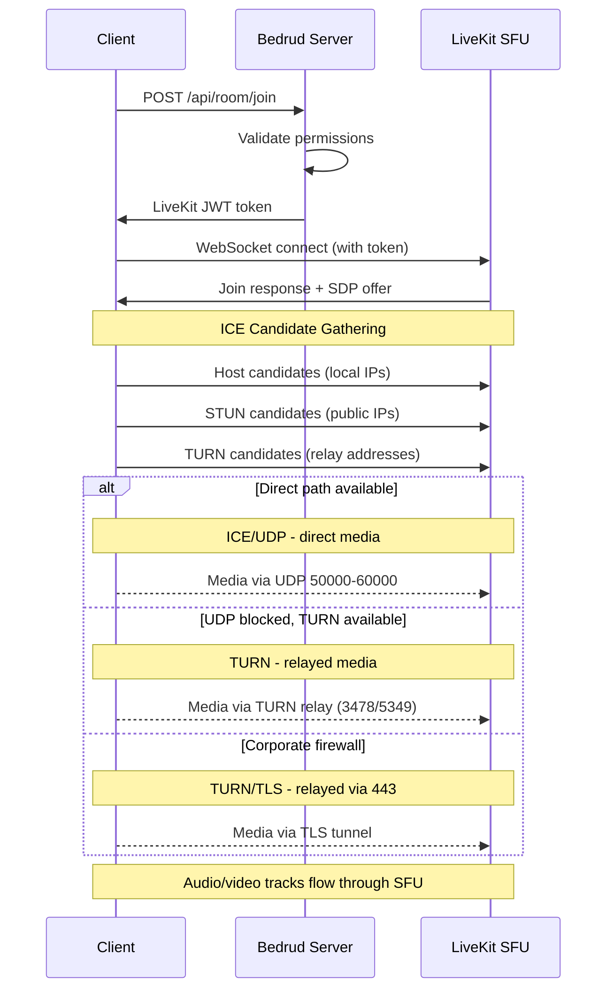
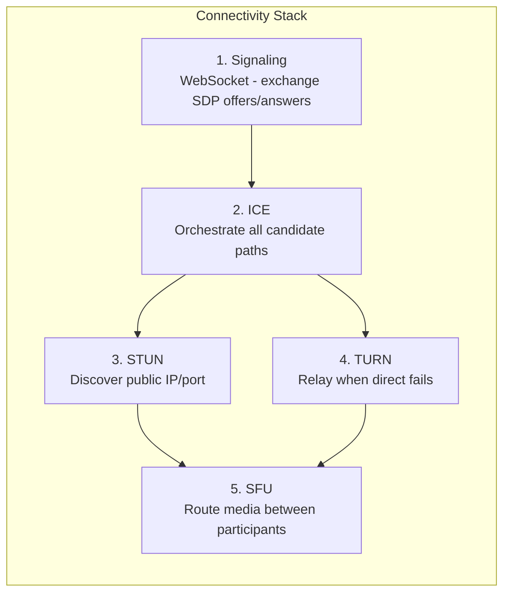
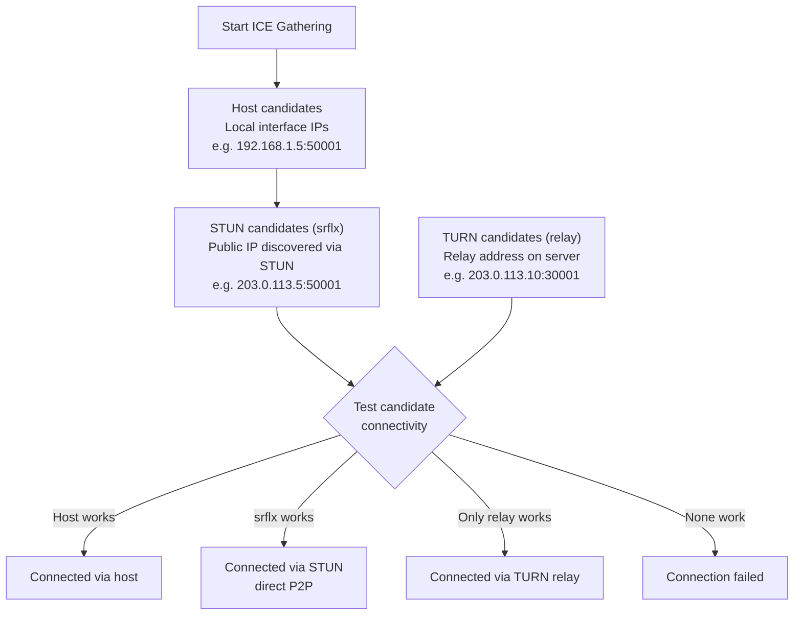
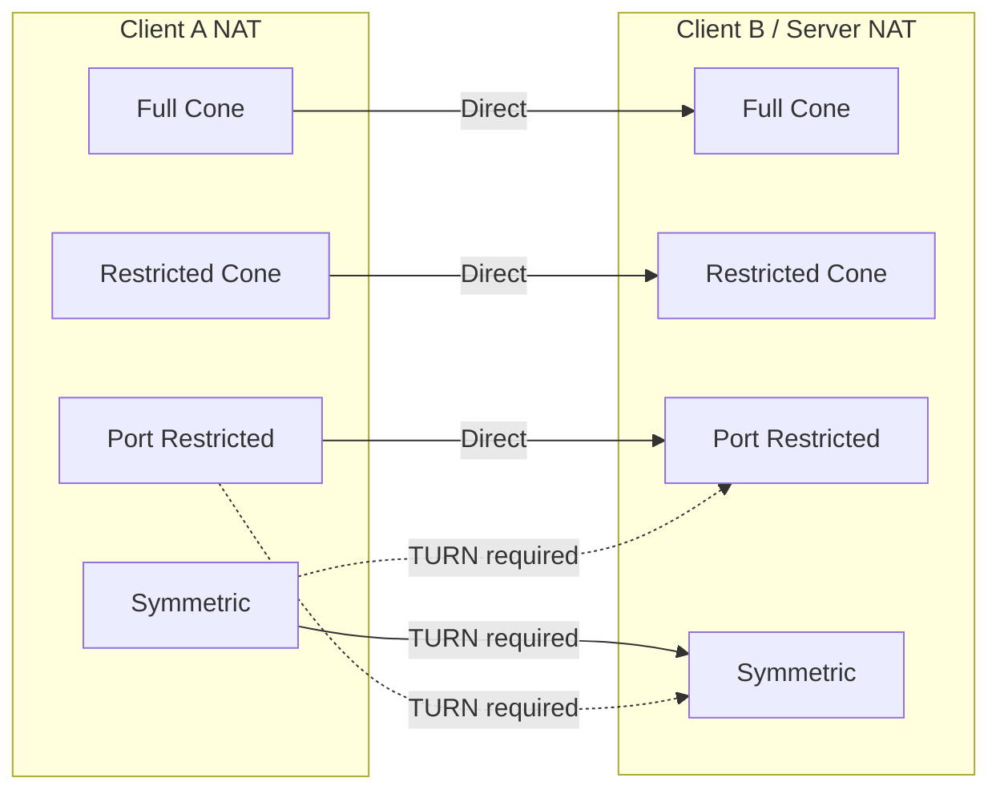

Как клиенты устанавливают соединения для передачи медиа в реальном времени в Bedrud. Описывается полный стек подключения: сигнализация, ICE, STUN, TURN и маршрут медиа через SFU.

---

## Обзор

WebRTC требует выполнения ряда шагов, прежде чем аудио и видео начнут передаваться между клиентом и сервером. Bedrud использует SFU-архитектуру (Selective Forwarding Unit) LiveKit - клиенты подключаются к серверу, а не друг к другу. **Это означает, что важен только сетевой маршрут между клиентом и сервером**, а не соединение между отдельными участниками.



---

## Стек подключения

Пять уровней работают вместе для установления маршрута передачи медиа:



### Описание уровней

**1. Сигнализация** - Клиент и сервер обмениваются метаданными соединения с помощью SDP-офферов и ответов (Session Description Protocol) через WebSocket. Это не медиа - это этап настройки. Bedrud проксирует сигнализацию через API-сервер к встроенному экземпляру LiveKit.

**2. ICE (Interactive Connectivity Establishment)** - Собирает все возможные маршруты соединения, называемые кандидатами, и проверяет их в порядке приоритета. ICE - это фреймворк, который координирует попытки соединения, но сам по себе не является протоколом.

**3. STUN (Session Traversal Utilities for NAT)** - Лёгкий протокол. Клиент отправляет binding-запрос к STUN-серверу, который отвечает публичным IP и портом клиента. Этот кандидат «server reflexive» затем проверяется на прямую достижимость. Работает для ~80% соединений.

**4. TURN (Traversal Using Relays around NAT)** - Когда прямое соединение невозможно, TURN выделяет адрес ретрансляции на сервере. Все медиапакеты пересылаются через эту ретрансляцию. Наибольшая нагрузка - пропускная способность сервера растёт с числом ретранслируемых пользователей. Подробное описание см. в [Руководстве по TURN-серверу](turn-server.mdx).

**5. SFU (Selective Forwarding Unit)** - После установления транспортного маршрута SFU LiveKit маршрутизирует медиа между участниками. Каждый участник отправляет один поток вверх; SFU пересылает копии остальным участникам. Это не peer-to-peer - сервер всегда находится на маршруте.

---

## Сбор ICE-кандидатов



ICE одновременно собирает три типа кандидатов:

| Тип | Источник | Приоритет | Как работает |
|------|--------|----------|-------------|
| **host** | Локальные сетевые интерфейсы | Наивысший | Прямой IP компьютера. Работает в локальной сети. |
| **srflx** (server reflexive) | Ответ STUN-сервера | Средний | Публичный IP, обнаруженный через STUN. Работает для большинства типов NAT. |
| **relay** | Выделение TURN-сервером | Наименьший | Адрес на TURN-сервере. Работает всегда. Наибольшая нагрузка. |

ICE проверяет всех кандидатов и выбирает пару с наивысшим приоритетом, которая прошла проверку. Если `srflx` работает, `relay` пропускается.

---

## Типы NAT и связность

Различные типы NAT влияют на возможность прямого соединения:



| Тип NAT | Описание | Прямое P2P | Нужен TURN |
|----------|-------------|------------|-----------|
| **Full Cone** | Все запросы с одного внутреннего IP/порта отображаются на один публичный IP/порт. Любой внешний хост может отправлять пакеты. | Да | Нет |
| **Restricted Cone** | То же отображение, что и Full Cone, но отправлять пакеты обратно могут только внешние хосты, которые уже получили пакет. | Обычно | Нет |
| **Port Restricted Cone** | Аналогичен Restricted Cone, но NAT также ограничивает номер внешнего порта. Наиболее распространённый тип домашних маршрутизаторов. | Обычно | Редко |
| **Symmetric** | Разное отображение публичного IP/порта для каждого направления назначения. Адрес, обнаруженный через STUN, нельзя использовать повторно. | Нет (при симметричном NAT с обеих сторон) | **Да** |

**Ключевой вывод:** Поскольку сервер имеет публичный IP и предсказуемый диапазон портов, большинство типов NAT работают напрямую. TURN в основном нужен, когда файрвол клиента блокирует исходящий UDP.

---

## Сводка конфигурации

Какие ключи конфигурации Bedrud/LiveKit влияют на подключение WebRTC:

**Ключи `livekit.yaml`:**

```yaml
rtc:
  port_range_start: 50000       # UDP media port range start
  port_range_end: 60000         # UDP media port range end
  tcp_port: 7881                # ICE/TCP fallback port
  stun_servers:                 # External STUN servers (optional)
    - stun:stun.l.google.com:19302
  use_external_ip: true         # Advertise public IP in ICE candidates

turn:
  enabled: true                 # Enable embedded TURN
  domain: "turn.example.com"    # TURN domain (DNS must resolve)
  udp_port: 3478                # TURN/UDP + STUN port
  tls_port: 5349                # TURN/TLS port (or 443)
  cert_file: /path/to/turn.crt  # TLS cert for TURN/TLS
  key_file: /path/to/turn.key   # TLS key for TURN/TLS
  relay_range_start: 30000      # Relay port range start
  relay_range_end: 40000        # Relay port range end
  external_tls: false           # L4 LB terminates TLS
```

**Ключи `config.yaml` (сервер Bedrud):**

```yaml
server:
  port: 8090                    # API port (signaling proxied through this)
  enableTLS: true               # HTTPS for signaling
  domain: "meet.example.com"    # Public domain
```

### Диагностика проблем со связностью

| Симптом | Проверка |
|---------|-------|
| Не удаётся подключиться | `rtc.use_external_ip: true`? Файрвол открыт на 443 + диапазоне UDP? |
| Подключается, но нет аудио/видео | UDP 50000-60000 заблокирован? Проверьте ICE-кандидатов в браузере. |
| Медленное подключение | Активна ретрансляция TURN (проверьте кандидатов). Ожидаемо при строгом NAT у клиента. |
| Не работает в корпоративной сети | TURN/TLS не настроен. Установите `turn.tls_port: 443` с валидным сертификатом. |
| Работает в LAN, не работает удалённо | Публичный IP не анонсируется. Установите `rtc.use_external_ip: true`. |

Для глубокой диагностики TURN см. [Руководство по TURN-серверу](/ru/docs/architecture/turn-server).

---

## См. также

- [Руководство по TURN-серверу](/ru/docs/architecture/turn-server) - архитектура TURN, конфигурация, TLS, диагностика
- [Интеграция с LiveKit](/ru/docs/backend/livekit) - как Bedrud встраивает LiveKit
- [Обзор архитектуры](/ru/docs/architecture/overview) - полная системная архитектура
- [Внутренний TLS](/ru/docs/guides/internal-tls) - TLS для изолированных сетей
