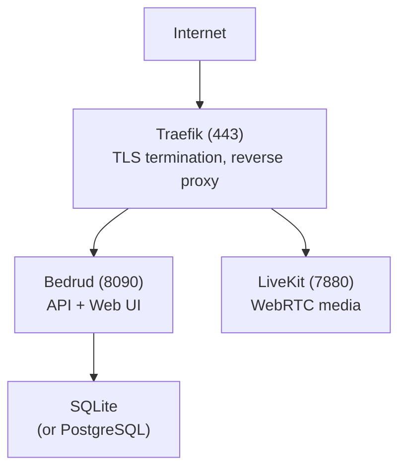

Это руководство описывает, как развернуть Bedrud на продакшен-сервере.

## Варианты развёртывания

| Метод | Лучше всего подходит для |
|--------|----------|
| [Менеджер пакетов (apt/AUR)](#package-manager) | Управляемая установка на поддерживаемых дистрибутивах Linux |
| [Автоматизированный CLI](#automated-cli-deployment) | Быстрая удалённая настройка |
| [Ручная установка](#manual-installation) | Полный контроль над конфигурацией |
| [Docker](#docker-deployment) | Контейнерные среды |
| [Режим Appliance](/ru/docs/guides/appliance) | Компонование «всё-в-одном» в одном бинарнике |

---

## Менеджер пакетов

Установите Bedrud на Debian/Ubuntu или Arch Linux с помощью встроенного менеджера пакетов. Это рекомендуемый метод для постоянных серверных развёртываний, где нужны автоматические обновления через `apt upgrade` или AUR.

См. [Руководство по установке пакетов](/ru/docs/guides/packages) для полных инструкций, включая добавление GPG-ключа и репозитория apt.

```bash
# Ubuntu / Debian
sudo apt install bedrud

# Arch Linux (AUR)
yay -S bedrud-bin
```

После установки запустите интерактивный установщик для настройки TLS, сервисов systemd и базы данных:

```bash
sudo bedrud install
```

---

## Автоматизированное развёртывание через CLI

Самый быстрый способ развёртывания. Запускается с вашей локальной машины:

**Предварительные требования:** Python 3.10+, [uv](https://github.com/astral-sh/uv) и SSH-доступ к целевому серверу.

```bash
cd tools/cli
uv run python bedrud.py --auto-config \
  --ip <server-ip> \
  --user root \
  --auth-key ~/.ssh/id_rsa \
  --domain meet.example.com \
  --acme-email admin@example.com
```

Это выполнит:

1. Сборку бинарника backend локально
2. Сжатие и загрузку через rsync
3. Удаление конфликтующих веб-серверов
4. Настройку межсетевого экрана
5. Установку и запуск сервисов на сервере

### Параметры CLI

| Флаг | Описание |
|------|-------------|
| `--ip` | IP-адрес сервера |
| `--user` | SSH-пользователь (по умолчанию: root) |
| `--auth-key` | Путь к SSH-приватному ключу |
| `--domain` | Доменное имя для Let's Encrypt |
| `--acme-email` | Email для Let's Encrypt |
| `--uninstall` | Удалить Bedrud с сервера |

---

## Ручная установка

### 1. Сборка бинарника

```bash
make build-dist
```

Результат: `dist/bedrud_linux_amd64.tar.xz`.

### 2. Загрузка на сервер

```bash
scp dist/bedrud_linux_amd64.tar.xz root@server:/tmp/
ssh root@server "cd /tmp && tar xf bedrud_linux_amd64.tar.xz"
```

### 3. Установка

```bash
ssh root@server
sudo /tmp/bedrud install --tls --domain meet.example.com --email admin@example.com
```

См. [Руководство по установке](/ru/docs/getting-started/installation) для всех сценариев установки.

### 4. Создание администратора

<CreateAdmin />

---

## Развёртывание с Docker

Сборка и запуск с Docker:

```bash
docker build -t bedrud .
docker run -d --name bedrud -p 8090:8090 -p 7880:7880 -v bedrud-data:/var/lib/bedrud bedrud
```

Готовый образ также доступен:

```bash
docker pull ghcr.io/bedrud-ir/bedrud:latest
```

См. [Руководство по Docker](/ru/docs/guides/docker) для полной информации, включая тома, конфигурацию и Docker Compose.

---

## Продакшен-архитектура



Для WebRTC-соединимости также откройте следующие порты на межсетевом экране:

| Порт | Протокол | Назначение |
|------|----------|---------|
| 3478 | UDP | TURN/UDP + STUN |
| 5349 | TCP | TURN/TLS (или используйте 443) |
| 7881 | TCP | ICE/TCP fallback |
| 50000-60000 | UDP | RTC медиапотоки |

См. [WebRTC-соединимость](/ru/docs/architecture/webrtc-connectivity) для полного стека соединимости.

<SystemdServices />

### Управление сервисами

```bash
# Проверить статус
systemctl status bedrud livekit

# Перезапуск
systemctl restart bedrud

# Просмотр логов
journalctl -u bedrud -f
tail -f /var/log/bedrud/bedrud.log
```

---

## Расположение файлов (продакшен)

| Путь | Содержимое |
|------|---------|
| `/usr/local/bin/bedrud` | Бинарник |
| `/etc/bedrud/config.yaml` | Конфигурация сервера |
| `/etc/bedrud/livekit.yaml` | Конфигурация LiveKit |
| `/var/lib/bedrud/bedrud.db` | База данных SQLite |
| `/var/log/bedrud/bedrud.log` | Логи приложения |

---

## CI/CD

### Пайплайн релизов

Workflow `release.yml` запускается по тегам версий (`v*`) и создаёт:

| Артефакт | Описание |
|---|---|
| `bedrud_linux_amd64.tar.xz` / `bedrud_linux_arm64.tar.xz` | Серверные бинарники (Linux x86_64 / ARM64) |
| `bedrud_amd64.deb` / `bedrud_arm64.deb` | Пакеты Debian/Ubuntu (сервер) |
| Docker image (`ghcr.io/bedrud-ir/bedrud`) | Мультиархитектурный контейнерный образ в GHCR |
| `bedrud-desktop-linux-x86_64.AppImage` | Десктоп - универсальный Linux AppImage |
| `bedrud-desktop-linux-x86_64.deb` | Десктоп - пакет Debian/Ubuntu |
| `bedrud-desktop-linux-x86_64.tar.xz` | Десктоп - портативный tarball для Linux |
| `bedrud-desktop-windows-x86_64-setup.exe` / `-arm64-setup.exe` | Десктоп - Windows NSIS-установщик |
| `bedrud-desktop-windows-x86_64.zip` / `-arm64.zip` | Десктоп - портативная версия для Windows |
| `bedrud-desktop-macos-x86_64.tar.gz` / `-arm64.tar.gz` | Десктоп - портативная версия macOS (без подписи) |
| Android APK (debug + release, по архитектурам) | Сборки Android-клиента |
| iOS IPA (опционально, требуется подпись) | Архив iOS-клиента |

Все артефакты прикрепляются к релизу на GitHub.

### Ночные сборки

Workflow `dev-nightly.yml` создаёт development-сборки по расписанию.

### CI-проверки

При каждом пуше в `main` и каждом pull request запускаются:

| Проверка | Платформа |
|-------|----------|
| `go vet` + сборка + тесты | ubuntu-latest (Go 1.24) |
| Проверка типов + сборка | ubuntu-latest (Bun) |
| Линт + модульные тесты | ubuntu-latest (JDK 17) |
| Сборка + тесты | macos-15 (Xcode) |
